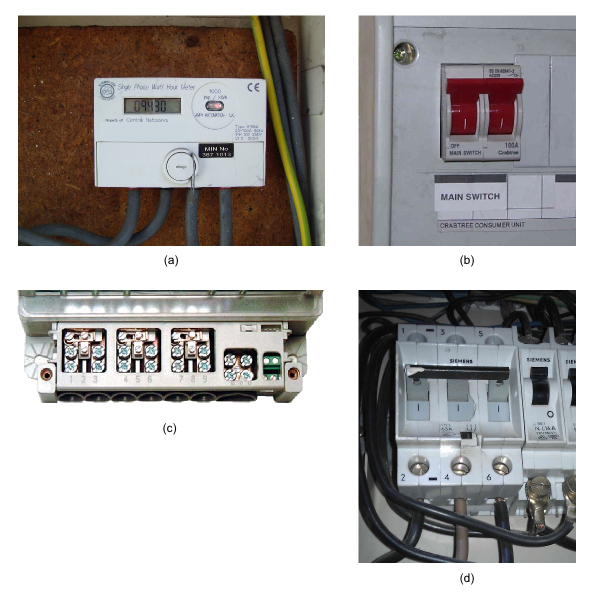
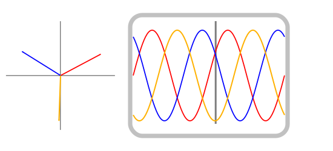
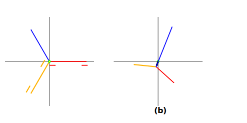
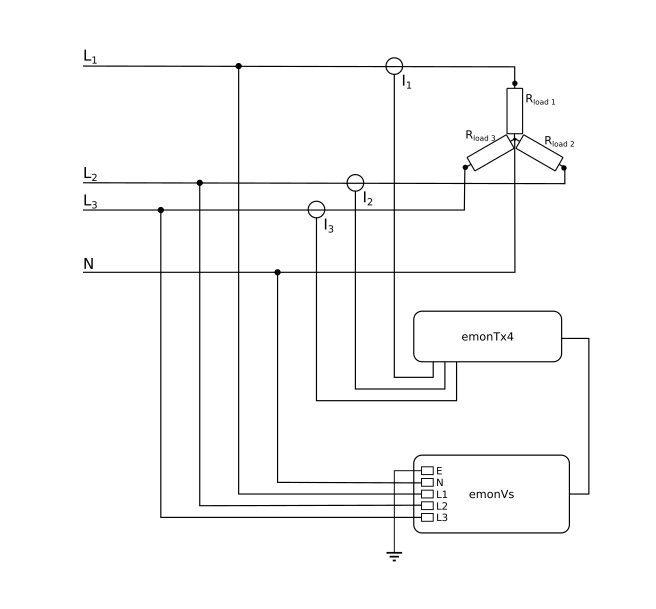
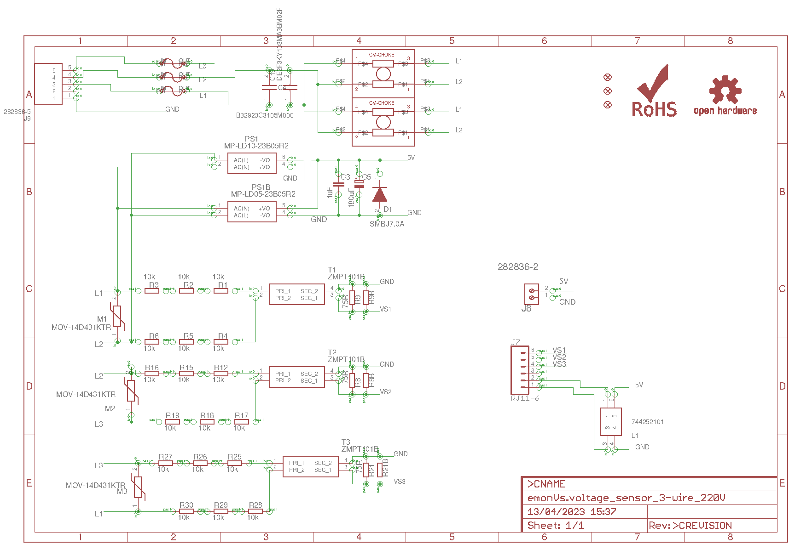

# 3-Phase Power

## History

The first electrical systems generated direct current by means of dynamos. It was soon realised that
there were serious limits to the area and the number of customers that could be served, and
alternating current took over – which as we all know can be transformed from one voltage to
another with minimal loss. Very quickly (in 1885) Italian Galileo Ferraris realised that two
windings set at an angle to each other could produce a rotating magnetic field, something of great
help when motion is required, and just two years later the 3-phase alternator appears.

## What is Three Phase Power?

Three phase is where you have 3 related voltage sources supplying the same load. It is a significant
improvement over single phase or two-phase because the three voltage or current waves follow each
other ⅓ cycle apart, and if you sum the currents together at any instant, you find that they perfectly
balance. For a mechanical analogy, think of a wheel with three elastic bands fixed to the rim 120º
apart and all tied together in the middle: the forces there are perfectly balanced, the knot stays at the
centre of the wheel. You can think of the bands representing voltages (or currents), and it's easy to
see that everything perfectly balances.

More importantly, the power is continuous and constant, so three phase motors run more smoothly
(we have all heard bottles rattling in the refrigerator, which is usually powered by a single phase
motor that vibrates as a result of the pulses of power at twice mains frequency).

There are important advantages for the power companies. If all the currents balance exactly, they
don't need a neutral conductor. Look at a high voltage overhead line and you'll see 6 bunches of
main conductors and a thin single conductor right at the top. The three bunches on one side are the
three phases of one circuit, a second circuit is on the other side, and the single conductor is an earth
which has probably got an optical fibre down the middle for signalling and communications. There
is no neutral conductor. Likewise there are also savings to be made on the amount of iron in
transformers, because the magnetic fluxes where they meet will balance too.

The main advantage comes with motors. The three phase currents set up a rotating magnetic field
inside the motor and so the motor will naturally start to rotate on its own, no special mechanism
(like a phase shift capacitor and an extra winding that you usually need with a single-phase motor)
is required.

## Naming

Traditionally in the UK the three phases were identified by the colours Red, Yellow (or White) and
Blue; with Black for the neutral and Green for earth. Pan-European harmonisation in 2004 led to the
standard becoming: Line 1 – Brown, Line 2 – Black, Line 3 – Grey, Neutral – Blue, Earth –
Green/Yellow stripes. [A comprehensive table of the colours used in various countries can be found
here: [http://en.wikipedia.org/wiki/Three-phase_electric_power](http://en.wikipedia.org/wiki/Three-phase_electric_power)].

Note: The phase conductor is “Line”, not “Live”. Live refers to the state of the circuit, a neutral
conductor that is carrying current is “live” too.

## Identifying a 3-Phase Supply

The obvious way to tell if you have a 3-phase supply is to locate your meter and distribution board /
consumer unit. Not counting green or green/yellow earth cables, if you have four reasonably thick
cables connecting to the meter, two of which go to your consumer unit or fuse-board, you don't have
a three-phase supply. If you have eight reasonably thick cables connecting to the meter, four of
which go to your consumer unit or fuse-board, and your main circuit breaker has 3 or 4 sections
with one operating lever working all three or four – known as a 3-pole or 4-pole linked MCB, then
you have a three-phase supply.

 (a) Single phase meter (UK)
 (b) Single phase double pole circuit breaker
 (c) Terminal block of a 3-phase meter, showing 8 main & 2 auxiliary terminals.
 (d) 3-pole linked circuit breaker, in a 3-phase installation. (Germany)
 
## Mathematics of a 3-Phase Supply

When we are dealing with a single-phase mains supply and purely resistive (or nearly so) loads,
normal maths (V = I.R, P = V2
 / R, etc) is adequate. When reactive components (inductors,
capacitors) are concerned and we need a graphical representation that will help us to visualise the
relationships between voltages and currents in different parts of the circuit, we turn to a device
called a 'phasor'. A phasor is quite simply a line that has a length and a direction, and it rotates. The
length represents the magnitude of the voltage or current, and the angle represents its relationship to
some reference (that we can choose to suit our circumstances). We can illustrate the relationship
between the three voltages of a 3-phase with three phasors 120° apart. If we connected a 3-channel
oscilloscope to the supply we might see something like this:

<object data="/_images/phasors.svg" type="image/svg+xml"></object>

The phasors rotate at the supply frequency. The three phasors are 120° apart, and the three voltage
waveforms too are 120° apart – 1 complete cycle being 360°.

The diagram also illustrates one of the fundamental properties of a 3-phase supply. If you take the
voltage to be the UK standard 240 V, that is the voltage between one line and neutral. The length of
the arrow represents this. The voltage between any two phases is clearly larger, and a bit of
trigonometry will show that it is in fact √3 times larger – the distance between the tips of the
arrows, so the line–line voltage is 415.7 V (usually given as 415 V). Also, the line–line voltages are
shifted in phase by 30° relative to the line–neutral voltages. The power delivered by a 3-phase
system is three times the power per phase, or assuming unity power factor, 3 x line-neutral voltage
x line current or √3 x line-line voltage x line current.

As it stands, that diagram illustrates the relationship between the 3 voltages. It need not be restricted
to voltages, we can use it for currents too, and its real value comes when we show both together.

## Effect of Unbalanced Loads

Suppose a small factory estate is supplied by an electricity sub-station. In the sub-station, the
neutral point of the transformer secondary windings is earthed. Cables feed two factories, the first
of which has loads connected between each of the phases and neutral. The question is, what effect
does this have on the voltages that the second factory receives?

The sub-station transformer windings and the cable all have impedances (for simplicity we'll
assume it is resistance only, and they are equal), which add together and are represented by Rline.
We'll also assume that the factory loads are all resistances too, and equal.

The combination forms a potential divider, so the voltages received by the first factory is reduced
by the factor Rload / (Rline + Rload). Because the loads are equal, there is no neutral current so the
neutral voltage is zero.

If the loads are unequal, it starts to get complicated and we shall use our phasor diagram. We'll
assume for clarity in the diagram that the load on Line 3 is very small, but that the other two loads
are very large (much larger that would be permitted in the real world). The phasor diagram looks
like this:

<object data="/_images/phasors-unbalanced.svg" type="image/svg+xml"></object>

In (a) the long arrows represent the no-load voltages of the transformer. The voltage on line 1 (red)
is reduced by voltage drop in Rline 1, at the same time the neutral voltage is raised towards line 1 (the
short arrows). A similar thing happens to line 2 (yellow). Line 3 (blue) takes a very small current
that we ignore, so its voltage remains the same. The result (b) is the neutral point is moved towards
the midpoint between lines 1 & 2 (i.e away from line 3), the voltages between Line 1 and neutral,
and between Line 2 and neutral, are much reduced while the voltage between Line 3 and neutral is
much increased. There is now a voltage on the neutral conductor, in anti-phase with line 3. The
angles between the three voltages are no longer 120°.

In the real world, while the cables are to a first approximation purely resistive, the same cannot be
said of the transformer impedance and the load, both of which are likely to be inductive to varying
degrees. That would mean the voltage drop phasors are no longer parallel to the line voltages, and
further phase shifts are introduced. However, the principle remains the same.

## Measuring 3-Phase Power with an emonTx V2 or emonTx V3.x

To measure 3-phase power you need 3 wattmeters or – in OpenEnergyMonitor terms – 3
emonTxs(See note). You quite simply measure the three phases in the same way as you would measure
three single-phase installations. You need a current transformer and a voltage monitor on each
phase, and the total power is the sum of the 3 powers.

If you have 3-wire balanced system and no neutral connection, then it can be shown that you need
only two wattmeters or emonTxs, and the total power is still the sum of the two powers. In this case,
you will be measuring the voltage between the lines rather than line-neutral, so you need voltage
transformers that are good to 440 V.

*(Note: One emonTx with an off-board extension to accommodate two additional voltage sensor inputs, connected to the two unused
analogue inputs on the I2C connector, and suitable modifications to the library and sketch, should also work).*

## Measuring 3-Phase Power with an emonTx4 and emonVs

The emonTx4 has been designed, in conjunction with the emonVs (the combined 5 V
power supply and 3-channel voltage monitor), to be able to work on 3-phase
supplies, provided that these are 4-wire (L1–L2–L3–N) and the line voltage does not
exceed 260 V. The emonVs cannot be used on a 3-wire supply where there is no
neutral.

The emonVs uses L1 & N for the a.c. to d.c. converter, which provides the power supply to the
emonTx4, the other two phases (L2 & L3) measure the line voltage only.

Single-phase loads connected Line–Neutral are measured in exactly the same way, with the c.t. on
the Line conductor to the load.

A balanced 3-phase load, whether connected internally in star or delta, may need only one c.t., by
virtue of being balanced, the total power then being three times the measured power. Only if the line
voltages are significantly out of balance will it be necessary to use 3 c.t’s and 3 channels.

An unbalanced load will always need 3 c.t's and 3 channels, whether connected in star or in delta.

Single-phase loads connected Line–Line should also have the c.t. on a conductor supplying just that
load. By specifying which two lines the load is connected between, the correct voltage to use is
calculated in the software.

## Using the emonTx4 on a 3-wire, 220 V System

The emonTx4 can be used on a 3-wire 220 V system, but it will be necessary to construct a special
“emonVs.voltage_sensor_3-wire-220V” version in which the 3 ZMPT101B transformers and their
voltage multiplier resistors are connected in delta, rather than in star as in the standard emonVs.
Anyone contemplating this should take local professional advice.

A less accurate alternative would be to use 3 a.c. adapters (transformers) equipped with voltage
divider resistors to reduce the voltage to 0.333 V r.m.s, and which connect to the emonTx4 exactly
like the emonVs. A 5 V d.c. adapter will also be needed to power the emonTx4.

## An Approximate Method to Estimate 3-Phase Power with an Unmodified emonTx V2 or emonTx V3.x

If access to measure the voltages of the three phases is difficult, or you do not want to add extra
hardware or use 3 emonTxs, then it is possible to measure the voltage on one phase and use this to
derive an approximate value for the voltages on the remaining two phases. The method relies on the
assumption that the voltages will be relatively similar and the phase disturbances small – though as
we've seen above neither of these are necessarily always the case. If the power system is reasonably
well balanced (which it should be), it is likely that this method will nevertheless be more accurate
than simply relying on a nominal assumed voltage and power factor.

The principle is to sample the voltage of the first phase at intervals (as per the normal sketch and
library routines). The measured voltage is used immediately to calculate the power etc. in the first
phase, but at the same time stored. Then, ⅓ cycle later, the value is retrieved and used with the
current measurement of the second phase to calculate the power there, and again ⅓ cycle after that
with the current measurement of the third phase to calculate that power.

The power and other measurements on the first phase (the one that has the voltage monitored) will
be accurate (to within the normal limits). The accuracy of the measurements for the other two
phases will be degraded because primarily, as has already been mentioned, the voltages of the three
phases will not track each other exactly. There is also an inherent assumption that the phase
relationships of the voltages remain constant, which will not necessarily be true, and finally a phase
error will be introduced in the two unmonitored phases when the mains frequency changes.

## Dangers

The principal danger of course is the higher voltage that exists between lines – around 400 V. The
probability that the electric shock that would result from accidental contact would be lethal is that
much higher. For this reason, it is not a good idea to have socket outlets supplied from different
phases in the same room.

There is a less obvious danger from the possibility that one phase may become disconnected, then a
3-phase motor would be likely to suffer damage as it would be running on only one phase. A linked
3-pole or 4-pole circuit breaker (breaking also the neutral), is essential for any such load. Fuses,
which if one fuse 'blows' will also result in single-phasing, are also not a good idea.
