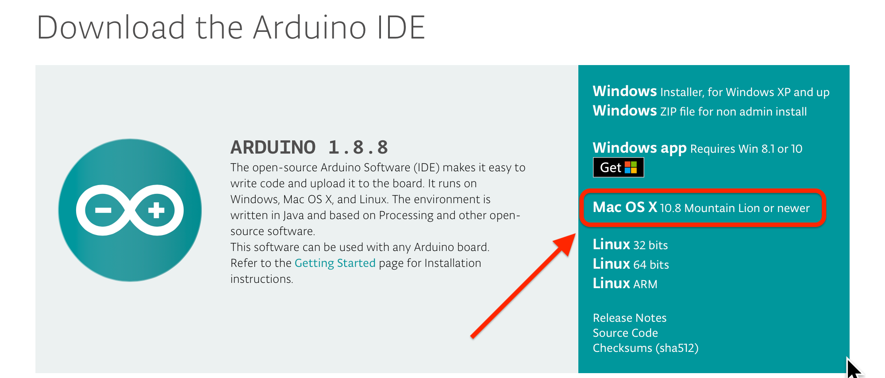
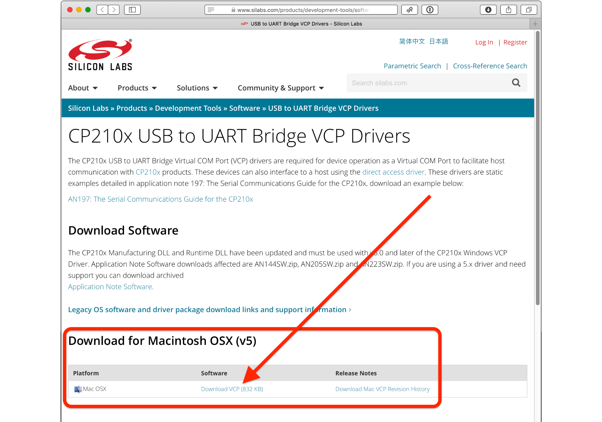
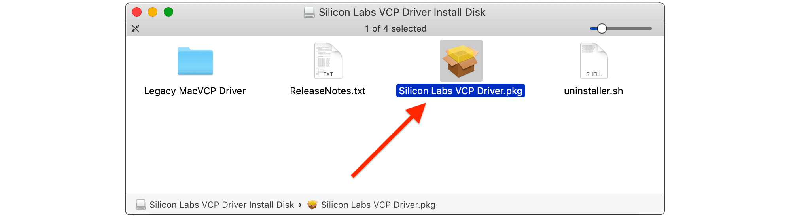
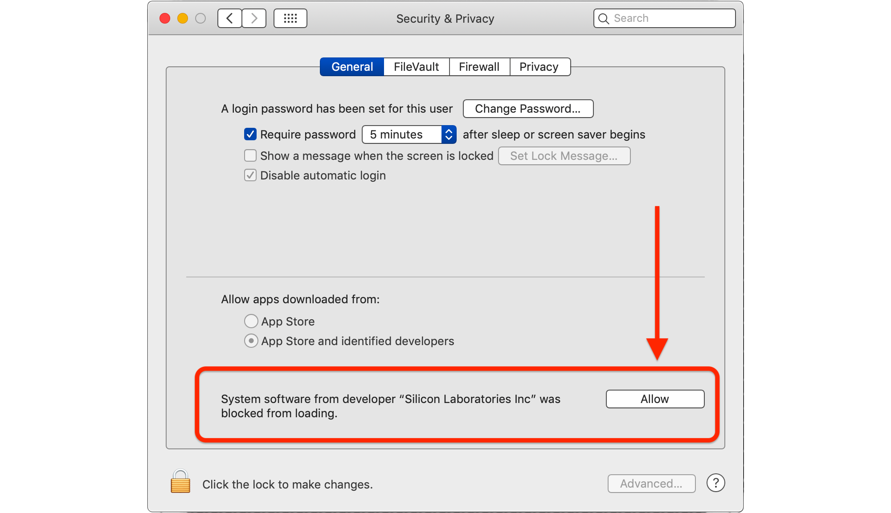

## Installing the Arduino IDE – macOS
<small>by Jon Murphy</small>
***

Arduino themselves have a wealth of information on installing the IDE on most operating systems in the <a href="https://www.arduino.cc/en/Guide/HomePage">'Getting Started'</a> part of their website. Be sure to read through this before continuing.

Download the latest Arduino IDE [here](https://www.arduino.cc/en/main/software) and click on the **Mac OS X** installer.

This will download the Arduino app to the Download folder.  After completion move the **Arduino.app** to your Applications folder. 

**Note**: If the file is downloaded as a ZIP file then double-click to uncompress.  And then move the file to the Applications folder.

#### Download and Install the SiLabs FTDI Drivers

If using Open Energy Monitor [USB to serial UART Programmer](https://openenergymonitor.com/programmer-usb-to-serial-uart/), **do not** follow the instructions for installing the drivers on the Arduino website.  Instead download the [CP210x USB to UART Bridge VCP Drivers](https://www.silabs.com/products/development-tools/software/usb-to-uart-bridge-vcp-drivers).

Click on **Download VCP (nnn KB)** and this will download the needed driver to the Download folder.  **Note**: If the file is downloaded as a ZIP file then double-click to uncompress.  And then install.

Open the `Mac_OSX_VCP_Driver` folder and double-click `Silicon Labs VCP Driver.pkg` to install the drivers.

If the software is blocked a window will pop-up with instructions.  Click **Open System Preferences**.

Open the macOS `System Preferences` > `Security & Privacy` and click **Allow**.

Make sure you restart the Arduino IDE after installing the drivers. Before connecting the programmer, check `Tools > Port` and make note of the available ports. Now connect the programmer and your module (emonTx, emonTH, etc). Go back to the main menu and select `Tools > Port` again. `Port` should be available and showing a new port. Select the port `/dev/cu.SLAB_USBtoUART`. And under `Tools > Board` ensure `Arduino/Genuino Uno` is selected.

If you have a favourite text editor, you can use it instead of the built-in editor. Select `File > Preferences` and tick the box `Use external editor`. When you use an external editor, your workflow is slightly different. You must still open the sketch in the IDE, but the IDE does not open your editor - you must yourself open the sketch file in your external editor, and save the file when editing is done. Then you switch to the IDE where you can click `Verify` or `Upload` and the IDE will read the file again and then proceed to compile it (“Verify”) or compile and upload it (“Upload”).

Read the section on [Installing the Arduino Libraries – macOS](macoslib) before you set your Sketchbook location (under `Preferences`).
