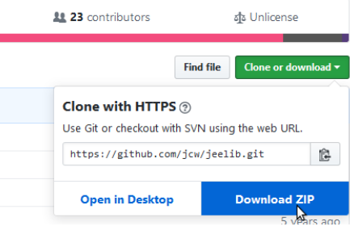
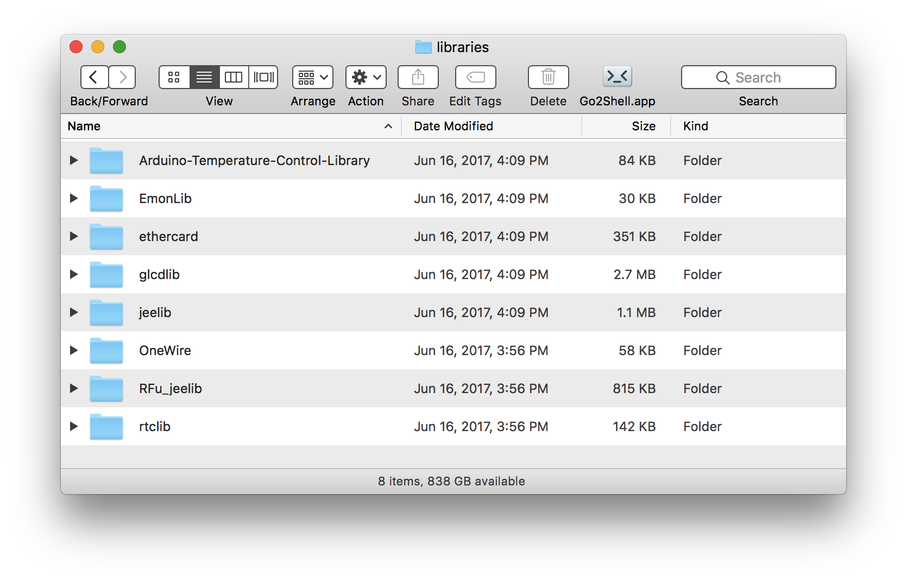

# Installing the Arduino Libraries – macOS

<small>by Jon Murphy</small>

Before you install the libraries, it would be a good idea to think about how you will organise your Emon data. When
you installed the Arduino IDE, it created a folder `Arduino` and beneath it a folder `libraries` in your `Home`
directory. If you’re happy with that, then you should install the libraries in there.

However, I prefer to have a folder that contains everything related to OpenEnergyMonitor. That folder, which I've
called `OEM` is at the top level in my personal area, i.e. `Home/OEM`. Beneath that I have folders for `Drawings`,
`Manuals` & `Leaflets`, and importantly that which concerns us here, `Software`. The `Software` folder contains sub-folders
that will eventually contain more sub-folders for sketches for the various modules, and a `libraries` folder for
the Arduino Libraries. This is the structure:

```
 Home
  │
  └── OEM
       │
       └─── Drawings
       └─── Manuals
       └─── Software
               │
               └─── emonPi
               └─── emonTH
               └─── emonTx
               └─── libraries
          
```

It is most important that the `libraries` folder is at the same level in the hierarchy as the folders, or some ancestor of
the folders, that will eventually contain the sketches. The parent of `libraries`, in this example called `Software` is
what the Arduino documentation and the IDE refers to as the `Sketchbook`. You can choose whatever name you
want for this folder.

<div class="note">

<p>Important: This is NOT the same 'libraries' folder that is part of the Arduino IDE. If you put the OEM libraries
in there, they will work but when you update the Arduino IDE, by default it installs in a completely new folder and you
will have to move or copy these libraries. For that reason it is not recommended.</p>

</div>

## Downloading the Libraries

Many libraries are required, this is the full list:

| Library            | Link                                                               | Notes |
|--------------------|--------------------------------------------------------------------|-------|
| JeeLib             | https://github.com/jcw/jeelib                                      |       |
| RFu_JeeLib         | https://github.com/openenergymonitor/RFu_jeelib                    | Only required for emonTx V3.2 and emonTH V1.4 using the RFu328 module.    |
| EmonLib            | https://github.com/openenergymonitor/EmonLib                       |       |
| OneWire            | https://github.com/PaulStoffregen/OneWire                          |       |
| DallasTemperature  | https://github.com/milesburton/Arduino-Temperature-Control-Library |       |
| RTClib             | https://github.com/adafruit/RTClib                                 | Only required for EmonGLCD   |
| GLCD_ST7565        | https://github.com/openenergymonitor/EmonGLCDlib                   | Only required for EmonGLCD   |
| EtherCard          | https://github.com/openenergymonitor/EtherCardOct2012              | Only required for NanodeRF   |
| emonLibCM          | https://github.com/openenergymonitor/EmonLibCM                     |       |
| SI7021             | https://github.com/LowPowerLab/SI7021                              | Only required for emonTH V2  |
| emonEProm          | https://community.openenergymonitor.org/uploads/short-url/eSkSOEesXkOL2FtaMCkrzhnUAOF.zip | Manages the EEPROM when saving config & energy values |
| rfmTxLib           | https://community.openenergymonitor.org/uploads/short-url/2itZ1bA7J0D1bfJO2byhattak9U.zip | Transmit-only - message format is compatible with JeeLib |
| LiquidCrystal_I2C  | https://github.com/openenergymonitor/LiquidCrystal_I2C             | Only required for emonPi |

<div class="warning">

<p>The following are <strong>NOT</strong> compatible with JeeLib and the RFM12B and the RFM69 in ‘compatibility’ mode (i.e. using “#define RF69_COMPAT 1”):</p>

</div>

| Library            | Link                                                               | Notes |
|--------------------|--------------------------------------------------------------------|-------|
| rf69               | https://community.openenergymonitor.org/uploads/short-url/5aI8TKgQAIJqOGOIH5443qD1oz1.zip | RFM69 ‘Native’ format - does not check for a busy radio channel |
| rfm69nTxLib        | https://community.openenergymonitor.org/uploads/short-url/pv8ewlR5XzEfB8M4Qge6ekUIlOR.zip | RFM69 ‘Native’ format version of rfmTxLib |

Go to each of the websites in turn. Download the zip file for each to your usual place – on GitHub the button is on
the right-hand side. Click `Clone or Download` followed by `Download ZIP`:



## Installing the Libraries

When you have downloaded all the files, go to your download location and from there you need to extract the
contents of each Zip file in turn: Double-click on the zip file, a window will open showing the contents. Extract that
folder into the `libraries` folder.

## Renaming the Libraries

The Arduino IDE does not allow hyphens '-' in the library folder names.


Therefore you must rename the folders to the names below. You should end up with this:



**Note**: If you wish, you can now delete the zip files that you downloaded.

## Check the Libraries

If your Arduino IDE is running, close all open windows and shut it down completely. Start (or restart) the IDE. First
you must tell the IDE where your `Sketchbook` is located. Click on `File > Preferences` and at the top for `Sketchbook
location` browse to and select your `Software` folder, then dismiss the Preferences window with OK. Click on `Sketch > Include Library` and you should see the list of libraries. The ones you just installed should be listed under `Contributed libraries`.

<div class="note">

<p>Note: The IDE only checks the libraries at start-up. Each time you change or add a library, you must completely shut
down and restart the IDE.</p>

</div>
