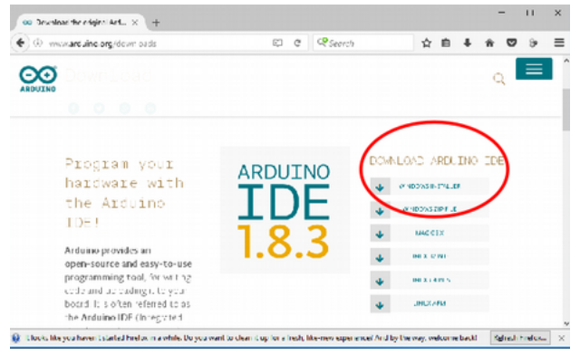
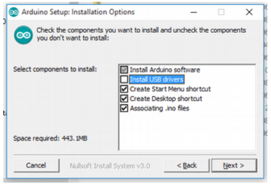

# Installing the Arduino IDE – Windows 10

<small>by Robert Wall</small>

Arduino themselves have a wealth of information on installing the IDE on most operating systems
in the <a href="https://www.arduino.cc/en/Guide/HomePage">'Get Started'</a> part of their website. Be sure to read
through this before continuing.

Download the latest Arduino IDE (use your favourite search engine on “Arduino IDE”) and click on
`Windows Installer`.

This will download a file with a name like “arduino-1.8.3-windows.exe” (the name will change
depending on the version) to your usual location. Double-click on that file and allow it to install in
the normal way. Part way through the installation, it will ask for the components to install. For our
purposes, you do not need to install the USB driver, you will later need to install the Future Technology Devices International or the Silicon Labs drivers.

When the installation finishes, the progress bar will show “Completed”.

## Download and Install the Drivers

If you are using the [OpenEnergyMonitor USB to serial UART Programmer](https://shop.openenergymonitor.com/programmer-usb-to-serial-uart/), do not follow the instructions
for installing the drivers on the Arduino website, instead download the drivers from
https://learn.openenergymonitor.org/electricity-monitoring/programmers/ftdi-programmer.

If you are using the OpenEnergyMonitor USB to serial UART Programmer sold before January, 2021, follow these instructions: https://learn.openenergymonitor.org/electricity-monitoring/programmers/wicked-device to install the drivers.

Make sure you restart the Arduino IDE after installing the drivers. Before you connect the
programmer, check `Tools > Port` [or `Serial Port`]. If `Port` is greyed out, that's OK, if not and any
`COM` (serial) ports are listed, make a note of which they are. Now connect the programmer and
your module (emonTx, emonTH, etc). Go back to the main menu and select `Tools` again. [Serial]
`Port` should be available and showing a new port. Select that port. Under `Tools > Board` ensure
`Arduino/Genuino Uno` is selected.

If you have a favourite text editor, you can use it instead of the built-in editor. Select `File > Preferences`
and tick the box `Use external editor`. When you use an external editor, your workflow
is slightly different. You must still open the sketch in the IDE, but the IDE does not open your editor -
you must yourself open the sketch file in your external editor, and save the file when editing is
done. Then you switch to the IDE where you can click `Verify` or `Upload` and the IDE will read
the file again and then proceed to compile it (“Verify”) or compile and upload it (“Upload”).

Read the section on [Installing the Libraries](windows10lib) before you set your Sketchbook location (under
`Preferences`).
