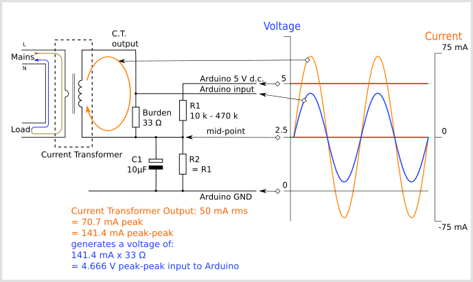
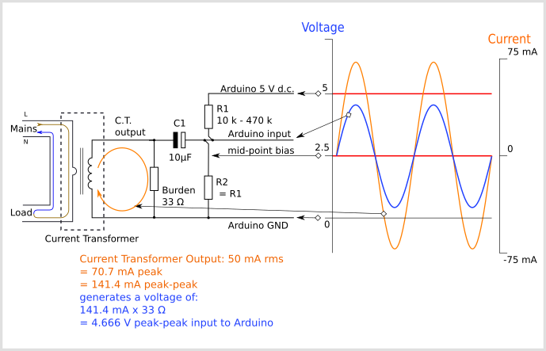

# CT Sensors - Interfacing with an Arduino

To connect a CT sensor to an Arduino, the output signal from the CT sensor needs to be conditioned so it meets the input requirements of the Arduino analog inputs, i.e. a **positive voltage between 0V and the ADC reference voltage.**

**Note:** This page give the example of an Arduino board working at 5 V and of the EmonTx working at 3.3 V. Make sure you use the right supply voltage and bias voltage in your calculations that correspond to your setup.

There are two circuit configurations, which in theory obtain the same result. The first was used in the emonTx V2 and the emonPi. It’s been pointed out that many switched-mode power supplies include a capacitor connected between the negative end of the high voltage d.c. rectified a.c. mains supply and the negative of the secondary side output, to reduce electromagnetic interference from the primary switching waveforms. This has the effect of introducing noise into the analogue input. The second configuration, which is used in the emonTx4 and the emonPi2, avoids this problem.
                                            
The circuit consists of two main parts, their functions are to change the c.t’s current into a voltage of the correct amplitude, and position this voltage in the centre of the ADC’s input range.

The voltages and currents shown are for a 5 V Arduino, with a 0 – 5 V range for the analogue input, about 1.6 V rms for a sine wave. For the emonTx V2 & V3 and the emonPi, the analogue input range is 0 – 3.3 V, so the midpoint voltage is 1.65 V and the analogue input voltage swings between 0 and 3.3 V (approximately 1 V rms for a sine wave). For the emonTx4 and emonPi2, the analogue input range is 0 – 1 V and is intended for use with 0.333 V rms output current transformers, which do not need a burden. so this resistor is omitted.

*Configuration used in the emonTx V2 and the emonPi*
                                   
In this configuration, the current from the c.t. flows around the loop comprising the c.t. itself and the burden resistor, which develops a voltage across the burden. (Note: In a voltage-output c.t, the burden is inside the casing of the c.t.) The two bias resistors divide the supply voltage in two and the mid-point and one end of the burden sits at 2.5 V above ground. The capacitor provides a near short-circuit to a.c. which firmly fixes the mid-point voltage with little or no a.c. component superimposed on it. The other end of the burden connects directly to the analogue input, and so the analogue input sees the burden voltage superimposed on the bias voltage.
                                                                                               
Here again, the current from the c.t. flows around the loop comprising the c.t. itself and the burden resistor, and so develops a voltage across the burden. (Note: in a voltage-output c.t., the burden is inside the casing of the c.t.) This time, one end of the c.t and burden is connected solidly to ground.
     

*Configuration used in the emonTx4 and the emonPi2*
     
Again, the two bias resistors divide the supply voltage in two, so the mid-point sits at 2.5 V above ground and this point connects to the analogue input. The difference is, the capacitor provides an a.c. path connecting the two sections whilst blocking the d.c. bias from reaching the c.t.  The bias resistors put a very small load on the c.t., but the effect of this is compensated for in the calibration.  The burden voltage is superimposed on the bias voltage, so the analogue input sees the burden voltage varying above and below the 2.5 V mid-point as shown. 
                                                                                       
In the emonTx4, a voltage-output c.t. is used whose output voltage is nominally 0.333 V rms, so there is no burden resistor, the bias resistors are unequal and the bias voltage is 0.512 V.

## Calculating a Suitable Burden Resistor Size

If the CT sensor is a "current output" type such as the _YHDC SCT-013-000_, the current signal needs to be converted to a voltage signal with a burden resistor. If it is a voltage output CT you can skip this step and leave out the burden resistor, as the burden resistor is built into the CT.

**a) Choose the current range you want to measure**

The YHDC SCT-013-000 CT has a current range of 0 to 100 A. For this example, let's choose 100 A as our maximum current.

**b) Convert maximum RMS current to peak-current by multiplying by √2.**

    Primary peak-current = RMS current × √2 = 100 A × 1.414 = 141.4A

**c) Divide the peak-current by the number of turns in the CT to give the peak-current in the secondary coil.**

The YHDC SCT-013-000 CT has 2000 turns, so the secondary peak current will be:

    Secondary peak-current = Primary peak-current / no. of turns = 141.4 A / 2000 = 0.0707A

**d) To maximise measurement resolution, the voltage across the burden resistor at peak-current should be equal to one-half of the Arduino analog reference voltage. (AREF / 2)**

If you're using an Arduino running at 5V: AREF / 2 will be 2.5 Volts. So the ideal burden resistance will be:

    Ideal burden resistance = (AREF/2) / Secondary peak-current = 2.5 V / 0.0707 A = 35.4 Ω

35 Ω is not a common resistor value. The nearest values either side of 35 Ω are 39 and 33 Ω. Always choose the smaller value, or the maximum load current will create a voltage higher than AREF. We recommend a 33 Ω ±1% burden. In some cases, using 2 resistors in series will be closer to the ideal burden value. The further from ideal the value is, the lower the accuracy will be.

Here are the same calculations as above in a more compact form:

    Burden Resistor (ohms) = (AREF * CT TURNS) / (2√2 * max primary current)

---

Burden resistor sizing for [OpenEnergyMonitor energy monitoring hardware](https://guide.openenergymonitor.org/setup).

**emonTx V3** ([see guide](https://guide.openenergymonitor.org/setup))

The emonTx V3 uses a 3.3V regulator, so it's VCC and therefore AREF, will always be 3.3V regardless of battery voltage. The standard emonTx V3 uses 22Ω burden resistors for CT 1, 2 and 3, and a 120Ω resistor for CT4, the high sensitivity channel. See the emonTx V3 technical page:
[https://docs.openenergymonitor.org/emontx3/technical.html](https://docs.openenergymonitor.org/emontx3/technical.html).

**emonPi** ([see guide](https://guide.openenergymonitor.org/setup))

The EmonPi has two CT channels both with 22Ω burden resistors.

**emonTx V2**

If you're using a battery powered emonTx V2, AREF will start at 3.3 V and slowly decrease as the battery voltage drops to 2.7 V. The ideal burden resistance for the minimum voltage would therefore be:

    Ideal burden resistance = (AREF/2) / Secondary peak-current = 1.35V / 0.0707A = 19.1 Ω

19 Ω is not a common value. We have a choice of 18 or 22 Ω. We recommend using an 18 Ω ±1% burden.

---

[Tool for calculating burden resistor size, CT turns and max Irms](https://tyler.anairo.com/?id=5.3.0) (thanks to Tyler Adkisson for building and sharing this).

(**Note**: this tool does not take into account maximum CT power output. Saturation and distortion will occur if the maximum output is exceeded. Nor does it take into account component tolerances, so the burden resistor value should be decreased by a few (~5) percent allow some "headroom." There is more info about component tolerances at: [ACAC Component tolerances.](../voltage-sensing/acac-component-tolerances "ACAC Component tolerances"))

## Adding a DC Bias

If you were to connect one of the CT wires to ground and measure the voltage of the second wire, relative to ground, the voltage would vary from positive to negative with respect to ground. However, the Arduino analog inputs require a _positive_ voltage. By connecting the CT lead we connected to ground, to a source at half the supply voltage instead, the CT output voltage will now swing above and below 2.5 V thus remaining positive.

Resistors R1 & R2 in the circuit diagram above are a voltage divider that provides the 2.5 V source (1.65 V for the emonTx). Capacitor C1 has a low _reactance_ - a few hundred ohms - and provides a path for the alternating current to bypass the resistor. A value of 10 μF is suitable.

<!-- The ADC isn't simply an ADC, it has a multiplexer in front of it, which switches between the 6 available input pins. The multiplexer samples the voltage and stores it on the sample & hold capacitor, to be converted by the ADC.

In order to charge that S&H capacitor sufficiently quickly to ensure an accurate reading, the Atmel data sheet tells us that the driving impedance needs to be less than 10 kΩ.

The combination of CT and burden resistor easily satisfies that requirement, but when you add in the Thévenin equivalent of the bias resistors (1.35 V with a source impedance of 235 kΩ for the emonTx), that limit is exceeded by a large margin. Adding the bypass capacitor provides a source to supply the charge that the S&H capacitor needs.

In terms of overcurrent protection, there are protection diodes inside the ADC inputs, which are in turn protected by a 1 kΩ series resistor and parallel transient voltage suppressor diodes (in production versions of the emonTx and emonPi) and yes, by the CT itself saturating. The impedance of the bias network also helps to limit the current in the protection diodes.
(R.Wall)
-->

---

**Choosing a suitable value for resistors R1 & R2**

Higher resistance lowers quiescent energy consumption.

We use 10 kΩ resistors for mains powered monitors. The emonTx uses 470 kΩ resistors to keep the power consumption to a minimum, as it is intended to run on batteries for several months.

## Arduino Sketch

To use the above circuit to measure RMS current, with an assumed fixed RMS voltage (e.g. 240V) to indicate approximate apparent power, use this Arduino sketch: [Arduino sketch - current only](https://github.com/openenergymonitor/EmonLib/blob/master/examples/current_only/current_only.ino)
