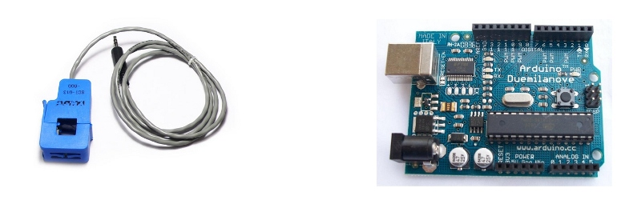

## CT sensors - Interfacing with an Arduino

To connect a CT sensor to an Arduino, the output signal from the CT sensor needs to be conditioned so it meets the input requirements of the Arduino analog inputs, i.e. a **positive voltage between 0V and the ADC reference voltage.**

**Note:** This page give the example of an Arduino board working at 5 V and of the EmonTx working at 3.3 V. Make sure you use the right supply voltage and bias voltage in your calculations that correspond to your setup.

This can be achieved with the following circuit which consists of two main parts: 

1.  The CT sensor and burden resistor

2.  The biasing voltage divider (_R1 & R2_)

### **<u>Calculating a suitable burden resistor size</u>**

If the CT sensor is a "current output" type such as the _YHDC SCT-013-000_, the current signal needs to be converted to a voltage signal with a burden resistor. If it is a voltage output CT you can skip this step and leave out the burden resistor, as the burden resistor is built into the CT.

**1) Choose the current range you want to measure**

The YHDC SCT-013-000 CT has a current range of 0 to 100 A. For this example, let's choose 100 A as our maximum current.

**2) Convert maximum RMS current to peak-current by multiplying by √2.**

<pre>Primary peak-current = RMS current × √2 = 100 A × 1.414 = 141.4A</pre>

**3) Divide the peak-current by the number of turns in the CT to give the peak-current in the secondary coil.**

The YHDC SCT-013-000 CT has 2000 turns, so the secondary peak current will be:

<pre>Secondary peak-current = Primary peak-current / no. of turns = 141.4 A / 2000 = 0.0707A</pre>

**4) To maximise measurement resolution, the voltage across the burden resistor at peak-current should be equal to one-half of the Arduino analog reference voltage. (AREF / 2)**

If you're using an Arduino running at 5V: AREF / 2 will be 2.5 Volts. So the ideal burden resistance will be:

<pre>Ideal burden resistance = (AREF/2) / Secondary peak-current = 2.5 V / 0.0707 A = 35.4 Ω
</pre>

35 Ω is not a common resistor value. The nearest values either side of 35 Ω are 39 and 33 Ω. Always choose the smaller value, or the maximum load current will create a voltage higher than AREF. We recommend a 33 Ω ±1% burden. In some cases, using 2 resistors in series will be closer to the ideal burden value. The further from ideal the value is, the lower the accuracy will be.

Here are the same calculations as above in a more compact form:

<pre>**Burden Resistor (ohms) = (AREF * CT TURNS) / (2√2 * max primary current)**</pre>

**emonTx V2**

If you're using a battery powered emonTx V2, AREF will start at 3.3 V and slowly decrease as the battery voltage drops to 2.7 V. The ideal burden resistance for the minimum voltage would therefore be:

<pre>Ideal burden resistance = (AREF/2) / Secondary peak-current = 1.35V / 0.0707A = **19.1 Ω**</pre>

19 Ω is not a common value. We have a choice of 18 or 22 Ω. We recommend using an 18 Ω ±1% burden.

**emonTx V3**

The emonTx V3 uses a 3.3V regulator, so it's VCC and therefore AREF, will always be 3.3V regardless of battery voltage. The standard emonTx V3 uses 22 Ω burden resistors for CT 1, 2 and 3, and a 120 Ω resistor for CT4, the high sensitivity channel. See the emonTx V3 technical wiki at: [https://wiki.openenergymonitor.org/index.php?title=EmonTx_V3#Burden_Resistor_Calculations](https://wiki.openenergymonitor.org/index.php?title=EmonTx_V3#Burden_Resistor_Calculations)

**[Tool for calculating burden resistor size, CT turns and max Irms](https://tyler.anairo.com/?id=5.3.0 ) -** thanks to Tyler Adkisson for building and sharing this.

(Note: this tool does not take into account maximum CT power output. Saturation and distortion will occur if the maximum output is exceeded. Nor does it take into account component tolerances, so the burden resistor value should be decreased by a few (~5) percent allow some "headroom." There is more info about component tolerances at: [ACAC Component tolerances.](https://openenergymonitor.org/emon/buildingblocks/acac-component-tolerances "ACAC Component tolerances"))

### 2) Adding a DC Bias

If you were to connect one of the CT wires to ground and measure the voltage of the second wire, relative to ground, the voltage would vary from positive to negative with respect to ground. However, the Arduino analog inputs require a _positive_ voltage. By connecting the CT lead we connected to ground, to a source at half the supply voltage instead, the CT output voltage will now swing above and below 2.5 V thus remaining positive.

Resistors R1 & R2 in the circuit diagram above are a voltage divider that provides the 2.5 V source (1.65 V for the emonTx). Capacitor C1 has a low _reactance_ - a few hundred ohms - and provides a path for the alternating current to bypass the resistor. A value of 10 μF is suitable.

**Choosing a suitable value for resistors R1 & R2:**

Higher resistance lowers quiescent energy consumption.

We use 10 kΩ resistors for mains powered monitors. The [emonTx](https://openenergymonitor.org/emon/emontx) uses 470 kΩ resistors to keep the power consumption to a minimum, as it is intended to run on batteries for several months.

### **Arduino sketch**

To use the above circuit to measure RMS current, with an assumed fixed RMS voltage (e.g. 240V) to indicate approximate apparent power, use this Arduino sketch: [Arduino sketch - current only](https://openenergymonitor.org/emon/buildingblocks/arduino-sketch-current-only)
