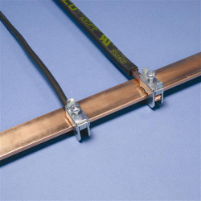
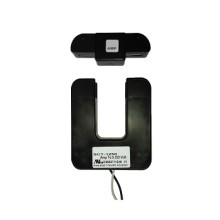
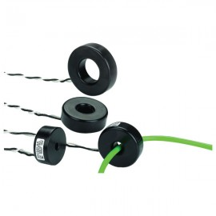

## CT sensors - An introduction

Often referred to as a current clamp, a CT is in fact, <u>_**not**_</u> a clamp.

_These_ are Clamps. On the left are two busbar clamps, on the right, a carpenter's G-clamp:

  
_Note the tensioning screws._

Pictured below, is an example of a Split-Core CT.

<u>_[YHDC Current Transformer SCT-013-000 test report](https://openenergymonitor.org/emon/buildingblocks/report-yhdc-sct-013-000-current-transformer)_</u>

Here's an example of a _Magnelab_ _**split-core**_ CT

In addition to the split-core type, solid core, (aka _**ring core**_) CTs are available.  
Here's an example of a _Magnelab **solid-core**_ CT  

**Basics**

Current transformers (CTs) are sensors that measure alternating current. They are particularly useful for measuring whole building electricity consumption (or generation, for that matter).

The split core type, such as the CT in the picture above, is particularly suitable for DIY use, as it can be clipped onto either the live **_or_** neutral wire coming into the building, without the need to do any high voltage electrical work.

Like any other transformer, a current transformer has a primary winding, a magnetic core, and a secondary winding.

In the case of whole building monitoring, the primary winding is the live _**or**_ neutral wire (not both!) coming into the building, that is passed through the opening in the CT. The secondary winding is made of many turns of fine wire housed within the transformer case.

The alternating current flowing in the primary produces a magnetic field in the core, which induces a current in the secondary winding circuit [1].

The current in the secondary winding is proportional to the current flowing in the primary winding:

<pre>Isecondary = CTturnsRatio × Iprimary

CTturnsRatio = Turnsprimary / Turnssecondary</pre>

The number of secondary turns in the CT pictured above, is 2000, so the current in the secondary is one 2000th of the current in the primary.

Normally, this ratio is written in terms of currents in Amps e.g. 100:5 (for a 5A meter, scaled 0 - 100A). The ratio for the CT above would normally be written as 100:0.05.

**Burden resistor**

A "current output" CT needs to be used with a burden resistor. The burden resistor completes or closes the CT secondary circuit. The burden value is chosen to provide a voltage proportional to the secondary current. The burden value needs to be low enough to prevent CT core saturation.

**Isolation**

The secondary circuit is galvanically isolated [2] from the primary circuit. (i.e. it has no metallic contact)

**Safety**

In general, a CT must **never** be open-circuited once it's attached to a current-carrying conductor.  
A CT is potentially dangerous if open-circuited.

If open-circuited with current flowing in the primary, the transformer secondary will attempt to continue driving current into what is effectively an infinite impedance. This will produce a high and potentially dangerous voltage across the secondary [1]

Some CT'shave built-in protection. Some have protective Zener diodes as is the case with the SCT-013-000 recommended for use in this project. If the CT is of the 'voltage output' type, it has a built in burden resistor. Thus, it cannot be open-circuited.

**Installing a CT**

The primary winding of the CT is the wire carrying the current you want to measure. If you clip your CT around a two or three core cable that has wires carrying the same current but in opposite directions, the magnetic fields created by the wires will cancel each other, and your CT will have no output. [3] & [4]

A split-core CT, especially one that has a ferrite core (such as the ones made by YHDC) should _**never**_ be "clamped" to the cable using any sort of packing material, because the brittle nature of the ferrite core means that it might easily be broken, thus destroying the CT. You should only clamp the CT to the cable or busbar if the housing is specifically designed to do so. Similarly, a ring-core CT should **_never_** be forced onto a cable that is too large to pass freely through the centre. The position and orientation of the cable within the CT aperture does **_not_** affect the output.

**References and further reading**

[Test report: Yhdc SCT-013-000 Current Transformer](https://openenergymonitor.org/emon/buildingblocks/report-yhdc-sct-013-000-current-transformer "Report: Yhdc SCT-013-000 Current Transformer")

[Elkor Technologies Inc - Introduction to current transformers](https://www.elkor.net/pdfs/AN0305-Current_Transformers.pdf)

[1] [Wikipedia article on current transformers](https://en.wikipedia.org/wiki/Current_transformer)

[2] [Wikipedia article on Galvanic isolation](https://en.wikipedia.org/wiki/Galvanic_isolation)

[3] [CT and AC power adaptor installation and calibration theory](https://openenergymonitor.org/emon/buildingblocks/ct-and-ac-power-adaptor-installation-and-calibration-theory "CT and AC power adaptor installation and calibration theory")

[4] [Current Transformer Installation](https://openenergymonitor.org/emon/Current_Transformer_Installation "Current Transformer Installation")
