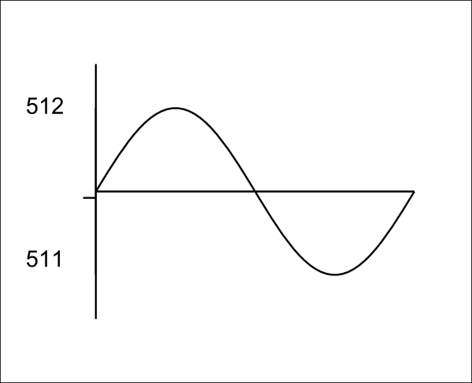

# Measurement Implications of ADC Resolution at Low Current Values

Common questions include:

> "Why does my current sensor read (X) Amps when there is no current flowing?"
>
> "Why do I read (Y) Watts when nothing is connected?"

It's because the analogue to digital converter (ADC) in the Arduino chip is not perfect.

Imagine a very small current flowing, and the bias voltage divider resistors in the current input stage circuit above, make the average voltage sit exactly in the middle of the Arduino ADC input range. At this point, you need to know that each number out of the analogue to digital converter represents not a voltage but a _band_ of voltages. The analogue to digital converter will measure the waveform at many points – about 50 in practice – and if the amplitude of the wave is small enough, each sample of the wave (sampleI) will have the value 511.

The high pass filter in the software will shift the wave so that the average value is zero. This is equivalent to subtracting the average value from each sample. The average is 511, so each filtered sample will now be 0.

Let's see what happens if the bias voltage drifts a little. Now the average value is just above the change from 511 to 512\. This time, when the analogue to digital converter measures the wave, the samples in the first half cycle (and maybe one or two more) will take the value 512, and the remainder will have the value 511\. The sampling process has turned our sine wave into a square wave.

The high pass filter in the software will again shift the wave, so the average value is zero, and again this is equivalent to subtracting the average value from each sample. But this time, the average is 511.6 (remember, now we're using floating point decimal values in the software), so each sample in the first half will be 512 - 511.6 = 0.4, and each sample in the second half will be 511 - 511.6 = -0.6 .

Now the important part comes when the software calculates the power and the RMS value of the wave.

To calculate power, the current and voltage for corresponding samples are multiplied together, and the average of that is the power. To calculate the rms current, each current sample is multiplied by itself, the average is calculated and the rms current is the square root of that number.

Clearly in the first case, because each current sample is zero, power and rms current are both zero.

In the second case, and assuming voltage and current waveforms are exactly in phase, the average power will be the average of [each positive half cycle voltage sample x 0.4] and [each negative half cycle voltage sample x -0.6], or about 0.45 units. The rms current will be the square root of the average of  0.42 + (-0.6)2, or about 0.72 units. We shall define the units next.

To see what numbers you might expect in practice, say the voltage is 240, and the current sensor is the standard 100 A CT with the standard 18Ω burden resistor. 100 A RMS represents a peak-to-peak count of about 800, so our wave with a peak-to-peak amplitude of 1 count has an RMS value of about 0.125 A. This represents a true power of 30 W. Therefore, in the second case we might read 13.5 W and 0.09 A, and even though we have unity power factor, we read an apparent power of 21.6 VA and a power factor of 0.625.

But you will get exactly the same result if the current is the smallest imaginable whilst still being just sufficient to flip the analog to digital converter between two adjacent values. So in practice, you might read anything from zero power and current, to a power of 13.5 W and a current of 0.09 A.

On the other hand, you might read zero power and zero current for any load up to 30 W.

Up to this point, we've assumed the Arduino ADC input comes from the current sensor. It may also come from digital noise generated by the Arduino itself, or outside noise picked up by the PCB or the wiring.
