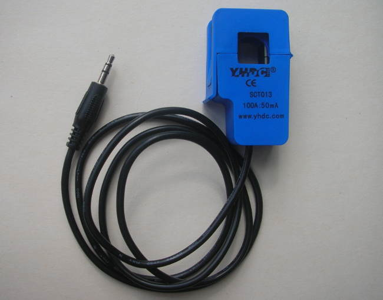
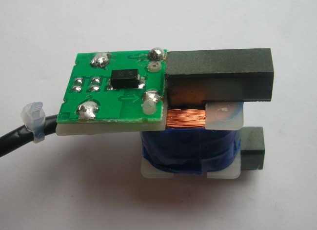
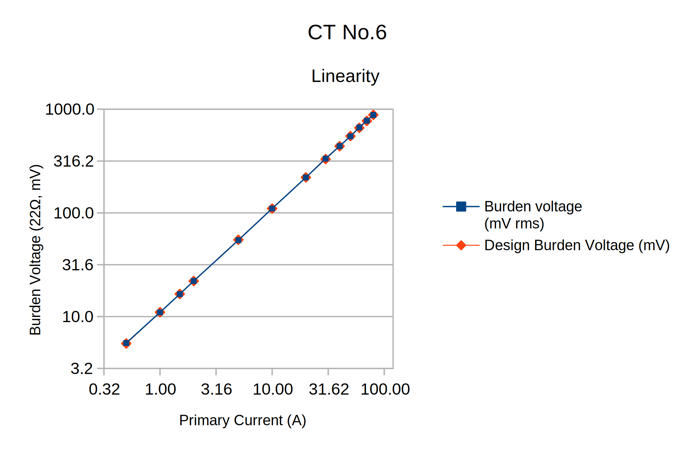
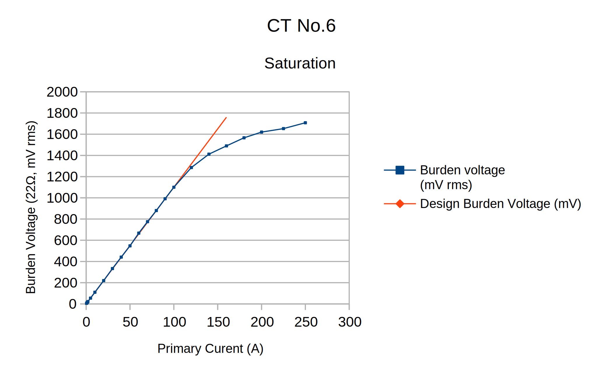
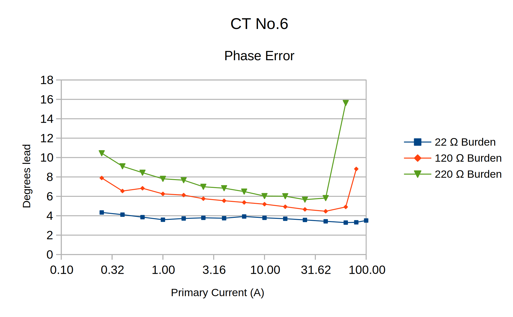

# YHDC SCT-013-000 Current Transformer

A Report on the properties of the *YHDC* current transformer and its suitability for use with the OpenEnergyMonitor system.

_by Robert Wall B.Sc., C.Eng., MIEE._

Datasheet: [download](files/SCT013-000_datasheet_0.pdf)

## Synopsis

The Yhdc current transformer is manufactured by Beijing YaoHuadechang Electronic Co., Ltd and is widely available from many stockists as Non-invasive AC current sensor (100A max), Model SCT-013-000.

It has no internal burden resistor, but a transient voltage suppressor limits the output voltage in the event of accidental disconnection from the burden. It is capable of developing sufficient voltage to fully drive a 5 V input.

## Test Rig

<!----------------------------------------------------------------------------->

<embed alt="C.T. Test Rig" height="250" src="files/C.T. Test Rig.160705.svg" type="image/svg+xml" width="600">

<!------------------------------------------------------------------------------->

For test currents up to 100 A, the CT primary consists of from 1 to 20 turns of insulated 16/0.2mm wire. The majority of tests were made at 5 A – thus the primary current seen by the CT could be adjusted in steps of 5 A by enclosing a variable number of turns inside the core. For saturation tests up to 250 A, the primary consists of 50 passes of enamelled copper wire, the current being adjusted in this case.

(Note: The current exceeds the rating of the wire used for the primary, but as the coil is loosely bunched except where it passes through the transformer core, and because each test is of relatively short duration, heating is not a problem).

The primary current was monitored by the 0.33Ω shunt. The potentiometers, current limiting resistor and diodes, in both the shunt and the CT outputs, are to protect the computer sound card from over-voltage and switching transients. The potentiometers were adjusted such that the voltage did not exceed 400 mV peak and at this voltage, the diodes did not affect the shape of the monitored waveform.

When the shape of the waveform was of interest, the primary current and CT voltage waveform were recorded using a software oscilloscope (Soundcard Oscilloscope from [https://www.zeitnitz.de/Christian/scope_en](https://www.zeitnitz.de/Christian/scope_en)) and the recorded waveform imported into a spreadsheet and subsequently calibrated against the actual voltage read either by a multimeter or a real oscilloscope connected directly across the CT output.

Since early 2012, when samples of this CT were first tested, YHDC has made many incremental changes to the design and construction of this device, and apparently the core material has also been changed. The latest model tested (with a single TVS diode instead of firstly, discrete 22 V zener diodes, then SMT zener diodes) is distinguished by the black lead with a moulded-on plug. The unit tested is identified as CT No.6, thereby distinguishing it from the earlier versions.

## The YHDC Current Transformer

Internal Components.

Circuit Diagram.

The current arrow represents current flowing out of the face of the transformer labelled “SCT-013-000”, i.e. in the direction of the arrows moulded into the housing, then the plug tip (white wire) is positive with respect to the sleeve (red wire).

The ring of the plug is not connected.

The purpose of the transient voltage suppressor is to limit the voltage that may appear on the plug and across the windings to a safe value should the transformer be unplugged from the burden in the transmitter/instrument, whilst the primary is energised.

## Tests

The following tests were conducted:

*   Check the ratio

*   Establish the useful range

*   Establish the phase error

*   Check operation with no external burden

*   Establish the maximum output when saturated

Some tests that were carried out on the earlier versions have not been repeated. Details of the results of those tests can be found in the earlier issue of this report, which is available for download as a PDF file [here](files/YhdcCTReportIss6.pdf).

## **1\. Ratio & Saturation.**

The ratio was checked from 0.5 A to 250 A with a multimeter on the a.c. mA range as the burden.

<table>

<thead>

<tr>

<th>

Primary Current

</th>

<th>

Secondary Current

</th>

<th>

Design Secondary Current

</th>

<th>

error

</th>

</tr>

</thead>

<tbody>

<tr>

<td>

0.5

</td>

<td>

0.2534

</td>

<td>

0.25

</td>

<td>

1.36%

</td>

</tr>

<tr>

<td>

1

</td>

<td>

0.504

</td>

<td>

0.5

</td>

<td>

0.80%

</td>

</tr>

<tr>

<td>

1.5

</td>

<td>

0.75

</td>

<td>

0.75

</td>

<td>

0.00%

</td>

</tr>

<tr>

<td>

2

</td>

<td>

1.012

</td>

<td>

1

</td>

<td>

1.20%

</td>

</tr>

<tr>

<td>

5

</td>

<td>

2.45

</td>

<td>

2.5

</td>

<td>

-2.00%

</td>

</tr>

<tr>

<td>

10

</td>

<td>

5

</td>

<td>

5

</td>

<td>

0.00%

</td>

</tr>

<tr>

<td>

20

</td>

<td>

10.07

</td>

<td>

10

</td>

<td>

0.70%

</td>

</tr>

<tr>

<td>

30

</td>

<td>

15.25

</td>

<td>

15

</td>

<td>

1.67%

</td>

</tr>

<tr>

<td>

40

</td>

<td>

20.31

</td>

<td>

20

</td>

<td>

1.55%

</td>

</tr>

<tr>

<td>

50

</td>

<td>

25.35

</td>

<td>

25

</td>

<td>

1.40%

</td>

</tr>

<tr>

<td>

60

</td>

<td>

30.6

</td>

<td>

30

</td>

<td>

2.00%

</td>

</tr>

<tr>

<td>

70

</td>

<td>

35.56

</td>

<td>

35

</td>

<td>

1.60%

</td>

</tr>

<tr>

<td>

80

</td>

<td>

40.63

</td>

<td>

40

</td>

<td>

1.58%

</td>

</tr>

<tr>

<td>

90

</td>

<td>

45.69

</td>

<td>

45

</td>

<td>

1.53%

</td>

</tr>

<tr>

<td>

100

</td>

<td>

50.72

</td>

<td>

50

</td>

<td>

1.44%

</td>

</tr>

<tr>

<td>

120

</td>

<td>

60.2

</td>

<td>

60

</td>

<td>

0.33%

</td>

</tr>

<tr>

<td>

140

</td>

<td>

68.7

</td>

<td>

70

</td>

<td>

-1.86%

</td>

</tr>

<tr>

<td>

160

</td>

<td>

74.5

</td>

<td>

80

</td>

<td></td>

</tr>

<tr>

<td>

180

</td>

<td>

78.7

</td>

<td>

90

</td>

<td></td>

</tr>

<tr>

<td>

200

</td>

<td>

81.9

</td>

<td>

100

</td>

<td></td>

</tr>

<tr>

<td>

225

</td>

<td>

84.5

</td>

<td>

112.5

</td>

<td></td>

</tr>

<tr>

<td>

250

</td>

<td>

87.4

</td>

<td>

125

</td>

<td></td>

</tr>

</tbody>

</table>

The measured ratio is comfortably within the specification ( ± 3% over the range 10 A to 120 A).

The error becomes meaningless above about 140 A as saturation sets in. In this area, the waveform becomes increasingly distorted and unusable for measurement purposes.

The test was repeated with a 22 Ω resistor as the burden, and this time measuring the burden voltage. Currents up to 250 A were applied in order to observe the effect of core saturation.

The saturation curve (showing rms current or voltage) fails to reveal the true situation because in any case, the peak-peak burden voltage – which in saturation is no longer directly related to the rms voltage – exceeds the emonTx & emonPi input range at a little over 100 A, and currents above this maximum value risk damaging the ADC input.

## 2\. Phase error.

The phase error was measured for 3 values of burden resistor. The values chosen were 22 Ω as used in the emonPi and emonTx Version 3; 120 Ω, which is the value used for the high sensitivity input of the emonTx V3; and 220 Ω, which would give a maximum current of about 10 A with the emonTx or 16 A with the emonTx Shield (with the burden resistor changed appropriately).

It was difficult to make meaningful measurements below 250 mA (representing a load of around 60 W) due to noise and pick-up.

These results show a notable improvement over the earlier versions, especially when the 22 Ω burden is used, when the phase error is commendably flat (within a band factionally more than 1 degree wide) over the entire measurable range.

These results also show that increasing the burden resistor value in order to increase sensitivity comes at a price: the phase error increases, more so at lower currents. Even so, this result still shows an improvement over the earlier production samples.

(To put these numbers into perspective, the ‘discrete sample’ sketch samples a voltage and current pair every 7° approximately.)

## Conclusions

The Yhdc current transformer is suitable for use with the OpenEnergy emonTx and emonPi. It can develop sufficient voltage to fully utilise the resolution of the Arduino's analogue input, and waveform distortion due to saturation at this secondary voltage is negligible for normal purposes. The maximum phase error of a little over 4° with the 22 Ω burden is insignificant (representing a power factor error of less than 0.0029 at unity power factor), but the error of nearly 8° with a 120 Ω burden could be troublesome with low current loads having a poor power factor where this input is most likely to be used.

## Appendix

Measurements on non-sinusoidal waveforms.

Most budget multimeters measure the rectified average value of an alternating wave, then the reading is scaled to display the root mean square (rms) value assuming the shape of the wave is a sinusoid. (The rms value is the value of a direct voltage or current that would give the same heating effect in a purely resistive load).

For many purposes, this approach is entirely adequate. When the wave shape departs from the sinusoid, this has to be taken into account. When the shape departs markedly from the sinusoid, the difference can be large.

The software oscilloscope used to capture the illustrations above has the capability to export the data points to a text file. That file can then be imported into a spreadsheet for processing. Taking that approach, these values were calculated for the “15 Ω burden, 250 A” waves from the tests on the early models of this CT:

<table border="0" cellpadding="2" cellspacing="2">

<thead>

<tr>

<th style="background-color:rgb(153, 153, 153); text-align:center">

Calculation

</th>

<th style="background-color:rgb(153, 153, 153); text-align:center">

Current (divisions)

</th>

<th style="background-color:rgb(153, 153, 153); text-align:center">

Burden Voltage (divisions)

</th>

</tr>

</thead>

<tbody>

<tr>

<td>

Peak-peak

</td>

<td>

14.47

</td>

<td>

6.41

</td>

</tr>

<tr>

<td>

Rectified average (measured value)

</td>

<td>

4.62

</td>

<td>

1.30

</td>

</tr>

<tr>

<td>

Rectified average x 1.11 (displayed value)

</td>

<td>

5.13

</td>

<td>

1.45

</td>

</tr>

<tr>

<td>

rms

</td>

<td>

5.16

</td>

<td>

1.66

</td>

</tr>

</tbody>

</table>

The multiplier 1.11 is the 'form factor' for a sine wave. The shape of the current wave is quite close to a sine wave, so the true rms value (5.16) is very close to the value that a budget meter would indicate (5.13 – reading 0.6% low). That is not true for the burden voltage – the meter would read 12.6% low.

The situation is even worse if the displayed value is used to calculate the peak-peak value. The true peak-peak burden voltage is 6.41\. Taking the average voltage as measured with a budget meter, multiplied (internally) by 1.11, then taking that displayed value (1.45) and multiplying by 2√2 to give the peak-peak value, assuming a sine wave, yields the incorrect result of 4.10\. The calculated value is low by 36%, a significant error. The form factor for the burden voltage wave turns out to be 1.28.

(Note: A true rms meter will only calculate the correct value over a limited range of form factors).
