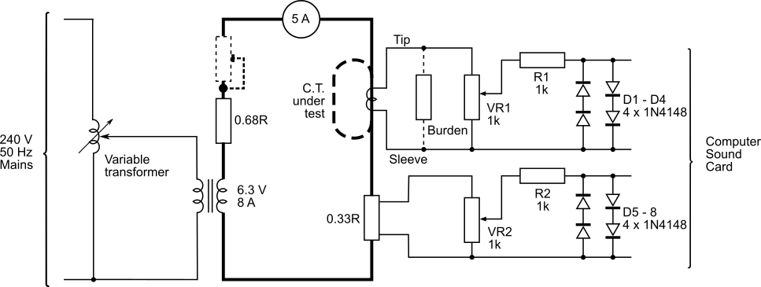
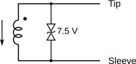
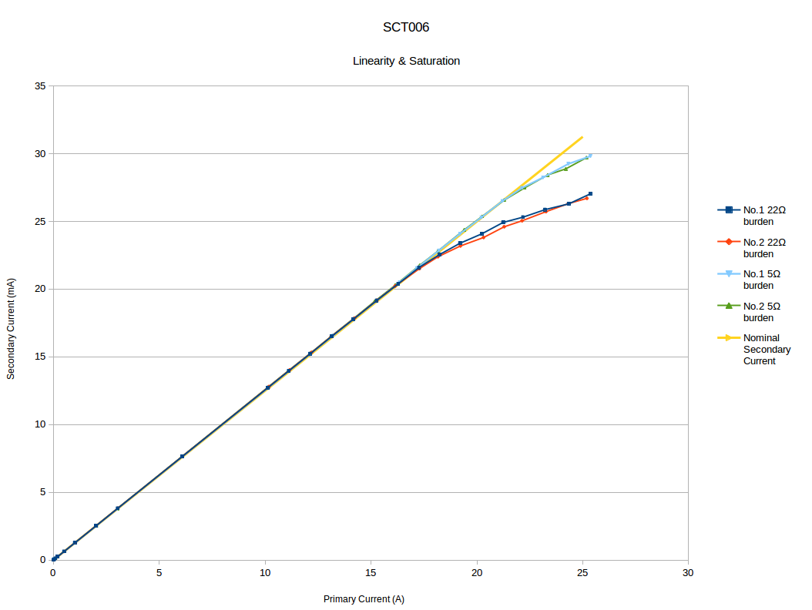
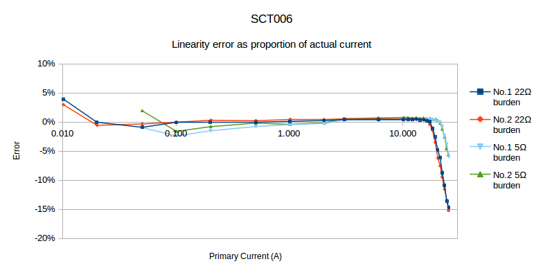
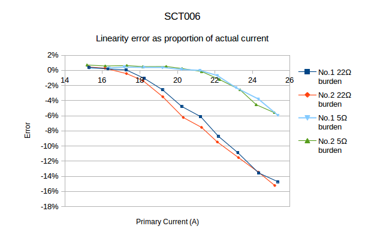
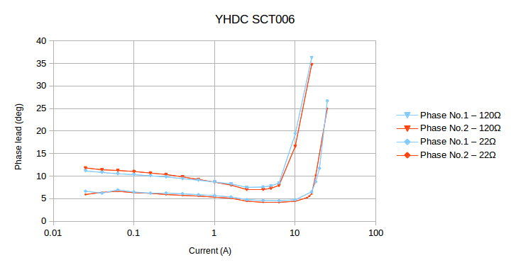
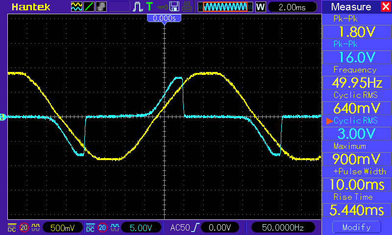

# YHDC SCT006 Current Transformer

A Report on the properties of the *YHDC SCT006* current transformer and its suitability for use with the OpenEnergyMonitor system.

Issue 1 - 23rd February, 2018

_by Robert Wall B.Sc., C.Eng., MIEE._

* [Download report (issue 1) as PDF](files/YhdcSCT006CTReport_issue1.pdf)  
* [Download YHDC SCT006 datasheet](files/SCT006.pdf)

## Synopsis

The YHDC SCT006 current transformer is manufactured by Beijing YaoHuadechang Electronic Co., Ltd.
It has no internal burden resistor, but a transient suppressor diode limits the output voltage in the event of accidental disconnection from the burden.

## Test Rig

All tests were carried out at 50 Hz. For the tests, the CT primary consisted of 1 or 5 passes of insulated 16/0.2mm wire. For currents below about 0.5 A, the 0.68 Ω resistor was supplemented by an additional series rheostat so that a higher voltage could be applied to allow finer control of current.

<small>(Note: The current exceeds the rating of the wire used for the primary, but as the coil is loosely bunched except where it passes through the transformer core, and because each test is of relatively short duration, heating is not a problem).</small>

The primary current was monitored by the 0.33 Ω shunt. The potentiometers, current limiting resistor and diodes in both the shunt and the CT outputs are to protect the computer sound card from over-voltage and switching transients, the potentiometers were adjusted such that the voltage did not exceed 1.0 V peak and at this voltage, the diodes do not affect the shape of the monitored waveform. To ensure minimum phase differences between channels, both potentiometers were adjusted to give exactly the same voltage with the same input (i.e. both potentiometers fed from the same source in parallel).

When the shape of the waveform was of interest, the primary current and CT voltage waveform were recorded using a software oscilloscope (Soundcard Oscilloscope from http://www.zeitnitz.de/Christian/scope_en) and the recorded waveform imported into a spreadsheet for analysis.

## The YHDC Current Transformer

### Internal Components

It is not easy to examine the internal components without damaging the c.t. It is evident that a transient suppressor diode or similar device is connected across the secondary winding, as the output is clipped at about 15.8 V p-p.

### Circuit Diagram
 

 
The current arrow represents current flowing in the direction of the arrow moulded into the base of the c.t, then the plug tip is positive with respect to the sleeve.

The ring of the plug is not connected.

## Tests

The following tests were conducted:

1. Check the ratio
2. Establish the useful range
3. Establish the phase error
4. Check operation with no external burden
5. Establish the effect of an air gap
6. Establish the effect of an adjacent current-carrying conductor

### 1. Ratio & saturation

Two samples of the CT were checked. The currents were measured by the voltage dropped by the meter shunt in the primary circuit, and by the burden voltage in the secondary circuit. Both were calibrated against a true rms digital multimeter. For the ‘upper’ range of currents, so as to satisfactorily illustrate the effect of saturation, the primary current was set in steps of 1 A from 10 A up to 25 A. For the ‘lower’ range of currents expected of smaller appliances, the primary current was set following approximately exponential steps from 20 mA to 10 A. Burden values of 22 Ω, representing the emonTx and emonPi, and 5 Ω (the manufacturer’s specified maximum) were used. The specified minimum current is 10 mA, but measurements below 20 mA with the 22 Ω burden, and below 50 mA with the 5 Ω burden, were unreliable. It is worth noting that these represent voltages of 0.55 mV or 0.3125 mV respectively at the input of the ADC; when one ADC step is 3.22 mV.

The ratio (or linearity) accuracy is within acceptable limits up to 17 A, when used with a 22 Ω burden.

### 2. Useful range & effect of burden resistance

The maximum burden resistance specified by the manufacturer is just 5 Ω. The effect of increasing the burden resistance is to overload the c.t, resulting in early saturation of the core and, inevitably, distortion of the waveform. Distortion is becoming visible at little more than 6 A with a 120 Ω burden, and at 15 A with a 22 Ω burden. With a 5 Ω burden, both c.t’s are good to the specified maximum current of 20 A.

### 3. Phase error

The phase error was measured for 2 values of burden resistor. The values chosen were 22 Ω, the value used in the emonTx V3 & emonPi, and 120 Ω, which is the value used for the high sensitivity input of the emonTx V3. Phase errors with the 5 Ω burden were not checked, as this value is not realistically usable with the emonTx or emonPi. The phase error when used with the 100 A input is acceptable up to 16 A, where it starts to increase dramatically. When used with the high sensitivity input, the error is on the limit of acceptability over most of the working range of currents, and its use here for real power measurement is strongly discouraged.

### 4. Operation without an external burden

When operated without an external burden, the core quickly saturates. The protective transient suppressor diode conducts at about 16 V peak-peak and this corresponds to a primary current of about 2 A. At this current, the core is clearly being driven well into saturation, and the errors are large.

The diode is not intended to nor will it protect the input circuitry of the ATMega 328 processor and this voltage could seriously damage or destroy the ATMega 328 chip.

<figure>
  
  <figcaption>
    The blue trace is output voltage, the yellow trace is the shunt
    voltage (primary current), the flattening is caused by large
    numbers of rectifier loads on the network.
  </figcaption>
</figure>

### 5. Effect of an air gap

Introducing an air gap of 0.04 mm in one side of the core caused the secondary current to fall by about 15%, and the phase error to increase to around 30°.

### 6. Effect of an adjacent current-carrying conductor

To measure this, a large coil of 20 turns carrying 5 A, oriented so as to simulate a parallel conductor carrying 100 A, was used. The current transformer under test was outside the coil. The equivalent current is the current that the CT would have measured in a conductor passing through the CT.

| Distance | Equivalent Current |
| :--------|:-------------------|
| Touching | 30 mA              |
| 20 mm    | 9.6 mA             |
| 50 mm    | 3.3 mA             |
| 100 mm   | 0.4 mA             |

## Conclusions

The YHDC SCT006 current transformer is suitable in limited circumstances for use with the emonTx and emonPi.

It cannot develop sufficient voltage to fully utilise the resolution of the Atmega 328 processor's analogue input, but it can offer an improvement over the SCT-013-000 on individual low-current circuits. The advantage over the 100 A c.t. is 2.5 times, significantly less than might be expected from the current rating alone and that, when measuring currents up to 16 A using the “100 A” inputs of the emonTx or emonPi, is roughly equivalent to having an 11-bit rather than the 10-bit ADC.

The c.t. is not recommended for use with the high sensitivity input of the emonTx. When used here, the phase error is on the limit of the range where it can be satisfactorily compensated by the correction mechanism of the standard pre-loaded sketches, and the maximum current is a little over 6 A, making it suitable only for measuring current (and not real power) in a lighting circuit or similar.
