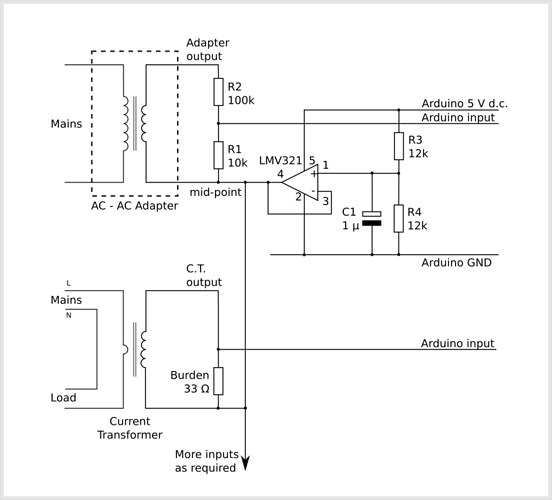

# Buffered Voltage Bias

## Improving the quality of the bias source

The relatively simple voltage bias source illustrated in [Measuring AC Voltage with an AC to AC power adapter](../voltage-sensing/measuring-voltage-with-an-acac-power-adapter) does have some limitations if high accuracy is required. It can be improved by adding an operational amplifier. The op.amp isolates the mid-point voltage at the junction of R3 & R4 from the AC-AC adapter and voltage divider. This significantly reduces the impedance of the voltage source, resulting in enhanced performance. Only one op.amp is needed, the current sensors can share the bias supply and connect to amplifier output (“mid-point”) with little fear of interaction between the inputs (which can be troublesome in some circumstances).

## Notes

- This modification might not be suitable if the power source is batteries,
- Any pair of equal resistors up to 100 kΩ may be used for R3 & R4, and C1 can be reduced to 100 nF for resistor values at the high end of the range.
- This design was originally published by Robin Emley at [http://openenergymonitor.org/emon/node/673](http://openenergymonitor.org/emon/node/673)

