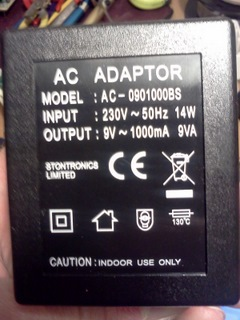

## Calibration Procedure

***

#### Why calibrate?

It is impossible to manufacture anything with absolute precision. In general terms, the more precisely something is manufactured, the more expensive it is. Consider the emonTx current input as a relatively simple example. If we assume for now that we don't have any errors in the sketch, we have 3 physical factors that will each contribute to the uncertainty in the value that we read for the current. These are:

1.  The transfer ratio of the current transformer.
2.  The value of the burden resistor.
3.  The accuracy with which the burden voltage is measured.

Item 3 has two components – ADC non-linearity and reference uncertainty. Normally, both of these have three components that contribute to the possible error to a greater or lesser extent:

*   An initial uncertainty in the value at the time of manufacture.
*   Drift due to physical changes over time.
*   External influences.

Calibration is a means of correcting the first of these, and if performed regularly, it will also correct for the second. Unless you are able to remove or shield your device from external influences, there is generally very little you can do to counter their effects.

A full appraisal of the sources of error in the emonTx measurement is [here](emontx-error-sources). In the worst case, the measurement of real or apparent power could be in error by nearly 40% without calibration. With calibration against a reasonably-priced multimeter, the accuracy should be around 6%.

#### Calibrating the Internal Reference Voltage

This procedure is not applicable to the emonTx V3 using the default sketch. For all other variants, it is recommended if you are using batteries to power your emonTx; it is optional if you are using a mains power supply. You should do this first, before adjusting the calibration constants. If you change the calibration of the internal reference, the calibration constants will need to be corrected.

Looking at the table in the [Multimeters article](how-good-is-your-multimeter), every meter gave the best accuracy when measuring the 3.3V supply, and the worst had a possible error of about 1%. In the emonLib library, we have a method that can measure the supply compared to the internal reference. Therefore, using this method and measuring the supply with a multimeter, it is possible to calibrate the internal band-gap reference to the accuracy of our multimeter, simply by changing the constant “1126400L” in readVcc( ) so that it returns the same value as the multimeter. A simple sketch CalVref [[download](https://github.com/openenergymonitor/emonTxFirmware/tree/master/emonTxV2/CalVref)] to calculate the calibration constant given the measured value of VCC, is all that is needed.

When we do this, we dramatically improve the accuracy within which the value of the internal band-gap reference is known, hence the accuracy of the battery voltage.

#### Recommended Calibration Method

(This applies equally to the emonTx, the emonTx shield and an Arduino board, or a custom or prototype version)

You will need:

*   A multimeter or voltmeter to measure your mains voltage.
*   The same multimeter or an ammeter to measure current.
*   A resistive load or loads (e.g. a kettle, electric heater, etc) that draw a current close to but less than the maximum that your meter can measure.

If you do not have a multimeter, or you are not confident that you can measure your mains safely, you can use a plug-in energy meter. In that case in the procedure that follows, you use the energy meter's readings for voltage and current instead of the multimeter's. If you don't have any form of meter, then see below for common calibration coefficients. You might then, over time, be able to make small adjustments so that the total energy recorded agrees with your energy supplier's meter.

#### Procedure:

Take great care when working with mains voltages. If you are using batteries to power your emonTx, you should calibrate the internal reference first.

1.  Load one of the demonstration sketches from [emonTxFirmware](https://github.com/openenergymonitor/emonTxFirmware). You will need to choose the one appropriate to your version of the emonTx. If you have the emonTx V3, use the default sketch (check the Wiki to see which that is), but you will need to add some print statements in order to read separately the values for current and power factor. Note, however, that some special-purpose sketches have their own particular calibration procedure. Where this is the case, it will be described in a comment in the sketch.
2.  Measure the mains voltage and adjust either the voltage constant 240.0 (emonTx_CT123) in lines like this
      emontx.power1 = ct1.calcIrms(1480) * 240.0; (emonTx V2)
    _or_
      const byte Vrms=                  230;      (emonTx V3)

    to the average value that you read
    _or_
    adjust the voltage calibration constant 236.39 (emonTx_CT123_Voltage) in lines like this
      ct1.voltageTX(236.39, 1.7);                  (emonTx V2)
    _or_
      const float Vcal=                  284.9667; (emonTx V3)
    so that the voltage reported by the emonTx is the same as the voltage you measure with your meter.
    The new calibration coefficient can be calculated by:

    <pre>New calibration = existing calibration × (correct reading ÷ emonTx reading)</pre>

3.  Insert your meter in series with the load and clip the current transformer over one of the leads. Connect to the mains supply, measure the current and adjust the current calibration constant 111.1 (or 90.9 or 60.6)  in lines like this
      ct1.currentTX(1, 111.1);                 (emonTx V2)
    _or_
      const float Ical=                  90.9; (emonTx V3)
    so that the current reported is the same as the current you measure. Check the instructions for your meter in case there is a time limit for making the measurement. If there is, you must make the measurement quickly and allow sufficient time for the meter to cool before repeating.
4.  If you are using the voltage input, with the load connected adjust the phase angle calibration 1.7 in lines like this
      ct1.voltageTX(236.39, 1.7);                    (emonTx V2)
    _or_
      const float phase_shift=                  1.7; (emonTx V3)
    so that real power and apparent power read the same value (and power factor is as close to 1.00 as possible). Your meter is not needed for this.
    The phase calibration coefficient should not normally go outside the range 0.0 – 2.0
5.  Check the voltage calibration again. It might need a slight adjustment if the phase angle calibration was altered significantly. Recheck the phase angle calibration.

#### Theoretical CT Sensor Calibration

<pre>CT Ratio / Burden resistance = (100A / 0.05A) / 18 Ohms = 111.1 (for the emonTx V2)</pre>

<pre>CT Ratio / Burden resistance = (100A / 0.05A) / 22 Ohms = 90.9 (for the emonTx V3 CT1-3)</pre>

<pre>CT Ratio / Burden resistance = (100A / 0.05A) / 120 Ohms = 16.67 (for the emonTx V3 CT4)

CT Ratio / Burden resistance = (100A / 0.05A) / 33 Ohms = 60.6 (for the emonTx Shield)</pre>

**In practice**

The CT has a stated accuracy of ±3%. The CT burden resistor is a 1% tolerance component, so the total error should be less than 4%. Therefore, the expected range for the CT calibration for the emonTx is 106.66 – 115.54 (58.18 – 63.02 for the emonTx Shield), provided the internal reference has been calibrated accurately. Because the emonTx V3 firmware does not use the internal reference by default, an additional 1% must be added for the voltage regulator tolerance and so the expected range should be 86.35 – 95.45.

<table>

<tbody>

<tr>

<th>Burden Resistor</th>

<th>Current Calibration Coefficient</th>

</tr>

<tr>

<td>15 Ω ±1% - old</td>

<td>133.3</td>

</tr>

<tr>

<td>18 Ω ±1% - shipped as standard in emonTx V2 kit</td>

<td>

111.1

</td>

</tr>

<tr>

<td>22 Ω ±1% - standard in emonTx V3 for CTs 1-3</td>

<td>

90.9

</td>

</tr>

<tr>

<td>120 Ω ±1% - standard in emonTx V3 for CT 4</td>

<td>16.67</td>

</tr>

<tr>

<td style="width: 347px;">33 Ω ±1% - shipped as standard in emonTx Shield kit</td>

<td style="width: 140px;">

60.6

</td>

</tr>

</tbody>

</table>

#### Theoretical AC-AC Adapter calibration

**Ideal Power AC-AC Adapters**

Datasheet: [Ideal Power 77DB-06-09](files/77DB-06-09.pdf) (UK Plug type)

Datasheet: [Ideal Power 77DE-06-09](files/77DE-06-09.pdf) (EURO Plug type)

Datasheet: [Ideal Power 77DA-10-09](http://files.openenergymonitor.org/77DA-10-09.pdf) (US Plug type)

<table>

<tbody>

<tr>

<th>Adapter Type</th>

<th>Voltage calibration coefficient
EmonTx V2</th>

<th>Voltage calibration coefficient
EmonTx V3</th>

<th>Voltage calibration coefficient
EmonTx Shield V2.5</th>

</tr>

<tr>

<td>Ideal Power 77DB-06-09 (UK Plug type)</td>

<td>227.59</td>

<td>268.97</td>

<td>268.97</td>

</tr>

<tr>

<td>Ideal Power 77DE-06-09 (EURO Plug type)</td>

<td>220.0</td>

<td>260.0</td>

<td>260.0</td>

</tr>

<tr>

<td>Ideal Power 77DA-10-09 (US Plug type)</td>

<td>110.0</td>

<td>130.0</td>

<td>130.0</td>

</tr>

</tbody>

</table>

[Note: The values are derived from manufacturer's data and are subject to normal manufacturing tolerances. The coefficient might be in error by up to ±6% (77DA-10-09 & 77DE-06-09) or ±4% (77DB-06-09) when resistor tolerances are added.]

### Other AC-AC Adapters

<table>

<tbody>

<tr>

<th>Ac-AC Adapter</th>

<th>Plug</th>

<th>Voltage Calibration Coefficient</th>

</tr>

<tr>

<td>

MW

</td>

<td>UK</td>

<td>

233.67

</td>

</tr>

<tr>

<td>

Strontronics

</td>

<td>UK</td>

<td>238.56</td>

</tr>

<tr>

<td>

Mascot 9580

</td>

<td>UK</td>

<td>234.26</td>

</tr>

<tr>

<td>

FP AD 3515

</td>

<td>Euro</td>

<td>212.658</td>

</tr>

<tr>

<td>

Ideal Power / TDC

[Currently adapter sold in the OpenEnergyMonitor shop](http://shop.openenergymonitor.com/components/)

</td>

<td>UK/Euro/US</td>

<td>see above</td>

</tr>

</tbody>

</table>

See [EmonTx errors](buildingblocks/emontx-error-sources) for a full analysis of the sources of error in the emonTx.

See [buildingblocks/different-acac-power-adapters](buildingblocks/different-acac-power-adapters) for more detailed information on the different AC-AC adapters.

See [CT and AC power adaptor installation and calibration theory](buildingblocks/ct-and-ac-power-adaptor-installation-and-calibration-theory) for detailed information on the theoretical basis for the calculation of the calibration coefficients.
