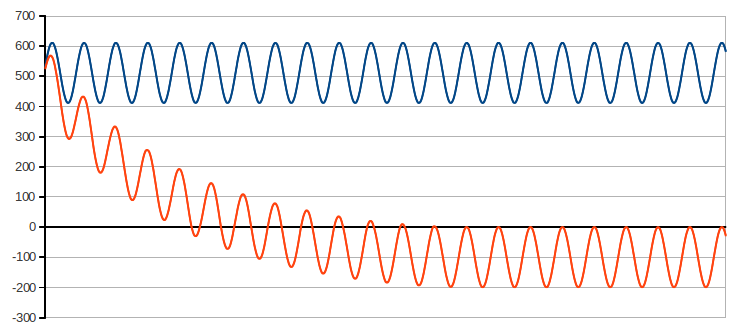
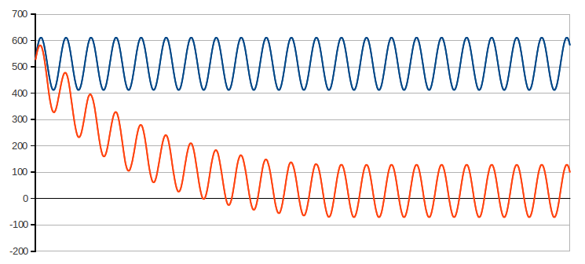
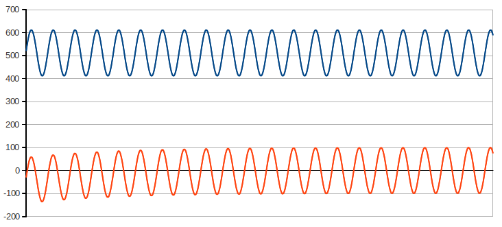
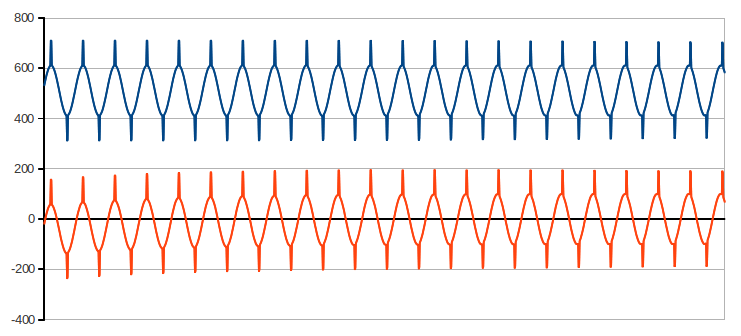
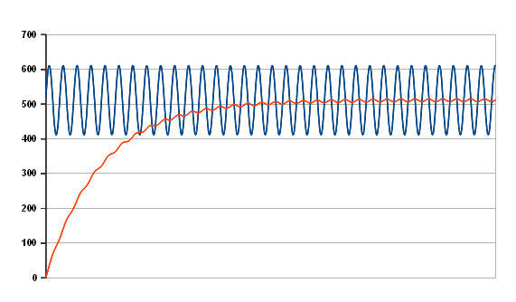

# Digital filters for offset removal

The Atmega ADC (Arduino) has an input voltage range of 0 to V<sub>cc</sub> and so when sampling an AC waveform the waveform needs to be biased at V<sub>cc</sub> / 2\. This translates to a digital offset value of approximately 512\. The waveform sample digital value will be between 0 and 1023, centered around 512.

To do the maths for real power, rms voltage and current calculations, we need remove this offset. This can be done with a digital filter. There are two approaches: the high pass filter, which allows the high frequency component through removing the bias, or the low pass filter, which first finds the bias, then subtracts the bias from the signal. Let's start with the high pass filter.

## Digital high pass filter

The floating point implementation looks like this:

```
filtered_value = 0.996 × (last_filtered_value + sample - last_sample)
```

**Why 0.996?** It is not a magic number, all that is required is a number reasonably close to unity in order to provide an adequately long time constant so there is some phase and amplitude distortion at the 50 Hz fundamental frequency being measured. 0.996 yields a filter time constant of 250 sample periods.

Code example:

<pre><span style="color: #CC6600;">int</span> sample = 0;
<span style="color: #CC6600;">int</span> last_sample = 0;
<span style="color: #CC6600;">double</span> a = 0;

<span style="color: #CC6600;">double</span> filtered_value = 0;

<span style="color: #CC6600;">void</span> <span style="color: #CC6600;"><b>setup</b></span>()
{
  <span style="color: #CC6600;"><b>Serial</b></span>.<span style="color: #CC6600;">begin</span>(9600);
}

<span style="color: #CC6600;">void</span> <span style="color: #CC6600;"><b>loop</b></span>()
{
  <span style="color: #7E7E7E;">// Generate a test signal</span>
  last_sample = sample;
  a+=0.1; sample = 512 + <span style="color: #CC6600;">sin</span>(a) * 100;

  <span style="color: #7E7E7E;">// Floating maths implementation of high pass filter takes 36-40 microseconds</span>
  filtered_value = 0.996 * (filtered_value + sample - last_sample);    

  <span style="color: #CC6600;"><b>Serial</b></span>.<span style="color: #CC6600;">print</span>(sample);
  <span style="color: #CC6600;"><b>Serial</b></span>.<span style="color: #CC6600;">print</span>(<span style="color: #006699;">' '</span>);
  <span style="color: #CC6600;"><b>Serial</b></span>.<span style="color: #CC6600;">println</span>(filtered_value);
  <span style="color: #CC6600;">delay</span>(50);
}

</pre>

Notice that it takes a significant amount of time to settle to the point where filtered_value goes both positive and negative with an amplitude of ±100.

**Integer bitwise implementation**

Apart from being close to unity, and therefore suitable for the type of filter we want, the value 0.996 above was selected because you can multiply by 0.996 efficiently using low level operations - bit shifts and subtractions. 0.996 is nearly equal to 255 / 256, and multiplication or division by 256 is easily done with bitwise operators:

    n × 256 = n << 8 (bitwise left shift by 8 bits = multiplication by 256)

    n / 256 = n >> 8 (bitwise right shift by 8 bits = division by 256)

    n × 255 = n × 256 - n = ((n<<8) - n)

We can rewrite the digital high pass filter as:

    n = last_filtered_value + sample - last_sample
    filtered_value = 0.996 × n = 255 × n / 256 = (n × 256 - n) / 256


substituting bitwise operators yields:

    n = last_filtered_value + sample - last_sample
    filtered_value = ((n<<8)-n)>>8

Code example:

<pre><span style="color: #CC6600;">int</span> sample = 0;
<span style="color: #CC6600;">int</span> last_sample = 0;
<span style="color: #CC6600;">double</span> a = 0;

<span style="color: #CC6600;">long</span> filtered_value = 0;

<span style="color: #CC6600;">void</span> <span style="color: #CC6600;"><b>setup</b></span>()
{
  <span style="color: #CC6600;"><b>Serial</b></span>.<span style="color: #CC6600;">begin</span>(9600);
}

<span style="color: #CC6600;">void</span> <span style="color: #CC6600;"><b>loop</b></span>()
{
  <span style="color: #7E7E7E;">// Generate a test signal</span>
  last_sample = sample;
  a+=0.1; sample = 512 + <span style="color: #CC6600;">sin</span>(a) * 100;

  <span style="color: #CC6600;">long</span> n = filtered_value + sample - last_sample;
  filtered_value = ((n<<8)-n)>>8;

  <span style="color: #CC6600;"><b>Serial</b></span>.<span style="color: #CC6600;">print</span>(sample);
  <span style="color: #CC6600;"><b>Serial</b></span>.<span style="color: #CC6600;">print</span>(<span style="color: #006699;">' '</span>);
  <span style="color: #CC6600;"><b>Serial</b></span>.<span style="color: #CC6600;">println</span>(filtered_value);
  <span style="color: #CC6600;">delay</span>(50);
}

</pre>

If you watch the filter settle, it _almost_ works, it appears to be settling correctly, but there's a problem.
filtered_value continues to decrease until it has a positive amplitude of around 0 and a negative amplitude of -200



This is partly due to rounding error, we can improve things by adding 128 before bit-shifting right, a trick to round to the nearest integer:

    128 is  ½ << 8

Changing the filter line above from

    filtered_value = ((n<<8)-n)>>8;

to 

    filtered_value = ((n<<8)-n+128)>>8;

Plotting the result gives:



But it's still not correct. The problem is the filtered_value variable does not have enough resolution to work correctly. With floating point maths the resolution is in the decimal points, with integer maths we're rounding to the nearest integer value.

The solution is to use a scaled filtered_value for the 'evolving' filtered_value variable and then divide the scaled filtered_value when we need filtered_value. This gives us a higher resolution to work with for the evolving filtered_value variable.

Lets look again at the filter equation above:

    n = last_filtered_value + sample - last_sample
    filtered_value = (n × 256 - n) / 256

With a bit of rearranging, we can bring out filtered_value multiplied by 256 as our higher resolution 'evolving' filtered_value.

If we move the 256 to the left side of the equation, we can rewrite it as:

    256 × filtered_value = n × 256 - n

(lets call 256 × filtered_value **shifted_filter,** as multiplying by 256 is the same as bit shifting to the left by eight (<<8))

if we then calculate n × 256 separately:

    shiftedFCL = 256 × filtered_value + 256 × (sample - last_sample)

(**shiftedFCL** stands for bit-shifted **F**ilter_value + **C**urrent_sample - **L**ast_sample). By separating out filtered_value from sample - last_sample we can use the **shifted_filter** value:

    shiftedFCL = shifted_filter + 256 × (sample - last_sample)

We can now re-write 256 × filtered_value = n × 256 - n as:

    shiftedFCL = shifted_filter + 256 × (sample - last_sample)
    shifted_filter = shiftedFCL - (shiftedFCL/256)

The final step is to divide shifted_filter by 256 to arrive at the actual filtered_value:

    shiftedFCL = shifted_filter + 256 × (sample - last_sample)
    shifted_filter = shiftedFCL - (shiftedFCL/256)
    filtered_value = shifted_filter / 256;

Replacing multiply by 256 and divide by 256 with bit-shift operators the complete filter looks like this:

    long shiftedFCL = shifted_filter + (long)((sample - last_sample)<<8);
    shifted_filter = shiftedFCL - (shiftedFCL>>8);
    long filtered_value = (shifted_filter+128)>>8;

Notice the additional 128 to improve rounding.

Example code:

<pre><span style="color: #CC6600;">int</span> sample = 0;
<span style="color: #CC6600;">int</span> last_sample = 0;
<span style="color: #CC6600;">double</span> a = 0;

<span style="color: #CC6600;">long</span> shifted_filter = -10000;

<span style="color: #CC6600;">void</span> <span style="color: #CC6600;"><b>setup</b></span>()
{
  <span style="color: #CC6600;"><b>Serial</b></span>.<span style="color: #CC6600;">begin</span>(9600);
}

<span style="color: #CC6600;">void</span> <span style="color: #CC6600;"><b>loop</b></span>()
{
  <span style="color: #7E7E7E;">// Generate a test signal</span>
  last_sample = sample;
  a+=0.1; sample = 512 + <span style="color: #CC6600;">sin</span>(a) * 100;

  <span style="color: #CC6600;">long</span> shiftedFCL = shifted_filter + (<span style="color: #CC6600;">long</span>)((sample-last_sample)<<8);
  shifted_filter = shiftedFCL - (shiftedFCL>>8);
  <span style="color: #CC6600;">long</span> filtered_value = (shifted_filter+128)>>8;

  <span style="color: #CC6600;"><b>Serial</b></span>.<span style="color: #CC6600;">print</span>(sample);
  <span style="color: #CC6600;"><b>Serial</b></span>.<span style="color: #CC6600;">print</span>(<span style="color: #006699;">' '</span>);
  <span style="color: #CC6600;"><b>Serial</b></span>.<span style="color: #CC6600;">println</span>(filtered_value);
  <span style="color: #CC6600;">delay</span>(50);
}
</pre>

Here's the output:



Here's an example to show that the filter works well with a more complex waveform. The waveform below is what you'd expect from a mixture of resistive loads and a non-linear switch mode power supply for say, a laptop computer.



## Digital low pass filter

**Why a low pass filter?** The low pass filter was introduced with the Mk2 Energy Router which uses a common bias supply (buffered by an operational amplifier) to supply the offset voltage for both voltage and current channels. The filter only has to be calculated once, and the resulting offset is naturally the same for both channels and therefore can be subtracted from both readings. This reduces processing time by a significant amount.

The floating point implementation of the classic low pass filter looks like this:

    filtered_value = last_filtered_value + 0.004 × (sample - last_filtered_value)

**Why 0.004?** All that is required is a reasonably small number to provide an adequately long time constant so there is little ripple from the 50 Hz fundamental frequency being measured. α = 0.004 gives a filter time constant of (1 - α)/α = 250 sample periods.

Code example:

<pre><span style="color: #CC6600;">int</span> sample = 0;
<span style="color: #CC6600;">double</span> a = 0;

<span style="color: #CC6600;">double</span> filtered_value = 0;
<span style="color: #CC6600;">double</span> last_filtered_value;

<span style="color: #CC6600;">void</span> <span style="color: #CC6600;"><b>setup</b></span>()
{
  <span style="color: #CC6600;"><b>Serial</b></span>.<span style="color: #CC6600;">begin</span>(9600);
}

<span style="color: #CC6600;">void</span> <span style="color: #CC6600;"><b>loop</b></span>()
{
  <span style="color: #7E7E7E;">// Generate a test signal</span>
  last_filtered_value = filtered_value;
  a+=0.1; sample = 512 + <span style="color: #CC6600;">sin</span>(a) * 100;

  <span style="color: #7E7E7E;">// Floating maths implementation of high pass filter takes 32-36 microseconds</span>
  filtered_value = last_filtered_value + 0.004 * (sample - last_filtered_value);    

  <span style="color: #CC6600;"><b>Serial</b></span>.<span style="color: #CC6600;">print</span>(sample);
  <span style="color: #CC6600;"><b>Serial</b></span>.<span style="color: #CC6600;">print</span>(<span style="color: #006699;">' '</span>);
  <span style="color: #CC6600;"><b>Serial</b></span>.<span style="color: #CC6600;">println</span>(filtered_value);
  <span style="color: #CC6600;">delay</span>(50);
}

</pre>



Unfortunately, this takes quite a long time to settle and there is still a significant ripple present. Reducing the filter constant will improve the ripple but worsen the settling time; however because we have a good idea of what the final value should be, it is possible to pre-load the filter by setting the initial value of the output to 512\. Now that we have pre-loaded the filter, the filter constant can be reduced to a very small value without forcing a long wait whilst the filter settles before useful readings can be had. This is what the output looks like with a filter α of 0.000122 – the ripple is ¼ count.


This too can be converted to use the much faster integer maths, and here the filter is updated from the voltage input each time the voltage is read. This snippet appears in the interrupt service routine of MartinR’s PLL implementation of the Mk2 router. Rather than multiplying the difference between the current sample and the last filtered value by a small number α << 1, the ‘filtered value’ is multiplied by 1/α ( = 2<sup>13</sup>) instead. This gives an α of 0.000122 and a time constant of 8191 samples. The ripple is 0.1%, which is about 1 count with the normal amplitude of voltage input. It includes the fix for integer rounding:

```
#define FILTERSHIFT 13 	// for low pass filters to determine ADC offsets
#define FILTERROUNDING (1<<12)
int voltsOffset=512;
static long fVoltsOffset=512L<<13;

ISR(ADC_vect)  // interrupt hander
{  
  newV=sampleV-voltsOffset;  //sampleV is the value read by ADC,
                             //newV is the output value

  fVoltsOffset += (sampleV-voltsOffset);  // update the filter
  voltsOffset=(int)((fVoltsOffset+FILTERROUNDING)>>FILTERSHIFT);
}
```

(The current reading is obtained similarly by subtracting the offset.)

An alternative algorithm for deriving the offset is to make an initial guess at the value of the offset, subtract the offset from the reading to give the desired value, and accumulate the desired values over one mains cycle. Ideally, the resulting value will be zero. Any error is used to correct the offset for the next cycle. This algorithm suffers from the disadvantage that, unless you know where a mains cycle starts and ends, additional code is necessary to determine that. This algorithm gives absolutely zero ripple on the output, but if the bias drifts from one cycle to the next (unlikely though this is, with stable voltages), there will be a step change from one cycle to the next.

Mk2 Router Low Pass Filter using floating point maths:  
(all variables except sampleV & sampleI are declared as double)

```
if (startingNewCycle)
{
  prevDCoffset = DCoffset;
  DCoffset = prevDCoffset + (0.01 * cumVdeltasThisCycle);
  cumVdeltasThisCycle = 0;
}

sampleVminusDC = sampleV - DCoffset;
sampleIminusDC = sampleI - DCoffset;
cumVdeltasThisCycle += (sampleV - DCoffset);
```
