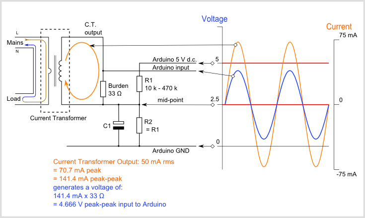

# EmonLib Calibration Theory


#### Voltage sensor

We are measuring the mains voltage. In order to do that, it is first transformed down to a safe voltage, then divided further before being applied to one of the analogue inputs of the processor.

The voltage transformer output is usually around 9 V at the nominal input voltage, but this is at full load. When used as a voltage monitor, it is effectively running on no load, and the voltage is 20 - 25% higher (due to the transformer “regulation”).

In order to reduce the voltage further to bring it within the range of the analogue input, it is usually necessary to have a potential divider formed by two resistors. The resistor ratio is chosen so that the combination of transformer and resistors gives a voltage that under all circumstances (the normal maximum supply voltage combined with the set of worst-case component tolerances that give the highest voltage at the ADC input, plus an allowance if required for a larger than normal crest factor of the voltage waveform) falls within the operating range of the ADC. For an Arduino running at 5 V, or a 3.3 V Arduino or EmonTx/EmonPi, the ‘rule-of-thumb’ voltages will be about 1.6 V rms and 1.1 V respectively. This voltage is then measured by the analogue input of the processor relative to the ADC’s reference voltage. In the case of the Arduino or emonTx/emonPi, that is usually the supply voltage of  5 V or 3.3 V.

The alternating voltage from the transformer has a constant bias added to it so that no part of it can ever be negative. The bias does not affect the calibration, its effect is removed by a filter in the library so we can ignore it when calculating the calibration constant.

The circuit diagram will look like this, but for the voltage input:



In this diagram, which uses the EmonTx component values, the a.c. adaptor (a step-down transformer) reduces the voltage to about 11.6 V rms, and the potential divider formed by resistors R1 & R2 further reduce the voltage to comfortably fit inside the 0 – 3.3 V d.c. range of the analogue input. 

Rd is the reciprocal of the voltage divider ratio
Rt is the voltage transformer ratio.
VRef is the analogue reference voltage.
CMax is the ADC resolution in counts.

It is important to use the correct value for the transformer ratio. Most small transformers are specified at full load, you must use the value under the actual load present. If this is not specified, it must be measured. The no-load voltage can be significantly higher than the nominal voltage under full load.

For the emonTx:

```
Rd = (120k + 10k) ÷ 10k = 13.0,
VRef = 3.3 V,
CMax = 1024
```

and for the Ideal Power (TDC) UK-plug (240VAC in / 9VAC out) AC-AC adapter:

`Rt = 240 ÷ 11.6 = 20.69 (approximately)`


The number seen by the processor is:

`counts = input pin voltage ÷ VRef × CMax` 

where

`input pin voltage = adapter output voltage ÷ Rd`

and

`adapter output voltage = mains voltage ÷ Rt`


In software, in order to convert the count back to a meaningful voltage, the software has to scale it according to the ADC parameters and multiply it by a calibration constant derived from the voltage input hardware parameters:

`Vmains = count ÷ Cmax  ×  VRef × voltage calibration constant`

therefore

`voltage calibration constant = Rt × RD`

which for the EmonTx & Ideal Power (TDC) UK-plug AC-AC adapter is:

`voltage calibration constant = Rt × Rd = 20.68 × 13 = 268.97`

The calibration constant is passed into the calculation as the second parameter to the method `EnergyMonitor::voltage( )` or the first parameter to `EnergyMonitor::voltageTX( )` in the file `EmonLib.cpp`.

 
#### Current sensor

The supplied current is measured using a current transformer, and the resulting (small) current converted into a voltage by the burden resistor. If you are using a device that outputs a voltage, e.g. a current transformer with an internal burden resistor, or a Hall effect transducer, you must not have a burden resistor. This voltage – however it is generated – is then measured by the analogue input of the processor relative to the ADC reference voltage.

(Note: The method for choosing what this voltage should be follows exactly the same principles as for the voltage input, described in the section above.)

The alternating voltage must have a constant bias added to it so that no part of it can ever be negative. The bias does not affect the calibration, its effect is removed by a filter in the library so we can ignore it when calculating the calibration constant.


The circuit diagram will look like this:


Rb is the burden resistor value,
Rt is the current transformer ratio.
VRef is the analogue reference voltage.
CMax is the ADC resolution in counts.

For the emonTx:

```
Rb = 22 Ω,
VRef = 3.3 V,
CMax = 1024
and for the standard YHDC SCT-013-000 CT sensor:
Rt = 100 A  ÷ 50 mA = 2000.
```

The number seen by the processor is

`counts = input pin voltage ÷ VRef × CMax`

where

`input pin voltage =  secondary current × Rb`

and

`secondary current = primary current ÷ Rt`

In the library, in order to convert the count back to a meaningful current, it has to scale it according to the ADC parameters and multiply it by a calibration constant derived from the current input hardware parameters.

`Isupply = count ÷ Cmax  ×  VRef × current calibration constant`

therefore 

`current calibration constant = Rt ÷ Rb`

and for the YHDC SCT-013-000 CT sensor:

`current constant = Rt ÷ Rb  = 2000 ÷ 22 Ω = 90.9`

The calibration constant is passed into the calculation as the second parameter to the method `EnergyMonitor::current( )`, or `EnergyMonitor::currentTX( )` in the file `EmonLib.cpp`. 

**If you use a current transformer with a built-in burden (voltage output type) or a Hall effect transducer**

The line 

`current constant =  Rt ÷ Rb`

is actually 

`current constant = (Ip ÷ Is) ÷  Rb = Ip ÷ (Is  × Rb)`
 
where Ip & Is are the primary & secondary currents, but 

`(Is  × Rb)` 

is in fact the voltage across the burden resistor, so if

Ip is the rated primary current, and
Vs  is the output voltage at that current, then

`current constant  = Ip ÷ Vs`

For example, the Yhdc SCT-013-030 CT sensor gives 1 V at a rated current of 30 A, so for this transformer you have:

`current constant = Ip ÷ Vs = 30 ÷ 1 = 30`

#### Phase angle (power factor) constant

Checks of the phase response of the current and voltage sensors reveal that both have a phase error that varies in magnitude. In the case of the voltage sensor, it increases approximately linearly with increasing voltage; in the case of the current sensor, it falls rapidly at first with increasing current, then reaches a minimum before rising again as saturation sets in. The value of each is heavily dependent on the design and construction of the transformer. Approximate values for the voltage sensor are from 3½° at 225 V to 7° at 253V for an Ideal Power (TDC) 240V AC-AC. adapter; and for the SCT-013-000 current transformer with a 22 Ω burden, around 4°. Fortunately, these errors are in the same direction, so the net error can be very small.

There is another source of error to be considered. In the software, the voltage and current are sampled in that order and conversion takes approximately 100 μs for the Arduino Uno or emonTx,	 thus the voltage is measured earlier than current by about 2° (all measurements are at 50 Hz). 

Hence the net error is likely to vary between 2° and 7°. Note that if voltage and current were to be sampled in the reverse order (current first), then the net error would range between -2° and +3°.

(It is worth considering the effect of these errors on the calculated values: power factor is the cosine of the phase angle, so when the power factor is close to 1, cos(2°) = 0.9994,  cos(7°) = 0.9925 so the power factor is in error by between 0.0006 and 0.0075. However, if the power factor is very poor (say 0.1), then the phase angle is 84.3° and error range becomes much larger – power factor will be calculated as 0.22 to 0.004.  Or with reversed order of sampling, from 0.15 to 0.074, an error of about 0.05).

The calibration constant is passed into the calculation as the third parameter to the method `EnergyMonitor::voltage( )` or the second parameter to `EnergyMonitor::voltageTX( )` in the file `EmonLib.cpp`. 

The correction algorithm in the software applies a proportion (the constant) of the difference between the present sampled value and the previous sampled value to the previous sample. Hence 1 returns the present value, zero returns the previous value and -1 will return (approximately) the value before that. By modifying the software to report the time it takes to complete the inner measurement loop and the number of samples recorded, the time between samples was measured as 377 μs. This equates to 6.79° (360° takes 20 ms).

Note that the correction is centred around 1, i.e. a value of 1 applies no correction, zero and 2 apply approximately 7° of correction in opposite directions. A value of 1.28 will correct the inherent software error of 2° that arises from the delay between sampling voltage and current.

Here is an [Explanation of the phase correction algorithm](explanation-of-the-phase-correction-algorithm).

*RW January 2017.*


