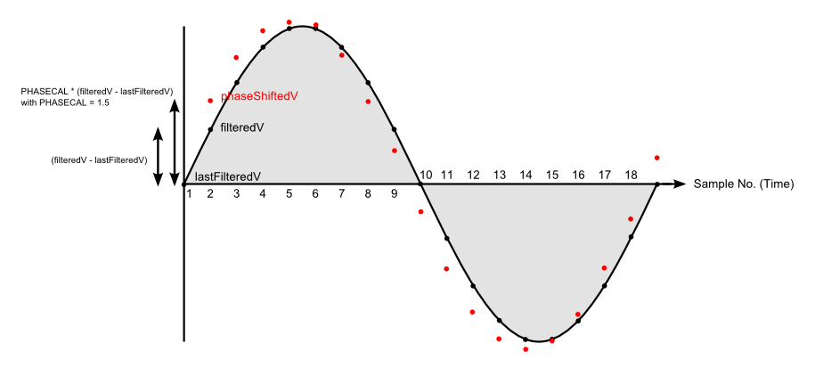

# Explanation of the phase correction algorithm

The correction algorithm in the software applies a proportion (the constant) of the difference between the present sampled value and the previous sampled value to the previous sample. The result generates a new waveform, shifted in time relative to the original (it also has a small effect on the amplitude, which may need to be corrected).

It is best explained with a diagram:

In the standard library routine, the wave is sampled about 53 times per cycle. To simplify the diagram, we have reduced this to 18 times per cycle. Time and samples run from left to right.

The first sample is read from the analogue input, filtered, and becomes 'filteredV'. Ignore for now what happens in the remainder of the first loop of the program. At the start of the second loop, that first sample is copied to the program variable 'lastFilteredV'. We now have the first two points on the diagram. The program calculates 'phaseShiftedV' from the formula

    phaseShiftedV = lastFilteredV + PHASECAL * (filteredV - lastFilteredV);

In the diagram, we have chosen a value of 1.5 for PHASECAL. This puts the point phaseShiftedV above the previous point by 1½ times the vertical distance between this point and the previous point. It is shown by the red dot.

The next time around the program loop, this point will become 'lastFilteredV' and the point we read now is the new 'filteredV'. We calculate the next phaseShiftedV and continue like this. You can see that a new waveform has been made that is shifted to the left. This is equivalent to a phase shift.

Three special values of PHASECAL stand out:

- 1 gives filteredV each time – no change, the waveform is unaltered
- 0 gives lastFilteredV each time – equivalent to moving the waveform to the _right_ by one sample period
- 2 gives (approximately) a move to the _left_ of one sample period

**Theoretical values for PHASECAL.**

By modifying the software to report the time it takes to complete the inner measurement loop and the number of samples recorded, the time between samples was measured as 377 μs. This equates to 6.79° (at 50 Hz, a full cycle, i.e. 360°, takes 20 ms)

Therefore, a value of 1 applies no correction, Zero and 2 apply approximately 7° of correction in opposite directions. A value of 1.28 will correct the 2° error caused by the delay between sampling voltage and current.
