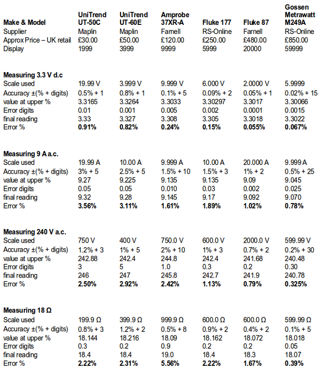

## How good is your multimeter?

***

In order to make accurate measurements that will help when fault-finding, and to calibrate the emonTx, a multimeter is normally used. These range in price from a few pounds to many thousands.

The “headline” accuracy of any meter is usually the best accuracy on one or more of the d.c. voltage ranges. When measuring on other ranges, particularly alternating voltages and currents, the accuracy can be spectacularly different, and it is often necessary to consult the operating manual to determine the accuracy of each individual reading.

Accuracy is normally quoted in terms of a percentage of the quantity being measured plus a number of display digits, for each measuring range. So as well as varying from range to range, the accuracy in percentage terms varies according to the actual value being measured. For example, taking the UniTrend UT-50C measuring 3.3 V d.c; the scale used is 19.99 V and the accuracy on that range is quoted as ±(0.5% + 1 digit). Therefore 3.3 V may be converted to 3.3165 or 3.2835 V at the two extremes, this is rounded to 2 decimal places, 3.32 or 3.28 V (the same as the display), and a further 1 digit of uncertainty is added to become the reading on the display. Therefore the display can read 3.33 or 3.27 or anything in between, and the accuracy has become ±0.90%. However, when reading 9 V on the same range, the accuracy (doing the same maths) has improved to ±0.67%, and when reading 19 V to ±0.58%

Here is a table of a selection of multimeters. The meters were chosen because they were generally available in the UK and by mail order, have the ranges required to measure typical voltages and currents to calibrate an emonTx, and each is approximately double the price of the one before it. Prices range from around £30 to about £850 (GBP, in July 2013). All are hand-held multimeters of the kind most hobbyists would purchase. Although clamp ammeters incorporating voltage ranges are available, they tend to have broadly similar performance to a general purpose instrument in the same price range. The table shows the accuracy when measuring some quantities that you might measure around an emonTx. Only the upper limit value is shown, in some cases rounding might make the accuracy asymmetrical. _Nothing here implies recommendation, endorsement or criticism of a particular make or model of meter or supplier_.

A £50 multimeter should calibrate your emonTx reading power (W) or apparent power (VA) to within 6%, and a £120 one to within 4%. You would need to spend about 4 times that to halve the uncertainty.

