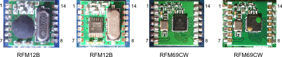

## RFM12B & RFM69cw wireless transceiver modules

The RFM12 and RFM69 radio modules are low power and low cost radio transceiver modules that are useful for sending data between sensor nodes and a basestation and have been used extensively in OpenEnergyMonitor hardware units for some time.

This page provides a brief overview of both modules and how they can be used in conjunction with an Arduino based microcontroller for communication between sensor nodes.

The modules are manufactured by Hope RF, re-branded by RFsolutions in the UK. Sometimes called 'Alpha RF'. They are low cost RF transceivers available from Rapid, Farnell, or RS in the UK.

- RFM12B Datasheet: [http://www.hoperf.com/upload/rf/RFM12B.pdf](http://www.hoperf.com/upload/rf/RFM12B.pdf)
- RFM69CW Datasheet: [http://www.hoperf.com/upload/rf/RFM69CW-V1.1.pdf](http://www.hoperf.com/upload/rf/RFM69CW-V1.1.pdf)

## Overview

|     | RFM12b | RFM69cw |
| --- | ------ | ------- |
| Supply Voltage | 2.2 to 3.8V | 1.8 to 3.6V |
| Interface | SPI | SPI |
| Frequency | 433MHz, 868MHz, 915MHz | 433MHz, 868MHz, 915MHz |
| Open air range | 150m | 250m |
| In home range | Similar to WIFI network | Similar to WIFI network |
| Transmission power | 5 dBm | 13 dBm |
| Standby Current | 0.3 uA | 0.1 uA |
| Bit rate | 115Kbps | 300Kbps |
| Encryption | Sofware | 128-bit AES Hardware |

3 ISM band frequencies: 433MHz (worldwide), 868MHz (Europe), 915MHz (USA & Australia only).

**JeeLib Arduino driver library**

- Maximum payload size: 66 bytes
- Up to 30 nodes per network*
- Up to 250 different network groups

The operating frequency of the modules is set in software. For best performance, the frequency chosen should match the hardware frequency of the module. 

Node ID's can be 0-31 with 1-30 used for normal operation. ID 31 is special, as it can communicate with nodes on any network. ID 0 is reserved for OOK operation.

## Antenna 

433 1/4 wave = 164.7mm  
433 1/2 wave = 329.4mm  
433 full wave = 692.7mm

868 1/4 wave = 82.2mm  
868 1/2 wave = 164.3mm  
868 full wave = 345.5mm

915 1/4 wave = 77.9mm  
915 1/2 wave = 155.9mm  
915 full wave = 327.8mm

## Arduino Uno Connections

An RFM12/69 can be connected to an Arduino running at 5V with the following circuit. The 4.7k and 10k resistors are used to drop the voltage levels from the Arduino down to 3.3V so as not to damage the RFM12/69 module.

The 4.7k resistors can be replaced with a direct wire link and 10k resistors removed if the Arduino or ATmega microcontroller is running at 3.3V.

Credit to Michael Margolis from [Arduino Cookbook](https://www.google.co.uk/url?sa=t&rct=j&q=arduino%20cookbook&source=web&cd=3&ved=0CFEQFjAC&url=http%3A%2F%2Fwww.amazon.co.uk%2FArduino-Cookbook-Michael-Margolis%2Fdp%2F0596802471&ei=WuqvTvppzsa0BqW-zFo&usg=AFQjCNHpgR7fNyKaGbD2cdFYktu9xSx47A&sig2=h6h3Pj-0Xy30PzFc0IT7dg) for Arduino connection diagram.

## Software

See: [Sending data between nodes with the RFM12/69](sending-data-between-nodes-rfm)
