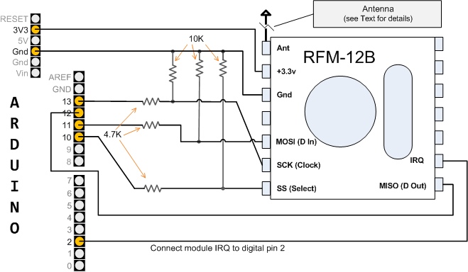

# RFM12B & RFM69CW Wireless Transceiver Modules

The RFM12 and RFM69 radio modules are low power and low cost radio transceiver modules that are useful for sending data between sensor nodes and a basestation and have been used extensively in OpenEnergyMonitor hardware units for some time.

This page provides a brief overview of both modules and how they can be used in conjunction with an Arduino based microcontroller for communication between sensor nodes.

The modules are manufactured by Hope RF, re-branded by RFsolutions in the UK. Sometimes called 'Alpha RF'. They are low cost RF transceivers available from Rapid, Farnell, or RS in the UK.

<p>So far, two types of Hope radio modules have been used with OpenEnergyMonitor kits &amp; modules. The first version was the RFM12B. During 2014, the RFM69CW became generally available and from May 2015, only the RFM69CW was&nbsp;supplied. Both modules have been manufactured for three frequency bands, 433 MHz, 868 MHz and 915 MHz, but only the first two are in common use. Since early 2015, the OEM Shop has standardised on 433 MHz.</p>

## The RFM69CW - 433 MHz Option

```{image} files/RFM69CW-433.png
:width: 400px
```

The antenna connection (pin 1) is top left. Distinguishing features are the i.c. is 28-pin square, marked &quot;RF69&quot;. The visible difference between the 433 MHz version and the 868 MHz version is the 433 MHz version has an extra capacitor, shown arrowed above, and green and bronze dots.</p>

## The RFM69CW - 868 MHz Option


```{image} files/RFM69CW-868.png
:width: 400px
```

The antenna connection (pin 1) is top left. Distinguishing features are the i.c. is 28-pin square, marked &quot;RF69&quot;. The visible difference between the 433 MHz version and the 868 MHz version is the 868 MHz version has no capacitor in the position shown arrowed above, and might have yellow and bronze dots.</p>

## The RFM12B - 433 MHz Option

```{image} files/RFM12B-433_0.png
:width: 400px
```

The antenna connection (pin 1) is top left. Distinguishing features are the i.c. is usually either a 16-pin dual-in-line (as here) or a &#39;blob&#39;. The visible difference between the 433 MHz version and the 868 MHz version is the 433 MHz version has an extra capacitor, shown arrowed above.</p>

## The RFM12B - 868 MHz Option

```{image} files/RFM12B-868.png
:width: 400px
```

The antenna connection (pin 1) is top left. Distinguishing features are the i.c. is usually either a 16-pin dual-in-line or a &#39;blob&#39; (as here). The visible difference between the 433 MHz version and the 868 MHz version is the 868 MHz version has no capacitor in the position shown arrowed above.</p>

## The RFM12B - with SMT Crystal

```{image} files/RFM12B-X868.png
:width: 400px
```

The RFM12B has also been manufactured with a smaller SMT crystal, this is an 868 MHz version, with no capacitor in the position shown arrowed above. The antenna connection (pin 1) is top left. <em>(Picture from Sparkfun)</em></p>

## Orienting and Fitting the Radio Module

<p>Do not rely on the relative positions of the crystal and the i.c. when orienting the RFM module. The safe guide is the cluster of small surface-mount components, which are nearest to the antenna pin (pin 1) in both the RFM12B and the RFM69CW versions. You should locate the PCB track from a pad to the antenna, which will be either a whip or an SMA socket, to see which is pin 1.</p>
<p>Make absolutely certain that you have oriented the module correctly before soldering, as without a professional rework station it is almost impossible to remove the module without damage either to the module, or to the main pcb, or both.</p>

## Difference Between 433 MHz &amp; 868 MHz Modules

<p>The only difference between the modules for the two RF bands is the antenna tuning, hence the additional capacitor that is visible in the photographs above. A 433 MHz band module will work at 868 MHz, and an 868 MHz band module will work at 433 MHz, but because the tuning is wrong, receiver sensitivity, transmitter output power and maximum range are significantly reduced. Operating an RFM69CW at maximum power on the wrong band or without an antenna, can damage the module.</p>
<p>Operation on the wrong band can, however, be very useful when testing, and is easily accomplished by setting the frequency in the sketch or in emonhub.</p>

## Differences Between RFM12B &amp; RFM69CW Modules

<p>Both modules share the same pin configuration, so are physically interchangeable.</p>
<p>However, the later RFM69CW has a higher output power and consequently draws a higher current when transmitting, although the standby current is lower. This must be taken into account in the case of battery operation, or when power supply output is limited, as is the case with the emonTx V3 when powered by an ac adapter.</p>

Also, because of the higher power available, it is essential that a proper matching antenna is used with the RFM69CW module. If it is possible that no antenna, or a wrong antenna, will be used, then the maximum power should be set no higher than +7 dBm.


- RFM12B Datasheet: [http://www.hoperf.com/upload/rf/RFM12B.pdf](http://www.hoperf.com/upload/rf/RFM12B.pdf)
- RFM69CW Datasheet: [http://www.hoperf.com/upload/rf/RFM69CW-V1.1.pdf](http://www.hoperf.com/upload/rf/RFM69CW-V1.1.pdf)

### Properties

|     | RFM12b | RFM69cw |
| --- | ------ | ------- |
| Supply Voltage | 2.2 to 3.8V | 1.8 to 3.6V |
| Interface | SPI | SPI |
| Frequency | 433MHz, 868MHz, 915MHz | 433MHz, 868MHz, 915MHz |
| Open air range | 150m | 250m |
| In home range | Similar to WIFI network | Similar to WIFI network |
| Transmission power | 5 dBm | 13 dBm (only with a matching antenna) |
| Supply current at max. power | 28 mA | 45 mA |
| Standby Current | 0.3 uA | 0.1 uA |
| Bit rate | 115Kbps | 300Kbps |
| Encryption | Sofware | 128-bit AES Hardware |

3 ISM band frequencies: 433MHz (worldwide), 868MHz (Europe), 915MHz (USA & Australia only).

### Software 

<p>The low-level commands and the internal configuration of the modules are vastly different, so totally different software is required for each. Both sets are included in JeeLib, and a simple software switch is used in the sketch to select which part of the library should be used. It is essential this is correctly set, because the module will not operate, and the sketch will hang, if the incorrect setting is chosen.</p>
<p>The software switch is:</p>
<ul style="list-style-type:none">
	<li>#define RF69_COMPAT 0 <em style="padding-left:3em">for the RFM12B</em></li>
	<li>#define RF69_COMPAT 1 <em style="padding-left:3em">for the RFM69CW</em></li>
</ul>
<p>There is a common interface, so no other changes are required.</p>

### Antenna 

433 1/4 wave = 164.7mm  
433 1/2 wave = 329.4mm  
433 full wave = 692.7mm

868 1/4 wave = 82.2mm  
868 1/2 wave = 164.3mm  
868 full wave = 345.5mm

915 1/4 wave = 77.9mm  
915 1/2 wave = 155.9mm  
915 full wave = 327.8mm

## ‘Classical’ JeeLib Arduino Driver Library

- Maximum payload size: 66 bytes
- Up to 30 nodes per network*
- Up to 250 different network groups

The operating frequency of the modules is set in software. For best performance, the frequency chosen should match the hardware frequency of the module. 

Node ID's can be 0-31 with 1-30 used for normal operation. ID 31 is special, as it can communicate with nodes on any network.<br>ID 0 is reserved for OOK operation.

## RFM69 Native Mode Library

To successfully use the RFM module with the continuous monitoring software in the emonPiCM, it is necessary to use the “RFM69 Native” format for the radio messages. 

Maximum payload size: 60 bytes
Up to 60 nodes per network.  (Node 0 is on-off keying, 61 is send-only, 62 is reserved, 63 is receive-all)
Up to 250 different network groups

This is incompatible with the “classical JeeLib” format, therefore a new library and a suite of modified sketches is required for monitoring nodes that work with an emonPiCM.


## Arduino Uno Connections

An RFM12/69 can be connected to an Arduino running at 5V with the following circuit. The 4.7k and 10k resistors are used to drop the voltage levels from the Arduino down to 3.3V so as not to damage the RFM12/69 module.

The 4.7k resistors can be replaced with a direct wire link and 10k resistors removed if the Arduino or ATmega microcontroller is running at 3.3V.

[](files/Cookbook_RFM12B_connections.png)

Credit to Michael Margolis from [Arduino Cookbook](https://www.google.co.uk/url?sa=t&rct=j&q=arduino%20cookbook&source=web&cd=3&ved=0CFEQFjAC&url=http%3A%2F%2Fwww.amazon.co.uk%2FArduino-Cookbook-Michael-Margolis%2Fdp%2F0596802471&ei=WuqvTvppzsa0BqW-zFo&usg=AFQjCNHpgR7fNyKaGbD2cdFYktu9xSx47A&sig2=h6h3Pj-0Xy30PzFc0IT7dg) for Arduino connection diagram.

## Software

See: [Sending data between nodes with the RFM12/69](sending-data-between-nodes-rfm)

## References

<p>RFM12B Data Sheet: <a href="http://www.hoperf.com/upload/rf/RFM12.pdf">http://www.hoperf.com/upload/rf/RFM12.pdf</a></p>
<p>RFM69CW Data Sheet: <a href="http://www.hoperf.com/upload/rf/RFM69CW-V1.1.pdf">http://www.hoperf.com/upload/rf/RFM69CW-V1.1.pdf</a></p>
