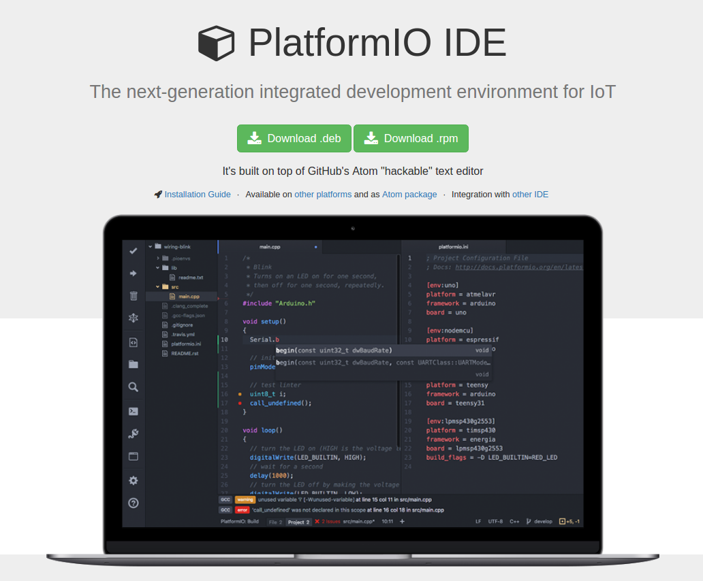
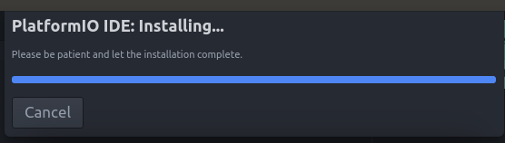
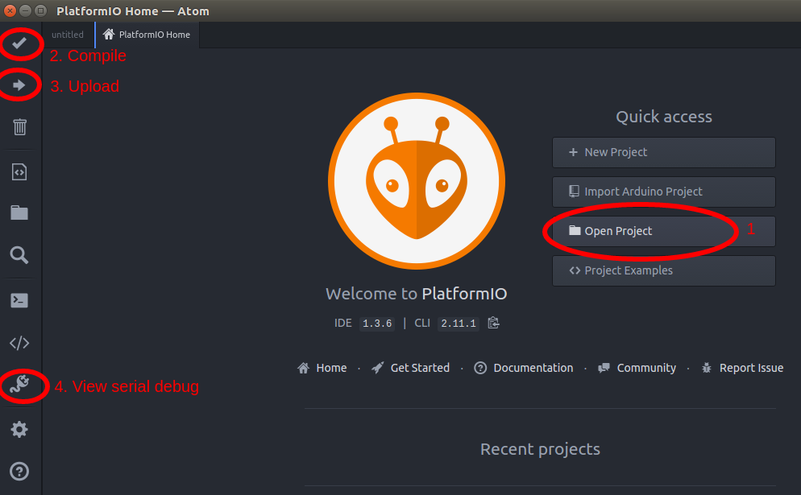

# Using PlatformIO

[**platformio.org:**](https://platformio.org)

- PlatformIO is an open-source ecosystem for IoT development.
- Cross-platform build system, IDE integration and continuous testing. Arduino, Espressif, ARM and mbed compatible.

See our [blog post introducing PlatformIO](https://blog.openenergymonitor.org/2016/06/platformio/).

## PlatformIO IDE

PlatformIO IDE is built on [Atom](https://atom.io) open-source *'hackable text editor for the 21st century'* built by the GitHub. See [PlatformIO IDE Install guide](http://docs.platformio.org/en/latest/ide/atom.html#ide-atom) for more info.

*Note: skip this section if your would prefer to use PaltformIO via it's excellent command-line interface*

These install steps have been tested to work on Linux, Mac and Windows.

- [Download and install PlatformIO IDE](http://platformio.org/platformio-ide)

If running windows:
- Python will also need to be installed, see [PlatformIO IDE install-guide](http://platformio.org/platformio-id) *
- [USB to UART adapter windows drivers](http://www.silabs.com/products/mcu/Pages/USBtoUARTBridgeVCPDrivers.aspx) will need to be installed



The first time Atom IDE is opened after a few seconds PlatformIO will finish the installation and then display its home page.





### Open emonTx3 Firmware

- Download [emonTx3 Firmware GitHub repo](https://github.com/openenergymonitor/emontx3) either via git clone or downloading the zip and extracting. 
- From the PlatformIO Home screen in Atom IDE choose `Open Project (1)*`
- Navigate to the standard emonTx Firmware `emontx3/firmware/emonTx34/emonTx34_CM` then chosen `open`
- You should see the emonTx34_CM firmware files in the file-tree on the right-hand-side of the editor


### Compile Firmware

- Once change has been made save then file then compile with PlatformIO by clicking `Compile (2)`
 - If this is the first time the code has been compiled PlatformIO will ask if you want to install all the required libs that are specified in `platformio.ini`. See [PlatformIO library manager](http://platformio.org/lib).

### Upload Firmware

- If code compiles successfully upload the firmware by clicking on `Upload (3)`
- Note: A [USB to UART cable](https://shop.openenergymonitor.com/programmers) is required to upload to emonTx / emonTH
- After successful upload check nodeID has changed by viewing serial output, click `Serial Monitor (4)` and choose `115200 baud`.

---

## PlatformIO Command Line

PlatformIO works great from the commandline, follow these instructions to install and run platformIO from the commandline. See the excellent [PlatformIO Quick Start Guide](http://docs.platformio.org/en/latest/quickstart.html) for more info.

### 1. Install PlatformIO via commandline

The easiest way if running Linux is to use the install script, this installs pio via python pip and installs pip if not present. See [PlatformIO installation docs](http://docs.platformio.org/en/latest/installation.html#installer-script):

`$ sudo python -c "$(curl -fsSL https://raw.githubusercontent.com/platformio/platformio/master/scripts/get-platformio.py)"`

### 2. Clone emonTx / emonPi repo

**emonTx V3**

```
git clone https://github.com/openenergymonitor/emontx3
cd emontx3/firmware/emonTx34/emonTx34_CM
```

**emonPi**

```
git clone https://github.com/openenergymonitor/emonpi
cd emonpi/firmware/emonPi_CM
```

### 3. Compile with PlatformIO CLI

`$ pio run`

### 4. Upload with PlatformIO CLI

`$ pio run -t upload`

*The first time platformIO is run it will ask to install the required libraries  and avr toolchain. The required libraries are defined in platformio.ini in the project folder.*

### 4. View serial port with PlatformIO CLI

`$ pio device monitor`

For more PlatformIO commandline love see [PlatformIO getting started](http://docs.platformio.org/en/latest/quickstart.html)
