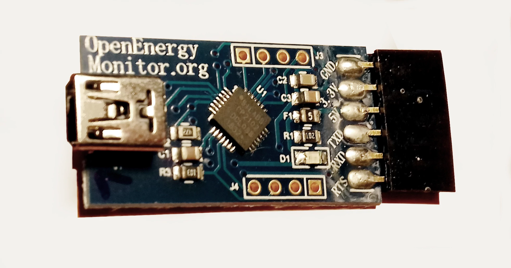

# Wicked Device / OpenEnergyMonitor Programmer

(Using the Silicon Labs CP2102 USB-to-UART Bridge Controller)

## Purpose

The Programmer connects the FTDI port on an emonTx, an emonTx Shield, an emonTH, an emonPi Shield, or the
Shield part of a disassembled emonPi to the USB port of a computer. This enables the device to be programmed or
to transfer serial data in each direction between the two, for calibration or monitoring. The programmer sold in the
OpenEnergyMonitor Shop prior to January 2021 uses the Silicon Labs chipset, which requires a driver downloaded from the SI
Labs website.

<!-- side-by-side images --->

  

    
  

  

    
  

<!-- /side-by-side images -->

<small>
  A "Wicked Device Nanode" and an OpenEnergyMonitor programmer.
  The only practical difference is the USB connector – a USB-A on the Nanode programmer and a USB-Mini connector on the
  OpenEnergyMonitor programmer.
</small>

## Install the Drivers

If your computer’s operating system is Linux, no drivers are needed.

If your computer’s operating system is Windows or MacOS, you need to install the SI Labs drivers for the CP2102
USB-to-UART bridge controller.

## Windows 10 OS

**Do not** follow the instructions for installing the drivers on the Arduino website, instead download the drivers from
https://www.silabs.com/developers/usb-to-uart-bridge-vcp-drivers. Click `Downloads`, then `CP210x
Universal Windows Driver`.

![Win10-1.webp][Win10]

[Win10]: files/Win10-1.webp "Windows 10"

This will download a zip file `CP210x_Universal_Windows_Driver.zip` to your usual location.

Extract the contents to a convenient place and you will find two installers, one for 32-bit computers
(`CP210xVCPInstaller_x86.exe`) and one for 64-bit (`CP210xVCPInstaller_x64.exe`). Double-click
on the correct one for your machine and allow it to install the drivers in the normal way.

Make sure you restart the Arduino IDE after installing the drivers. Before you connect the
programmer, check `Tools > Port` [or `Serial Port`]. If `Port` is greyed out, that's OK, if not and any
`COM` (serial) ports are listed, make a note of which they are. Now connect the programmer and
your module (emonTx, emonTH, etc). Go back to the main menu and select `Tools` again. [Serial]
`Port` should be available and showing a new port. Select that port. Under `Tools > Board` ensure
`Arduino/Genuino Uno` is selected.

## MacOS

**Do not** follow the instructions for installing the drivers on the Arduino website, instead download the drivers from
https://www.silabs.com/developers/usb-to-uart-bridge-vcp-drivers. Click `Downloads`, then `CP210x VCP Mac OSX Driver`.

![MacOS_v6.webp][MacOSv6]

[MacOSv6]: files/MacOS_v6.webp "MacOS"

This will download the needed driver to the Download folder.  **Note:** If the file is downloaded as a ZIP file then double-click to uncompress.  And then install.

Open the `Mac_OSX_VCP_Driver` folder and double-click `Silicon Labs VCP Driver.pkg` to install the drivers.

If the software is blocked a window will pop-up with instructions.  Click **Open System Preferences**.

Open the macOS `System Preferences` > `Security & Privacy` and click **Allow**.

Make sure you restart the Arduino IDE after installing the drivers. Before connecting the programmer, check `Tools > Port` and make note of the available ports. Now connect the programmer and your module (emonTx, emonTH, etc). Go back to the main menu and select `Tools > Port` again. `Port` should be available and showing a new port. Select the port `/dev/cu.SLAB_USBtoUART`. And under `Tools > Board` ensure `Arduino/Genuino Uno` is selected.

## Connecting the Programmer

Use a USB-A or USB-Mini cable (whichever fits) to connect the programmer to your computer. The blue
“power” LED will light.

![Wicked_Device_Gnd.webp][WDGND]

[WDGND]: files/Wicked_Device_Gnd.webp "Wicked Device GND pin"

On the UART connector, the GND pin is labelled on the component side.

## EmonTx

![emonTx.webp][emontx]

[emontx]: files/emonTx.webp "emonTx"

Plug the programmer into the emonTx with the component side of the board and the blue LED facing down
and the GND connection aligned with the engraving on the panel; that is, nearest to the aerial socket on the
emonTx.

## EmonTx Shield

![emonTxShield.webp][emontxShield]

[emontxShield]: files/emonTxShield.webp "emontx Shield"

Plug the programmer into the emonTx Shield with the component side of the board facing inwards and the
GND connection farthest from the jack sockets.

## EmonTH

![emonTH.webp][emonTH]

[emonTH]: files/emonTH.webp "emonTH"

Plug the programmer into the emonTH with the component side of the board facing inwards and the GND
connection farthest from the corner.

## EmonPi Shield

Plug the programmer into the emonPi Shield with the component side of the board facing inwards towards the
centre of the board. Note that a separate 5 V USB power supply is needed to program the Shield, and for the
Shield to work in the absence of a Raspberry Pi.

![emonPiShield.webp][emonpishield]

[emonpishield]: files/emonPiShield.webp "emonPi Shield"

## M-Bus to UART Converter

Plug the programmer onto the header pins with the component side and the LEDs facing upwards and away from M-Bus to UART converter board.

![WD_MBus.webp][wd_mbus]

[wd_mbus]: files/WD_MBus.webp "Using the 'OEM' programmer with the M-Bus to UART converter"

## Powering the Emon Device

While loading and testing a sketch, the programmer can provide power to the emonTx and emonTH, using the
5 V connection.

The emonTx Shield and Arduino might draw a significant current at 5 V. This will require a separate power
supply if the USB power is insufficient. The maximum current that the programmer can supply at 3.3 V is 100
mA.

The emonPi Shield does not have the appropriate connection on the FTDI connector, therefore the normal
USB 5 V d.c. power must be supplied separately.

## Finding the Computer Port

The general method is: list the ports, plug the programmer in, list the ports again and the new port that
appears is that which the programmer is connected to. Select it.

## Linux, MacOS & Windows 10

In the Arduino IDE, and before connecting the programmer, check `Tools > Port` [or `Serial Port`]. If
`Port` is greyed out, that's OK, if not and any `COM` (serial) ports are listed, make a note of which ones they
are. Now connect the programmer and your module (emonTx, emonTH, etc). Go back to the main menu and
select `Tools` again. [Serial] `Port` should be available and showing a new port. Select that port. Under
MacOS, the port will possibly be called `/dev/cu.SLAB_USBtoUART`.

## Assigning the Programmer’s Port (Linux Only)

Under Linux, it is possible to assign the port that the programmer will appear on. In the directory
`/etc/udev/rules.d` create a file named `60-emonProgrammer.rules`. There needs to be one line per
device. The line for the Wicked Device Nanode/OpenEnergyMonitor programmer is:

`SUBSYSTEM=="tty", ATTRS{idVendor}=="10c4", ATTRS{idProduct}=="ea60", SYMLINK+="FTDI", MODE="0666"`

The programmer will now appear as a device: `/dev/FTDI -> ttyUSB0`.

(The file may also contain a line for the FTDI LC231X programmer:

`SUBSYSTEM=="tty", ATTRS{idVendor}=="0403", ATTRS{idProduct}=="6015", SYMLINK+="FTDI_LC231X", MODE="0666"`.

This programmer will now appear as a device: `/dev/FTDI_LC231X -> ttyUSB0`)

Unfortunately, the Arduino IDE does not recognise the symlinks.

There is a Forum discussion [here](https://community.openenergymonitor.org/t/how-to-match-a-ttyusbx-device-to-
a-usb-serial-device/8747).

## LED Activity

A blue LED indicates “Power On”. The power may come from either the USB connector or the FTDI
connector. There is no indication of data flowing.
