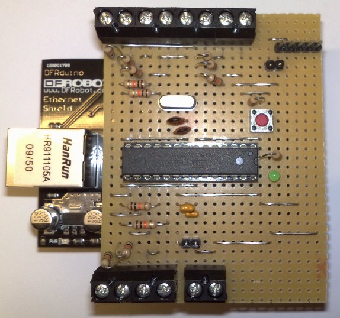
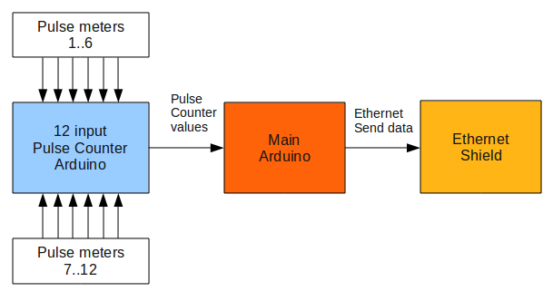
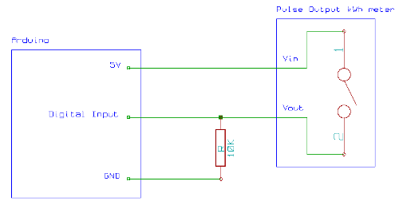

## Build a 12 input pulse counter - multiple input pulse counting

_Pulse counting shield: includes a dedicated barebones Arduino and pull down resistors (detailed below)_

### How it works

We can't use the interrupt method to measure 12 pulse inputs as there are only 2 interrupts on the Arduino. Instead, we need to sample very fast and as continuously as possible in order to catch every pulse and measure the pulse rate accurately. To get best performance we need to:

1.  Read the digital input pins using fast low level digital input register commands
2.  Dedicate the Aduino to pulse counting. e.g. no Ethernet data sending.
3.  Streamline the code as much as possible - e.g. no floating point math and minimal serial printing.

**Low level digital input registers**

When first prototyping the multiple input pulse counter we used the standard Arduino digitalRead to read the state of the digital inputs and we also used the pulse counting Arduino to do other things like sending data via Ethernet. After doing some accuracy tests it quickly became apparent the more inputs we read, the worse the accuracy became. The accuracy deteriorated quite rapidly.

Luckily, we can read digital Inputs much faster using direct port manipulation. It's possible to read a register of 8 digital inputs in one command, although it actually drops to 6 inputs per register due to the use of 2 for serial communication ( 0 and 1) and for the clock crystal (14 and 15).

Digital pins 2 to 13 occupy 2 registers, register D and B. By calling commands PIND and PINB which return a binary value of the digital pin states, it's possible to read 12 useful digital inputs virtually simultaneously. Although it's much faster than using the digital read command, it's not as easy to understand when you look at the code!

With low level digital register access, accuracy stopped dropping when reading from more than 2 or 3 inputs.

**Dedicated Pulse Counting Arduino**

The Arduino used for pulse counting needs to be dedicated to the task. As mentioned above, the first protoype used the same arduino for Ethernet data. The problem is that Ethernet data sending can take from 26 to 1700+ ms, and any pulses occurring during this time, are lost. For accurate results, keep the pulse counting Arduino needs to be dedicated.

This means that a 12 input pulse counting Arduino needs to be seen as an external input module. We need a second Arduino for doing other tasks like Ethernet data sending, etc.

We decided to opt for a configuration where the pulse counting Arduino displays its pulse times in microseconds and pulse counts of all 12 inputs via 115200 bps serial, once per second. This string is sent to, and decoded by, the main Arduino, then sent via Ethernet, to a web-conected energy display:

### Hardware

The hardware for a pulse counter is mostly just the Arduino itself, then depending on your configuration:

**Wired pulse counting**

A pull down 10k resistor on each digital input to bring the digital signal to zero when the pulse output relay is in its off/disconnected state.

**LED Pulse counting**

Create LED pulse sensors following this [guide by AirSensor](http://www.airsensor.co.uk/component/zoo/item/energy-monitor.html)

No pull down resistor is required as the pulse / light sensor output is logic level 0 when the pulse is low. However, if you build a pulse counting module with pull down resistors of ~10k it still works with the light sensor, more info to come on this.

### Software

**Dedicated pulse counting module sketch**

Measures pulses from up to 12 pulse output meters, sends a string to the serial port at a specified time interval (1s default) with pulse times and pulse counts. The string is in semi-JSON format to keep it lightweight.

**Download:** [MultipleInputPulseCounter_24Oct.zip](files/MultipleInputPulseCounter_24Oct.zip)

**Base Arduino sketch**

The following sketch decodes the semi-JSON string sent from the dedicated pulse counting Arduino and calculates power and energy values from the pulse times and pulse counts.

**Download:** [PulseDecoder.zip](files/pulseDecoder.zip)

**Pulse Decoder + Ethernet**

The above sketch, plus sending these values via a JSON string to the web using the official Ethernet shield.

**Download:** [PulseDecoderEthernet.zip](files/pulseDecoderEthernet.zip)

**Bench Testing - Pulse Generator**

With the pulse counter build, you may want to test all 12 inputs for proper operation. Glyn Hudson has written documentation and a sketch to do that: [Bench testing with a 12 output pulse generator](12-input-pulse-counting-testing)

### More useful pages:

### **[Introduction](introduction-to-pulse-counting)**

### **[Accuracy and Precision](accuracy-and-precision)**