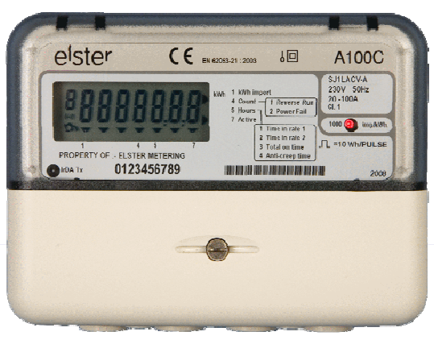
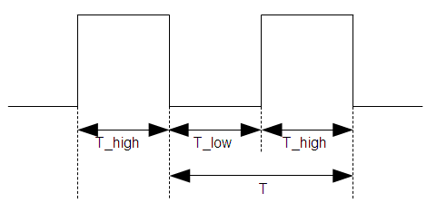
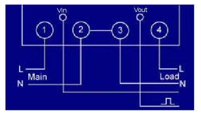

# Monitoring energy via utility meter pulse output

## Introduction

Many meters have pulse outputs, examples include: single phase and three phase electrical energy meters, Gas meters, Water meters.

The pulse output may be a flashing LED or a switching relay (usually solid state) or both.

In the case of an electricity meter, a pulse output corresponds to a defined amount of energy passing through the meter (kWh/Wh). For single-phase domestic electricity meters (e.g. the Elster A100c) each pulse usually equals one Wh (1000 pulses per kWh).  With higher power meters (often three-phase), each pulse corresponds to a greater amount of energy e.g. 2, or even 10, Wh per pulse.

## Example Meter

- **[A100C BS Single Phase Meter](http://www.elstermetering.com/en/949.html)**

## What is a Pulse?

_Figure 1_

Figure 1 illustrates a pulse output. The pulse width T_high varies depending on the meter. Some pulse output meters allow T_high to be set. T_high remains constant during operation. For the A100c meter T_high is 50ms. The time between the pulses T_low varies according to the pulse rate. It is the pulse *rate*, 1/T, that indicates the power measured by the meter.

## Calculating Energy

For the A100c meter, each pulse represents 1/1000th of a kWh, i.e. 1 Wh, of energy passing through the meter.

## Calculating Power

3600 seconds per hour = 3600J per pulse i.e. 1 Wh = 3600J
therefore, instantaneous power **P = 3600 / T** where T is the time between the falling edge of each pulse.

## Optical Pulse Counting: Flashing LEDs

Many electricity meters do not have pulse output connections or the connections are not accessible due to restrictions imposed by the utility company. All modern meters have an optical pulse output LED. In such cases an optical sensor can be used to interface with the meter.

The red pulse-output LED can be seen in the A100c picture above. To detect the pulses from the LED, you need a light sensor, such as [this one](https://shop.openenergymonitor.com/optical-utility-meter-led-pulse-sensor/). This is supplied complete with a RJ45 plug to give an easy connection to the pulse input of an emonTx or emonPi. 

Inside the sensor is a small p.c.b. carrying a photo-diode and a two-transistor amplifier-driver circuit:

<small>Thanks to @warrenashcroft for providing the photo, and confirming the circuit details.</small>

The circuit generally works well, but has a few shortcomings: it is susceptible to ambient light, so it should be shielded from bright lights; the green LED does not accurately reflect the state of the output, so there can be a logic high output without the green LED lighting.

The pulse input of the emonTx and emonPi is configured with the internal pull-up active (to prevent spurious pulses being counted when nothing is connected) but this is quite weak and the resistor R4 is able to pull the output down when the transistor turns off. It should not be necessary to supplement the pull-up resistor, nor to add an external pull-down. If severe interference is experienced, a moderately low-valued capacitor may be connected between the pulse output and GND. Its value will be determined by the pulse width and maximum pulse rate, 100 nF would be a good starting value.

## Other Optical Sensors

Other sensors that operate in the visible and infra-red ranges should be usable. A photo-diode or photo-transistor will be suitable, and you will need a similar interface circuit to give a usable pulse output. A light-dependent resistor is unlikely to be satisfactory due to its very slow response time.

## Wired / Switched Output Pulse Detection

Many meters have a wired pulse output. Often, this will be labelled or described in the documentation as “S0”. The S0 interface is a standardised hardware interface, defined in EN62053-31. Inside the meter, there is a switch – possibly a reed relay but more likely an optically isolated transistor. The operating voltage must be supplied by the emonTx or emonPi.

The meter’s “S0-” terminal should connect to GND, and the “S0+” terminal to the pulse input. The internal pull-up might not be strong enough, and in that case a 1 kΩ resistor must be connected between the 3.3 V terminal and the pulse input to provide adequate current.

If the meter’s pulse output is **NOT** labelled as “S0”, then you should assume that it cannot be directly connected to an Arduino, emonTx or emonPi and you need to determine exactly what it is. It is possibly a connection at line voltage and isolation will be required.

## Wired / Switched Output Supply Voltage

From what I understand, 24V is a fairly standard supply for such meter systems, but other voltages can usually be used. Meters often have a fairly wide pulse output supply voltage range of 3 to 35V. So the 5V supply from an Arduino could be used. Higher voltages are desirable when there is more noise in the environment and the cable runs are longer.

## Safety

**Watch out for mains connected pulse outputs: **Make sure your meter's pulse output is not connected to the high voltage mains (within the meter). Some meters have one of the pulse output connectors connected to neutral. If your meter is one of these you will need isolation circuitry to interface with an Arduino.

**Live wire proximity: **The pulse outputs are usually very close to live wires, so watch out for those too!

## Further Reading

- [Gas meter monitoring](gas-meter-monitoring)
- [http://www.arduino.cc/cgi-bin/yabb2/YaBB.pl?num=1276096046](http://www.arduino.cc/cgi-bin/yabb2/YaBB.pl?num=1276096046)
- [Single optical pulse counting using a JeeNode board and a Hope RFM12 RF module](http://jeelabs.net/projects/cafe/wiki/Electricity_consumption_meter)
- [Application instructions energy meter Topic: S0-pulse interface](https://sbc-support.com/uploads/tx_srcproducts/Applicationnote_S0puls_output_EN_V1.1_01.pdf)
