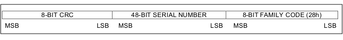

# DS18B20 - Serial Number and Search Algorithm

Some users of the DS18B20 sensor have thought that that the functions that detect the sensors do so in random order. In fact, this is not the case and the Search ROM function is deterministic and always returns the devices found in the same order. The algorithm is explained in the [Maxim iButton® Book of Standards](http://www.maxim-ic.com/ibuttonbook). The DallasTemperature Library claims to use the same algorithm, and this indeed appears to be the case. The reason people think the order is random is because the serial numbers are sorted in an order that is not obvious to us. The order is revealed only after we manipulate the numbers.

## Cracking the code.

All the information necessary is contained in two Maxim publications, the DS18B20 Data Sheet and the previously mentioned iButton book, as well as the DallasTemperature software library.

The starting point is the 64-Bit Lasered ROM Code, set out in Fig. 6 in the data sheet:

The lasered ROM code, often called the “serial number”, actually comprises three parts: the CRC, the serial number itself and the family code. The order of these might seem peculiar, with the CRC occupying the 8 most significant bits, but there is a good reason for this, and for that we need to look in detail at the search algorithm in the iButton book. There, it explains that, when searching the devices on the one-wire bus, the data is sent and read with the least significant bit of the least significant byte or character first; in other words, from right to left in the diagram above. So in fact, the family code is the first element to be read. And this makes sense: if it isn't a device of the correct family, it can be ignored.

However, this family code is the first element of the address array that is printed by the temperature search sketch. These two things are the clues to predicting the order in which the sensors are discovered: the search is performed with the greatest weight given to the first (the least significant, and right-most) bit in the diagram.

Using three particular sensors as an example, their addresses as reported by the sketch are:

    0x28, 0x81, …
    0x28, 0xC9, …
    0x28, 0x8D, …

The first byte of the “address” is always 0x28, the family code, so it’s not helpful. Let’s examine the second byte.

The algorithm is this:
Reverse the bit order of the second byte of each address, and then read it conventionally with the left-most bit being the most significant:

    0x81 = 10000001, reversed is 10000001, or 129 decimal
    0xC9 = 11001001, reversed is 10010011, or 147 decimal
    0x8D = 10001101, reversed is 10110001, or 177 decimal
    
At this point we have uniquely determined (or more accurately verified) the sort order: the smallest number came first. Had two or more addresses been equal here, we would have continued with the next and subsequent bytes, treating them in exactly the same way, until the order was resolved.
The final piece of data to be received is the checksum.
