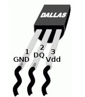
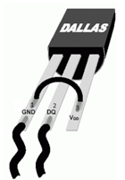
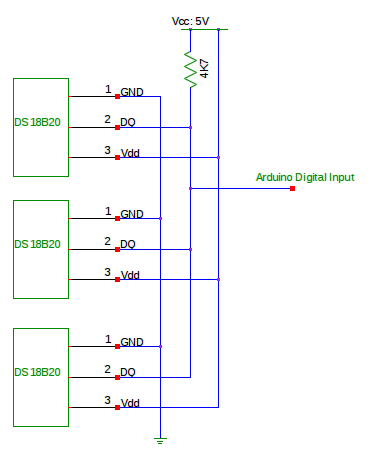
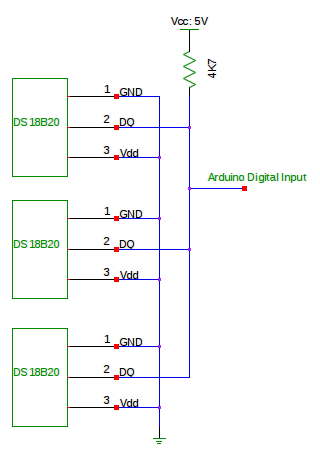
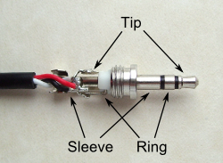

## Temperature Sensing using DS18B20 Digital Sensors

The [DS18B20](http://datasheets.maxim-ic.com/en/ds/DS18B20.pdf) is a small temperature sensor with a built in 12bit ADC. It can be easily connected to an Arduino digital input. The sensor communicates over a one-wire bus and requires little in the way of additional components.

The sensors have a quoted accuracy of +/-0.5 deg C in the range -10 deg C to +85 deg C.

#### Hardware

Multiple sensors can be connected to the same data bus. Each sensor identifies itself by a unique serial number.

The sensor can operate in normal or parasite mode. In normal mode, a 3-wire connection is needed. In parasite mode the sensor derives its power from the data line. Only two wires, data and ground, are required.

<span style="font-style: italic">**Note:** The Arduino positive supply rail is referred to as V<sub>cc</sub> and the positive supply for the DS18B20 as V<sub>dd</sub>. In this context, the two are the same.</span>

#### Normal Mode

In normal mode, each sensor is connected between a power line (V<sub>dd</sub> pin 3) and ground (GND pin 1), and the data output (DQ pin 2) connects to a third, data, line. The data output is a 3-state or open-drain port (DQ pin 2) and requires a 4k7 pull-up resistor. The data line is connected to an available Arduino digital input or Arduino digital pin 4 in the case of the emonTx.

Normal mode is recommended when many devices and/or long cable runs are involved.

#### Parasite Mode

Parasite power mode requires both DS18B20 GND (pin 1) and V<sub>dd</sub> (pin 3) to be connected to ground. The DQ pin (pin 2 - the middle pin) is the data/parasite power line. The data line requires a pull-up resistor of 4k7 connected to + 5 V. The data line is connected to an available Arduino digital input or Arduino digital pin 4 in the case of the emonTx.

Parasite mode should be used only with a small number of devices, over relatively short distances.

<table>
  <tbody>
    <tr>
      <td width="400px"><br>Figure 1: Normal Power Connection Diagram</td>
      <td width="350px"><br>Figure 2: Parasite Power Connection Diagram</td>
    </tr>
    <tr>
      <td width="400px"><br>Figure 3: Three DS18B20's in normal power mode</td>
      <td width="350px"><br>Figure 4: Three DS18B20's in parasite power mode</td>
    </tr>
  </tbody>
</table>

#### Connecting multiple sensors

If the sensors are located relatively close to the Arduino/emonTx, then satisfactory operation should be achieved by making a parallel connection of the sensors at the connection to the Arduino or emonTx . This is called a radial or 'star' arrangement.

If long cable runs are required, consideration should be given to connecting in 'daisy-chain' fashion where one cable runs from the furthest sensor, connecting to each sensor in turn, before ending at the Arduino or emonTx.

There is more about this in the note below.

For short cable runs, unscreened two or three-core cable, or single-core (parasite mode) or twin-core (normal mode) screened audio cable should be suitable. For longer cable runs, low capacitance cable such as RF aerial downlead (parasite mode) has been successfully used over a distance of 10 m. CAT 5 network cable has also been used with success over a distance of 30m, with data & ground using one twisted pair and power & ground using a second twisted pair.

#### Cable Length

Up to 20m cable length has [been successfully reported](https://twitter.com/mharizanov/status/704194316659515392) with a lower pull-up resistor value of 2K. Adding multiple sensors will reduce the practical length, as will non consistent / nonlinear cable runs, [see app note](https://www.maximintegrated.com/en/app-notes/index.mvp/id/148)

#### Temperature Sensing with the emonTx

For emonTx V3 and emonPi see Wiki:

- https://wiki.openenergymonitor.org/index.php/EmonPi#DS18B20_Temperature
- https://wiki.openenergymonitor.org/index.php/EmonTx_V3.4#RJ45_Connection

The emonTx supports direct connection of DS18B20 temperature sensors, however, there are significant differences between emonTx V2 and emonTx V3.

#### The emonTx V2

The PCB includes the option to solder a DS18B20 sensor directly onto the PCB for monitoring the temperature where the emonTx is located. A more useful option is to connect DS18B20 temperature sensors to the 3.5mm temperature jack port for monitoring remote temperatures e.g. outside temperature, living room temperature and boiler temperature.

The sensors can be connected either in normal or parasite power mode. We recommend normal power mode for increased reliability. 3-core 22AWG wire is perfect for wiring up sensors. Encapsulated sensors can be purchased. and connected. The 4k7 pull-up resistor is provided on the pcb.

Wire up the sensor(s) to a male 3.5mm jack as follows:



<table>

<tbody>

<tr>

<th>Connection</th>

<th>Normal Mode</th>

<th>Parasite Mode</th>

<th>Voltage</th>

</tr>

<tr>

<td>Tip</td>

<td>DQ (data line)</td>

<td>DQ (data line)</td>

<td>3.9 V approx</td>

</tr>

<tr>

<td>Ring</td>

<td>V<sub>dd</sub></td>

<td>no connection</td>

<td>+ 5 V</td>

</tr>

<tr>

<td>Sleeve</td>

<td>GND</td>

<td>GND + V<sub>dd</sub></td>

<td>0 V</td>

</tr>

</tbody>

</table>


[GitHub emonTx V2 temperature example ](https://github.com/openenergymonitor/emontx2/tree/master/firmware/emonTx_temperature_examples)
(also includes a sketch to extract the serial number from the DS18B20\. (N.B. You must change '#define ONE_WIRE_BUS 4' to '#define ONE_WIRE_BUS 5' for the emonTx V3.4)

#### Software

[Dallas Temperature Control Arduino library by Miles Burton.](http://milesburton.com/Dallas_Temperature_Control_Library#The_Library)

Version 372 works with Arduino 1.0\. download it from [here](http://download.milesburton.com/Arduino/MaximTemperature/)

This library makes interfacing with the sensors very straightforward and comes with examples.

The OneWire protocol communication library is also required. Version 2.0 can be downloaded from [here](http://www.pjrc.com/teensy/td_libs_OneWire.html).

Once the libraries have been extracted to the Arduino libraries folder, and the Arduino IDE restarted, I recommend checking out the ‘simple’ and ‘multiple’ examples which are part of the Dallas Temperature Control Library. These two examples demonstrate two methods to identify and communicate with each sensor.

**Addressing the sensors.**

Each sensor has a unique serial number assigned by the manufacturer, and your sketch (unless it is the "low-power" sketch that expects a single sensor) must be programmed with these serial numbers so it can identify and interrogate each sensor. Download the examples from [GitHub emonTx V2 temperature example](https://github.com/openenergymonitor/emontx2/tree/master/firmware/emonTx_temperature_examples). There you will find the [temperature search test sketch](https://github.com/openenergymonitor/emontx2/tree/master/firmware/emonTx_temperature_examples/temperature_search). You need run the sketch only once to extract and list the serial number from each DS18B20\. Then you manually copy the serial numbers into your monitoring sketch.

See [Part 2](DS18B20-temperature-sensing-2) for a description of how the order in which the sensors are discovered is decided.

**Error values.**

The sensor works by reading and converting the temperature and storing this value in scratchpad memory. The scratchpad memory is then read via the One-wire bus by the Dallas library.

The power-on value in the scratchpad memory is 85 °C. If the scratchpad memory is read before the temperature conversion has completed, then the erroneous temperature value of 85 °C might be returned. Depending on your application, it might not be possible to distinguish this from a genuine reading. This error value might be caused by an intermittent or absent connection of either the power wire (normal mode) or the GND wire.

If the data being read from the scratchpad memory is corrupted in transit, then the checksum will fail and the Dallas library will return a value of -127 °C. This is outside the operating temperature range of the sensor, so can easily be detected in software. This error value might be caused by an intermittent or absent connection of either the data wire (normal mode) or the GND wire, or indeed an absent sensor.

The following error codes have been defined for use with firmware running on OpenEnergyMonitor hardware. [See forum discussion.](https://community.openenergymonitor.org/t/emonpi-temperature-measurement/6792/15)

```
#define UNUSED_TEMPERATURE 300
// this value (300C) is sent if no sensor has ever been detected
#define OUTOFRANGE_TEMPERATURE 302
// this value (302C) is sent if the sensor reports < -55C or > +125C
#define BAD_TEMPERATURE 304
// this value (304C) is sent if no sensor is present or the checksum is bad (corrupted data)
// NOTE: The sensor might report 85C if the temperature is retrieved but the sensor has not been commanded
```

#### The emonTx V3

If running the standard emonTx V3 firmware see [Temperature tab of Setup Guide](https://guide.openenergymonitor.org/setup/)

The emonTx V3 has a connection for the temperature sensors on a screw terminal block. Full details can be found on the [Wiki page](https://wiki.openenergymonitor.org/index.php?title=EmonTx_V3). The pre-loaded sketch will sense a single temperature sensor at start-up and requires no further configuration. Note: The examples for the emonTx V2 and the temperature search sketch will not work without modification. You will need to edit the sketch due to changed I/O usage in the emonTx V3: You must change "#define ONE_WIRE_BUS 4" to "#define ONE_WIRE_BUS 5".

#### Notes and further reading

For large numbers of sensors and longer cable runs, use the [DS2480B](http://www.maxim-ic.com/datasheet/index.mvp/id/2923) 1-wire driver chip. [N.B. Some very helpful information from [ Chris Shucksmith](http://twitter.com/#!/shuckc) appears to have been removed.]

_"If you intend to have a large 1-wire network, it is important that you design the network correctly, otherwise you will have problems with timing/reflection issues and loss of data. For very small networks, it is possible to connect each sensor in a star or radial arrangement. This means that each sensor is connected via its own cable back to a central point and then connected to the 1-wire to serial adapter. However, it is strongly recommend that you connect each sensor to a single continuous cable which loops from sensor to sensor in turn (daisy chain). This will reduce potential misreads due to reflections in the cable. Each sensor should have a maximum of 50mm (2") of cable connected off the main highway. Even using this method, connecting more than 10-15 sensors will still cause problems due to loading of the data bus. To minimise this effect, always place a 100-120 ohm resistor in the data leg of each sensor before connecting to the network."_

quoted from: [http://www.jon00.me.uk/onewireintro.shtml](http://www.jon00.me.uk/onewireintro.shtml)
