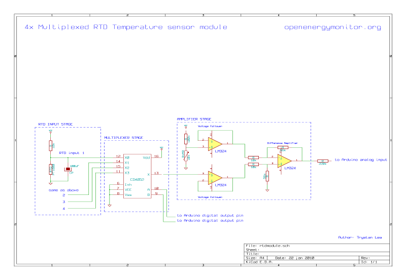
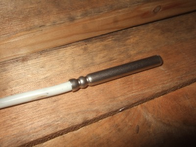
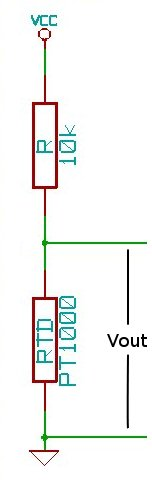
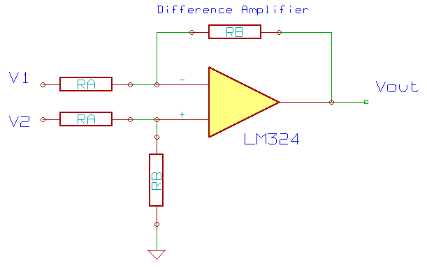
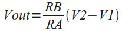

# 4x Multiplexed RTD Temperature sensor module

## Description

This module can be used to measure temperature using RTD (resistive temperature detectors) sensors. It produces an analog voltage proportional to the probe temperature. The module contains a multiplexer to enable using a maximum of four temperature probes.

## Design

**RTD Temperature sensors change their resistance with temperature**. The resistance change is converted to a voltage by a simple voltage divider. The output voltage passes through a low pass filter to remove any unwanted high frequency noise components.

In order to use only one amplifier circuit and one arduino analog input, the temperature sensing input stages are selected sequentially by a **multiplexer**.

Accuracy is maximized by using a difference amplifier to scale the output to the full range of the Arduino analog input.

## Component list

**RTD Input stage**

**3x** PT1000 RTD Temperature sensors.

**3x** 10k resistors

**3x** 100uF capacitors

**Multiplexer stage**

**1x** CD4052 Multiplexer

**Amplifier stage**

**1x** LM324 opamp

**1x** 100k resistor

**1x** 10k potentiometer

**2x** 10k resistor

**2x** 56k resistors

**1x** 220k resistor

## Circuit schematic

**Download** [png](files/rtdmodule.png) : [kiCad](files/rtdmodule.tar.gz)

## Detailed design

**Temperature sensing**

_RTD Temperature sensor_

The RTD sensors used in this guide are type PT1000. Their resistance is 1000ohms at 0C. Another popular value is the PT100 which is 100ohms at 0C. The setup here can easily be modified for PT100's by changing the 10k resistor on the input stage voltage divider to a 1k resistor.

RTD temperature sensors have a fairly linear increase in resistance as their temperature increases (although not completely). The temperature at a given resistance is determined by a look-up table:

**PT1000 resistance table**

| C | Ohms | C | Ohms |
| --- | --- | --- | --- |
| -10 | 961 | 55 | 1213 |
| -5 | 980 | 60 | 1232 |
| 0 | 1000 | 65 | 1252 |
| 5 | 1019 | 70 | 1271 |
| 10 | 1039 | 75 | 1290 |
| 15 | 1058 | 80 | 1309 |
| 20 | 1078 | 85 | 1328 |
| 25 | 1097 | 9 | 1347 |
| 30 | 1117 | 95 | 1366 |
| 35 | 1136 | 100 | 1385 |
| 40 | 1155 | 105 | 1404 |
| 45 | 1175 | 110 | 1423 |
| 50 | 1194 | 115 | 1442 |

The changing resistance of the RTD can be converted to a voltage by placing the RTD in a simple voltage divider circuit with a constant voltage source and measuring the voltage across the RTD. As in the following schematic:

The resistance of the RTD can be found from the output voltage of the voltage divider by the following equation:

    RTD Resistance = Vout x R / (Vcc - Vout) rearranged for: Vout = Vcc x RTD / (RTD + R)

The considerations when choosing R are:

*   Increasing R minimizes self heating of the RTD, thus minimizing error.
*   Increasing R decreases the magnitude of the voltage change per degree, decreasing signal to noise ratio.
*   Increasing R increases noise caused by the resistors, decreasing the signal to noise ratio.

So to choose R, we need to balance these considerations.

With a supply voltage of 5V and R = 10k, the voltage out at -10C will be 0.438V and at 115C will be 0.630V. This voltage can be measured directly by the Arduino analog inputs, however with default settings the accuracy will not be great. The arduino ADC with the default [ADC reference voltage](http://www.arduino.cc/en/Reference/AnalogReference) of 5V divides 0 to 5V in to 1023 divisions, 0.438V to 0.630V therefore has 39 divisions and 125C range divided by 39 is equal to an accuracy of about 3.2C. However by using the full Arduino ADC range we can do much better, the best accuracy achievable would be 125C / 1023 = 0.122C.

To use the full range of the ADC the voltage output from the temperature measurement circuit needs to be 0V at -10C and the arduino ADC reference voltage (what ever it is set to) at 115C.

**Obtaining 0V at minimum temperature**

The voltage at -10C is 0.438V so a circuit is needed to subtract 0.438V from the voltage output of the RTD input stage. This can be done with a difference amplifier.

**The difference amplifier**

The voltage output of the difference amplifier above is given by the following equation:

From the equation, we can see: if V1 is set to 0.438V and V2 to be the output of the RTD input stage then at -10C (V2 = 0.438V) the output of the difference amplifier will be 0V. 

A fixed V1 can be obtained with a voltage divider and a voltage follower to prevent the amplifier circuit from loading the voltage divider in a way that changes the desired fixed voltage. The output of the RTD input stage also needs a voltage follower for the same reason.

**Matching maximum voltage out with Arduino ADC reference voltage**

With no amplification from the amplifier the voltage at 115C will be 0.630V - 0.438V = 0.192V. The Arduino ADC reference voltage could be set to 0.192V with a simple voltage divider, giving full accuracy. Or alternatively it could be amplified to match the internal ADC reference voltage:

**1.1V Internal ADC reference voltage**

The default internal ADC reference voltage is 5V. However many amplifiers will not amplify up to their supply voltage. The LM324 opamp used here has a maximum output voltage of the supply minus 1.5V (5V-1.5V=3.5V) and so 1.5V of the ADC range would be wasted if the ADC reference voltage was set to 5V. The ADC reference voltage could be set to 3.5V, however this would require the added reference voltage divider. Luckily the Arduino has a 1.1V internal ADC reference voltage that can be selected from the Arduino sketch. Using this reference voltage along with amplification of the 0.192V signal to 1.1V, the maximum voltage output can be matched with the ADC reference voltage without the need for extra components.

**Amplification**

Amplifying 0.192V to 1.1V requires a gain of 5.7 times. The gain of the difference amplifier is given by RB / RA, and the main considerations when choosing RB and RA are:

*   RB / RA needs to be equal or as close to 5.7 as possible.
*   Larger magnitude resistors increases noise.
*   Larger magnitude resistors decreases power consumption.

Again, it is a matter of balance between noise and power consumption. A combination of different resistors where tried here: 100k / 560k, 10k / 56k and 1k / 5.6k. The noise went down noticeably from 100k to 10k but not noticeably lower at 1k.

**Multiplexer**

In order to save the effort and cost of building multiple amplifier circuits one for each RTD sensor a multiplexer can be used to select each sensor sequentially, allowing 4 sensors to share one opamp. The multiplexer used in this example is a 4052 chip. The inputs can be selected with two digital control lines A and B.

| A	| B	| Input pin |
| --- | --- | --- |
| 0 | 0	| 1 (0y) |
| 1 | 0	| 5 (1y) |
| 0 | 1	| 2 (2y) |
| 1 | 1 | 4 (3y) |

**Low pass filter**

The RTD sensor leads are often quite long and may act like aerials, which adds a lot of noise to the voltage signal coming in to the temperature sensing circuit. To get rid of the noise, a capacitor can be connected in parallel with the RTD sensor. The capacitor acts as a low pass filter. A 100uF capacitor gets rid of most of the noise.

## Connecting the module to the Arduino

_**Connection diagram**_

The example Arduino sketch below reads the temperatures of the RTD sensors and prints the temperatures to the serial port for logging. The RTD temperature sensor library hopefully makes the main sketch less cluttered. For example, to get the temperature of the collector sensor:

    temperature = sensorName.getTemperature();

**Download RTDsensor library:** [RTDSensorLib.tar.gz](files/RTDModuleLib.tar.gz) 

**Download the Arduino sketch:** [RTDModuleExample.tar.gz](files/RTDModuleExample.tar.gz)

1) Copy the library to your Arduino/Libraries folder

2) Open the example sketch in the arduino IDE and reset the current calibration:

    rtd.calibration(0, 0.120270927, -15.066198679);

needs to be

     rtd.calibration(0, 1.0, 1.0);

(Thank you to Justin for the [observation](https://openenergymonitor.org/emon/node/874))

3) compile+upload the Sketch to the Arduino.

If you now go to the Arduino Serial monitor you should see values three columns of values, like so:

    1023.0 1023.0 1023.0

At this point, the program is not calibrated, the output corresponds to the ADC value. So to see temperature values the next step is:

## Calibration

**Calibrating the minimum**

1) Choose the minimum temperature to be measured and find the resistance of the RTD at this temperature. For example if a minimum of -10C is chosen from the lookup table the resistance should be 960Ohms.

2) Holding the RTD at a certain temperature for calibration is quite a challenge, so to make things easier, create a resistor equal to your chosen minimum resistance. A variable resistor and a multimeter is an easy way to do this.

3) Connect your 'minimum' resistance to one of the 3 RTD inputs. 

4) With the Arduino connected to the computer, go to the Arduino serial monitor and check the value being printed.

5) Adjust the voltage offset variable resistor until this value is between say 10 and 40. Note the value you have set it to and the corresponding minimum temperature that it corresponds to. For example:

-10C corresponds to 30

**Calibrating the maximum**

While watching the Arduino serial monitor, increase the resistance of the 'RTD' variable resistor on the input until the value on the serial monitor hits 1023. 

Measure the resistance at this point with a multimeter and find the corresponding temperature. If the temperature is not close to your desired maximum, either change the gain of the opamp by changing resistor RA and RB and/or tweak the offset voltage divider.

Once you are happy with the maximum temperature and the minimum temperature note the temperatures and serial output readouts, for example:

    -10C corresponds to 30
    115C corresponds to 1010

Using the equation for a straight line, the calibration coefficients can now be found:

    y = mx + c
    -10 = m * 30 + c
    115 = m * 1010 + c
    m = (y1 - y2) / (x1 - x2)
    m = (-10 - 115) / (30 - 1010) = 0.128
    c = -10 - 0.128 * 30 = -13.84

Place these calibration coefficients in the Arduino sketch. For example:

    MultiplexedRTDSensor sensorName(2,4,5,0,0, m, c);
    MultiplexedRTDSensor sensorName(2,4,5,0,0, 0.128, -13.84);

Upload the new sketch to the Arduino. The output should be temperature in degrees C. The calibration procedure is best repeated for each sensor to maximise accuracy. This time however, none of the resistors should need changing.

Software based averaging can also be used to improve the observed stability of the readings:

    temperature = sensorName.getTemperature();

can be replaced with: 

    temperature = sensorName.getTemperatureSmooth(number of samples to average, number of averaged samples to smooth);

try: 

    temperature = sensorName.getTemperatureSmooth(100,4);

## Useful reading

[MICROCONTROLLER-BASED TEMPERATURE MONITORING AND CONTROL](http://www.elsevier.com/wps/find/bookdescription.cws_home/680245/description#description) by Dogan Ibrahim
