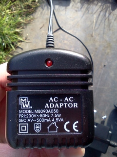
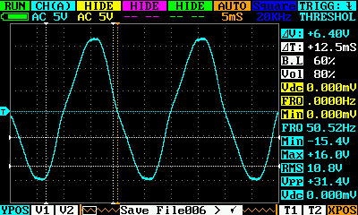
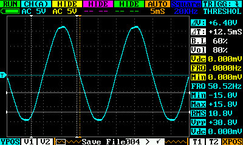
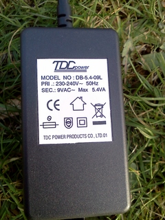
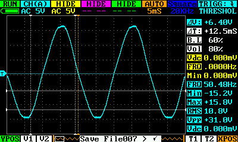

# Different AC-AC Power Adapters

## AC to AC Power Adapters

A 9V AC-AC adapter can be connected to the emonTx to supply an AC voltage sample. This can be used to measure the AC RMS voltage which, in turn, can be used to calculate real power, power factor, frequency and detect power flow direction.

Not all AC-AC adapter are the same. Variations in design, materials and construction mean the AC output waveform varies between different adapters.

## MW (UK plug)

Rating: 9V AC 500mA

Primary resistance: 700 ohm

Secondary resistance: 2.4 ohm

Quiescent power consumption: 3.9W

Supplier: unknown

## Strontronics (UK plug)

Rating: 9V AC 100mA

Primary resistance: 266 ohm

Secondary resistance: 1.3 ohm

Quiescent power consumption: 2.5 - 3.4W

Supplier: Farnell [http://uk.farnell.com/stontronics/ac-09100bs2-1/adaptor-9vac-1a-uk-2-1/dp/1279503?Ntt=1279503](http://uk.farnell.com/stontronics/ac-09100bs2-1/adaptor-9vac-1a-uk-2-1/dp/1279503?Ntt=1279503)

## Mascot 9580 (UK plug)

Rating: 9V AC 300mA

Primary resistance: 1.37Kohm

Secondary resistance: 3.3 ohm

Quiescent power consumption: 1.4W

Supplier: RS[ http://uk.rs-online.com/web/p/products/400-6484/](http://uk.rs-online.com/web/p/products/400-6484/)

## FP AD 3515 (euro plug)

Rating: 9V AC 528mA

Primary resistance: 970 ohm

Secondary resistance: 3.5 ohm

Quiescent power consumption: 1.5W

Supplier: RS [http://uk.rs-online.com/web/p/products/459-853/](http://uk.rs-online.com/web/p/products/459-853/)

## TDC

Rating: 9VAC 600mA

Primary resistance: 705 ohm

Secondary resistance: 2.3 ohm

Quiescent power consumption: 0W

Supplier: [http://www.idealpower.co.uk/](http://www.idealpower.co.uk/)

 
