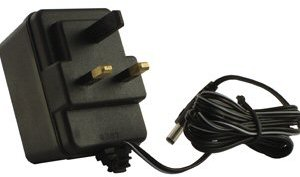
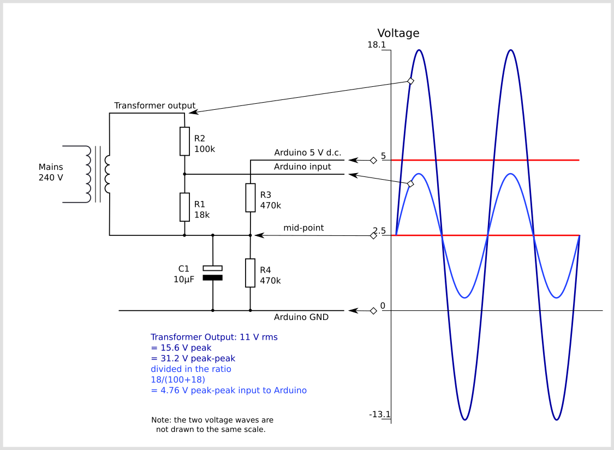
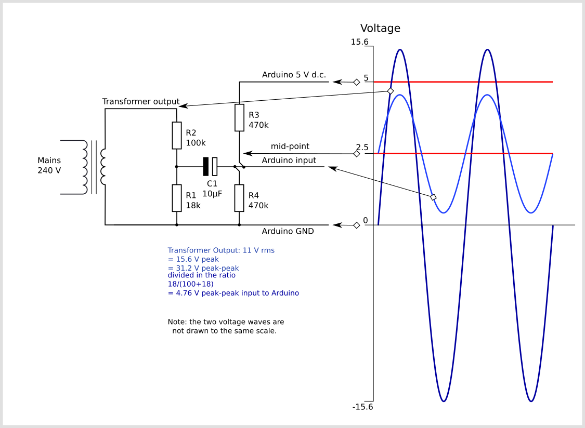

# Measuring AC Voltage with an AC to AC power adapter

An AC voltage measurement is needed to calculate real power, apparent power and power factor. This measurement can be made safely (requiring no high voltage work) by using an AC to AC power adaptor. The transformer in the adapter provides isolation from the high voltage mains.

This page briefly covers the electronics required to interface an AC to AC power adapter with an Arduino.

As in the case of current measurement with a CT sensor, the main objective for the signal conditioning electronics detailed below, is to condition the output of the AC power adapter so it meets the requirements of the Arduino analog inputs: a **positive voltage between 0V and the ADC reference voltage** (Usually 5V or 3.3V - emontx).

AC to AC power adapters are available in many voltage ratings. The first thing important to know is the voltage rating of your adapter. We have made a [reference](different-acac-power-adapters) list of the main AC voltage adapters that we have used (we have standardised on a 9V RMS adapter).

The output signal from the AC voltage adapter is a near-sinusoidal waveform. If you have a 9V (RMS) power adapter the positive voltage peak be 12.7V, the negative peak  -12.7V. However, due to the poor voltage regulation with this type of adapter, when the adapter is un-loaded (as in this case), the output is often 10-12V (RMS) giving a peak voltage of  14-17V. The voltage output of the transformer is proportional to the AC input voltage, see below for notes on UK mains voltage.

The signal conditioning electronics needs to convert the output of the adapter to a waveform that has a positive peak that's less than 5V (3.3V for the emonTx) and a negative peak that is more than 0V.

So we need to:

1.  **scale** **down** the waveform and
2.  **add an offset** so there is no negative component.

The waveform can be scaled down using a voltage divider connected across the adapter's terminals, and the offset (bias) can be added using a voltage source created by another voltage divider connected across the Arduino's power supply (in the same way we added a bias for the current sensing circuit).

There are two circuit configurations, which in theory obtain the same result. The first was used in the emonTx V2 and the emonPi. It’s been pointed out that many switched-mode power supplies include a capacitor connected between the negative end of the high voltage d.c. rectified a.c. mains supply and the negative of the secondary side output, to reduce electromagnetic interference from the primary switching waveforms. This has the effect of introducing noise into the analogue input. The second configuration, which is used in the emonTx V3 and in combination with the emonVs in the emonTx4 and the emonPi2, avoids this problem.
                                            
The circuit consists of two main parts, their functions are to change the a.c. adapter’s voltage to a lower voltage of the correct amplitude, and position this voltage in the centre of the ADC’s input range.

The voltages and currents shown are for a 5 V Arduino, with a 0 – 5 V range for the analogue input, about 1.6 V rms for a sine wave. For the emonTx V2 & V3 and the emonPi, the analogue input range is 0 – 3.3 V, so the midpoint voltage is 1.65 V and the analogue input voltage swings between 0 and 3.3 V (approximately 1 V rms for a sine wave). 

*Configuration used in the emonTx V2 and the emonPi*

In this configuration, the a.c. adapter’s output voltage is divided down by the voltage divider comprising R1 & R2 in the ratio 18 / (100 + 18) and the output of the divider is 4.76 V peak-to-peak appearing across R1. The two bias resistors R3 & R4 divide the supply voltage in two, so the mid-point and one end of R1 sits at 2.5 V above ground. The capacitor provides a near short-circuit to a.c., which firmly fixes the mid-point voltage with little or no a.c. component superimposed on it. The other end of R1 connects directly to the analogue input, and so the analogue input sees the voltage across R1 superimposed on the bias voltage. 

*Configuration used in the emonTx4 and the emonPi2*

Here, again the a.c. adapter’s output voltage is divided down by the voltage divider comprising R1 & R2 in the ratio 18 / (100 + 18) and the output of the divider, which is 4.76 V peak-to-peak, appears across R1. This time, one end of the a.c. adapter and R1 is connected solidly to ground.

Again, the two bias resistors R3 & R4 divide the supply voltage in two, so the mid-point sits at 2.5 V above ground and this point connects to the analogue input. The difference is, the capacitor provides an a.c. path connecting the two sections whilst blocking the d.c. bias from reaching the voltage divider and a.c adapter.  The bias resistors put a very small load on the voltage divider, but the effect of this is compensated for in the calibration.  The voltage across R1 is superimposed on the bias voltage, so the analogue input sees alternating voltage varying above and below the 2.5 V mid-point as shown. 
                                             
For the emonTx4, the a.c. adapter is replaced by a small current transformer whose input current is derived directly from the mains voltage, and its burden resistor replaces R1 (there is no R2). This part is inside the emonVs. The capacitor and bias resistors are in the emonTx4. The bias resistors are unequal and the bias voltage is 0.512 V. The output voltage from the emonVs is nominally 0.333 V rms.

If you would like detailed information on how to calculate the optimum values for the components, taking component tolerances into account, see [this page](acac-component-tolerances).

## Arduino sketch

To use the above circuit along with a current measurement to measure real power, apparent power, power factor, Vrms and Irms upload the Arduino sketch detailed here: [Arduino sketch - voltage and current](https://github.com/openenergymonitor/EmonLib/blob/master/examples/voltage_and_current/voltage_and_current.ino)

## Improving the quality of the bias source

This relatively simple voltage bias source does have some limitations. See [Buffered Voltage Bias](../ctac/acac-buffered-voltage-bias) for a circuit that offers enhanced performance.

## Notes on Mains Voltage Limits

The standard domestic mains supply for Europe is 230 V ± 10%, giving a lower limit of 207 V and an upper limit of 253 V. It is permissible under BS 7671 to have a voltage drop within the installation of 5%, which would give a lower limit of 195.5 V.
The UK standard prior to harmonization was 240 V ± 6%, giving an upper limit of 254.4 V.

Although the UK nominal standard is now 230 V, the supply system has not generally been adjusted, and the voltage centers around 240 V.

Thanks to Robert Wall for summarizing the rather convoluted standards surrounding UK grid voltages.

All of Europe, Africa, Asia, Australia, New Zealand and most of South America, use a supply that is within 6% of 230 V. For the United States supply requirements are within 5% of 240V (this is at the utility meter -- the NEC allows a further 5% drop to the receptacles per 210.19(A) and 215.2(A)(1)).

[https://en.wikipedia.org/wiki/Mains_electricity_by_country](https://en.wikipedia.org/wiki/Mains_electricity_by_country)
