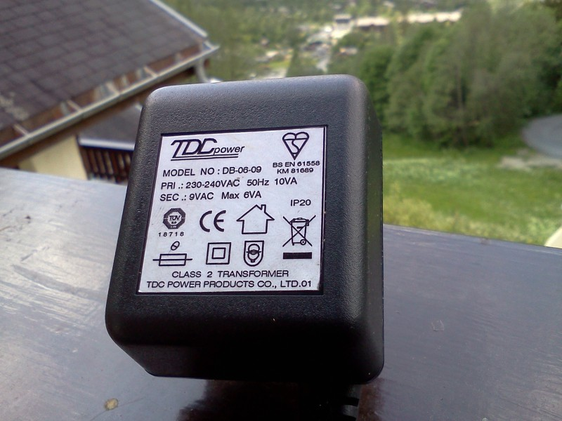
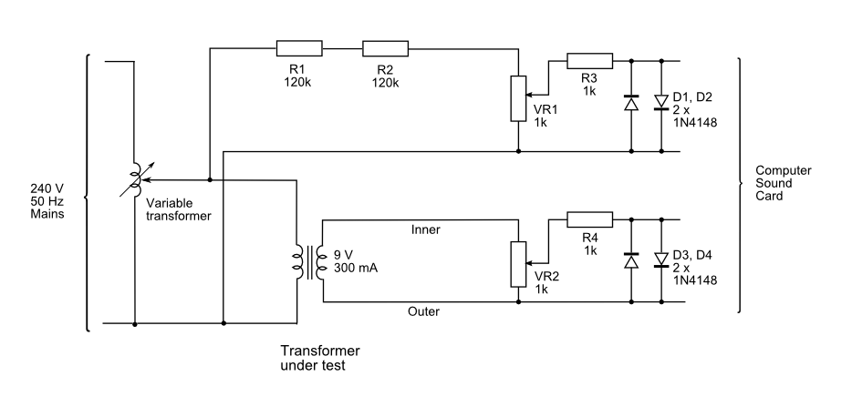
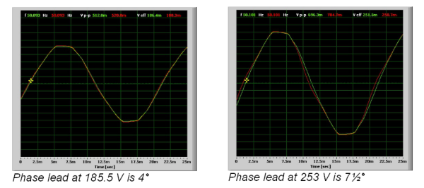

# Ideal Power 9V AC-AC Adaptor (Voltage Transformer)

**By Robert Wall  B.Sc., C.Eng., MIEE.** 
Issue 2  20th December, 2013

Also branded as TDC, these adapters are identical 

## Synopsis

The Ideal Power Adaptor is manufactured in China and supplied by Ideal Power Ltd.  
It has an integral mains plug to BS.1363\. Output is on a flying lead terminated in a coaxial DC Power plug.  
The rated input is 230-240 V AC 50 Hz and the output is 9 V a.c, 6VA. The transformer exhibits a phase lead that varies from 4° at the lower limit of the supply range up to 7½° at the upper limit. Two samples have now been measured, one supplied in July 2012 (No.1) and a second supplied in December 2013 (No.2).

## Test Rig

## WARNING

In any attempt to replicate these tests, due care must be taken with regard to personal safety as potentially lethal voltages may be encountered.

The primary voltage is monitored by a potential divider comprising two fixed resistors and a potentiometer. The transformer is loaded with a 1 kΩ potentiometer. The potentiometers, current limiting resistor and diodes in both voltage monitor circuits are to protect the computer sound card from over-voltage and switching transients, the potentiometers were adjusted such that the voltage did not exceed 800 mV peak and at this voltage, the diodes did not affect the shape of the monitored waveform.  
When the shape of the waveform was of interest, the primary voltage and PT output voltage waveform were recorded using a software oscilloscope (Soundcard Oscilloscope from http://www.zeitnitz.de/Christian/scope_en) and the recorded waveform imported into a spreadsheet and subsequently calibrated against the actual voltage read either by a multimeter or a real oscilloscope connected directly across the PT output.

## Winding Phase

The transformer is supplied with a DC Power supply plug, the output voltage is in antiphase with the input.

## Tests

The following tests were conducted:  
1\. Check the ratio  
2\. Establish the regulation  
3\. Establish the phase error

### 1\. Ratio

The transformer was checked at 240 V. The open-circuit output voltage was measured at 11.36 V. Output voltage tracked the input voltage exactly over the range 185.5 V to 253 V.

### 2\. Regulation.

At 240 V input and the rated full-load current of 666 mA, the output voltage fell to 9.09 V. This gives a value for regulation of 27%.

**Measurement errors.**

The voltages were measured with a digital multimeter having an accuracy of (1% + 3 digits) above 200 V and (0.8% + 3 digits) below.  
Therefore, the maximum uncertainty in the ratio measurement is 2.25% for the primary voltage and 1% for the secondary, a total of 3.25%.  
The measured output at full load fell well within the band of uncertainty.

### 3\. Phase error.

As the primary voltage increased, the secondary voltage waveform showed increasing distortion due to saturation of the transformer core. This was accompanied by the output voltage phase advancing. The distortion of the secondary voltage waveform, barely visible at 185 V, is clearly visible at 253 V in the second screen-shot.

Secondary Phase against Primary Voltage

(The green trace is primary voltage, the red trace is secondary voltage. Note: the vertical scale is uncalibrated).

## Conclusions

The Adaptor is suitable for use with the OpenEnergyMonitor emonTx, though the poor regulation, to be expected of this type of transformer, does mean that the output voltage may be higher than expected (33.8 V peak-peak) at the upper limit of supply voltage. The maximum phase error of 7.6º may be significant in certain circumstances, representing an error of 0.066 when the power factor is 0.9 or better, but a greater error as the power factor worsens.

The adapter consumes approx 0.33 W of power in normal operation.

## Appendix

Mains voltage limits.

The standard domestic mains supply for Europe is 230 V ±  10%, giving a lower limit of 207 V and an upper limit of 253 V.  It is permissible under BS 7671 to have a voltage drop within the installation of 5%, which would give a lower limit of 195.5 V.  
The UK standard prior to harmonization was 240 V ±  6%, giving an upper limit of 254.4 V.  
Although the UK nominal standard is now 230 V, the supply system has not generally been adjusted and the voltage centers around 240 V.
