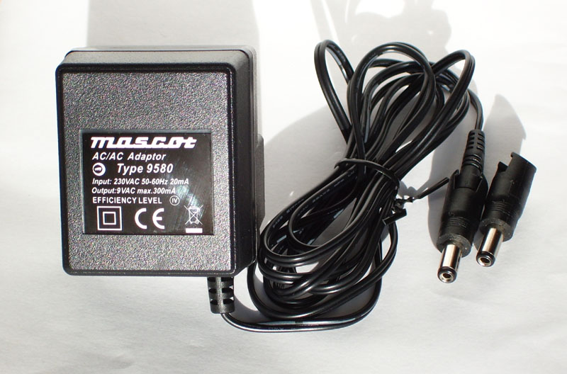
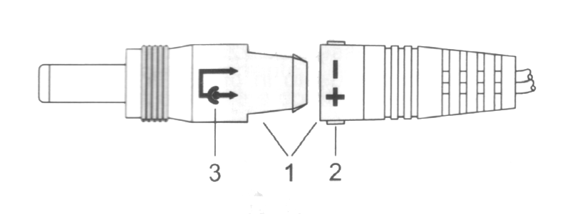
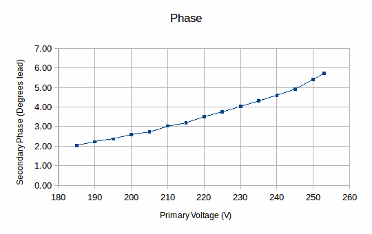
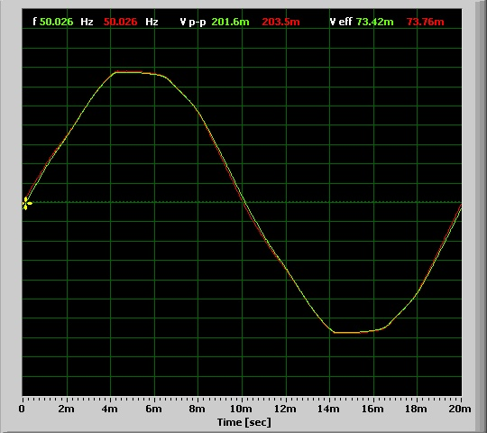
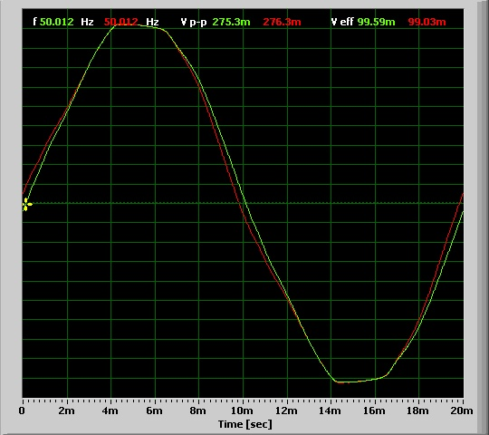

# Mascot 9 V AC/AC Adaptor (Voltage Transformer)

A Report on the properties of the Mascot Voltage Transformer and its suitability for use with the OpenEnergy monitor.

_By Robert Wall  B.Sc., C.Eng., MIEE._

## Synopsis

The Mascot Adaptor is manufactured in China for Mascot Electronics AS of Norway (www.mascot.no), type 9580, part no. 9580900600.

It has an integral mains plug to BS.1363\. Output is on a flying lead having a two-pin socket which fits a coaxial DC Power plug (supplied).

The rated input is 230 V AC 50 Hz and the output is 9 V a.c, 300 mA. The transformer exhibits a phase lead that varies from 2° at the lower limit of the supply range up to 5.7° at the upper limit.

## Test Rig

## WARNING

**In any attempt to replicate these tests, due care must be taken with regard to personal safety as potentially lethal voltages may be encountered.**

The primary voltage is monitored by a potential divider comprising two fixed resistors and a potentiometer. The transformer is loaded with a 1k potentiometer. The potentiometers, current limiting resistor and diodes in both voltage monitor circuits are to protect the computer sound card from over-voltage and switching transients, the potentiometers were adjusted such that the voltage did not exceed 400 mV peak and at this voltage, the diodes did not affect the shape of the monitored waveform. 

When the shape of the waveform was of interest, the primary voltage and PT output voltage waveform were recorded using a software oscilloscope (Soundcard Oscilloscope from http://www.zeitnitz.de/Christian/scope_en) and the recorded waveform imported into a spreadsheet and subsequently calibrated against the actual voltage read either by a multimeter or a real oscilloscope connected directly across the PT output.

**Winding Phase**

The transformer is supplied with a choice of DC Power supply plugs, which may be fitted either way round. When the plug is fitted as shown below, i.e. “+” to the centre connector, the output voltage is in phase with the input.

## Tests

The following tests were conducted:

1\. Check the ratio

2\. Establish the regulation

3\. Establish the phase error

### 1\. Ratio.

The transformer was checked at 240 V. The open-circuit output voltage was measured at 11.20 V. Output voltage tracked the input voltage exactly over the range 185.5 V to 253 V.

### 2\. Regulation.

At 240 V input and the rated full-load current of 300 mA, the output voltage fell to 9.37 V. This gives a value for regulation of 19.5%.

**Measurement errors.**

The voltages were measured with a digital multimeter having an accuracy of (1% + 3 digits) above 200 V and (0.8% + 3 digits) below.

Therefore, the maximum uncertainty in the ratio measurement is 2.25% for the primary voltage and 1% for the secondary, a total of 3.25%.

The measured output at full load fell well within the band of uncertainty.

### 3\. Phase error.

As the primary voltage increased, the secondary voltage waveform showed increasing distortion due to saturation of the transformer core. This was accompanied by the output voltage phase advancing. The distortion of the secondary voltage waveform, barely visible at 185 V, is clearly visible at 253 V in the second screen-shot.

_Secondary Phase against Primary voltage_

     

Phase lead at 185.5V is 2 degrees                           Phase lead at 253V is 5.7 degrees

_(The green trace is primary voltage, the red trace is secondary voltage, the flattening is distortion in the mains supply. Note: the vertical scale is uncalibrated)_

## Conclusions

The Mascot Adaptor is sui for use with the OpenEnergy emonTx, though the poor regulation, to be expected of this type of transformer, does mean that the output voltage may be higher than expected (33.4 V peak-peak) at the upper limit of supply voltage. The maximum phase error of 5.75º may be significant in certain circumstances, representing an error of less than 0.05 when the power factor is 0.9 or better, but a greater error as the power factor worsens.

## Postscript

Since writing that report, I have checked two more samples of the adapter. Both measured a slightly higher voltage (a little under 2% higher) than reported, but one was phased as reported and one was opposite. Therefore the advice is: if your power direction is wrong, reverse the DC Power plug, or turn your c.t. round.

## Appendix

### Mains voltage limits.

The standard domestic mains supply for Europe is 230 V ±  10%, giving a lower limit of 207 V and an upper limit of 253 V.  It is permissible under BS 7671 to have a voltage drop within the installation of 5%, which would give a lower limit of 195.5 V.

The UK standard prior to harmonization was 240 V ±  6%, giving an upper limit of 254.4 V.

Although the UK nominal standard is now 230 V, the supply system has not generally been adjusted and the voltage centres around 240 V.
