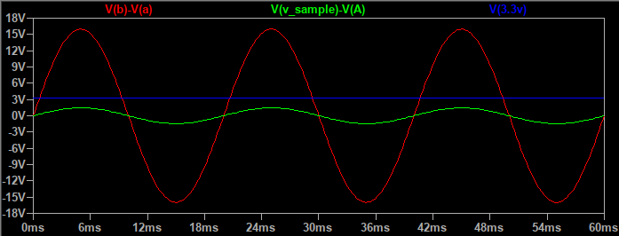
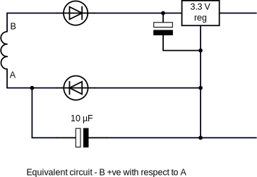
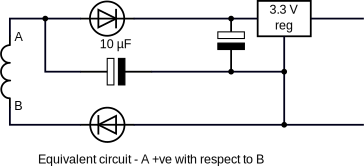
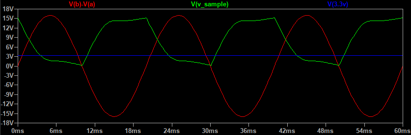

# Why Can’t I Use a Single Transformer?

We often see a circuit submitted where someone has thought it would be a good idea to use the same transformer, or AC adapter, both to supply the power to their Arduino and to monitor the voltage. And the question is always: Why does it not work?

The circuit that is normally put forward uses a single transformer winding, rectifier bridge and regulator in the standard configuration, and adds the normal voltage monitor to the same transformer winding.

What could possibly be wrong with that? The regulator provides 3.3 V (or equally it can be 5 V to power an Arduino) and the voltage sample appears across R1. This is what the voltages look like:

The red trace is the transformer voltage, reduced by the divider to give the green trace that is the voltage to the ADC, and the blue is the 3.3 V supply. A minor problem is the green trace should sit between 0 V and 3.3 V (the blue trace) but we can cure that by connecting the sample reference to the bias voltage at the mid-point (the red wire), can’t we?

Unfortunately, we cannot. To see why, ignore the resistors and look at the simplified circuit.  drawn twice – once with voltage ‘B’ positive with respect to ‘A’ and showing only the two diodes from the bridge rectifier that are conducting, and the second time on the next half-cycle when voltage ‘A’ is positive with respect to ‘B’ and the other two diodes in the bridge rectifier are conducting.

In the first case, the capacitor is reverse biased (not good, but it has only 0.65 V across it, so it’s unlikely to suffer serious damage), but in the second case it is behaving as a second reservoir capacitor to the power supply.

This is what happens to the waveforms:

In addition to being far outside the allowable ADC input range, the sample waveform (in green) is so badly distorted, compared to the transformer output (in red), it’s unusable. The reason can be seen in the bottom diagram above. The mid-point bias voltage (now connected to point A) is no longer coming from the two resistors R3 & R4, their effect is being overridden by the half-wave rectifier made by the diode on leg ‘B’ attempting to pump the voltage on capacitor C1 (which is now acting as a reservoir capacitor) up to around 15 V, but the current is being drained away through the second diode into the regulator and its load (the Arduino). For the waveform picture, the load was set at a modest 10 mA. With no load, the sample voltage is less distorted and biased to around 15 V, but still completely wrong.

However, it is possible to use a single transformer, but not in the way that most constructors are familiar with.

*(Note: In the suggestions that follow, the diagrams are illustrative only – they should not be used for construction. Some component values might not be optimal. In particular, all (with the possible exception of the third) will, due to loading on the transformer, show a distorted voltage wave. The degree of distortion will be heavily dependent on the current drawn and the transformer regulation.)*

First, one way that works is the circuit that is used in the emonTx V3. That uses a half-wave rectifier, and it works because there is one common ground connection that is shared between the transformer (or a.c. adapter), the regulator that provides the smooth operating voltage and the ADC that measures the mains voltage sample.

The second way is to use a centre-tapped transformer and two diodes as a full-wave rectifier, instead of the usual 4 diodes in a bridge configuration. This again works for much the same reason – the transformer centre tap, the regulator and the ADC all share one common ground connection. This was not adopted for the emonTx because it needs a centre-tapped AC adapter with a 3-pole connector, something which is not generally available.

The third way that works is to use a transformer with two separate secondary windings, or two transformers, one supplying the power and the other supplying the mains voltage sample. This is the solution that Robin Emley adopted for his Mk2PVRouter. This works because the two voltage sources are isolated from each other.

A fourth way is to use an operational amplifier with a differential input, which outputs the differential voltage, also isolating the two voltage sources from each other.

