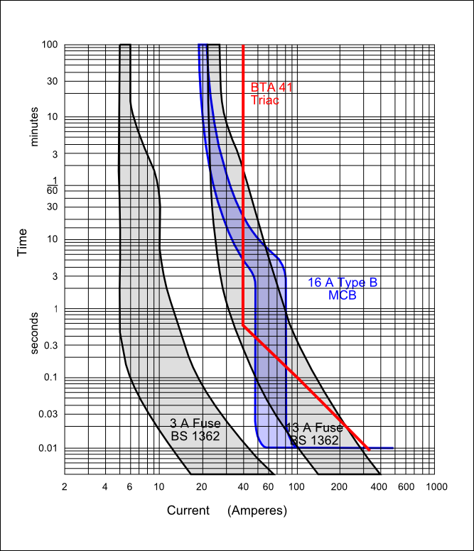

# Overload Protection of Mains Electrical Circuits

<!-----------------------------Warning----------------------------------------->

 

This page covers only the very basic principles of circuit protection and the choice of fuse or circuit breaker in the context of a mains sub-circuit. <strong>If you are thinking of modifying or extending an installation, then unless you are qualified, you should seek advice from a competent person</strong>. You may need official approval for any work carried out on a fixed installation.

<!-----------------------------/Warning---------------------------------------->

## The Fundamentals

All electrical circuits must have some means of protecting against overload. This may be done by including a fuse or circuit breaker in the circuit, or the protection may be designed in to the supply that is feeding the circuit. We will consider only fuses and circuit breakers, as they are most likely the device encountered in a normal environment.

## How to Determine the Ratings

First, you need to know the current that the load demands under all conditions. You then need to choose a fuse or circuit breaker that will not blow (or trip) when carrying that current, but with only the smallest safety margin under worst-case conditions. Finally, you must choose everything in between – cable, switches, plugs & sockets, etc – so that each will safely carry the current that will guarantee the fuse will blow, or the circuit breaker will trip, under all conditions (paying particular regard to ambient temperature and the ability of the cable to stay cool, i.e. it must not be buried in insulation).

## How a Fuse Works

A fuse is a piece of wire that has resistance, and mass, and some insulation around it. The resistance makes it heat up when current flows. The mass regulates how long it takes the temperature to rise with a given amount of heat going in. The insulation keeps the electricity in (irrelevant to this discussion…) and it keeps the heat in.

From those basic concepts, you can draw a curve - the I²t curve - for a fuse that describes the interaction of those 3 things. A ‘fast blow’ fuse has little thermal capacity and good thermal insulation so that it heats up and melts quickly. A ‘slow-blow’, anti-surge or time-delayed fuse will have a larger mass of metal that takes a while reach melting temperature. You can sometimes see a glass fuse with a blob of solder in the middle of the wire - that’s no accident. It delays the melting of the wire so that a brief current surge, e.g. starting a motor, doesn’t blow the fuse.

The common belief that a 13 A fuse blows at 13 A is rubbish. The 13 A fuse will _carry_ 13 A indefinitely, at the maximum expected ambient temperature. From the characteristic curves (the black curve) below, the BS 1363 fuse will blow at 2 × current (26 A) after somewhere between 3 s and never! It needs 30 A to guarantee to blow inside 400 s (6? minutes), but it might blow in 1 s.

## How an MCB Works

Domestic Miniature Circuit Breakers are designed to mimic the action of fuses fairly closely. However, they are ‘better’ than fuses (apart from being easy to reset following a trip) because they can offer additional protection. Most have two mechanisms that cause them to trip, thermal and magnetic. The magnetic trip is a solenoid energised by the load current that operates ‘instantly’ when a high current is detected. The thermal trip is a bi-metallic strip that is heated (usually indirectly with a small heater) that detects a sustained lower fault current. So again, it is a fallacy that a 16 A MCB will trip at 16 A. Looking once more at the characteristic curves (the blue curve) below, it might trip at 18 A after an hour or more, but it needs 23 A to guarantee a trip within an hour. This is the thermal trip operating, and that remains the active trip mechanism up to 48 A (3 × current) when it will take between 3 and 12 seconds to trip. At 48 – 80 A (3 – 5 × the rated current), the magnetic trip takes over. This is not totally precise – it may trip a 3 ×, but it is guaranteed to trip at 5 ×, and it might trip within 20 ms but it may take as long as 4 seconds (the vertical part of the blue shaded area). However, if the current is more than 96 A (6 ×), it trips in 10 ms.

## Applying This to a Triac Immersion Heater Control

Let’s say we have a triac that is switching an immersion heater. The same kind of curve as the fuse’s exists for anything that carries current and gets heated by that current – cables, resistors, or the device we’re interested in, a triac. The basic data for a BTA41 for example, is given in just one line on the [data sheet](files/BTA41_Triac.pdf) [PDF download]: In Table 2 I²t Value for fusing tp = 10 ms 1000 A²s”. (there is more in Figure 5). From that you can draw the curve for the triac (the red line). If the triac is to be protected by the fuse, the whole of the triac’s curve must lie above and to the right of the fuse curve. [Bear in mind that unless it has a large and fully rated heatsink, the vertical line for the triac is wrong, it should continue to slope – at a different rate of course – but without knowing or making assumptions about the heatsink, we don’t know enough to show it].

So if there’s a fault, the immersion heater can draw 50 A for 0.1 s, or 100 A for ½ cycle, or 20 A for a long time, without guaranteeing a blown fuse.

(Don’t confuse the terms ‘slow blow’ or ‘quick-blow’ with "HRC". Another property of fuses is the maximum fault current they can handle. An HRC fuse is constructed with an arc-quenching material inside so that it can safely handle a much higher fault current – **H**igh **R**upture **C**urrent).

If we have a 16 A MCB protecting the triac, the situation is slightly better (but still not satisfactory). With a fault current of less than 40 A, the triac is still safe. With a fault current above 100 A, the triac is safe because the MCB will operate in 20 ms. However, if the fault current is between 40 A and 80 A, it’s not clear what will happen but the triac is more than likely doomed. You would in fact need a 6 A MCB to protect this triac, but then your immersion heater could only run at an average power of 1440 W (at 240 V).

## And Finally…

Fuses and MCBs are affected by ambient temperature. If the ambient is anything other than normal room temperature, you need to check the manufacturer’s data sheet for the appropriate rating factors.
