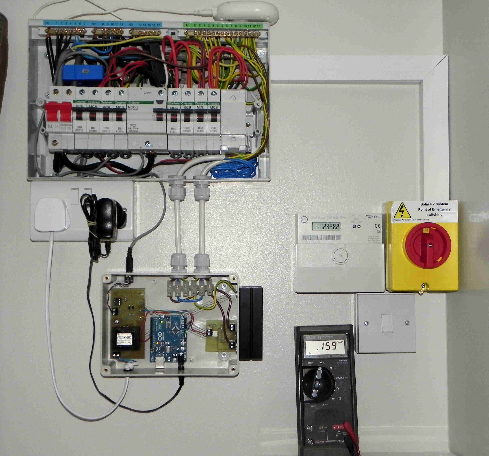
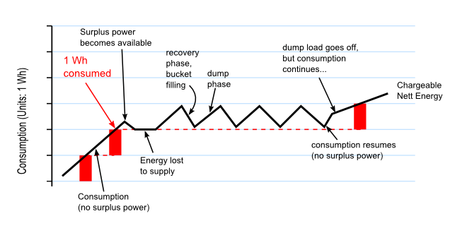
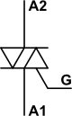
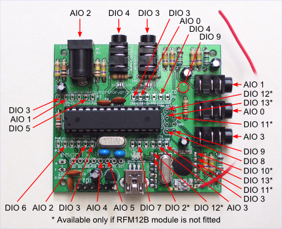
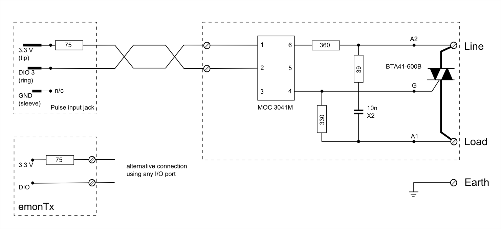
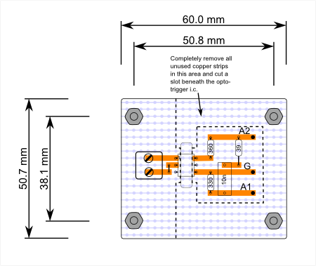
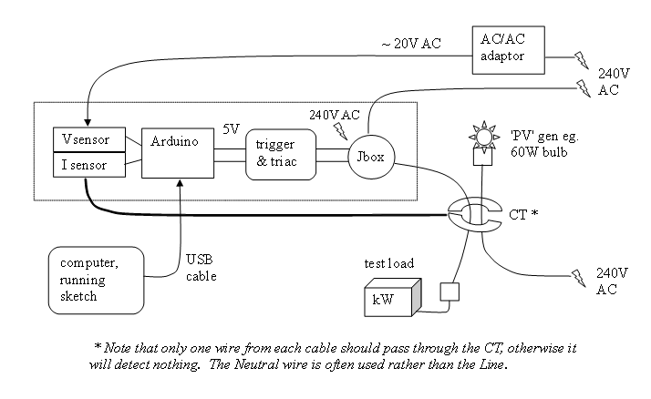
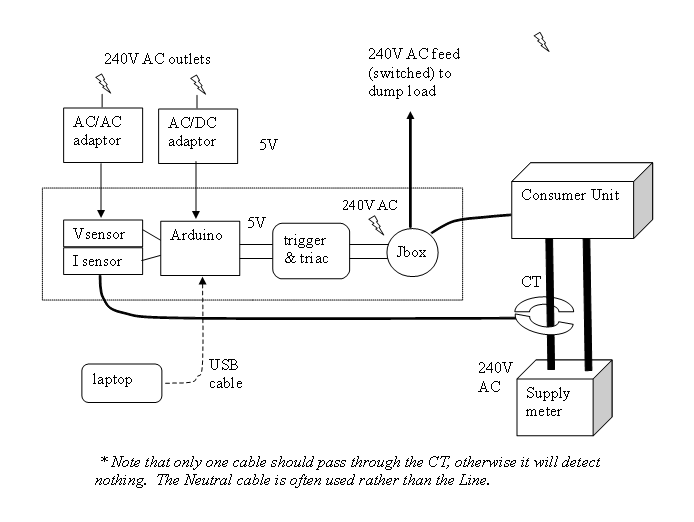
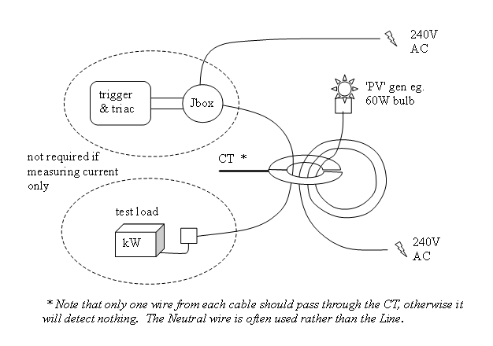

# Diverting surplus PV Power, by Robin Emley

A Project to Design and Build a Controller to Route Surplus P.V. Energy into the Domestic Hot Water Supply

---

## 1: Introduction, and “Power” v. “Energy”

This describes practice in the UK. Practice in other places may vary.

During the last couple of years, PV panels have appeared all over the country. The main incentive for having PV installed is the government's Feed-In Tariff (FIT) whereby a direct payment is made to the owner for every unit of energy (kilowatt Hour, or kWh) that is produced.  Despite its name, the FIT scheme actually applies not only to PV systems that are linked (or “grid-tied”) to the local mains but also to off-grid installations.

Having generated some energy from PV, that energy is freely available for use on the premises. If the energy cannot be used immediately, it flows backwards through the supply meter and out into the local grid. This process is known as “exporting”.

The FIT scheme makes two types of payments to PV owners. Firstly, there is a generous payment for every kWh of energy that is generated. A second, much smaller, payment is made in respect of energy that is exported to the grid.  (Off-grid installations receive the generation payment but not the export payment).

Most domestic installations do not have an “export” meter. For these premises, an assumption is made that 50% of the generated energy will be used on-site, and 50% will be exported. The “export” tariff is therefore paid on exactly half of the energy that has been generated during the period of interest.

For any premises with grid-tied PV, the first call on any generated power is the base-load of the house. This is the power that’s consumed by mains appliances such as fridges, central heating, burglar alarm, phone-chargers etc. As more PV power becomes available, correspondingly less is taken from the mains.

On a good day, when the supply of PV is greater than the base-load demand, surplus power has to go somewhere. Unless an additional load is immediately made available within the premises, that “surplus” power will flow back into the grid as export. For the majority of users, whose FIT payments are not dependent on the actual amount of energy exported, it makes little sense to allow surplus energy to slip away to the grid if it could be beneficially used on-site.

Having explained the nature of “surplus PV”, and why it makes sense for this electricity to be retained on-site, the next stage is to detect when surplus power becomes available, and to then divert it to some suitable appliance. An appliance whose sole purpose is to consume surplus power is often known as a “dump load”.

One approach for detecting and diverting single-phase surplus power is my Mk2 PV Router. This project has been released in various forms, along with associated tools and supporting information including video footage. A summary of all my Mk2 PV Router material is available at [https://openenergymonitor.org/emon/node/1757](https://openenergymonitor.org/emon/node/1757). Various items on that list have been used to illustrate this document.

### Power and Energy

The terms “power” and “energy” are often inter-changed in everyday speech but their meanings are very different. Before going any further, I think it is important to point out the difference.

When thinking about a journey, it is clear to everyone that “distance” and “speed” are not the same. After a few moments thought, most people will agree that:
Distance (in miles) = Average Speed (in miles/hour) × Time_of_Journey (in hours).

In the world of electricity, “energy” is related to “power” in the same way. So: Energy (in kWh) = Power (in kW) × Time_TheApplianceWasOn (in hours).

If a 2 kW heater (its power rating) were to be switched on for a period of 1 Hour (time), then 2 kWh (of energy) would be consumed. Similarly, if a PV installation were to generate electricity at a constant rate of 1 kW (power), and this situation were to be maintained for a period of 2 Hours (time), then 2 kWh (of energy) would have have been generated.

[In the latter example, the PV owner would most likely receive 2 units of “generation” FIT, and 1 unit of “export” FIT, regardless of how their PV-generated electricity had actually been used.]

In the same way that “Speed is the rate at which Distance is covered”, i.e. miles per hour, so “Power is the rate at which Energy is consumed or generated” i.e. kWh per hour, or just kW. In the material which follows about the measurement of mains electricity, it is often helpful to think of power as the rate at which energy flows.

### Further Reading

[Wikipedia article - Feed-in tariff](https://en.wikipedia.org/wiki/Feed-in_tariff)

---

## 2: Detection and Measurement of surplus PV

By the use of non-invasive sensors for measuring voltage and current, the rate of energy flow (i.e. Power) is routinely determined in Open Energy Monitor applications. The underlying principles are described in the section “[Different ways of Measuring Voltage and Current](../../electricity-monitoring/ctac/index.md)”.

Energy from the grid normally flows **into** the premises where consumption is taking place (when importing power). In this situation, the voltage and current waveforms are in-phase; they always have the same polarity.

The situation is reversed whenever surplus PV becomes available. To get energy to flow **away from** the premises (when exporting power), the instantaneous voltage at the PV's inverter must always be slightly greater than that of the mains. While in this state, the voltage and current are 180° out-of-phase; their polarities are always opposite.

_(If the output from the PV were to exactly match the load, then there would be no flow of current at the grid supply point, in either direction.)_

To detect whether energy is being imported or exported at any given moment, it is only necessary to ascertain whether the instantaneous value of Power at the grid connection point (i.e. Voltage × Current) is positive or negative. There is a full explanation of how the direction of energy flow may be detected here [Electricity Monitoring: An Introduction to AC Power](../../electricity-monitoring/ac-power-theory/introduction). However, it is also necessary to determine _how much_ surplus power is available so that the right amount of power can be diverted for an alternative purpose.

The [standard OpenEnergyMonitor sketch for V & I](https://github.com/openenergymonitor/EmonLib/blob/master/examples/voltage_and_current/voltage_and_current.ino) runs for a short period of time (around a second or two) and then indicates the average power which has been flowing during that period. By repeated use of this routine, a “dump load” can be made to switch on and off as necessary in order to consume any surplus power. This type of system can work very effectively, and many tankfuls of hot water have been provided by this means. The development of several such systems is described at [https://openenergymonitor.org/emon/node/176](https://openenergymonitor.org/emon/node/176). My own first system, which was of this type, can be seen working [here](http://www.youtube.com/watch?v=-lk6Me3cwuw), and the sketch is [here](files/Mk1_in_Garage_2.ino_.zip).

With the above type of system, power to the load is diverted on the basis of surplus power that is _predicted_ to be available over the next period. If conditions change, then too much or too little power could be diverted. The response time is also rather slow, and measurements are not continuous.

For the purpose of detecting surplus energy, the concept of an “energy bucket” has recently found great favour with DIY constructors. This concept is central to all versions of my Mk2 PV Router sketch. When using this system, the energy content of every individual mains cycle is calculated (no gaps!), and a running total of their sum is held in a suitably named variable in the controller's code such as `energyInBucket`. Surplus energy is only diverted when there is sufficient virtual energy in the “energy bucket”.

The “energy bucket” approach is directly analogous to the operation of the utility meter at the grid connection point. The Mk2 PV Router monitors the flow of energy adjacent to the supply meter and adjusts power to the dump load in order to maintain zero net flow.

---

## 3: Diversion and Use of surplus PV

Various schemes for storing surplus energy are possible, including the charging of batteries. For most users, however, the most practical use for any surplus PV energy is to heat their Domestic Hot Water using an immersion heater. [This arrangement is not directly suitable for households where hot-water is supplied by an instant boiler, such as a “combi”. In such cases, some other means of making effective use of surplus PV energy would need to be devised.]

A typical immersion heater is rated at 3 kW. Surplus PV will be generally be less than this, so it is necessary for the dump load to be on for only some of the time. With power being rationed in this way, the water in the tank will still get hot but at a proportionately slower rate.

To consume a variable amount of surplus PV energy, power to the dump load needs to be cycled on and off as necessary in order to maintain an accurate balance between import and export. When power is cycled in this way, the effect on the supply meter needs to be considered.

All supply meters allow a certain range within which energy can flow freely in either direction. The extent of this range is typically 1 Wh or 3600 Joules. Providing that the net flow of energy into or out of the premises never exceeds this value, there will be no charge to the user nor will any surplus energy be lost. We call this the “sweet zone”, and the capacity of the energy bucket in all Mk2 PV Router systems to date has been set to 3600 J to match. Any system that diverts power needs to be able to operate reliably within this zone, and in order to do this, power to the dump load needs to be switched on and off at precisely defined times. The switching device that is normally used for this is a triac.

### Further reading

[Building Blocks - Energy Meters](../background/meters)

---

## 4: Switching High Current Loads using a Triac

### The Triac

A triac is a controlled bi-directional semiconductor switch. It is a 3-terminal device, there are two **Main Terminals**, A1 and A2 that carry the heavy current being switched, and a control terminal, the **Gate**, G, which accepts the control signal to turn the switch on.

But the triac, like its uni-directional cousin the thyristor, cannot be turned off using the gate. Once turned on, the triac will conduct forever. The only way to turn it off is to remove the current by some other means. Fortunately, in an alternating current circuit, the current passes through zero every half-cycle, so a triac will always turn off at the end of a half-cycle.
_In order to simplify that description, there are many half-truths above. Triac operation is exhaustively described in [this Wikipedia article](https://en.wikipedia.org/wiki/TRIAC)._

### Using a Triac

A triac can be turned on at any time, and turns off at the end of each half-cycle. Clearly this enables us to control the current, and hence, the power in the circuit. If the triac is turned on at the beginning of each half-cycle, then current flows all of the time, and maximum power is delivered to the load. If we turn the triac on later in the half-cycle, or if we turn it on only sometimes, then less power is delivered. Depending on when and how often we turn on the triac, gives us two modes of operation. If we turn the triac on at the same relative point in each half-cycle, this is called **phase control**. If we turn the triac on for a cycle or two and then leave it off, it is called **burst fire** or sometimes whole cycle control.

**Phase Control:**
Maximum power is delivered to the load when the triac conducts for all of each half-cycle. The power ramps down continuously (but not linearly) to zero when the triac does not conduct at all.*

**Burst Fire:**
Maximum power is delivered to the load when the triac conducts for every cycle. As fewer cycles conduct, the average power falls in steps (of 20% in this case).*

### Firing (Triggering) the Triac

For this task, there are a number of ICs that not only generate the appropriate signal but also provide isolation between the mains and the control electronics. Two examples are the MOC3021 for phase control and MOC3041 for burst fire, both from Fairchild and others.

### The MOC3021 Random Phase Driver I.C.

As always, the data sheet gives full details, an application circuit diagram and it is advisable to follow this exactly. As far as the Arduino processor is concerned, the driver looks very much like an ordinary LED. It needs a series resistor to limit the current and the value for this can be calculated in the normal way knowing the drive capability of the Arduino digital output pin and the voltage dropped by the LED, and the current it requires. The software sketch must provide a sufficiently long pulse at the correct instant in each half-cycle so the triac is turned on at the correct time.

### The MOC3041 Zero-Cross Optoisolator Driver I.C.

Again, the data sheet gives full details, an application circuit diagram and it is advisable to follow this exactly. Again, the Arduino sees the device as an LED and the series resistor is calculated in the same way. However, it differs from the MOC3021 in that it contains a zero crossing detector circuit. In operation, the trigger is ‘primed’ by sending it a ‘turn-on’ signal during the preceding half-cycle, specifically after the voltage has risen above 20 V (the ‘Inhibit Voltage’ on the data sheet). The software now needs to look ahead and prime the zero-crossing trigger a little while after the previous half-cycle has started. So that rectification does not occur, the ‘turn-on’ signal is left on until the corresponding point one whole cycle later, at which point it is either turned off or left on as necessary.

### Dip or Flicker

Any electricity supply has a finite impedance, a property of the cables, transformers, switchgear and ultimately even the generators that make up the system. And like every impedance, when you draw a current, a voltage appears across it that causes the supply voltage to drop. The amount the voltage dips is generally expressed as a percentage of the normal voltage.

If you have your own supply, it is under your control, but in general this is not the case, and you share the electricity supply with anything from a handful to many tens, possibly hundreds, of neighbours. Therefore every time you switch a load on, the voltage to everyone will dip, and recover when you switch the load off. If this happens repeatedly and frequently, it is called flicker. Incandescent lamps are highly sensitive to voltage variation, the light output is roughly proportional to V3.4 and so there are strict limits that define the maximum allowable voltage change, which is related to how often the changes take place. [See Reference] Flicker is a problem for burst fire controllers.

### Harmonics & RFI

Each time an electrical circuit is switched on by the triac, and assuming there is a voltage across the triac, the load current rises from zero to some value in a very short time. The value and rate of change are both determined by the load, and in the case of a pure (or nearly so) resistance, the rate of change can be very high. The resulting ‘edge’ generates a wide spectrum of noise which may easily extend high into the radio frequency bands and interfere with the operation of nearby electronic equipment, unless proper filtering is used.

At the same time, the act of chopping up the sine wave also generates harmonics of the line frequency. If the wave is chopped symmetrically, only odd harmonics will be present. (You can easily illustrate the reverse of this in spreadsheet: plot a sine wave, then add in the third harmonic at 1/3rd the amplitude, the fifth harmonic at 1/5th the amplitude and so on. Eventually you get a square wave.)

Again, because of the finite impedance of the mains supply, a load that draws harmonic currents will cause distortion of the voltage wave, and this in turn will cause currents at those harmonics in every other load connected to the system. This may cause undesirable heating in and again, there are strict limits for the amount of current that may be drawn at any given harmonic. In general, a filter must be included that will reduce both the radio frequency interference and the harmonics that are injected into the supply. [See Reference]

Harmonics are a major problem for phase-angle controllers, and for burst-fire controllers if switching point moves significantly away from the zero-crossing.

### References & Data Sheets

[MOC3021 Driver http://www.fairchildsemi.com/an/AN/AN-3003.pdf](http://www.fairchildsemi.com/an/AN/AN-3003.pdf)

[MOC3041 Driver http://www.fairchildsemi.com/ds/MO/MOC3041M.pdf](http://www.fairchildsemi.com/ds/MO/MOC3041M.pdf)

Harmonics and Flicker - the low frequency end of the EMC spectrum By Dr. Philip D Slade, Exeter University

[http://www.compliance-club.com/archive/old_archive/990619.html](http://www.compliance-club.com/archive/old_archive/990619.html)

---

## 5: Mk2 Controller Operating Modes

The principle on which the Mk2 controller operates works equally well using either Burst Mode or Phase Angle Control to regulate the dump load.

When running in **burst mode** the basic Mk2 PV Router has a single energy threshold. The algorithm for diverting power is very simple. Whenever the energy bucket’s level is above this threshold value, power for the dump load is turned on; otherwise it’s turned off. A new decision is made every mains cycle, i.e. 50 times per second. By switching the load on or off in whole cycles, complications with DC are avoided.

When a good amount of surplus power is available, the load is turned on and off many times per second. At half power, the switching rate is likely to be approximately 12.5 Hz. Although the dump load is not adversely affected by this kind of switching, any nearby incandescent lights are likely to “flicker” because of the slight reduction in mains voltage that occurs whenever a high-power load is on and drawing current. This is a fundamental problem which affects all burst mode systems.

An **anti-flicker option** has therefore been included in all recent releases of the Mk2 code. When running in this mode, the frequency at which the dump load is switched on and off is greatly reduced. Correct calibration of the system is essential when running in anti-flicker mode. If the 1Wh ‘sweet zone’ of the supply meter is exceeded, then some surplus energy would be permanently lost, or the user would be charged for some consumption, or both.

Anti-flicker is a topic of ongoing development, a forum thread may be found at [https://openenergymonitor.org/emon/node/1637](https://openenergymonitor.org/emon/node/1637). There is a video demonstration of the problem and a possible solution [here](http://www.youtube.com/watch?v=U-gW0ccroYc).

The **phase-angle control** version works slightly differently. The conduction angle of the triac is made proportional to the amount of energy in the bucket, with a correction built in to compensate for the inherent non-linearity of phase control, so that as the energy in the bucket rises and falls, the firing point steadily advances and retards. The phase-angle variant of my Mk2 PV Router can be seen working in a video [here](https://www.youtube.com/watch?v=p_IoNohZJAY).

---

## 6: Different ways of Measuring Voltage and Current

The hardware for measuring power using non-intrusive sensors is fully described in the Electricity Monitoring section. Behind the hardware lies some associated software in the OEM’s library files. The standard code for measuring and calculating various parametric values including Power may be found in the `calcVI()`function in the source file `emonLib.cpp`. Instructions for downloading the EmonLib library are given at [Arduino sketch - voltage and current](https://github.com/openenergymonitor/EmonLib/blob/master/examples/voltage_and_current/voltage_and_current.ino).

Essentially, _pairs of voltage and current measurements are multiplied together and accumulated over a period of time to reveal the average power that is present_.

Samples of voltage and current are alternately produced by the Analogue-to-Digital Converter (ADC) which is part of the micro-controller. For most constructors, this is the ATmega328 which is the main component in an [Arduino Uno](http://arduino.cc/en/Main/ArduinoBoardUno) or equivalent system. The input to the ADC is single-ended, and operates from 0V to some positive voltage, usually 3.3V or 5V. Each sensor must ensure that its output signal is correctly biassed near the mid-point of the ADC’s input range.

If an input signal is correctly biassed, the ADC’s output will be centred close to the mid-point of the output range. The ADC is normally run in its 10-bit mode which gives integer values from 0 to 1023\. Each output stream of voltage and current samples would therefore normally be centred at around 512.

The standard means of processing voltage and current samples is to pass them through a pair of independent high-pass filters (HPF). This removes the DC content so that each waveform is then centred around zero. Pairs of samples can then be multiplied together to find the instantaneous power that they represent. These values are accumulated over the period of interest to reveal the average power that is present.

_So far, I have described just the conventional approach that is used in the standard OEM sketch for measuring power. The remainder of this section is a summary of the further development that I and others have undertaken for the specific purpose of diverting surplus power to a dump load more efficiently._

Any conventional filter, whether high-pass or low-pass, introduces some distortion. While developing the Mk2 PV Router, I devised a variant of low-pass filter which had minimal effect on the underlying waveform. This improvement was achieved by updating the LPF only once per mains cycle rather than after each individual sample. Having ascertained the DC-offset using the LP filter, this value could then be subtracted from each raw sample to remove the DC offset.

The above variant of LPF gives excellent performance, but suffers from the minor problem that it can sometimes fail to start up correctly. Two solutions to this problem have been devised and implemented. One approach is to retain the HPF on the voltage stream, which allows voltage samples to be reliably grouped together into mains cycles. This is how the original Mk2 build was constructed. The second approach is to simply prevent the output from the LPF from ever straying too far away from the expected value of 512\. The Mk2a_rev3 and Mk2i versions use this method. Both techniques have been found to work reliably, the second one being very much simpler and less demanding on processor time than the first.

Each operation of the ADC takes a finite amount of time, around 104µs. Having taken a pair of samples, subsequent processing needs to be performed. When using the standard maths, processing of the sample values takes a similar amount of time to the pair of ADC conversions.

Early Mk2 builds were limited to this rate of operation, with only around 50 sample pairs (i.e. "loops" of the code) per mains cycle. It then became apparent that the time while ADC conversions were in progress could be beneficially used by the main processor. By rearranging the code, I found that all of the general processing could be neatly hidden away within these periods, and the Arduino still had plenty of time to spare. The number of loops per mains cycle correspondingly rose to around 89\. This version was released as Mk2a_rev2.

A further version (Mk2i) was released after it became apparent that the ADC could be controlled in a better way by using interrupts. For absolute speed, the “free-running” mode is best, this giving around 96 loops per mains cycle. This corresponds to the flat-out rate of the ADC, so no further improvement in speed seems likely. A second option is to use a fixed timer within the Arduino’s hardware. One advantage of this approach is that the operation can be slowed down as required to allow additional tasks to be performed such as communication with external equipment. When running in this mode at 50 loops per mains cycle, the Arduino’s main processor is only around 25% occupied.

The above improvements in speed have also been made possible by the use of integer maths, this being very much faster than the standard floating-point maths which was used in the original OEM code. One consequence of this change is that the energy bucket on later Mk2 builds has had to be re-scaled. Although still corresponding to an energy range of 3600 J (1 Wh), its numerical capacity is instead some large number in excess of a million. When developing software tools, where the ability to understand the code’s operation is of prime importance, the original floating point maths and scaling have been retained. But for sheer performance, integer maths is in a league of its own.

When the full range of parameters are required, such as Power Factor, it is necessary to remove the DC content from both the voltage and current streams before further calculations can proceed. This is how the standard OEM calculations are undertaken. However, when only “real power” is required, it turns out that there is no need to remove the DC from one of these sets of values. This is because the DC content gets cancelled out within the maths. Not removing the DC from the current stream saves on processing time. In practice, to avoid the system becoming over-sensitive to random effects, it is prudent to remove a nominal amount of DC from each raw current sample. The actual value, however, is not important, and this approach has been satisfactorily used in Mk2a_rev3 and all versions of Mk2i.

---

## 7: Calibration of power and voltage, plus phase-alignment

### Calibration of Power

Unless operating in anti-flicker mode, calibration of any Mk2 system with regards to power is generally not required, the measurement system just needs to be linear.

When operating in anti-flicker mode (or with phase-angle control), accurate calibration with regards to power is essential. Later Mk2 builds include ‘tallymode’ which allows accurate calibration of power to be easily achieved. Full guidance about this mode may be found in the code and supporting posts on the OEM forum.

### Calibration of Voltage

Calibration of the voltage sensor may be required for correct operation of the power diversion system which uses a triac. Full guidance about this may be found in any of the Mk2 sketches, and tools are available to assist with this process. Providing that the voltage sensor is constructed in the standard way, the default values are likely to work fine without any need for adjustment.

### Phase-Alignment

When an AC voltage source is applied to a resistive load, the resulting AC current is perfectly aligned with the voltage. With a resistive load, the Power Factor is one (or unity), and “apparent power” and “real power” are both the same. With other types of load, the current can be advanced or retarded with respect to the voltage. In either case, the Power Factor is then less than one.

Utility meters measure “real power”, so any measurement system for diverting surplus power should do likewise. In simple terms, this means that the measured waveforms for voltage and current should be closely aligned when a resistive load is applied.

Because voltage and current are sampled alternately, that process introduces some temporal shift between the two waveforms. Each of the non-invasive sensors also introduces some phase-shift into the waveform that is produced. Some means therefore needs to be included whereby the voltage and current waveforms can be realigned prior to each pair of samples being processed. This alignment process is achieved by applying the standard OEM ‘phasecal’ algorithm.

Phasecal is generally applied to the voltage waveform, its purpose being to calculate the appropriate time-shifted value of voltage which corresponds to each sample of current. This algorithm makes use of the two most recent sample values for voltage, and then calculates the appropriate value for the “correct” moment by linear interpolation. If the required moment lies beyond these two points, then the algorithm applies extrapolation rather than interpolation. The phasecal process is described in more detail here [Electricity Monitoring: Explanation of the phase correction algorithm](../../electricity-monitoring/ctac/explanation-of-the-phase-correction-algorithm.md).

For the purpose of diverting surplus power, the value of phasecal has been found to be relatively unimportant. The default value of 1.0 has been generally found to work fine. For alternative types of application, much better alignment may be required between voltage and current.

A sketch, [PhasecalChecker](files/PhasecalChecker.zip), is available which allows the optimum value of phasecal to be determined for any arrangement of hardware. This is included in the list of associated Mk2 items at [https://openenergymonitor.org/emon/node/1757](https://openenergymonitor.org/emon/node/1757).

---

## 8: Building a Mk2 PV Router

<small>(updated, to include the emonTx hardware, by Robert Wall)</small>

As mentioned on the Contents page, two different hardware platforms have been successfully used to support Mk2 PV Routers.

Update at 7/3/14:  Since writing this article, I have developed a new hardware platform which has been specifically designed  for this product.  The main board has an integral power supply and RF module, and there is a display to show how much surplus energy has been diverted each day.  Two of the PCBs can be mounted directly inside an enclosure from Schneider Electric; this can be either ABS or polycarbonate.

As of January 2023, ownership of “Mk2 PV Router” and manufacturing has been transferred to new owners in France, operating as [“mk2pvrouter.com”](http://mk2pvrouter.com/). The English website with full design and construction data for the kits will remain available at [https://mk2pvrouter.co.uk](https://mk2pvrouter.co.uk/) for the foreseeable future. Information regarding parts that might still be available can be found on [the “Shop” page](https://mk2pvrouter.co.uk/shop.html).

The emonTx was originally thought by the author to be less suitable for the Router application than a bespoke hardware platform. However, both the emonTx and the Arduino Uno versions have since been shown to give equivalent performance, so the choice is really down to how well the features of each version match the requirements for each constructor’s needs.

All of the author’s software runs equally well on either platform.

All of the necessary information to construct a basic Mk2 router may be found in the initial posting on the OpenEnergyMonitor forum at [https://openenergymonitor.org/emon/node/841](https://openenergymonitor.org/emon/node/841) and this is essentially the same for whichever version is chosen. This includes a schematic diagram which covers the circuitry for both of the input sensors and the output stage. The sensors for [voltage](../../electricity-monitoring/voltage-sensing/measuring-voltage-with-an-acac-power-adapter.md) and [current](../../electricity-monitoring/ct-sensors/interface-with-arduino.md) are entirely standard and are well described in the Electricity Monitoring section. Buffering the 2.5 V reference is not essential. Many constructors have used two independent references, as may be found on the emonTx platform, with no problems.

Although the input stage is both low-voltage and non-invasive, the output stage will require some connection to the mains supply. <strong>If at all unclear about how this should be done, it would be wise to seek guidance from a qualified electrician</strong>.

Some form of power supply will be needed for the processor. For setup purposes, power via the programming lead from the USB socket of a laptop or PC is fine, but for continuous use, a permanent power supply should be arranged.

The OpenEnergyMonitor shop stocks various items which may be of use:

*   [Current Transformer (CT)](https://shop.openenergymonitor.com/100a-max-clip-on-current-sensor-ct/), for the current sensor
*   [AC/AC adaptor](https://shop.openenergymonitor.com/ac-ac-adapter-uk-plug/), for the voltage sensor
*   [psu](https://shop.openenergymonitor.com/power-supplies/), for the Arduino or alternative controller
*   the [emonTx](https://shop.openenergymonitor.com/emontx-kit-no-rf/), as an alternative to the [Arduino Uno](http://arduino.cc/en/Main/ArduinoBoardUno)

### The Author’s Original Design of Hardware

The Mk2 Router sketch was originally intended to run on an Arduino Uno. This required a pair of input sensors to be constructed as shown in the original ‘Mk2’ posting on the forum.

A breadboard layout is fine for short-term assembly of the input sensors, but for a permanent installation, ‘Stripboard’ is a favoured method for many home construction projects. Alternatively, a PCB for these sensors, which also incorporates a small AC transformer for the voltage sensor, can be purchased from a forum member. A second PCB is provided for the output components. Details can be found at [https://openenergymonitor.org/emon/node/2044](https://openenergymonitor.org/emon/node/2044)

The combination of a standard Arduino Uno, and a pair of PCBs for the input and output components, makes for a very straightforward construction of a basic Mk2 Router. If the PCBs are purchased bare, this is probably the cheapest way to obtain a basic working system.

PCBs are also available in a kit with the input and output components, either for DIY-assembly or with the circuit boards pre-assembled.

### Limitations

*   The PCB option is limited to just one CT. Although this is fine for the router in its basic function, many constructors have found it desirable to measure current in at least one additional location for stats purposes.
*   Unlike the shop-sourced AC/AC adapter, the pcb-mounted transformer has not been formally tested for suitability in this application.
*   No RF unit is included, but this could be added by following the guidance at [Electricity Monitoring: rfm12b wireless](../../electricity-monitoring/networking/rfm12_69.md)

### The emonTx Hardware

(This section applies particularly to the emonTx V2.)

The emonTx provides an RF-ready sensor platform with multiple inputs. The AC/AC adaptor for the voltage sensor needs to be purchased separately. This adapter has been formally tested as being suitable for this application and is inherently safe. Full [construction details](https://openenergymonitor.org/emon/emontx/make/assemble/buildguide22) are available. It is possible to use the pulse input jack socket (DIO 3) to connect to the opto-isolator I.C and if that is done, the emonTx can be assembled exactly according to the build guide. In the unlikely event that the pulse input is required, or if extra outputs are needed, then a 3-pin header needs to be added to the port or ports of your choice (DIO 4-7) to provide the connection.

<small>The emonTx I/O connections.</small>

### Using the emonTx V3

The emonTx V3.2, which uses the RFμ 328 module, can be used provided that the high sensitivity opto-trigger described in [Choosing an Energy Diverter](https://openenergymonitor.org/emon/Choosing%20an%20Energy%20Diverter) is used. The same applies to the emonTx V3.4 if the RFM12B radio module is fitted. If the emonTx V3.4 is fitted with the RFM69CW radio module, operation using the ac adapter as the sole power supply is not guaranteed and an external 5 V power supply should be used.

### Using the emonTx Shield

It should be possible to use the emonTx Shield along with an Arduino Duemilanove, Leonardo or Uno instead of the emonTx. This will replace the p.c.b. for the voltage and current inputs, but as with the emonTx, a p.c.b. or stripboard for the output stage will still be required. The different input configuration will also necessitate some changes to the sketch.

### The Output Stage Hardware

If it is not convenient to route the power wiring close to the measurement point, it is easy to separate the controller from the triac assembly. A simple low voltage twisted pair (‘telephone’ or CAT5) cable is all that is required to link the two parts, and it should be good for many tens of metres. If the two parts are in the same enclosure, the current limiting resistor may be more conveniently located on the output circuit board, as shown for the emonTx V3.

<small>Output stage circuit diagram for emonTx V2.</small>

<small>Output stage circuit diagram for emonTx V3. The differences between this and the emonTx V2 are explained in the<a href="../introduction/choosing-an-energy-diverter.md"> overview</a>.</small>

The pcb for the output components mentioned above may be used with both the Arduino Uno and emonTx variants, and is available separately. Details can be found at [https://openenergymonitor.org/emon/node/2044](https://openenergymonitor.org/emon/node/2044).

Alternatively, ‘Stripboard’ is the favoured method for many home construction projects.

<small>Suggested stripboard layout – component side. The 75 Ω or 180 Ω current-limiting resistor may be mounted here if desired (with a minor modification to the low voltage side).</small>

The optoisolator I.C. provides adequate isolation between the low voltage circuit and the mains **provided** its integrity is not compromised by the circuit board layout. You should have at least 7 mm of “creepage distance” between the high voltage and low voltage sides, and the only way to achieve this will be to cut a slot beneath the opto-isolator I.C, as shown.

The recommended triac is an insulated tab device, meaning that it is possible to bolt the tab directly to the heat-sink. However, an insulation kit comprising a silicone rubber washer and insulated bush is recommended and might improve the heat transfer from the device to the heat sink. In any event, the heatsink will need to be either outside the box or the box itself for performance reasons, so if touchable must be solidly earthed, and the high voltage wiring must be appropriately rated and insulated. All other live parts must be enclosed in an earthed metal box or double-insulated.

### Circuit Protection

It is not economic to include a fuse or circuit breaker that will protect the recommended triac in every possible circumstance (even though it is grossly over-rated for the duty) and therefore it should be possible to replace it easily in the event of failure. See [Overload Protection of Mains Electrical Circuits](../background/overload-protection-of-mains-electrical-circuits.md) for more information.

### Testing

Having assembled the basic components (i.e. voltage and current sensors, and the processor), the measurement side of the system can then be tested. Various tools are available to allow this part of the system to be thoroughly checked. "Tallymode", in any of the later Mk2 builds, provides an easy means for accurate calibration of the system. Although an AC supply is needed to stimulate the sensors, and to power the processor if a USB supply is not being used, no direct connect to the mains is required at this stage.

With the measurement side in order, the output stage needs to be tested. Any convenient appliance can be used as a temporary dump load for system checks; an immersion heater is not required. By running one core of the cable of the output circuit through the same CT as is measuring the PV, feedback is established so that the system can operate in a state of balance just as it would when working for real. A [video](http://www.youtube.com/watch?v=lefSTLTfUN0) which shows this technique in action is mentioned in my [Mk2 summary list](https://openenergymonitor.org/emon/node/1757).

### A Suggested Test-Rig for the Mk2 PV Router

The use of “Tallymode” can provide a complete picture of the system in its working state. By this means, a high degree of confidence can be obtained on a test rig before the hardware is moved its final location.

My recommended order of activities would be:

*   check that you can communicate with your Arduino. Does the “blink” sketch work?
*   connect the voltage and current sensors to suitable test circuits
*   run the [MinAndMaxValues](files/minAndMaxValues.ino_.zip) tool to check that the ADC’s output values are scaled appropriately for the values of voltage and current that are to be measured (80-90% of full scale is ideal). A second tool, [RawSamplesTool](files/rawSamplesTool.ino_.zip), provides a one-shot display of the samples that are taken during a single mains cycle
*   adjust the value for voltageCal if necessary (see sketch for details)
*   run “Tallymode” in any of the later sketches to check/adjust the calibration for power
*   check the o/p stage. The load should go on at 1800 J. If it doesn’t, try reversing the CT.
*   set up a balance test with a 60 W bulb or similar for the ‘PV’. The load should ‘flicker’.
*   run any of the later builds in anti-flicker mode. It should still cycle, but more slowly
*   Congratulations. You appear to have a working system.

All versions of the Mk2 PV Router require the CT’s direction to be such that the energy bucket’s level <strong>increases</strong> when power is being <strong>exported</strong>, and <strong>decreases</strong> when power is being <strong>imported</strong>. This is the opposite way around to the guidance in the OpenEnergyMonitor’s<a href="https://openenergymonitor.org/emon/applications/solarpv"> Solar PV Application Note</a>.

### A Typical Installation

### How to Simulate More Current by Using Multiple Turns Through the CT

---

## 9: Different Versions of the Software Sketch

All versions of the Mk2 PV Router sketch (apart from the phase-angle variant) will work with the original hardware. The difference between them is simply their efficiency. Mk2i offers substantially better performance than the original Mk2\. It may therefore be a better choice for an application where additional workload is to be placed on the processor. Having said which, all versions can be relied on to heat up a tankful of water in similar times. Every version that has been posted to date is included in the list at [https://openenergymonitor.org/emon/node/1757](https://openenergymonitor.org/emon/node/1757)

Note that the [phase-angle variant of the Mk2 sketch](files/Mk2_PV_phaseAngle.ino_.zip) requires slightly different hardware. These differences are given in the associated post which accompanies that particular version.

A summary of the operation of the [Mk2_PV_Router_mini.ino](files/Mk2_PV_Router_mini.ino_.zip) version now follows. The line numbers are as shown in the editor that forms part of the Arduino’s IDE.

|Line Nos.|Content|
|---------|-------|
|1 - 74|Global definitions|
|77 - 102|setup() which includes: - initialisation of the Serial interface - pin definitions for outputs|
|105 - 241|- loop(), which is executed for each per pair of V & I samples (~ 400 µS)|
|108|- update the # of samples, for the calculation of average power|
|111 - 113|- copy values from previous loop, to avoid them being overwritten|
|117 - 118|- get the next pair of voltage and current samples|
|121 - 122|- subtract the known DC offset (assumes a shared 2.5V reference)|
|125|- update the HPF for voltage (used with a LPF to find the DC offset)|
|128 - 132|- determine the polarity of the latest voltage sample|
|135 - 227|- if the polarity now is positive:|
|138 - 195|- if this is the first positive sample of a new mains cycle:|
|144 - 145|- update the LP filter with the net sum of ±deltas from last cycle|
|149 - 150|- calculate the energy content of the previous mains cycle|
|153 - 163|- a convenient place to display data, if required|
|165 - 187|- if the system has had time to settle since start-up:|
|169|- update the "energy bucket" with the latest contribution|
|170|- update a parallel bucket for LED use (this one has no limits)|
|174|- adjust the energy bucket's level by any desired safety margin|
|177 - 180|- apply upper and lower limits to the bucket's level|
|189|- set a flag to show that the trigger needs to be armed|
|192 - 194|- clear the per-cycle accumulators|
|198 - 226|- if the trigger needs to be armed:|
|201 - 225|- if the voltage is OK for arming the trigger (>20V typical)|
|208 - 217|- if bucket is at least half full, the trigger is to be 'on', else 'off'
|220|- write this decision to the pin for the external trigger|
|223|- clear the flag (the trigger is armed only once per mains cycle)
|235 - 236|- apply the phasecal algorithm to correct for phase-shift between V and I|
|237|- determine the instantaneous power (using P = V × I)|
|238|- add this latest contribution to the accumulated total for this mains cycle|
|240|- update the per-cycle accumulator for ±deltas|
|241|- end of loop(), and end of the main code|
|246 - 306|checkLedStatus(). This is an optional function which allows LED events at the supply meter to be monitored. By displaying the value of `energyInBucket_4led`, the operation of the measurement system can be compared directly with the operation of the supply meter.|

### Help and Assistance

When building a Mk2 PV Router for the first time, the [OpenEnergyMonitor community forum](https://community.openenergymonitor.org/) is a valuable resource. The OpenEnergyMonitor is an open-source project and most constructors are only too happy to provide assistance to anyone whose project
