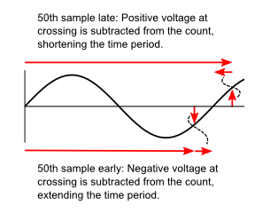
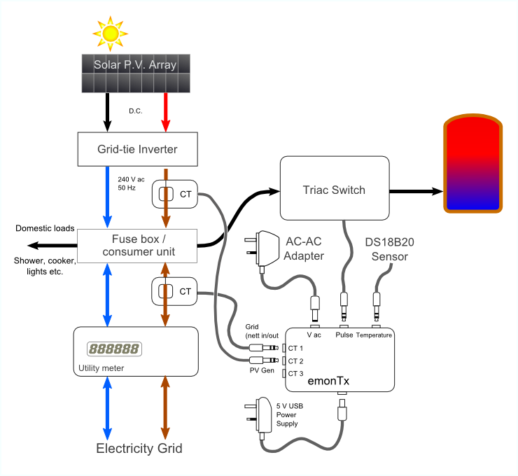
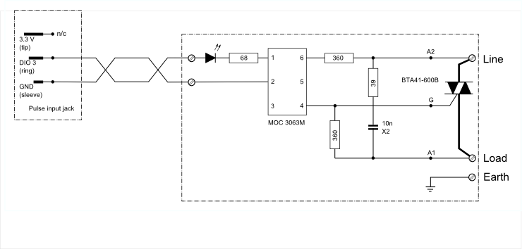

# Solar PV Power Diversion with emonTx Using a PLL, emonGLCD and Temperature Measurement, by Martin Roberts

<small>Documentation by Robert Wall</small>

A Design for a Controller to Route Surplus P.V. Energy into the Domestic Hot Water Supply and to Provide Energy Monitoring

## 1: Features

- Continuous monitoring, every mains cycle is sampled exactly 50 times.
- Uses 2 current transformers – suitable for a [“Type 2”](http://guide.openenergymonitor.org/applications/solar-pv/#required-hardware) installation.
- Normal transmission to emonGLCD via the RFM12 every few seconds, this also takes account of every mains cycle so you won’t miss short peaks.
- Support for a single DS18B20 temperature sensor.
- Standard, unmodified emonTx hardware, the triac trigger is driven from the pulse detector jack via a suitable resistor.
- Diverted power is calculated and transmitted to emonGLCD.
- Triac pulses can be manually set via the serial interface (e.g. enter 2 to pulse every second mains cycle – remember to put this back to 0!)
- Upper and lower energy thresholds can be set to minimise flicker.
- The design uses one of the ATmega328 timers to interrupt the Arduino sketch approximately every 400 microseconds. The exact timer period is determined by a software phase-locked loop which ensures that the first voltage sample is aligned to the rising zero crossing and the 26th sample is aligned to the falling zero crossing. This means that the samples are always taken in the same place on every cycle.

The sampling process occupies about 30% of the CPU time so there’s plenty left for other tasks like transmission, temperature measurement, print statements etc. These are completely decoupled from the timing loop so they don't interfere with the sampling in any way.

## 2: Software Design Overview

The PLL Power Diversion sketch uses advanced techniques to achieve a performance that is in several respects superior to that which is achievable with the standard demonstration sketches and emonLib. This is not to denigrate emonLib nor the other libraries that the demonstration sketches employ, those are designed for general use and as such need to cover all eventualities. In a closely controlled application, it is possible to bypass these general purpose functions and, at the expense of more advanced programming, control both the processor itself and the external devices – radio and temperature sensor – at much lower level to achieve an enhanced performance.

The sketch uses a phase locked loop to synchronise to the mains frequency, it uses the much faster integer maths to speed up the calculations, and the ADC runs in the background communicating with the main program via interrupts.

This design builds on top of the excellent work done by Robin Emley ([“Diverting surplus PV Power”](../mk2/index)) and on the emonLib library.

The basic power diversion algorithm is the same as Robin Emley’s and sections 1 – 6 of “Diverting surplus PV Power” provide a good explanation of the principles and basic operation. If you are not familiar with that, I suggest you read those pages before continuing.

## 3: What is a PLL? – Operating Principle.

A Phase Locked Loop (PLL) is a particular form of a closed loop control system. It is often used, as here, to follow the changes in frequency of some incoming signal. In our case, that is the mains electricity supply.

If we set up our emonTx to measure the mains voltage and current 2500 times per second, (that’s 50 times per cycle in the UK) then as long as the mains frequency remains at 50 Hz, and as long as the crystal clock in our emonTx is accurate and doesn’t drift, then we will indeed take exactly 50 measurements in each cycle, and on successive cycles each measurement will be at exactly the same place on the wave. Clearly, in practice even if we can start out like this, it won’t stay like it for long. Both the mains frequency and our crystal can drift, and so the measurements will slide backwards and forwards along the wave as the two frequencies change relative to each other.

To stop this from happening, we must control the frequency at which we make the measurements so that they happen at exactly the same place on the wave each time. If we say that we will start measuring when the mains voltage crosses zero going positively, then the 51st measurement should again be zero. If our clock is running fast, we will get there early and the voltage will be negative and we need to slow our clock; on the other hand, if we are late the voltage will be positive and we need to speed our clock up. So we are not only locking our clock and the frequency of our measurements to the mains, we are also locking every 50th measurement to the positive-going zero crossing of the voltage. We have a phase locked loop.

## 4: The ADC and Interrupts

The analogue to digital converter (ADC) in the Atmel processor can run in one of two modes. The data sheet lists features that are key to how we use the ADC:

*   Free Running or Single Conversion Mode
*   Interrupt on ADC Conversion Complete

EmonLib uses “Single Conversion Mode”. In this mode, the main program sends a command to set the input channel and start the conversion process, and waits until that has finished before carrying on to use the value it measured. We also use single conversion mode, which we start by sending the command to measure the voltage at a frequency controlled ultimately by our PLL.

The second feature “Interrupt on ADC Conversion Complete” means that when the ADC finishes the conversion and it has put the answer in a standard place, it “interrupts” the main program to say the conversion is done. A special function, the “interrupt handler” or “Interrupt Service Routine (ISR)” then runs to pick up the result and does something useful with it (and it starts the measurement on the next channel) and when that finishes, the main program carries on where it left off. That way, we don’t have to wait in our main program while the ADC conversion is taking place.

## 5: Integer Maths

High level languages like C++ make it easy to write programs by offering a wide range of variable types and functions. Unfortunately, that convenience comes at the price of speed and performance. Although modern compilers can usually optimise a program far better than all but the best human programmers, there are limits to what they can do simply because they can never be totally aware of the actual conditions when the program is running. One area where a prior knowledge of what the variables are and what they mean is invaluable is in the mathematical operations.

Processing decimal numbers – so called “floating point” variables because the decimal point can ‘float’ left and right so that the numbers cover a huge range of values (even though the _precision_ is limited to 6 or 7 digits) – is normally very slow compared to the same operation with integer numbers. Therefore, if we can remove floating point variables from our calculation, we can speed it up significantly. The general principle is to multiply a small decimal number by some value so that when it is truncated to an integer, it still retains adequate precision; and divide a number that is too large to be stored as an integer while still retaining adequate precision. The maths then proceeds using the scaled integer values.

The essential difference is that rather than letting the computer handle the placing of the decimal point in a generalised way, we the programmers take over that responsibility and do it in a way that is often specific to just that line of code.

There is more about this, specifically the filter calculations, at [Electricity Monitoring: Digital filters for offset removal](../../electricity-monitoring/ctac/digital-filters-for-offset-removal).

## 6: Advantages Over emonLib

The energy monitor library (“emonLib”) designed for use with the emonTx was conceived with operation from either batteries or a 5 V mains adapter being possible. To achieve a reasonable battery life, it adopts the strategy of measuring power for a short time, then (in the standard demonstration sketches) sleeping for a long time. These times are approx. 200 mS and 5 s. This means that the power recorded is a sample and the underlying assumption is that this is representative of the power each side of this sample. Over a long period of time and with steady loads that are only occasionally switched on or off, this is quite reasonable and after careful calibration, agreement with the “official” meter to better than 1 % has been reported.

However, this approach is liable to increasing errors if a rapidly switched load, like the burst-mode controller, is present, and the switching times are comparable with the sampling period. The interrupt-driven approach means that measurement is continuous and the average power over the reporting period is accurately measured. Because the reading cycle is locked to the mains frequency, it is also possible to obtain a display of frequency.

Also, as the ADC switches to reading the next input almost instantaneously, rather than returning to the main program to wait for an instruction, readings can be made somewhat faster – meaning that either more samples can be taken in each cycle, or rather more usefully, more inputs can be read with the same sample rate. For example, the PLL sketch reads one voltage input and two current inputs 50 times per cycle with plenty of spare time between readings, the equivalent emonLib method reads about 54 samples of one voltage and one current reading only, with no spare time between readings.

## 7: Implementation

There are several details of the implementation that it is necessary to explain before the sketch is described in detail.

### The clock frequency.

In the description of the PLL, a brief mention was made of changing the frequency of the clock, without saying what the clock was or how. The frequency is actually controlled using the in-built timer-counter of the processor, which is explained in full in section 15 of the data sheet.

The 16-bit timer-counter is normally used to generate accurate output signals, it counts up to a value that we set (and alter, depending on whether our loop is running faster or slower than the mains) and then resets, in the process generating an interrupt. This interrupt – a different one to that which the ADC generates on completion – is our clock ‘tick’ that sets the ADC multiplexer to measure the voltage input channel and starts the ADC conversion process.

### The ADC interrupt handler

This routine is really the heart of the sketch. For each set of samples, three measurements are needed – the voltage and the two currents. We have seen how the conversion process for the voltage is started by the timer-counter, and how the ADC generates an interrupt when the conversion has finished. That is what starts this handler. First, it goes to the location where the ADC put the result and stores it, it then needs to set up the next input to be measured and start the conversion. Once the ADC is working, it can then handle the result from the last conversion, e.g. apply the filter, apply a phase shift if necessary, calculate the instantaneous power and accumulate the power as part of the calculations to get the average; and most importantly on every 50th set of samples it adjust the timer-counter to maintain synchronism with the voltage wave.

### Libraries

The sketch only uses the One-Wire library for the temperature sensor. All the commands for the ADC and the RFM12B radio module are built into the sketch. EmonLib, JeeLib and the Dallas Temperature Library are not required.

## 8: The Sketch Explained in Detail.

The version described was published at [https://openenergymonitor.org/emon/node/1535](https://openenergymonitor.org/emon/node/1535) and can be downloaded from [emonTx_Solar_Controller_Temperature_PLL_0.zip](files/emonTx_Solar_Controller_Temperature_PLL_0.zip)

### Calibration & Hardware Set-Up

Lines 19 – 21
The voltage and current calibration constants for the three inputs. These must be set according to your hardware by comparing with known good values.

Lines 22 & 23
The correction for difference in phase shift between the voltage and current transformers. These must be set to report maximum real power (unity power factor) on a purely resistive load, and drawing a current that is typical of normal use if possible.

Line 24
This is a small adjustment should it be found that the voltage signal is leaking into the current inputs. Normally it should be zero.

Line 26
In the original sketch, the temperature input is used to turn off the diverted power when the desired tank temperature is reached. The value here allows the diverted energy to be calculated. If a standard cylinder thermostat is used instead to switch off the heater, the calculation will give the energy that was _available for diversion_, not the actual energy diverted (which may be considerably less when the water reaches maximum temperature and the thermostat prevents further diversion).

Line 27
Normally, the on-board LED indicates a value transmitted. It may be configured here to indicate that the PLL is locked to mains.

Line 35
3600 J is a common value. The size of the energy buffer may need to be changed according to the size of the meter's energy packet. See [Energy Monitoring: Meters](../background/meters). If this is changed, the thresholds in lines 36 & 37 may need to be changed accordingly.

Line 43
The time between radio transmissions.

Lines 65 – 75
These constants define the I/O pins used, and should be correct for the emonTx. If the emonTx Shield, or an Arduino with custom I/O hardware is used, these will need to be changed accordingly. SYNCPIN and SAMPPIN are useful for debugging but are not necessary for operation. (It has been reported that removing the code for SYNCPIN improves the loop stability – see [https://openenergymonitor.org/emon/node/2679](https://openenergymonitor.org/emon/node/2679))

None of the other preprocessor directives should need to be changed.

Lines 86 – 89
These set up the One-wire library for temperature measurement and the SPI library for the serial connection to the RFM12B radio module.

### RF Data to GLCD, emonBase & emonCMS

Lines 91 & 92 set up the familiar data structure for passing data via the radio module.

### Static Variables

Lines 94 – 112 declare the static variables used in the sketch.

### Setup( )

Lines 118 – 127 set the I/O pins as required.

Lines 131 – 134 set the serial interface to the radio module.

Lines 136 – 152 set up the radio module itself.

Line 138 is for setting the RF band: the value for 433 MHz is 0x80D7, for 868 MHz use 0x80E7\. Line 140 sets the frequency within the band and is correct for both bands.

Line 141 sets a lower data rate if range is an issue (the receiver must be set likewise if this is changed).

Lines 159 & 160 'unset' default settings for the ADC made by the Arduino library.

Lines 163 – 172\. These set up Timer1, the 2500 Hz ‘tick’ to allow the PLL to control it and for it to generate the interrupt necessary to start the ADC.

### Loop( )

The main loop comprises just a few lines, lines 176 – 201, because the main body of work is done in the interrupt handlers and in supporting functions.

Line 177
If the start of a new cycle (a positive-going zero crossing of the voltage) is detected by the PLL, then the last cycle's totals for average energy, rms V and I and some miscellaneous variables are accumulated.

Lines 179 – 192
Every 5 s, at nextTransmitTime, the rms values of voltage and current, the average real and apparent powers, the diverted power and frequency are calculated, the temperature from the last time is read from the temperature sensor and the results are sent both by radio and to the Serial port. Then the temperature sensor is instructed to measure the temperature again ready for the next time (the temperature is expected to change slowly so this is not a problem).
If the on-board LED is not being used to indicate that the loop is locked, then it is flashed while this is happening to indicate that data is being sent.
Finally, it’s possible to manually trigger the dump load ‘on’ for a specified number of cycles (1 – 255) by typing a number at the serial console, e.g. enter 2 to pulse every second mains cycle.

### The Timer1 Interrupt Handler ISR(TIMER1_COMPA_vect)

Lines 204 – 210.
This function is invoked when the interrupt is triggered as the 16-bit timer-counter Timer1 reaches its pre-set limit, thereby generating our 2500 Hz clock ‘tick’.
The two digitalWrite statements put a pulse on SAMPPIN to indicate the start of conversion. The ADC multiplexer is set to the voltage input, and the ADC conversion is started.

### The ADC Interrupt Handler ISR(ADC_vect)

Lines 213 – 263
This function is invoked when the interrupt is triggered after the ADC completes its conversion.

Lines 215 – 217
The static variables are ones that need to be stored between calls to the function. The others are temporary variables used in the calculations.

Lines 221 & 262
Like the other interrupt handler, a pulse is sent to SAMPPIN while the function is working.

Lines 222 & 223
The important first task is to recover the value from the ADC. It is in ADCH & ADCL and the value is transferred into 'result'.

Line 226
The switch statement checks which input was used to read the analogue value and one of the following 'case' branches is executed.

Lines 228 – 243
Voltage Input.

Lines 229 & 230 set the ADC multiplexer to the next input to be measured (CT1) and start the conversion. While that is happening, the old value from the previous sample is saved for use in the filter, the new value copied and the input offset (more on that later) is subtracted and the resulting value squared and accumulated (line 234). The offset is then updated by adding in a small fraction of the difference between the original value and the present offset – this action making the low-pass filter (lines 236 & 237). An interpolation using this and the last sample (lines 239 & 241) performs a time shift (effectively a phase shift) on the voltage to align it with the current reading associated with the previous voltage sample, and finally (lines 240 & 242) the power is calculated and accumulated.

Lines 244 – 252
Current input 1.

Lines 245 & 246 set the ADC multiplexer to the next input (CT2) and thereafter this follows the same pattern as the voltage input, except of course there is no time shift and no power calculation.

Lines 253 – 260 Current input 2.

This is much the same as the first current input. There is no need to pre-set the voltage input for the multiplexer – this is done separately by the Timer1 ISR, but at the end of this when the 3 inputs have been read, the function to update the PLL is called (line 259).

### Update the PLL

Lines 265 - 339

Lines 267 – 270
The static variables are ones that need to be stored between calls to the function. The others are temporary variables used in the calculations.

The function is split into 3 main sections:

1.  If 50 sets of samples have been completed (_samples>=NUMSAMPLES; line 276_), and if the voltage is rising (determined by whether the voltage at this sample is greater than the last sample) then we take advantage of the fact that the value of the voltage is very conveniently a good number to use to correct the value of Timer1 on which the 2500 Hz tick is based. The voltage is subtracted from the Timer1 value. If the voltage was positive, it meant the time between ticks was too long, the measurement was late and the time will be shortened on the next mains cycle; conversely if the voltage was negative, the time between ticks was too short, the measurement was early and the time will be lengthened on the next mains cycle. This mechanism (lines 281 – 298) is the heart of the PLL.
    Note: The ‘loop gain’ – a measure of how the control loop responds to changes and indeed whether it will be stable or not – depends on the slope at the zero crossing which in turn depends on the amplitude of the voltage input being correct. The voltage at the a.c. input socket should give a peak – peak value of about 850 – 900 counts out of the ADC at normal mains voltage.
    Next, the accumulated values for the cycle (V2, I2, powers etc) are copied into global static variables to be picked up by the main loop (lines 303 – 308) and the cycle values are reset (lines 310 – 318). A most important variable is the flag “newCycle” that indicates to the main loop that this process has been completed, so that it can pick up the accumulated values.
2.  The negative-going zero crossing (at NUMSAMPLES/2) is when SYNCPIN is set low. It was set high at the positive-going crossing so this pin carries a square wave synchronised to mains frequency – it is useful for debugging but is not necessary for operation.
3.  Four samples before the negative-going zero crossing (line 325) is where we determine whether to arm the triac. “availableEnergy” is one of the global static variables that will be updated by the main loop, and is analogous to the “Energy Bucket” of Robin Emley’s article. If the level is above the upper threshold, the triac is turned on (lines 327 & 331 – 335) and it remains on until the level has fallen below the lower threshold (lines 328 & 336) when it is turned off.

### AddCycle

Lines 342 – 356.
This function is called at the start of the main loop when the end of a mains cycle has been detected (newCycle is set by the ADC interrupt handler).
The running totals for the cycle are added to the totals for the 5 s period and the flag is cleared.
DivertedCycleCount is a measure of the energy available for diversion.

### CalculateVIPF

Lines 359 – 393.
This is called to perform the calculations for the average values every 5 s prior to transmitting the results.

Lines 363-365 calculate the mean values and take the square root, then scale the result according to the calibration constants.

Lines 367 – 374 similarly calculate the mean powers, apply the correction (if any – it should be zero), and calculate the apparent powers and power factors.

Line 375 calculates the 'diverted power' (often this will be the power available for diversion).

Line 376 calculates the mains frequency. (Note: the constant may be changed to calibrate this if the actual crystal frequency is known or can be measured.)

Lines 379 – 382 transfer the required values to the emontx structure ready for the radio module.

Lines 384 – 392 finally reset the accumulators.

### SendResults

Lines 395 – 420.
The data already prepared for the radio module is sent (line 397) and the remainder of this function prints values to the serial monitor. The “Offset” values are useful for checking that the hardware bias of the input circuit and the filter is working correctly.

### Rfm_write

Lines 423 – 431.
Sends a word to the radio module via the SPI interface.

### Rfm_send

Lines 434 – 471.
Sends the complete message.

First, the radio module is powered and the transmitter switched on (lines 439 & 440) and line 443 puts it into tx register write mode, allowing multiple bytes to be sent.

In the ‘while’ loop (lines 445 – 463), the message header is constructed first in lines 450 – 456, then the message itself (line 457) followed by the checksum. Line 465 actually transfers the byte to the radio module via the SPI bus. Finally, the transmitter is shut down and the module put into sleep mode.

### ConvertTemperature

Lines 473 – 478.
Starts the temperature conversion process.
Note that if a 2-wire parasitic connection to the temperature sensor is used and problems are experienced, line 477 should be changed to:
    oneWire.write(CONVERT_TEMPERATURE,1);

### ReadTemperature

Lines 480 – 497.
This function reads the temperature from the scratchpad memory in the temperature module and returns the value converted to °C × 100.

The module is set up in lines 488 – 490, the data is read in line 491 and the checksum is computed and compared in line 492\. If good, the temperature is extracted and converted by lines 494 – 496, else an obviously false value of 300 °C is returned to flag the error.

## 9: Hardware

### Original Triac Switch Output Stage

The original sketch uses the pulse jack socket on the emonTx V2 as the output to the triac driver. For the test setup Martin used a 68 Ω resistor in series with a normal LED and the MOC3063 triac driver. The MOC3063 is a low current device.

For the emonTx V3 using the ac adapter as the power supply, the circuit in [Choosing an energy diverter](../introduction/choosing-an-energy-diverter.md) must be used on account of the limited current available from the rectifier circuit (note the use of the more sensitive MOC3043M and the increased value of the series resistor).

### Alternative Triac Switch Output Stage

It is possible to use exactly the same output stage as Robin Emley’s design, in which the driver is wired to the tip and ring of the plug, but a small change is required to invert the triac signal in the sketch: in the three places where “digitalWrite(TRIACPIN, …)” appears, change LOW to HIGH and vice versa. The higher current required by the driver means that the series LED cannot be used. If a indication of operation is required, then a LED with its own series resistor in parallel with the driver should be employed.

The pcb for the output components mentioned in Robin’s article may be used and is available separately. Details can be found at [https://openenergymonitor.org/emon/node/2044](https://openenergymonitor.org/emon/node/2044) (but note that there is no provision for the LED to be mounted on-board). Alternatively, ‘Stripboard’ is the favoured method for many home construction projects.

<small>Suggested stripboard layout – component side. The current-limiting resistor (68 Ω, 75 Ω or 180 Ω) and the LED may be mounted here if desired (with a minor modification to the low voltage side).</small>

The optoisolator I.C. provides adequate isolation between the low voltage circuit and the mains **provided** its integrity is not compromised by the circuit board layout. You should have at least 7 mm of “creepage distance” between the high voltage and low voltage sides, and the only way to achieve this will be to cut a slot beneath the opto-isolator I.C, as shown.

The recommended triac is an insulated tab device, meaning that it is possible to bolt the tab directly to the heat-sink. However, an insulation kit comprising a silicone rubber washer and insulated bush is recommended and might improve the heat transfer from the device to the heat sink. In any event, the heatsink will need to be either outside the box or the box itself for performance reasons, so if touchable must be solidly earthed, and the high voltage wiring must be appropriately rated and insulated. All other live parts must be enclosed in an earthed metal box or double-insulated.

### Circuit Protection

It is not economic to include a fuse or circuit breaker that will protect the recommended triac in every possible circumstance (even though it is grossly over-rated for the duty) and therefore it should be possible to replace it easily in the event of failure. See [Overload Protection of Mains Electrical Circuits](../background/overload-protection-of-mains-electrical-circuits) for more information.

## 10: Derivatives

Two notable derivatives of this design have been published.

1.  A three-phase 50 Hz version using only one voltage reference for the emonTx Shield, by Petrik.
    Originally published at [https://openenergymonitor.org/emon/node/2339#comment-13967](https://openenergymonitor.org/emon/node/2339#comment-13967), the updated sketch can be found at [files/emonTx_Solar_Controller_Temperature_PLL_LCD_3Phase.ino](files/emonTx_Solar_Controller_Temperature_PLL_LCD_3Phase.ino)
    In this design, still in development, a single phase dump load is connected, but power is measured across all three phases. The hardware is an emonTx Shield with a local liquid crystal display, directly connected, as well as the radio module. The number of samples per cycle has been reduced to 36 to accommodate the additional readings (now 4 current and one voltage), and the voltage samples are stored in an array so that a delayed copy of the Phase 1 voltage can be used to calculate the real power of phases 2 & 3.
2.  A 60 Hz single phase 120 V North American version for the emonTx by Dan Woodie.
    The final version is published at [https://openenergymonitor.org/emon/node/2679](https://openenergymonitor.org/emon/node/2679), earlier versions and discussion at [https://openenergymonitor.org/emon/node/2624](https://openenergymonitor.org/emon/node/2624) and [https://openenergymonitor.org/emon/node/2720](https://openenergymonitor.org/emon/node/2720)
    This design caters for 3 current inputs and has compile-time switches to include or exclude the load controller (if excluded, it becomes a power monitor only) and to include or exclude temperature measurement and the drive to SYNCPIN.

Although the design was originally for the emonTx V2, it can be used with the emonTx V3. The points to note are:

1.  If the emonTx V3 is to be powered only by the ac-ac adapter, a 'high-sensitivity' opto-trigger must be used. See [Choosing an Energy Diverter](../introduction/choosing-an-energy-diverter) for further details and a circuit diagram.
2.  Changes must be made to the IO pin assignments in MartinR's original sketch:

	<table>
		<tbody>
			<tr>
				<th class="rtecenter">Analogue Pin Assignments</th>
				<th class="rtecenter">emonTx V2</th>
				<th class="rtecenter">emonTx V3</th>
			</tr>
			<tr>
				<td>VOLTSPIN</td>
				<td class="rtecenter">2</td>
				<td class="rtecenter">0</td>
			</tr>
			<tr>
				<td>CT1PIN</td>
				<td class="rtecenter">3</td>
				<td class="rtecenter">1</td>
			</tr>
			<tr>
				<td>CT2PIN</td>
				<td class="rtecenter">0</td>
				<td class="rtecenter">2</td>
			</tr>
			<tr>
				<td>CT3PIN (if implemented)</td>
				<td class="rtecenter">1</td>
				<td class="rtecenter">3</td>
			</tr>
			<tr>
				<td>CT4PIN (if possible)</td>
				<td class="rtecenter">-</td>
				<td class="rtecenter">4</td>
			</tr>
			<tr>
				<td>PWRPIN (temp sensor power)</td>
				<td class="rtecenter">-</td>
				<td class="rtecenter">5</td>
			</tr>
			<tr>
				<th class="rtecenter">Digital Pin Assignments</th>
        <th class="rtecenter">emonTx V2</th>
				<th class="rtecenter">emonTx V3</th>        
			</tr>
			<tr>
				<td>LEDPIN</td>
				<td class="rtecenter">9</td>
				<td class="rtecenter">6</td>
			</tr>
			<tr>
				<td>SYNCPIN</td>
				<td class="rtecenter">6</td>
				<td class="rtecenter">10</td>
			</tr>
			<tr>
				<td>SAMPPIN</td>
				<td class="rtecenter">5</td>
				<td class="rtecenter">9</td>
			</tr>
			<tr>
				<td>RFMSELPIN</td>
				<td class="rtecenter">10</td>
				<td class="rtecenter">4</td>
			</tr>
			<tr>
				<td>RFMIRQPIN</td>
				<td class="rtecenter">2</td>
				<td class="rtecenter">3</td>
			</tr>
			<tr>
				<td>SDOPIN</td>
				<td class="rtecenter">12</td>
				<td class="rtecenter">12</td>
			</tr>
			<tr>
				<td>W1PIN</td>
				<td class="rtecenter">4</td>
				<td class="rtecenter">5</td>
			</tr>
			<tr>
				<td>TRIACPIN</td>
				<td class="rtecenter">3</td>
				<td class="rtecenter">2</td>
			</tr>
		</tbody>
	</table>

SYNCPIN & SAMPPIN are provided to facilitate testing and checking the timing with an oscilloscope.
PWRPIN in the emonTx V3 is used to supply power to the temperature sensor. It needs to be set permanently high if temperature measurement is required. (It is so that when battery power is used (not relevant in this application), the temperature sensor can be powered only when it is required to take a reading, thus potentially extending battery life.)

## 11: References

Atmel data sheet ATmega48PA/88PA/168PA/328P
[www.atmel.com/Images/8161s.pdf](http://www.atmel.com/Images/8161s.pdf)

Fairchild zero-crossing triac opto-coupler data sheets:
[www.fairchildsemi.com/ds/MO/MOC3041M.pdf](http://www.fairchildsemi.com/ds/MO/MOC3041M.pdf)
[www.fairchildsemi.com/ds/MO/MOC3061M.pdf](http://www.fairchildsemi.com/ds/MO/MOC3061M.pdf)
