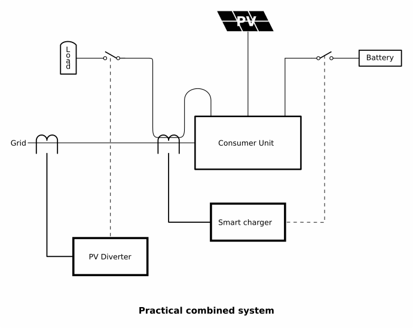

# Using Multiple Diverters

It is becoming common to have either an Electric Vehicle charger, or maybe a peak-lopping or standby battery with an associated inverter/charger, in addition to a hot water cylinder, as a consumer of surplus PV energy.

## The General Principle

The overriding principle is that there must be no possibility of two or more systems interacting with each other – there must always be a hierarchy where one system has priority for the surplus energy, and the other (or others) receive their share when the primary system is satisfied. The first in the hierarchy will influence, but not *control*, the actions of the next in line; and the lower one in the hierarchy must react to the actions of, but again neither influence nor control, the one above it. The instant when one system tries to control the other, or both react to the same stimulus, is when instability becomes a near certainty.

(It is also possible for a controller to share the energy between a number of systems, in which case an individual system can refuse to accept energy, but it cannot demand energy from the controller.)

## Example

The home has a PV installation and a ‘smart’ battery charger for an E.V.  The battery charger is set to charge the vehicle using energy that would otherwise be exported. When the vehicle is fully charged, it refuses to accept any more and the energy is exported.

The householder wants to use the excess PV energy that isn’t used by the battery charger to heat the domestic hot water.

The battery charger is therefore at the top level in the hierarchy because it must have priority for the PV energy, the hot water is the second in line for the PV energy.

The two systems must be set up so that the primary system comprises the normal house load and the P.V as its normal load, the battery charger is its dump load. The secondary system has the *primary system* as its normal load, and the hot water tank is its dump load.

## A Practical Combined System

The combined system above is not normally practical – it implies the wiring is grouped and accessible in a way that’s not normally possible inside a real consumer unit or distribution panel.

Normally, the water heating load, battery charger and the P.V. infeed will all be connected to circuit breakers in the distribution panel, and the only places where it’s possible to measure the total usage will be either next to the main switch inside the panel, or on the main cable feeding the panel. A way must be found to make sure the current supplied to the water heater is not measured by the battery charger.

It is possible to do this by putting both the battery charger’s and the PV diverter’s current transformers on the main incoming cable, and taking the wire supplying the water heater **backwards** through the battery charger’s c.t.  This c.t. will measure the water heater’s contribution to the total current, but taking this current though again but in the opposite direction means it is subtracted from the total in the main cable and not measured as part of the total, so it does not influence the battery charger.

