# MyHomeEnergyPlanner: Getting Started

Low energy building technology: highly insulated, air-tight buildings can deliver space heating energy savings of up to 50-90% while simultaneously increasing our comfort.

[MyHomeEnergyPlanner](http://github.com/emoncms/MyHomeEnergyPlanner) is an open source energy assessment tool to help you explore how you can achieve this level of performance improvement in your own home - developed as a collaboration between OpenEnergyMonitor and CarbonCoop, currently maintained by [Carlos Alonso Gabizon](https://github.com/cagabi) at Carbon Coop.

The model used is based on the 2012 version of SAP (Standard Assessment Procedure for UK EPC's (Energy Performance Certificate's)) developed by the Building Research Establishment for which the full specification can be downloaded from BRE here: [SAP-2012_9-92.pdf](http://www.bre.co.uk/filelibrary/SAP/2012/SAP-2012_9-92.pdf).

#### Example 1: Semi-detached 3 bedroom 1950 ex-council house, Wales, UK.

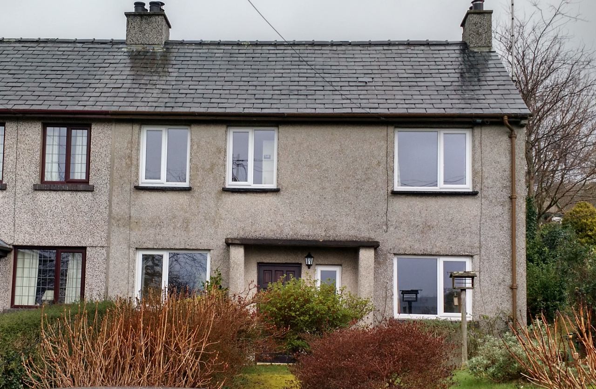

This guide is work in progress, aiming to provide an example of using MyHomeEnergyPlanner to carry out a household energy assessment in order to work out the best combination of measures to apply in order to achieve the performance standards suggested in the ZeroCarbonBritian scenario.

The guide currently provides a rough overview of the initial baseline assessment entry stage. There is a lot more to add in order to really get the most out of the tool which will be added in due course.

The next step is to extend it with an example of cross checking the model results with actual current energy use - from meter readings, energy and temperature monitoring.

The example house is a 1950’s semi-detached 3 bedroom house in Snowdonia, North Wales, UK. The construction is brick cavity wall. The house has a good south facing aspect.

It was not initially clear if the walls had cavity wall insulation and so our example assessment starts with uninsulated cavity walls and then after comparison with actual meter readings the assessment was redone with insulated cavity walls - a physical inspection is still required.

### Measuring up your home

Its useful to start by drawing a floor plan of your home. Having a floor plan diagram helps when you come back to revisit your assessment later as a reminder of which elements in the assessment relate to which walls, windows etc in the house.

A floor plan could be drawn on paper, a graphics program, open office draw or a CAD package. 

- Measure each wall dimension without initially taking into account the window's and doors, place the dimension on the floor plan. 
- Draw an indication of wall widths and include internal walls.
- Draw the windows and doors on the floor plan and note each windows width and height.
- Label each room and note the room height.

**Floor Plan Example:**

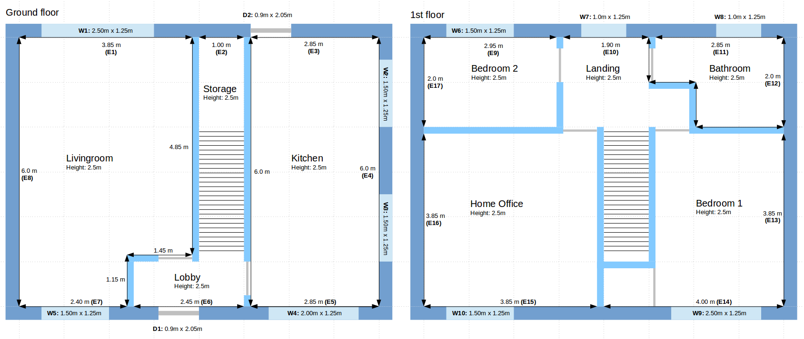

- Start in the top-left corner and work clockwise labelling each external wall with a unique name: E1, E2, E3 etc. 
- Do the same for the windows: W1, W2, W3..

### Create a MyHomeEnergyPlanner assessment

- Login or create an account in emoncms: [http://myhome.emoncms.org](http://myhome.emoncms.org)
- Create and then open a new assessment, you can give the assessment a name and a description.

### 1. Context: 

Calculate the area of each floor not including internal walls of each floor, enter each floor in the floor section of the calculator.

In our example here there are two floors each 6 meters by 8 meters and 2.5m high:

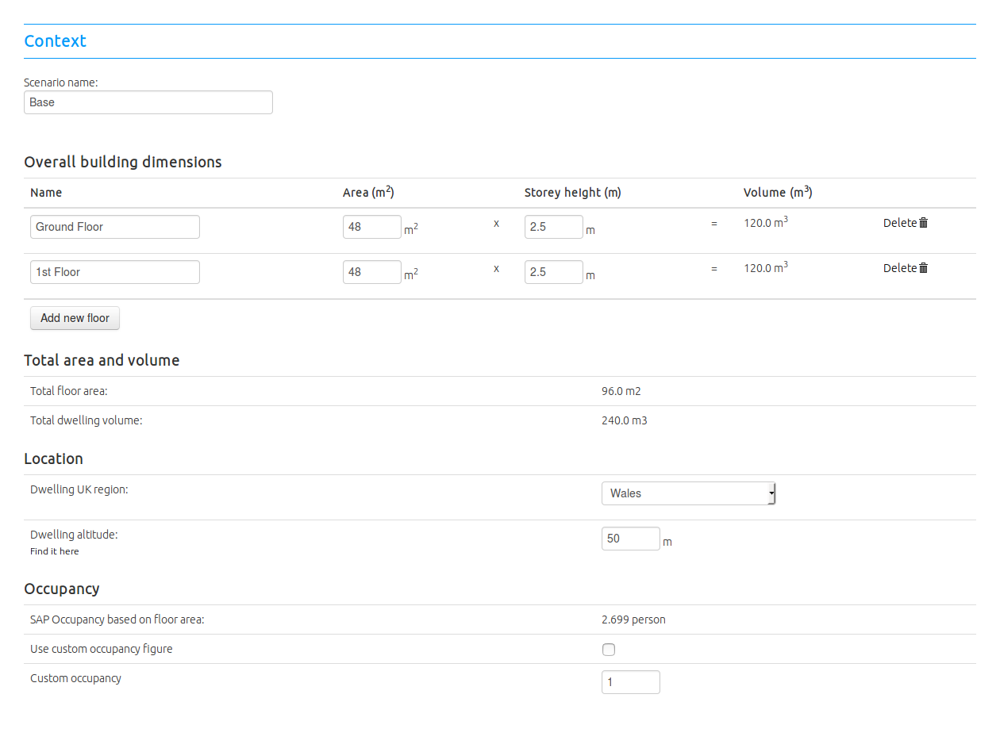

### 2. Ventilation

A key cause of heat loss is ventilation and infiltration. The movement of heated air from inside the house into its surroundings and its replacement by cold air from outside. The ventilation and infiltration section allows selection of both deliberate ventilation sources and infiltration through the building fabric and other sources of draughts.

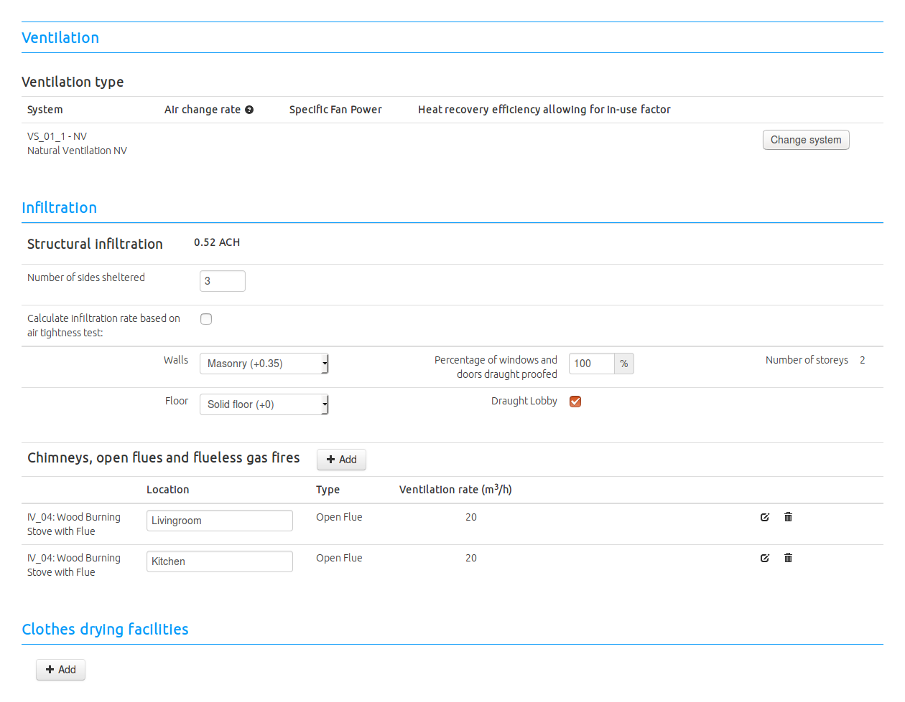

### 3. Fabric

The Fabric section is used to enter the dimensions, u-values and other thermal properties of all external and internal walls, floors, the roof and windows of your building. 

#### Walls

Enter each wall in order following the floor plan labelling. In our example the first wall section E1 has a length of 3.85m, a height given by the room height of 2.5m and is an uninsulated cavity wall with a U-value of 1.3 W/K.m2 and K-value of 110 kJ/K.m2. E2 has a length of 1.0m, a height of 2.5m and is a continuation of the uninsulated cavity wall with a U-value of 1.3 W/K.m2 and K-value of 110 kJ/K.m2:

U-values and K-values for several types of common construction can be found in the [Element Library](ElementLibrary.md).

MyHomeEnergyPlanner has built in element libraries. Element types can be selected from these libraries and U-values can be changed as required by editing the libraries.

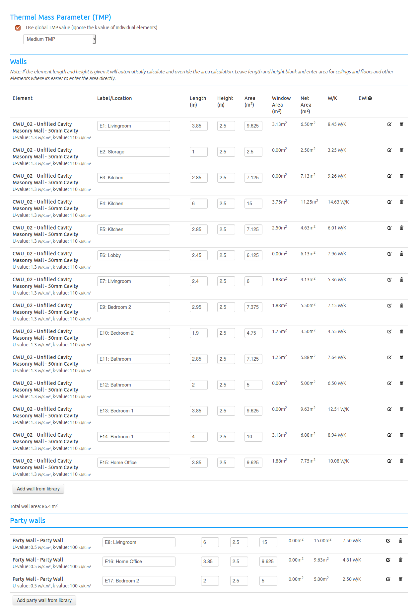

#### Floor and Roof

In the example the ground floor area is 48m2 and is an uninsulated solid floor with a U-value of 0.7 W/K.m2 and a K-value of 75 kJ/K.m2 from the Element Library. 

The Roof is also 48m2 measured as the area of the loft, an is insulated with 100mm of loft insulation resulting in a U-value of 0.4 W/K.m2.

The area's can be used directly in the element list rather than entering a length and height, enter the floor and roof in the same element list as the walls.

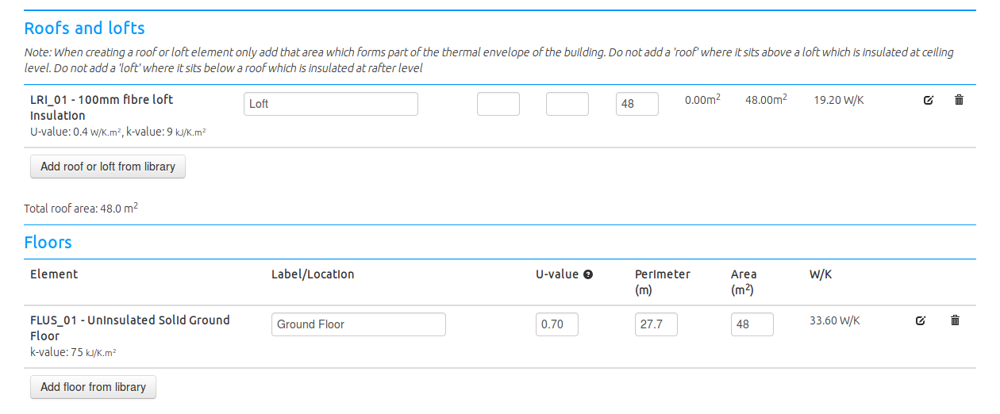

#### Windows

The window section requires additional inputs in order to calculate the contribution to heating from solar gains. Its also possible to subtract window area's from particular wall sections. This both simplifies the calculation procedure for wall areas and provides a convenient way of associating a window with a wall for reference.

Enter each window, its width, height, orientation, overshading level and U-value from the Element Library.

**Example:** Window 1 (W1) is 2.5m wide and 1.25m high, it is positioned in external wall E1. It faces North and is averagely shaded.

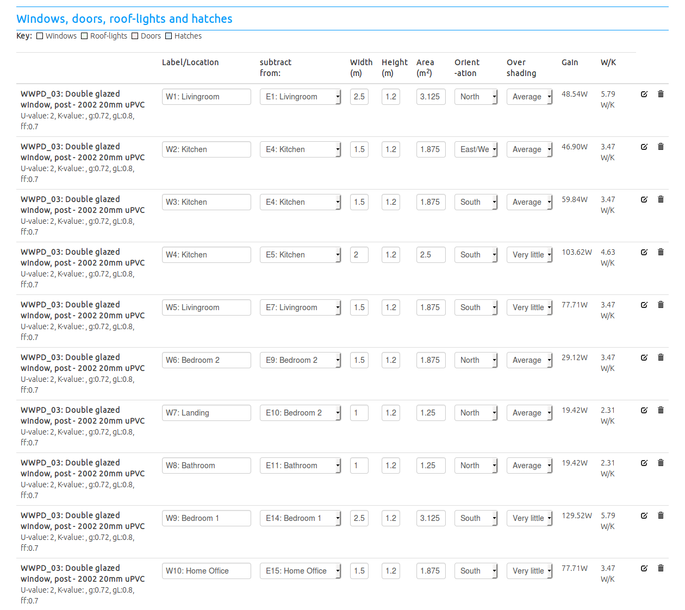

Once a window has been entered and the wall that it is to be subtracted from is selected from the dropdown menu the wall list will update with the window area and show the resultant net wall area:

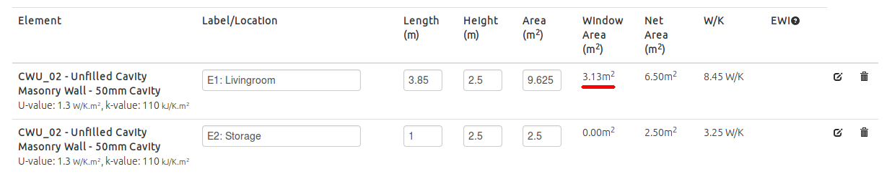

With the ventilation and fabric sections completed the house heat loss graphic should now show all the sources of heat loss and their relative magnitudes:

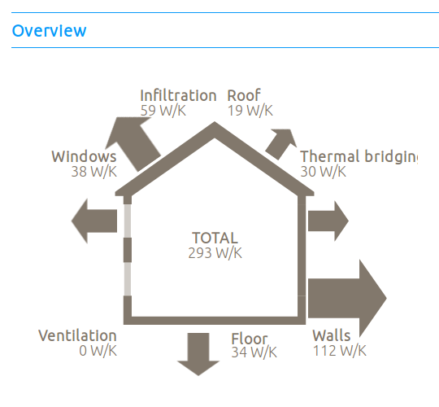

### 4. Lighting, Appliances & Cooking

Lighting, appliances and cooking all contribute heat gains into a house reducing the amount of additional heat required. It is possible to either use a SAP based calculation as part of this section or a more detailed SAP for lighting and appliance list for appliances and cooking approach. For quick results we will start with the SAP estimates and come back to this section later.

Select the relevant fuel sources if using a mixture of economy 7 and standard tariff electricity or gas and other fuels for cooking.

### 5. Heating

**Hot water demand:** 

The heating section starts with a section on hot water demand. Again it is possible to either use the SAP based estimate or enter your own figures here in order to achieve a more accurate result.

**Space heating demand:** 

Adjust the living area to cover the area for which the house is kept at the target temperature most of the time. Set the target temperature as close to the temperature achieved during the time heating is on, If your thermostat is well positioned this will likely be near the thermostat temperature.

The default SAP target temperature is 21C. Clearly the predicted space heating requirement will be significantly larger than your actual consumption if the mean internal temperature assumed by the assessment is significantly higher than the actual mean internal temperature of your home. SAP assessments use a single value across all houses in order to provide a fair comparison as perceptions of comfort, affordability of heat, level's of frugality and therefore indoor temperature can change with different owners.

**Heating systems:** 

Add heating systems as required. Our example house has storage heaters and two wood stoves for space heating and instantaneous electric water heating. The fraction of each system can be entered in the fraction boxes and needs to add up to 1.0.

### 6. Fuel Requirements

The final page provides an overview of all the different end use energy demands and their fuel sources and gives an opportunity to amend the fuel costs. The overview at the top provides comparative figures for space heating demand, primary energy, CO2 and per person energy use.

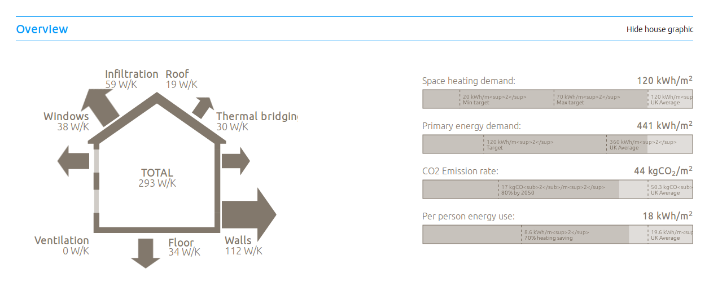

### A1: Base-line assessment summary

Key inputs and assumptions: 

- Uninsulated walls
- 21C target temperature
- 50/50 storage heaters and wood stoves
- Standard SAP assumptions for Lighting, Appliances and Cooking
- Standard SAP assumptions for hot water demand
- Standard SAP occupancy
- Standard SAP heating profile

Assessment results:

- **Heat loss rate:** 293 W/K
- **Lighting, Appliances and Cooking (LAC) electric:** 393.13+2565.84+354.11 = 3,313 kWh (9.1 kWh/d)
- **Water heating demand (DHW):** 1,384 kWh (3.8 kWh/d)
- **Space heating demand:** 14,540 kWh (39.8 kWh/d)
- **Electricity:** 11,967 kWh (LAC+DHW+50% storage heaters) (32.8 kWh/d)
- **Wood:** 2086 kg (8,553 kWh @ 85% efficiency / 4.1 kWh/kg)

### Cross checking with current energy use: meter readings, energy and temperature monitoring

With these initial modelled figures we can now check the model against actual meter readings, monitoring and estimated wood consumption to see how close they match.

If the model results are very different from actual consumption we will know that we have an error in the inputs and model assumptions. The base-line assessment tried to stick to standard SAP assumptions as much as possible, several of which are known to differ greatly from actual conditions and consumption but provide a good base-line to start from, as well as helping with comparison with other households which is the intended use of SAP in Energy Performance Certificates EPC's.

**Meter readings:**
 
Standard tariff:

    1107 kWh Aug 22th 16 →  22nd March 17 (212 days) = 5.2 kWh/d
    1576 kWh April 18th 16 →  22nd March 17 (338 days) = 4.7 kWh/d
    2935 kWh June 3rd 15 →  22nd March 17 (658 days) = 4.5 kWh/d
    
Economy 7:

	  1730 kWh Aug 22th 16 →  22nd March 17 (212 days) = 8.2 kWh/d
	  1933 kWh April 18th 16 →  22nd March 17 (338 days) = 5.7 kWh/d
	  3568 kWh June 3rd 15 →  22nd March 17 (658 days) = 5.4 kWh/d
	  
Both:
 
	  2837 kWh Aug 22th 16 →  22nd March 17 (212 days) = 13.4 kWh/d
	  3509 kWh April 18th 16 →  22nd March 17 (338 days) = 10.4 kWh
	  6503 kWh June 3rd 15 →  22nd March 17 (658 days) = 9.9 kWh/d

**A rough estimate of wood consumption**

	  20 weeks at x 20kg = 400
	  15 weeks at x 15kg = 225
	  17 weeks at x 8kg = 136
	  Total = 761 kg
	  
**OpenEnergyMonitor temperature monitoring**

    Living room temperature average: March 17: 16.7C
    Kitchen temperature average: March 17: 14.6C
    Mean internal temperature: March 17: ~15.7C

**Discussion**

As we can see actual consumption is significantly below the modelled consumption given the input assumptions in our base-line assessment.
    
- Standard LAC electricity consumption is 52% of SAP estimate.
- Storage heater consumption is 29% of SAP estimate.
- Electricity consumption is 31% of SAP estimate
- Rough wood consumption estimate is 36% of SAP estimate
- Mean internal temperature is 19.32 – 15.7 = 3.62 C less than SAP estimate

Actual consumption is so low that the household almost achieves the passivhaus primary energy demand target (120 kWh/m2) at 155 kWh/m2 and the CO2 reduction target of 80% (17kgCO2/m2) at 21 kgCO2/m2. Space heating demand is 3x the passivhaus retrofit potential however the level achieved is still 40% lower than the UK average. Given the already low consumption of this house, the application of measures such as insulation and heating system changes may be of more use for improving comfort rather than achieving a large energy reduction.

Going back to the difference between the model and actual consumption the temperature monitoring indicates one source of error. The actual mean internal temperature is 3.6C less than the 19.3C mean internal temperature in March calculated in the model (resulting from a 21C target temperature during heating periods).

### Reducing internal temperature to match monitoring

Adjusting the target temperature in the assessment to 17.4C results in a modelled mean internal temperature in the month of March of 15.7C (accounting for times where the temperature drops when the heating is not on) - matching the monitored temperature for March.

Inputs and assumptions: 

- Uninsulated walls
- 17.4C target temperature (15.7C mean internal temperature)
- 50/50 storage heaters and wood stoves
- Standard SAP assumptions for Lighting, Appliances and Cooking
- Standard SAP assumptions for hot water demand
- Standard SAP occupancy
- Standard SAP heating profile

Assessment results:

- **Heat loss rate:** 293 W/K
- **Lighting, Appliances and Cooking (LAC) electric:** 393.13+2565.84+354.11 = 3,313 kWh (9.1 kWh/d)
- **Water heating demand (DHW):** 1,384 kWh (3.8 kWh/d)
- **Space heating demand:** 9,116 kWh (25 kWh/d)
- **Electricity:** 11,967 kWh (LAC+DHW+50% storage heaters) (25 kWh/d)
- **Wood:** 1308 kg (5,362 kWh @ 85% efficiency / 4.1 kWh/kg)

Standard LAC electricity consumption is now 52% of SAP estimate (no change) 
Storage heater consumption is 46% of SAP estimate (+17%) 
Electricity consumption is 41% of SAP estimate (+10%) 
Rough wood consumption estimate is 58% of SAP estimate (+22%) 

This improvement in input has reduced our error by a fair amount but we are still a long way off. Another known error in input is lighting, appliances and cooking electricity consumption.

### Using the Carbon Coop appliance and cooking list instead of the SAP calculation

The assessment has so far used the SAP assumptions for lighting, appliances, cooking and hot water energy demands. These demands are all electric and all happen during standard tariff hours and so we can use the meter readings for the standard tariff to find out the actual consumption of these energy demands.

- SAP calculation LAC demand: 393.13+2565.84+354.11 = 3,313 kWh (9.1 kWh/d)
- SAP hot water demand: 1384 kWh (3.8 kWh/d)
- SAP LAC + Hot Water: 4697 kWh (12.9 kWh/d)
- **Meter readings standard tariff: 1716 kWh (4.7 kWh/d)**

Actual consumption is 63% less than the SAP estimated demand and is therefore another known input error in the assessment model. Reducing LAC + Hot water energy input will however result in even higher space heating demand as there will be less waste heat available used in reducing space heat demand.

Using the Carbon Coop appliance list interface available under the Lighting, Appliances and Cooking section its possible to build a list of appliances in the home as shown in the following example:

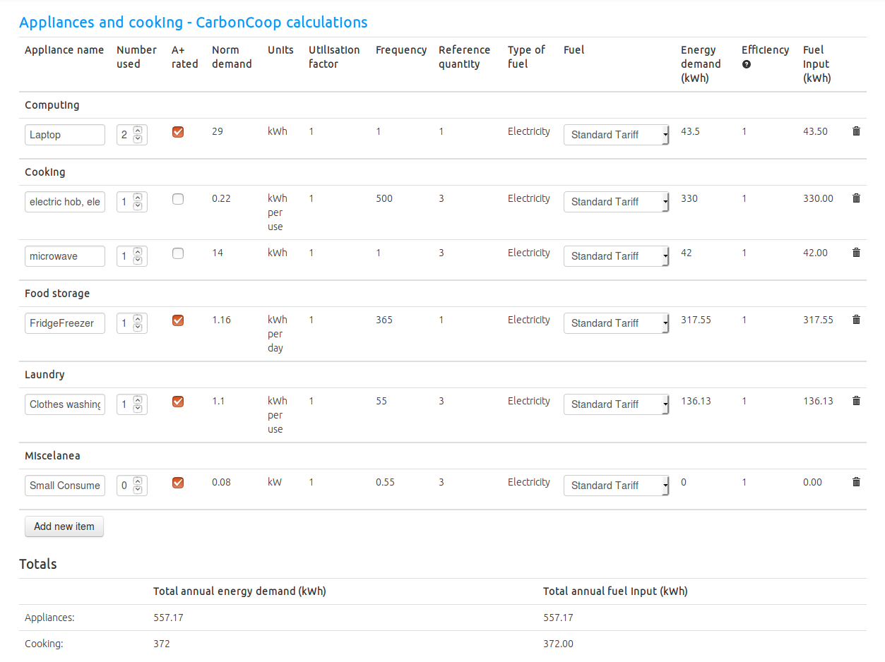

The result for our example home came to: Lighting: 393 kWh, Appliances: 557 kWh and Cooking 372 kWh but then in order to meet the same electricity consumption quantity recorded with meter readings, hot water heating demand needed to be reduced from 1384 kWh down to 408 kWh a 70% reduction - which indicates another significant discrepancy to better understand.

Running the model again with amended LAC + Water heating demand.

Inputs and assumptions: 

- Uninsulated walls
- 17.4C target temperature (15.7C mean internal temperature)
- 50/50 storage heaters and wood stoves
- Custom Lighting, Appliances and Cooking demand
- Custom hot water demand
- Standard SAP occupancy
- Standard SAP heating profile

Assessment results:

- **Heat loss rate:** 293 W/K
- **Lighting, Appliances and Cooking (LAC) electric:** 393.13+557.17+372 = 1322.3 kWh (3.6 kWh/d)
- **Water heating demand (DHW):** 408 kWh (1.1 kWh/d)
- **Space heating demand:** 10,142 kWh (27.8 kWh/d)
- **Electricity:** 6801 kWh (LAC+DHW+50% storage heaters) (18.6 kWh/d)
- **Wood:** 1455 kg (5,966 kWh @ 85% efficiency / 4.1 kWh/kg)

Storage heater consumption is 41% of SAP estimate (-5%) 
Electricity consumption is 56% of SAP estimate (+15%) 
Rough wood consumption estimate is 52% of SAP estimate (-6%) 

The total error in electricity consumption is reduced by 15% points however the error in space heating demand for electricity and wood has increased as expected.

### Insulated cavity walls

It was not initially clear if the walls had cavity wall insulation or not and so the first runs of the assessment above started with uninsulated cavity walls as a starting point for comparison.

Given that the discrepancy between the modelled space heating demand, meter readings and wood consumption estimate is so large - one cause could be better building fabric than first assumed.

The following assessment results result from setting the cavity wall U-value to 0.2 corresponding to a 100mm insulated cavity.

Inputs and assumptions: 

- Insulated cavity walls
- 16.9C target temperature (15.7C mean internal temperature)
- 50/50 storage heaters and wood stoves
- Custom Lighting, Appliances and Cooking demand
- Custom hot water demand
- Standard SAP occupancy
- Standard SAP heating profile

Assessment results:

- **Heat loss rate:** 198 W/K
- **Lighting, Appliances and Cooking (LAC) electric:** 393.13+557.17+372 = 1322.3 kWh (3.6 kWh/d)
- **Water heating demand (DHW):** 408 kWh (1.1 kWh/d)
- **Space heating demand:** 6,043 kWh (16.6 kWh/d)
- **Electricity:** 4752 kWh (LAC+DHW+50% storage heaters) (13.0 kWh/d)
- **Wood:** 867 kg (3555 kWh @ 85% efficiency / 4.1 kWh/kg)

Storage heater consumption is 69% of SAP estimate (+28%)
Electricity consumption is 80% of SAP estimate (+24%)
Rough wood consumption estimate is 88% of SAP estimate (+36%)

### What if the wood estimate has a significant error.

There could be a significant error in the wood consumption estimate as this was based on a rough calculation of the number of bags of wood used per week at different times of the year. We can use the model to estimate the wood consumption required if storage heater demand matched actual storage heater consumption from meter readings.

- Overall space heating demand is 6,043 kWh
- From meter readings storage heater consumption is 5.7 kWh x 365 = 2081 kWh
- Remaining space heating requirement: 6,043 kWh - 2081 kWh = 3962 kWh
- Wood consumption at 85% wood stove efficiency: 3962 / 0.85 = 4661 kWh
- Wood consumption in kg at 4.1 kWh/kg: 4661 ÷ 4.1 = 1137 kg.

If we under-estimated the wood consumption by a third actual consumption would match the model results which given how rough the wood consumption estimate is may not be that unlikely.

Alternatively the discrepancy between the model and actual consumption could be further affected by a number of factors such as lower overall mean internal temperatures, better insulation values, window u-values. Lower party wall U-value.

### Improving the building fabric

To be written

### Changing the heating system

To be written

