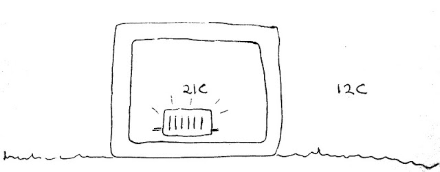

## Building fabric heat loss, thermal conductivity and U-values

Building fabric heat loss is heat loss through building elements such as walls, windows, floors, roofs, doors and more.

Building elements are composed of materials, and a material's thermal conductivity is called a k-value. The units are in W/m.K (Watts per meter-Kelvin). Kelvin as a unit has nothing to do with the naming of k-value. 

A fundamental physics notation to know is that Watts is the amount of energy per unit time.
1 Watt is equal to 1 Joule per second. W = J/s.

Heat loss for an area, such as a wall, is calculated using U-values. The U-value is the k-value multiplied by thickness or depth, d. The units are in W/m^2.K (Watts per meter-squared-Kelvin).
Multiple material layer k-values and thicknesses are simply summed together to make a building element U-value.

Example:

    A wall is made up of bales of hay with a layer of 50mm wood-fibre board on each side.
    k-value of hay bales = 0.07W/m.K
    k-value of wood-fibre board = 0.04W/m.K
    thickness of bales = 400mm
    thickness of wood-fibre board (total) = 100mm
    
    (0.07 * 0.4) + (0.04 * 0.1) = 0.032 W/m^2.K

    The wall is 10 metres long and 2.6m high.

    0.032 * 10 * 2.6 = 0.832 W/K

This means for every Kelvin, or degrees C, temperature difference, 0.832 Watts of thermal energy will be transferred.

A standard equation for heat conduction, which will give us the amount of heat transfer for a given temperature difference, is given here:

    Heat Loss = k x A x (Ti - Te) / d

    k = thermal conductivity of the element material
    A = surface area of the element
    Ti = internal temperature
    Te = external temperature
    d = element thickness or depth

    The straw bale wall is part of a building with an internal target temperature of 20degC.
    The temperature outside is -10degC. So the temperature difference Ti-Te is 30degC.
    0.832 * 30 = 24.96 Watts are being lost through the wall.

Heat transfer has a direction. In UK houses we're normally concerned with minimising heat loss, like above. The way we set up the equation means a positive result would mean *heat lost*, but in a scenario where the temperature difference is negative, this could mean a negative result, and could represent heat flowing into our building, maybe cooling is required instead of heating.

Temperature difference is sometimes written as ΔT (delta T).

***Another Example:***

Imagine an object that is a hollow cube of uniform material, no windows, no openings, no draughts, just a simple hollow cube.

Lets say this cube object-house is made of nothing but mineral insulation 100mm thick, with internal dimensions: 7m wide, 7m long and 7m high.

Our cube house is situated in a climate with no wind or solar gain just a stable 12C outside air temperature all year.

How much energy would it take to keep this hypothetical house at a stable 21C?

As we heat the house, heat will move from the hotter internal air through the walls to the colder external air via conduction and so the equation that we need is the fundamental physics equation for heat conduction.

    H = (kA / l) x (Ti – Te)
    
See the great hyperphysics site for more on the [heat conduction equation](http://hyperphysics.phy-astr.gsu.edu/hbase/hframe.html) and everything else physics.

The [Wikipedia table on material thermal conductivity](http://en.wikipedia.org/wiki/List_of_thermal_conductivities) tells us that mineral insulation has a thermal conductivity of 0.04 W/mK. We can take the area of the material to be the internal area of our cube house (imagine folding the cube house out so that we just have this one dimensional wall of area A and thickness l), there is of course a difference between the internal area and the external area of our cube house but lets come back to that one later and take the internal area for now which is:

    7m x 7m x 6 surfaces = 294 m2

Putting the numbers into the heat conductivity equation we get:

    H = (0.04 x 294 / 0.1) x (21 – 12) = 1058 Watts
    
And so we find we would need a fairly standard 1kW heater to keep our cube house at 21C.
1058W continuously would work out to being 25 kWh per day and 9268 kWh/year.

Heat loss through building elements is one of the main cornerstones of a building energy model. But in models such as SAP it's not usually referred to as the heat conductivity equation nor is the thermal conductivity of a material the usual starting point. Instead models like SAP start with a building elements U-value and an equation that looks like this:

    Heat loss = U-value x Area x Temperature Difference

For an element made of a single uniform material the U-value is simply the material's thermal conductivity k divided by its thickness. But building elements are only sometimes single uniform materials; a building element can also be an assembly of different materials such as a timber stud wall with insulation, membranes, and air inside. The physical process of heat transfer through the element may also be a mixture of conductive, convective, and radiative heat transfer.

In the case where a material is uniform the heat loss through a building element equation is the same as the basic equation for heat conductivity and the U-value is just the k/l part lumped together into one constant.

The U-value of our 100mm mineral insulation wall would therefore be: 

    U-value = k / l = 0.04 / 0.1 = 0.4  W/m2.K.

If you have a composite of materials, say a layer of wood and then a layer of insulation, it's possible to calculate the overall U-value in the same way as we calculate the equivalent resistance of parallel resistors in electronics.

For further reading on U-values see [U-values definition and calculation](http://www.architecture.com/SustainabilityHub/Designstrategies/Earth/1-1-1-10-Uvalues(INCOMPLETE).aspx) by the RIBA.
