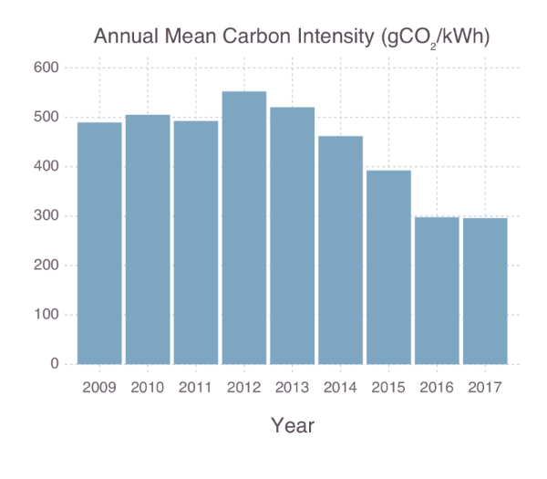

## Cars: Energy and Carbon Performance

This page includes a series of tables designed to help compare the energy and carbon performance of a range of petrol, diesel and electric cars. Including the performance of electric cars at different levels of grid de-carbonisation and overall performance including the embodied energy used in manufacturing the lithium ion batteries.

### Petrol cars

4.54609 Litres in a gallon, 9.7 kWh in a Litre, 2.31 kg CO2 per Litre

| MPG | MPL  | Miles/kWh | gCO2/mile | gCO2/km |
|-----|------|-----------|-----------|---------|
| 80  | 17.6 | 1.81      | 131       | 82      |
| 75  | 16.5 | 1.70      | 140       | 87      |
| 70  | 15.4 | 1.59      | 150       | 93      |
| 65  | 14.3 | 1.47      | 162       | 100     |
| 60  | 13.2 | 1.36      | 175       | 109     |
| 55  | 12.1 | 1.25      | 191       | 119     |
| 50  | 11.0 | 1.13      | 210       | 130     |
| 45  | 9.9  | 1.02      | 233       | 145     |
| 40  | 8.8  | 0.91      | 263       | 163     |
| 35  | 7.7  | 0.79      | 300       | 186     |
| 30  | 6.6  | 0.68      | 350       | 217     |
| 25  | 5.5  | 0.57      | 420       | 261     |
| 20  | 4.4  | 0.45      | 525       | 326     |
| 15  | 3.3  | 0.34      | 700       | 435     |
| 10  | 2.2  | 0.23      | 1050      | 652     |

### Diesel cars

4.54609 Litres in a gallon, 10.7 kWh in a Litre, 2.68 kg CO2 per Litre

| MPG | MPL  | Miles/kWh | gCO2/mile | gCO2/km |
|-----|------|-----------|-----------|---------|
| 80  | 17.6 | 1.64      | 152       | 95      |
| 75  | 16.5 | 1.54      | 162       | 101     |
| 70  | 15.4 | 1.44      | 174       | 108     |
| 65  | 14.3 | 1.34      | 187       | 116     |
| 60  | 13.2 | 1.23      | 203       | 126     |
| 55  | 12.1 | 1.13      | 222       | 138     |
| 50  | 11.0 | 1.03      | 244       | 151     |
| 45  | 9.9  | 0.93      | 271       | 168     |
| 40  | 8.8  | 0.82      | 305       | 189     |
| 35  | 7.7  | 0.72      | 348       | 216     |
| 30  | 6.6  | 0.62      | 406       | 252     |
| 25  | 5.5  | 0.51      | 487       | 303     |
| 20  | 4.4  | 0.41      | 609       | 378     |
| 15  | 3.3  | 0.31      | 812       | 504     |
| 10  | 2.2  | 0.21      | 1218      | 757     |

### Electric vehicles

Electric cars (EV's) are often quoted at a performance of 4 miles/kWh which can easily be achieved with electric cars such as the Nissan Leaf and Renault Zoe. This performance is dependent on acceleration, de-acceleration, speed and terrain in the same way as internal combustion cars.

The carbon emissions of EV's vary with the carbon intensity of electricity production (gCO2/kWh). EV's have the potential to have very low carbon emissions per mile of the electricity is generated via renewable sources.

UK grid carbon constantly intensity varies, here is an average carbon intensity of the UK grid for 2009 - 2017. Source: [Grid Carbon](http://www.gridcarbon.uk).

*Note: since EV's are mainly charged overnight when grid carbon intensity is often at it's lowest the actual figure will be lower than the annual average.*

Grid electric @ 500 gCO2/kWh

| miles/kWh | gCO2/mile | gCO2/km |
|-----------|-----------|---------|
| 4.4       | 114       | 71      |
| 4.2       | 119       | 74      |
| 4         | 125       | 78      |
| 3.8       | 132       | 82      |
| 3.6       | 139       | 86      |
| 3.4       | 147       | 91      |
| 3.2       | 156       | 97      |

Grid electric @ 400 gCO2/kWh

| miles/kWh | gCO2/mile | gCO2/km |
|-----------|-----------|---------|
| 4.4       | 91        | 56      |
| 4.2       | 95        | 59      |
| 4         | 100       | 62      |
| 3.8       | 105       | 65      |
| 3.6       | 111       | 69      |
| 3.4       | 118       | 73      |
| 3.2       | 125       | 78      |

Grid electric @ 367 gCO2/kWh (UK 2015 grid average intensity ~ Gas CCGT intensity)

| miles/kWh | gCO2/mile | gCO2/km |
|-----------|-----------|---------|
| 4.4       | 83        | 52      |
| 4.2       | 87        | 54      |
| 4         | 92        | 57      |
| 3.8       | 97        | 60      |
| 3.6       | 102       | 63      |
| 3.4       | 108       | 67      |
| 3.2       | 115       | 71      |

Grid electric @ 300 gCO2/kWh

| miles/kWh | gCO2/mile | gCO2/km |
|-----------|-----------|---------|
| 4.4       | 68        | 42      |
| 4.2       | 71        | 44      |
| 4         | 75        | 47      |
| 3.8       | 79        | 49      |
| 3.6       | 83        | 52      |
| 3.4       | 88        | 55      |
| 3.2       | 94        | 58      |

Grid electric @ 200 gCO2/kWh

| miles/kWh | gCO2/mile | gCO2/km |
|-----------|-----------|---------|
| 4.4       | 45        | 28      |
| 4.2       | 48        | 30      |
| 4         | 50        | 31      |
| 3.8       | 53        | 33      |
| 3.6       | 56        | 35      |
| 3.4       | 59        | 37      |
| 3.2       | 63        | 39      |

Grid electric @ 100 gCO2/kWh

| miles/kWh | gCO2/mile | gCO2/km |
|-----------|-----------|---------|
| 4.4       | 25        | 16      |
| 4.2       | 26        | 16      |
| 4         | 28        | 17      |
| 3.8       | 29        | 18      |
| 3.6       | 31        | 19      |
| 3.4       | 32        | 20      |
| 3.2       | 34        | 21      |

Grid electric @ 0 gCO2/kWh

| miles/kWh | gCO2/mile | gCO2/km |
|-----------|-----------|---------|
| 4.4       | 0         | 0       |
| 4.2       | 0         | 0       |
| 4         | 0         | 0       |
| 3.8       | 0         | 0       |
| 3.6       | 0         | 0       |
| 3.4       | 0         | 0       |
| 3.2       | 0         | 0       |

### Taking into account lithium ion battery embodied energy

Figures for the embodied energy and carbon emissions of manufacturing often have fairly large error margins due to differences in manufacturing techniques and factors such as the fuel mix of the electricity used by a factory.

One of the more recent papers available that provides a guide to the embodied energy of lithium ion batteries among other technologies is a paper published in 2015 in the royal society of chemistry on [Hydrogen or batteries for grid storage? A net energy analysis](http://pubs.rsc.org/en/content/articlehtml/2015/ee/c4ee04041d). The figure quoted suggests that each kWh of lithium ion battery requires 136 kWh of energy to manufacture. An earlier paper published by members of the same team suggested an embodied energy of 454 kWh per kWh ([figure 1](https://www.researchgate.net/figure/255770835_fig1_Fig-1-Energy-storage-technologies-require-varying-amounts-of-energy-for-manufacturing)).

Using 136 kWh per kWh of battery and a battery capacity of 24 kWh for the Nissan Leaf requiring a total of 3264 kWh to manufacture and assuming 120k miles over the lifetime of the car (Some Nissan Leafs have [passed 170k miles with appox 26% reduction in capacity](https://twitter.com/candctaxis/status/821651868862545921).

    120,000 miles @ 4.0 miles/kWh: 30,000 kWh
    Adding the manufacturing energy of 3264 kWh
    Total energy demand: 33,264 kWh
    Total performance: 3.61 miles/kWh

A Nissan leaf driven normally in a relatively hilly rural area (Snowdonia North Wales) with a fair amount of acceleration & de-acceleration in our own testing achieves about 3.8 miles/kWh (over 4 miles/Kwh is easily achievable on flat roads at moderate speed). Including the embodied energy of the battery would drop this to 3.44 miles/kWh. At the UK average grid intensity of [367gCO2/kWh](http://www.earth.org.uk/note-on-UK-grid-CO2-intensity-variations.html#fullyear2015) in 2015, this would equate to 107gCO2/mile or 67gCO2/km. Which would provide a carbon savings of 28% compared to a 70 MPG petrol car, 39% compared to 60 MPG and 48% compared to 50 MPG.

If the embodied energy of the battery is not included as the carbon impact of battery manufacturing is more complicated and depends on many other factors the savings would be 36%, 45% and 54% respectively. It's also worth noting that lithium batteries can at the end of their useful life in a car be put to use as grid storage and then eventually recycled.

These savings will only improve as the grid further de-carbonises and will be larger if the electric car is charging from home solar or an other renewable source. There is some debate as to the emission factor claimable from green tariff electricity in the UK as part of the subsidy for renewable generation is paid for by all electricity customers. A more detailed discussion on this topic can be found [here](https://learn.openenergymonitor.org/sustainable-energy/energy/greentariffs). In order to provide a middle road between claiming zero emissions and grid average carbon intensity, we calculated a rough estimate of an emission factor based on who pays for the ROC's subsidy in the UK (detailed here) which worked out to be of 218 gCO2/kWh. At this emission factor an electric car without the battery emissions included would save 62% vs 70MPG, 67% vs 60MPG, 73% vs 50MPG and with an estimate of battery emissions: 58% vs 70MPG, 64% vs 60MPG, 70% vs 60MPG.
