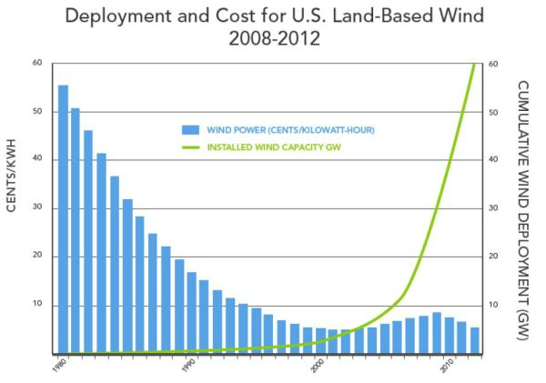
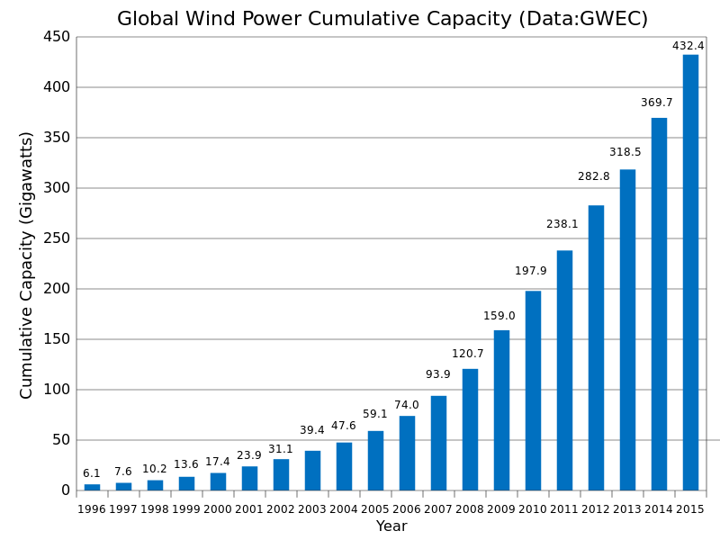
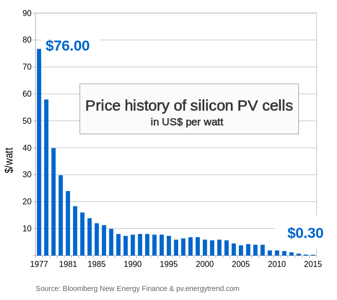
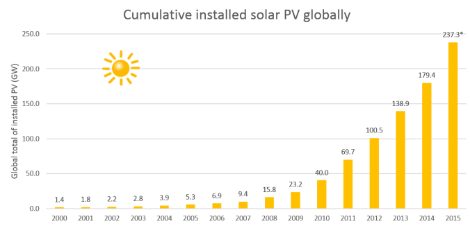

## Costs

Note: When comparing different generating technologies the unit costs below only show part of the story, for a full comparison, backup, storage, transmission and distribution costs also need to be taken into account.

### Wind Power

| Capacity  | Turbine              | Project Cost | Maintanence 20y | Cost £/kW | £/kW/y | Unit Cost @35% |
|-----------|----------------------|--------------|-----------------|-----------|--------|----------------|
| 55 kW     | [Endurance E-3120](http://www.renewablesfirst.co.uk/windpower/windpower-learning-centre/how-much-does-a-wind-turbine-cost-to-operate) | £320k | £72k | 7127 | 356 | £0.116 |
| 1 kW      | [Hugh Piggot V3](http://v3power.co.uk/wp/wp-content/uploads/2014/11/How-to-get-a-Hugh-Piggott-wind-turbine-by-V3-Power.pdf) | £4,645 | £800 | 5445 | 272 | £0.089 |
| 100kW     | [GHREPOWER](http://www.ghrepower.co.uk/100kw-wind-turbines.asp) | £285k | £90k | 3750 | 188 | £0.061 |
| 900 Kw    | [Enercon E44](http://www.communityenergyscotland.org.uk/userfiles/file/case_studies/Horshader_Rev_Gen_Case_Study.pdf) | £1.87m | £820k | 3363 | 168 | £0.055 |
| 800 kW    | [Enercon E53/48/44](http://www.renewablesfirst.co.uk/windpower/windpower-learning-centre/how-much-does-a-wind-turbine-cost-to-operate) | £1.4 million | £820k | 2775 | 139 | £0.045 |
| 1.5 MW    | [GE 1.5sle](http://www.renewablesfirst.co.uk/windpower/windpower-learning-centre/how-much-does-a-wind-turbine-cost-to-operate) | £2.7 million | £1.4m | 2733 | 137 | £0.045 |
| 900 kW    | [EWT DW61](http://www.renewablesfirst.co.uk/windpower/windpower-learning-centre/how-much-does-a-wind-turbine-cost-to-operate) | £1.4 million | £820k | 2467 | 123 | £0.040 |
| 1 kW      | [Hugh Piggot V3 (DIY)](http://v3power.co.uk/wp/wp-content/uploads/2014/11/How-to-get-a-Hugh-Piggott-wind-turbine-by-V3-Power.pdf) | £1,845 | £600 | 2445 | 122 | £0.040 |
| 2 – 3 MW | [Enercon E82](http://www.renewablesfirst.co.uk/windpower/windpower-learning-centre/how-much-does-a-wind-turbine-cost-to-operate) | £3.1 million | £2.0m | 1700 | 85 | £0.028 |

Maintanence costs are based on annual O&M cost estimates available on renewablesfirst.co.uk, with costs for turbines where this information is not available estimated at £40/kW/year.

The costs above do not include business rates, wind turbine insurance, financing or network costs which increase the final cost of the delivered electricity.

The cost of wind generated electricity has fallen significantly over the last 40 years, the following graphic on the left illustrates the extent of these cost reductions for wind power in the US with a fall of 10x from $0.55/kWh to $0.05/kWh. With these cost reductions installation rates have rocketed with over 63 GW of wind having been installed in the US between 2001 and 2015. Total global wind capacity in 2015 reached 432.4 GW.

**Wind cost reductions and capacity growth**

<table>
<tr><td style="width:50%"> Source: <a href="http://sites.psu.edu/math033fa15/2015/10/16/assignment-2-wind-turbines-final-paper">http://sites.psu.edu/math033fa15/2015/10/16/assignment-2-wind-turbines-final-paper</a></td><td> Source: <a href="https://en.wikipedia.org/wiki/Wind\_power_by_country">https://en.wikipedia.org/wiki/Wind_power_by_country</a></td></tr>
</table>

### Solar PV

| Capacity | Estimated Cost (£) | Cost £/kW      | £/kW/y  | Unit Cost @10% |
|----------|--------------------|-----------|---------|-----------|
| 1kW      | 2500-3000          | £2,750.00 | £110.00 | £0.126    |
| 2kW      | 3000-5000          | £2,000.00 | £80.00  | £0.091    |
| 3kW      | 5000-6000          | £1,833.00 | £73.32  | £0.084    |
| 4kW      | 6000-7000          | £1,625.00 | £65.00  | £0.074    |

Overview of Solar PV costs in the UK 2016:

- [http://www.theecoexperts.co.uk/how-much-do-solar-panels-cost-uk](http://www.theecoexperts.co.uk/how-much-do-solar-panels-cost-uk)
- [http://www.theecoexperts.co.uk/4-kw-solar-pv-systems](http://www.theecoexperts.co.uk/4-kw-solar-pv-systems)

Typical retail costs for the Solar PV panels themselves in the UK late 2016 is around £600/kW which is around 30% of the total installation cost estimates above:

- Navitron: [Renesolar 245W, £140.43 ex VAT](http://www.navitron.org.uk/renesola-245w-poly-virtus-ii-jc245m-24b-b-40mm)
- Wind and Sun [260 Wp REC Peak Energy module, silver frame £155.62 ex VAT](http://www.windandsun.co.uk/products/Solar-PV-Panels/REC-Solar-PV-Panels/REC-Peak-Energy-Series#.WD1VHLVKbCI)

**Solar cost reductions and capacity growth**

As in the case of wind, the cost of solar has also fallen significantly over the last 40 years.

<table>
<tr><td style="width:50%"> Source: <a href="https://commons.wikimedia.org/wiki/File:Price_history_of_silicon_PV_cells_since_1977.svg
">Wikimedia Commons</a></td><td> Source: <a href="https://charlieonenergy.wordpress.com/2015/12/07/solar-and-moores-law">https://charlieonenergy.wordpress.com/2015/12/07/solar-and-moores-law</a></td></tr>
</table>

### Anaerobic Digestion

Anaerobic digestion plants with gas turbine generators with or without heat recovery could potentially be used as a dispatchable backup supply. In ZeroCarbonBritain biogas from AD is combined with hydrogen from electrolysis via the sebatier process in order to produce more methane from a given amount of input biomass. The AD system costs below are for the direct AD plant with power generation.

| Capacity | Name         | Total Cost    | £/kW      |
|----------|--------------|---------------|-----------|
| 75kW     | Case Study 1 | £506,921.00   | £6,758.95 |
| 499kW    | Case Study 2 | £1,364,085.00 | £2,733.64 |
| 190kW    | Case Study 3 | £953,176.00   | £5,016.72 |
| 105kW    | Case Study 4 | £480,054.00   | £4,571.94 |
| 250kW    | Case Study 5 | £822,122.00   | £3,288.49 |
| 250kW    | Case Study 6 | £876,590.00   | £3,506.36 |
| 75kW     | Case Study 7 | £464,489.00   | £6,193.19 |
| 861kW    | Case Study 8 | £3,157,036.00 | £3,666.71 |

Source: [Cornwall Agri-food Council](http://www.farmingfutures.org.uk/sites/default/files/uploads/economicspresentation1.pdf)

£4000-7000/kW: [renewableenergyonfarms.co.uk AD Fact sheet](http://www.renewableenergyonfarms.co.uk/sites/rdi/files/140224_ad_fact_sheet_and_faqs_v5.pdf)

**Example gas engine** The [GE Jenbacher type 2](https://powergen.gepower.com/products/reciprocating-engines/jenbacher-type-2.html) is one example gas engine used in conjunction with biogas plants. It achieves an electrical efficiency when powered with biogas of 38.70%. The Jenbacher type 2 supports heat recovery for Combined Heat and Power with a thermal efficiency of 48.50%. Bringing the total efficiency to 87.30%. The cost of reciprocating engines are in the order of £400-600/kW [[1]](http://www.mrwmd.org/archives/2007%20Board%20Meeting/December/MRWMDDec07_8_Purchase_Of_Jenbacher_Memo.pdf) [[2]](http://www.districtenergy.org/assets/pdfs/2015-Annual-Boston/Proceedings/Tuesday/3B.1Koenig.pdf)

### Hydro

The following example hydro costings are for three exemplar community hydro schemes in North Wales, each of which included successful community share issues to raise part of the project costs. The examples also provide an insight into loan and share interest payments which increase the project cost to 150% of the project construction cost alone. The operational cost also include costs such as land lease payments and other administration costs in addition to the strict O&M costs.

|                  |  Ynni Padarn Peris | Ynni Ogwen   | Anafon Hydro  |
|-----------------------|---------------|--------------|---------------|
| Capacity              | 55kW          | 100kW        | 271KW         |
| Annual generation     | 182 MWh (38%) | 500 MWh      | 957 MWh       |
| Construction Cost     | £246,126      | £476,499     | £1,100,000    |
| Operational Cost      | £279/kW/y     | £199/kW/y    | £100/kW/y *   |
| Lifespan              | 40-100 years  | 40-100 years | 40-100 years  |
| Cost £/kW             | £4,475        | £4,765       | £4,059        |
| Paid unit price       | 27.4 p/kWh    | 13.4 p/kWh   | 20.96 p/kWh * |
| Cost unit price 40y (@ 0% interest)   | 13.3 (11.6)   | 7.5 (6.4)    |               |
| Cost unit price 100y (@ 0% interest)  | 10.3 (9.6)    | 5.4 (5.0)    |               |
|                       |               |              |               |
| 20 Year Profit & Loss |               |              |               |
| Gross revenue         | £997,690      | £1,548,130   | £4,011,744 *  |
| Operational Costs     | £306,945      | £398,785     | £540,000      |
| Depreciation          | £246,126      | £476,499     | £1,100,000    |
| Loan interest         | £69,165       | £156,410     | -             |
| Shareholder interest  | £52,270       | £68,459      | -             |
| Bank interest         | £0            | £250         | -             |
| Capital grant         | £0            | £10,000      | -             |
| Net Profit            | £323,185      | £457,726     | -             |

It is worth noting that the operational cost sets a lower bound on the unit cost over the longer term periods. For 40 years the operational cost of the Ynni Padarn Peris hydro is 2.5x the construction cost, over 100 years the operational cost is 6.2x the construction cost. For Ynni Padarn Peris the operational cost is 1.7x at 40 years and 4.2x at 100 years. We can see that even if the original construction cost is covered with a 0% interest loan the longer term lower bound on the unit price is not affected that much (10.3p/kWh vs 9.6p/kWh, 5.4p/kWh vs 5.0p/kWh).

Sources:

- [Ynni Padarn Peris share offer](http://ynnipadarnperis.org/wp-content/uploads/2016/02/Share-Offer-Saesneg-low-res.pdf)
- [Ynni Ogwen share offer](http://www.ynniogwen.cymru/wp-content/uploads/2016/01/2016_02_23.Portffolio-saesneg-terfynnol-terfynnol.pdf)
- [Anafon Hydro](http://anafonhydro.co.uk/)
- Anafon Hydro unit price, 171.78 MWh is worth £36,000 equivalent to 20.96 p/kWh
- Anafon Hydro O&M costs based on figures by renewablesfirst.co.uk of £25k/year for 250 kW

### Wood pellets

- Wood pellets: 4.5 p/kWh to 5 p/kWh
- Wood chips: 3.4 to 3.7 p/kWh

Source: [What is the price of biomass fuel such as pellets or wood chip?](http://info.cat.org.uk/questions/biomass/what-price-biomass-fuel-such-pellets-or-wood-chip)

Source: [Forest Fuels](http://www.forestfuels.co.uk/about-wood-fuel/fuel-price-comparisons)

### CCGT cost

The capital cost of CCGT power plants is around £500-700/kW.

[http://www.timera-energy.com/the-uk-ccgt-new-build-challenge/](http://www.timera-energy.com/the-uk-ccgt-new-build-challenge/)

### A simple model of the additional costs of grid electricity

The analysis above has so far focused on the cost of generating electricity but the cost of purchasing electricity from the grid via an electricity supplier is higher than this as further costs are incurred. A typical electricity bill breaks down as following:

Typical cost £476 for 3100 kWh [[REF]](uk-energy-2015)

| | % | Cost | Unit Cost |
| --- | --- | --- | --- |
| Wholesale cost | 32% | £152 | 4.9 p/kWh |
| Operational cost | 16% | £76 | 2.5 p/kWh |
| Environmental and social policy costs | 20% | £95 | 3.1 p/kWh |
| Network costs | 27% | £129 | 4.1 p/kWh |
| VAT | 5% | £24 | 0.8 p/kWh |
| **Total** | | **£476** | **15.4 p/kWh** |

Source: [Energy UK, Energy bill breakdown 2016-2017](http://www.energy-uk.org.uk/customers/about-your-energy-bill/the-breakdown-of-an-energy-bill.html)

We can see that even if the wholesale cost is 4.9 p/kWh, the cost of the electricity to the customer is three times this cost. Some of the Environmental and social policy costs are subsidies for renewable power generation and so we could re-allocate these to the wholesale cost in order to get a more accurate average cost of generation.

Environmental and social policy costs break down roughly as 57% CERT and CESP, 22% ROCs, 3% FIT’s, 10% warm home discount. Although 22% for ROC’s out of £95 = £21 does not add up to the estimate based on current ROC of 0.29 or £41.15. This could reflect recent changes in policy and the increase in renewable obligation year on year.

Assuming that half of the environmental and social policy costs are subsidies for generation and including this in the wholesale cost would increase the wholesale cost to 6.5 p/kWh.

Network cost reflect the cost of operating and maintaining our transmission and distribution networks. These costs cover the costs of the transmission network via the National Grid and the local DNO’s.
An estimate of the unit cost of the national grid is calculated [here](https://en.wikipedia.org/wiki/National_Grid_(Great_Britain)) as between 0.2-0.71 p/kWh, which suggests that most of the network charge is for the DNO.

The operational cost depends to a degree on the efficiency of the operations of the energy supplier, this operational cost includes the suppliers profit.

The network cost is to a degree going to reflect the requirements on the network if larger network capacities are needed to deal with large renewable energy generation capacities this part of the cost could increase. 

We could make a rough cost model based on 6.5 p/kWh wholesale, 4.1 p/kWh network, 1.6p/kWh efficiency & social obligation, 2.5 p/kWh operational costs and 0.8p/kWh VAT. Here the final cost of electricity will add 9 p/kWh to whatever the wholesale cost of electricity is.

### A worked example calculation of final cost of zero carbon electricity

The following example is a rough attempt at calculating a cost for zero carbon electricity from renewable sources using many of the costs as outlined above.

The Enercon E82 is used for the wind cost at £1033/kW and an O&M cost of £33/kW/year. Assuming perhaps generous low interest finance at 2.5% (simple interest) over 20 years. The actual cost is £1313/kW. Multiplied by 1.5 kW per household is £1970.

For Solar a low domestic installation cost of £1625/kW is assumed, again paid for with low interest finance at 2.5% over 20 years. The actual cost is £2066/kW. Multiplied by 1.5 kW per household is £3099. Solar PV is likely to last at least 30 years, a maintanence cost of £20/kW/y is included to cover inverter maintanence. Large scale solar is likely much cheaper than this as recent Contracts For Difference auctions have resulted in MWh prices that are similar to Onshore wind.

The CCGT cost is assumed to be £600/kW, paid for with low interest finance at 2.5% over 20 years. The actual cost is £763/kW. Multiplied by 1.6 kW per household is £1221. Maintance costs are assumed to be £40/kW/year and plant lifetime 35 years.

Bulk refined biomethane costs of £0.03/kWh are assumed - to be refined.

The onshore wind, solar and CCGT backup capacities used here are based on the results of the 10 year hourly zero carbon energy model providing 100% of demand from the zero carbon energy sources listed.

|                             | Capacity |       | kWh/d | Capital cost | / year | O&M/year |
|-----------------------------|----------|-------|-------|--------------|--------|----------|
| Onshore wind                | 1.5      | kW    | 10.9  | £1,970       | £99    | £50      |
| Solar PV                    | 1.5      | kW    | 3.2   | £3,467       | £116   | £30      |
| CCGT                        | 1.6      | kW    | 3.1   | £1,441       | £41    | £64      |
| Biomass                     |          |       | 10.4  |              |        | £114     |
| Biomass unit cost           | 0.03     | £/kWh |       |              |        |          |
| Network cost                |          |       |       |              |        | £129     |
| Supplier operational cost   |          |       |       |              |        | £76      |
| Efficiency & Social costs   |          |       |       |              |        | £48      |
|                             |          |       |       |              |        |          |
| Total annual capital cost   | £255     |       |       |              |        |          |
| Total annual O&M            | £510     |       |       |              |        |          |
| Total annual cost ex VAT    | £766     |       |       |              |        |          |
| Total annual cost inc VAT   | £804     |       |       |              |        |          |
|                             |          |       |       |              |        |          |
| Supplied electric           | 14.5     | kWh/d |       |              |        |          |
| Final unit cost of electric | £0.152   | /kWh  |       |              |        |          |

The resultant unit cost compares very well with current electricity prices. Key to achieving this price is being able to both source low interest long term finance and to run the generating facilities at near cost. This could perhaps be achieved if owenership of the wind and CCGT backup are vertically integrated as part of the energy supplier. The operational cost, maintance, interest payments of the generating facilities are covered and the supplier still makes a profit as part of their operational cost.

The following worked examples show how the final electricity cost changes at different rates of interest and generator profit:

- **0.0% interest:** £0.138 p/kWh.
- **2.5% interest:** £0.152 p/kWh.
- **5.0% interest:** £0.168 p/kWh.
- **8.0% interest:** £0.191 p/kWh.

Including a generator profit:

- **2.5% interest + 10% profit:** £0.160 p/kWh.
- **5.0% interest + 10% profit:** £0.178 p/kWh.
- **2.5% interest + 20% profit:** £0.168 p/kWh.
- **5.0% interest + 20% profit:** £0.187 p/kWh.

We can also put different supply scenarios through the same cost estimator:

**Reference scenario above**

- 1.5kW onshore wind + 1.5kW solar + 10.4 kWh/d biomass: 15.2p/kWh

**Onshore wind + backup biomass**

- 1.5kW onshore wind + 16.6 kWh/d biomass	13.6p/kWh
- 2.0kW onshore wind + 11.7 kWh/d biomass	13.6p/kWh

**Solar PV only + backup biomass**

If the solar price used here was based on what is possible at scale it is likely that the cost would be lower given that large scale solar and onshore wind can generate energy at a similar cost per MWh

- 7kW of solar + 23.1 kWh/d biomass (20.2% landarea): 26 p/kWh 
- 4kW of solar + 2kWh lithium ion + 25.9 kWh/d biomass: 23 p/kWh 
- 4kW of solar + 27.8 kWh/d biomass (24.3% landarea): 21 p/kWh 
- 0kW of solar + 50.7 kWh/d biomass (50.7% landarea): 19 p/kWh

Souce £/MWh different technologies: [“Cheap and clean” – new BEIS report confirms that renewable energy will be cheaper than fossil fuels](https://www.regensw.co.uk/news/cheap-and-clean-new-beis-report-confirms-that-renewable-energy-will-be-cheaper-than-fossils-fuels-10-november-2016)
