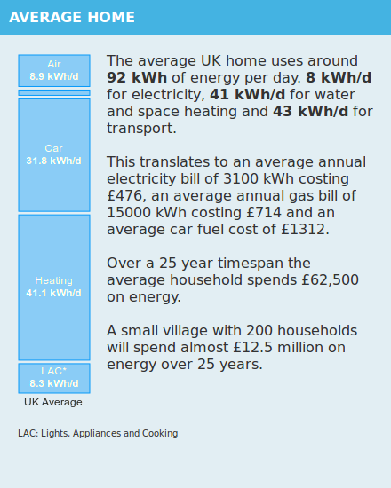
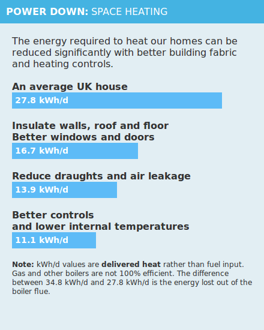
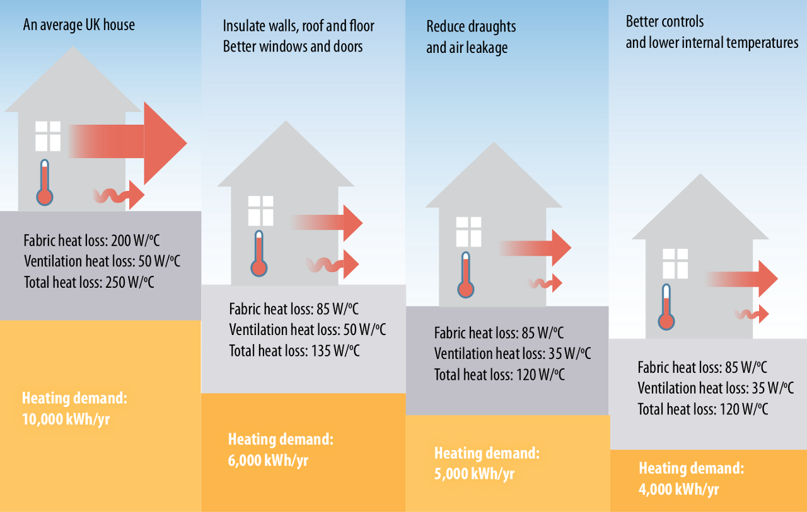
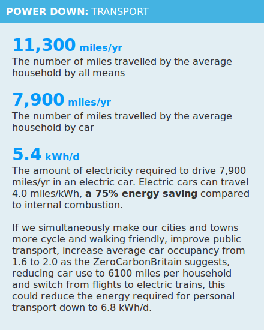

### Energy Introduction: Reference guide

<table>
<tr><td style="width:350px" valign=top>

</td><td valign=top>This section provides a summary of average household energy consumption in the UK today using the latest data available from 2015.  

The main dataset used is published by the UK government as part of UK energy statistics, in particular the ECUK_Tables_2016.xlsx spreadsheet.
  The full detail of how this summary is compiled can be found here:
<a href="EnergyOverviewCalculation.md">Energy Overview Calculation.</a>
</td></tr></table>

<table>
<tr><td style="width:350px" valign=top>

</td><td valign=top>
This section is just a summary of the application of measures as discussed in detail in the sections below.
</td></tr></table>

<table>
<tr><td style="width:350px" valign=top>

</td><td valign=top>
This section applies the main building fabric measures as outlined in ZeroCarbonBritain to the space heating demand as calculated for 2015.  
The fuel energy consumption for space heating in 2015 was 34.8 kWh/d. The average boiler efficiency in 2012 was 80% (ECUK_Tables_2016:Table 3.2) resulting in 27.8 kWh/d of delivered heat.
  
<b>Applying ZCB retrofit measures (page 42-43)
</b>  

<i>ZeroCarbonBritain: Figure 3.7, page 43.</i>
  
40% energy saving: Insulation of walls, roofs and floors, better windows and doors:  27.8 kWh/d x 0.6 = 16.7 kWh/d.
  
50% energy saving: Insulation of walls, roofs and floors, better windows and doors + reduction of draughts and air leakage 27.8 kWh/d x 0.5 = 13.9 kWh/d.
  
60% energy saving: Insulation of walls, roofs and floors, better windows and doors + reduction of draughts and air leakage + better controls and lower internal temperature 27.8 kWh/d x 0.4 = 11.1 kWh/d.
  
A space heating demand of 11.1 kWh/d is equivalent to a space heating energy performance of 53 kWh/m2/year, 60% less than the average uk household today but still twice the level of what is possible using state-of-the-art passivhaus techniques for the retrofit of buildings (25 kWh/m2/year) and over three and a half times the level achievable in new build (15 kWh/m2/year).

</td></tr></table>

<table>
<tr><td style="width:350px">

</td><td valign=top>
Heat pumps are used to provide the bulk of space and water heating demand in ZeroCarbonBritain as they provide an effective way of using renewable, primarily wind electricity for heating.  
</td></tr></table>

<table>
<tr><td style="width:350px">

</td><td valign=top>
This section uses mileage figures from the Department for Transports National Travel Survey data, nts0410.
  
The number of miles traveled by the average household by car is in vehicle miles rather than passenger miles so that the energy consumption of switching vehicle technology can be easily calculated.
  
7900 miles divided by 4 miles/kWh = 1975 kWh or 5.4 kWh/d.
  
The average vehicle efficiency in the UK is 30 mpg or 0.68 miles/kWh. An electric car provides an energy saving of 83% compared to the average. A newer 50 mpg petrol car travels 1.13 miles/kWh, an EV would provide a 72% saving in this case.
</td></tr></table>
