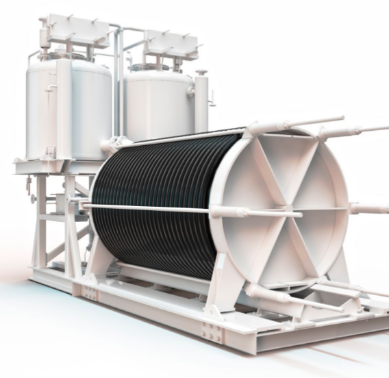
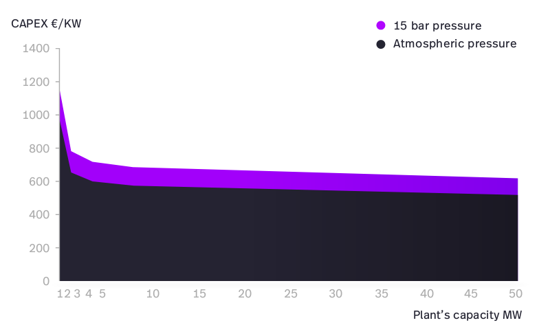
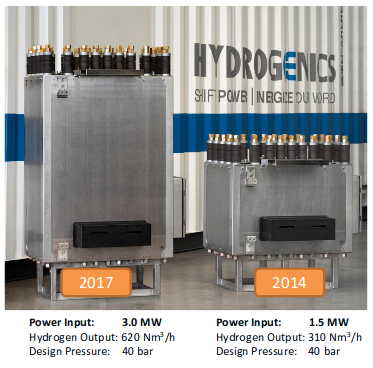
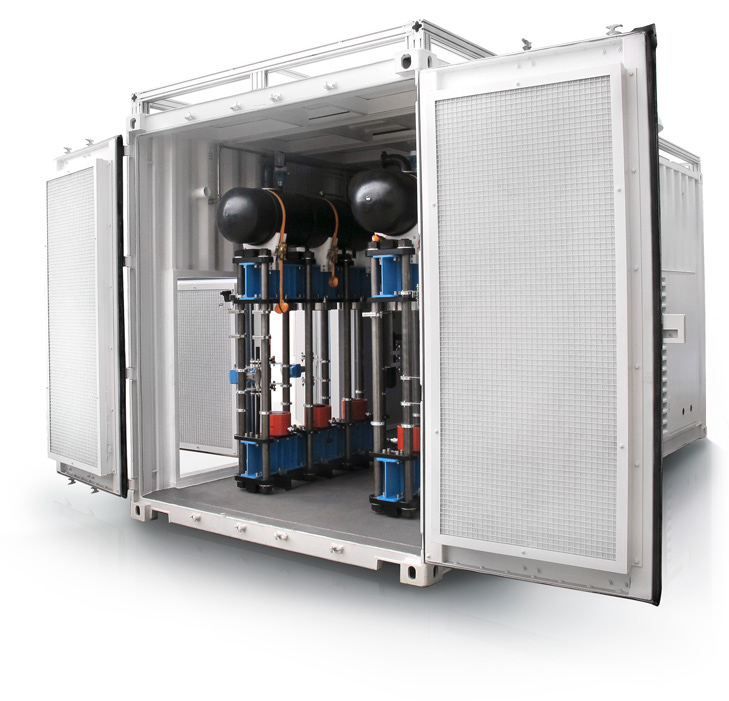

## Hydrogen Electrolysis

Review of commercial electrolyser efficiency and cost.

### Nel Hydrogen

<table><tr>
<td style="width:65%">

Nel Hydrogen of Norway, founded in 1927, state having the world's most efficient and reliable electrolyser: <a href="https://nelhydrogen.com/product/atmospheric-alkaline-electrolyser-a-series">https://nelhydrogen.com/product/atmospheric-alkaline-electrolyser-a-series</a>

Electrolyser DC power consumption: 3.8 - 4.4 kWh/Nm3

<pre>
Nm3 = Normal cubic meter - Temperature 0C, Pressure 1 atm

Using the ideal gas law: PV = nRT
n = (101,325pa x 1m3) / (8.314 x 273.15K) = 44.618 mol

Hydrogen has a molar mass of: 2.01588 g-mol-1
1 Nm3 of H2 is therefore 44.618 mol x 2.01588 g-mol-1 = 89.945g

Hydrogen higher heating value 286 kj/mol
converted to kWh = 39.4 kWh/kg HHV

1 Nm3 of H2 has therefore an energy content of 3.544 kWh

3.544 / 3.8 kWh/Nm3 = 93.3% efficient
3.544 / 4.4 kWh/Nm3 = 80.5% efficient
</pre>

<ul>
<li>Molar mass: <a href="https://www.webqc.org/mmcalc.php">https://www.webqc.org/mmcalc.php</a></li>
<li>HHV: <a href="https://en.wikipedia.org/wiki/Heat_of_combustion">https://en.wikipedia.org/wiki/Heat_of_combustion</a></li>
</ul>

Inferring from the following cost graphic, their electrolyser cost at scale (50MW) approaches ~520 €/kW (atmospheric pressure) or ~610 €/kW (15 bar).

</td>
<td>

</td>
</tr></table>

### Hydrogenics

<table><tr>
<td style="width:65%">

A specialist in PEM and alkaline electrolysers, fuel cells for vehicles & stationary applications, and power-to-gas.

All figures below from: 
<a href="http://europeanpowertogas.com/wp-content/uploads/2018/06/20180619\_Hydrogenics_EU-P2G-Platform_for-distribution.pdf">http://europeanpowertogas.com/wp-content/uploads/2018/06/20180619_Hydrogenics_EU-P2G-Platform_for-distribution.pdf</a>

<pre>
PEM Cell Hydrogen Output: 620 Nm3/h x 3.544 kWh/Nm3
2197 kW / 3000 kW = 73.2% efficient

Alkaline HySTAT-100-10: 100 Nm3/h x 3.544 kWh/Nm3
354.4 kW / 500 kW = 70.9% efficient
</pre>

Presentation quotes efficiencies as high as 89.5% (39.4/44) for PEM electrolyser by 2020 and 82.1% (39.4/48) for alkaline electrolyser by 2025. With central efficiencies of 83.8% (39.4/47) and 78.8% (39.4/50) respectively. <i>(Source: FCH-JU, Development of Water Electrolysis in the European Union, February 2014)</i>

Electrolyser efficiency increases with higher current density and average cell voltage.

Stack efficiency of 3MW HyLYZER 600 is 80% HHV @ 2MW, 78% HHV at 2.5MW and 75% HHV at 3.0MW, see <a href="http://www.hydrogenics.com/wp-content/uploads/HyLYZER_600_3MW.pdf?hsCtaTracking=e7822d8a-95ad-4406-b5e3-5d70b0816a80%7C09704de4-2fdf-48b3-8248-9ddd2bfbd34e">3MW HyLYZER 600 Brochure</a>

Costs (Development of Water Electrolysis in the European Union, February 2014):

<ul>
<li>2030 PEM Central cost estimate: 760 €/kW (250-1270)</li>
<li>2030 Alkaline Central cost estimate: 580 €/kW (370-800)</li>
</ul>

Costs (Power-to-Gas Roadmap for Flanders):

<ul>
<li>2030 multi-MW PEM cost estimate: 700 €/kW, opex 32 €/kW, 50,000h lifetime</li>
<li>2050 multi-MW PEM cost estimate: 385 €/kW, opex 28 €/kW, 60,000h lifetime</li>
</ul>

Cell stack replacement costs are expected to fall to less than 300 €/kW by 2030 and less than 200 €/kW by 2050.

Alkaline @ 20MW scale in 2025: 
<i>FCH-JU, Early business cases for H2 in energy storage and more broadly power to H2 applications, June 2017</i> 
<ul>
<li>Efficiency: 80.4% efficient</li>
<li>CAPEX System: 480 €/kW</li>
<li>OPEX: 10 €/kW</li>
<li>CAPEX Replacement 216 €/kW</li>
<li>lifetime 90,000h</li>
</ul>

</td>
<td>

</td>
</tr></table>

### ITM Power

<table><tr>
<td style="width:65%">

The hydrogen production rate (40,000kg) and system power (100MW) on the ITM Power HGAS product page suggests an efficiency of 66% for their PEM electrolyser. However their technology updates suggest higher efficiency at >77%.

<a href="http://www.itm-power.com/news-item/technology-update-performance-and-efficiency-improvements">16th July 2013: Technology Update: Performance and Efficiency improvements (more than 77% efficiency)</a>

<a href="https://www.itm-power.com/wp-content/uploads/2016/01/ITM_Impact_Report_2015web.pdf">ITM Impact Report 2015 (Stack efficiency 84%, 2015)</a>

<a href="http://www.itm-power.com/news-item/thuga-group-power-to-gas-technology-performance-update">13th June 2016: Thüga Group: Power-to-Gas technology performance update (over 70% efficiency)</a>

Cost projection to 2024 suggests less than 500 €/kW at 100MW scale <a href="https://www.itm-power.com/wp-content/uploads/2019/02/Interim-Results-presentation.pdf">Interim Results January 2019</a>

</td>
<td>

</td>
</tr></table>  
