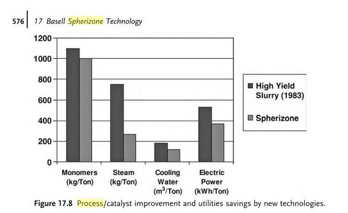
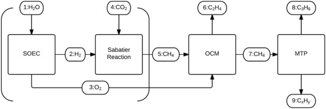

<b>Draft:</b> This piece is part of a new series on zero carbon industrial processes and is currently an initial draft.

## Plastics

A quick search for the embodied energy of plastics suggests a typical embodied energy of 22 kWh per kg of plastic, around 4x the embodied energy per kg of steel or half that of aluminium with 33% recycled content.

Its important to note that the embodied energy of plastics typically include the energy embodied in the feedstock itself in addition to the process energy required to make plastic. Other materials such as steel and aluminium are not made up of an original feedstock that contain energy in the same way.

    PVC (General) 77.2 MJ/kg, 2.41 kgCO2/kg 21.4 kWh/kg 

[https://en.wikipedia.org/wiki/Embodied_energy](https://en.wikipedia.org/wiki/Embodied_energy)

    Plastics — general 90.0  MJ/kg				  25 kWh/kg
    PVC (polyvinyl chloride) 80.0  MJ/kg    22 kWh/kg
    
[http://www.yourhome.gov.au/materials/embodied-energy](http://www.yourhome.gov.au/materials/embodied-energy)

    Polypropylene: 23 + 46 = 69 MJ/kg       19 kWh/kg
    
[http://www.coengineers.com/embodied-energy-polypropylene-vs-copper](http://www.coengineers.com/embodied-energy-polypropylene-vs-copper/)

    Plastics (from crude oil): 62-108MJ/kg  17.2 – 30.0 kWh/kg

[http://www.lowtechmagazine.com/what-is-the-embodied-energy-of-materials.html](http://www.lowtechmagazine.com/what-is-the-embodied-energy-of-materials.html)

    Primary polyethylene PE 		            77 MJ/kg		21.4 kWh/kg
    Primary polypropylene 			            80 MJ/kg		22 kWh/kg
    Primary PVC 				                    80 MJ/kg		22 kWh/kg

[http://www.tectonica-online.com/topics/energy/embodied-energy-materials-enrique-azpilicueta/table/31](http://www.tectonica-online.com/topics/energy/embodied-energy-materials-enrique-azpilicueta/table/31)

The production of plastics such as polyethelene and polypropylene which make up the bulk of plastic production, is divided into four main steps:

1. Extraction and refining, production of naptha
2. The production of olefins: ethane and propylene from conventional and heavy feedstocks by steam cracking.
3. Polymerization, e.g: conversion of propylene to polypropylene
4. Extrusion, Injection moulding, product manufacturing

### Extraction and refining, production of naptha

A certain amount of energy is required to extract and refine oil and gas to produce naptha ready for olefin production.

In an industry report by the UK oil and gas sector [1], exploration, production and transport carbon emissions is said to make up between 9 and 16% of total life cycle emissions (US data), 22,000 tonnes per million barrels of oil equivalent, 3% of total UK emissions (UK data).

The carbon emissions of burning the products of a barrel of oil is roughly ~317kg CO2 [2], We can therefore estimate that the equivalent of 70,000 barrels of oil where used to produce 22,000 tonnes of carbon emissions, or 7% of 1 million barrels.

Another paper From Ground to Gate: A lifecycle assessment of petroleum processing activities in the United Kingdom [3] suggests that in terms of carbon emissions petrol generates ~83.6 gC02 per MJ of which combustion accounts for 67.2 gCO2 per MJ, suggesting an overall efficiency of 80%. Results for naphtha appear to be similar.

The LHV of naphtha is approximately 44 GJ/t. = 12.2 kWh/kg.

This suggests that an other 3.1 kWh/kg are used during extraction, transport and refining. Bringing the total embodied energy at this point to 15.3 kWh/kg.

### Steam cracking, olefin production

“Steam cracking for the production of light olefins, such as ethylene and propylene, is the single most energy-consuming process in the chemical industry” - “Energy cost counts for approximately 70% of production costs in typical ethane- or naphtha-based olefin plants” [4]

In the paper “Olefins from conventional and heavy feedstocks: Energy use in steam cracking and alternative processes” [4]. Process energy consumption for olefin production of 17 GJ/t is given, this works out to being 4.7 kWh/kg which is about 20% of the embodied energy figures given above.

The paper provides figures in primary energy, assuming an electricity efficiency of 40% and steam efficiency of 80%, however it is hard to work out from the paper how much energy input there is from electricity or steam.

The paper also quotes a figure from US Department of Energy putting global process energy used in ethylene production at 2.6 EJ when the global ethylene production was 93 Mt in 2000. This works out to being 7.8 kWh/kg.

Adding the feedstock energy of 12.2 kWh/kg and the extraction and refining energy of 3.1 kWh/kg to both of our steam cracking process stage figures brings out total embodied energy to between 20 kWh/kg and 23.1 kWh/kg not far off the embodied energy figures from our google search.

### Spherizone Polymerization

The following chart from the book “Sustainable Industrial Chemistry: Principles, Tools and Industrial Examples” - [5, page 576] provides an indication of the process energy consumption of the polymerization process. In particular the Spherizone process which is one of the more efficient polymerization processes used in the production of polypropylene.

The Spherizone process uses high yield/high selectivity catalysts. It is a modular technology consisting of: Catalyst feeding, MZCR Polymerization, Gas-phase polymerization and a finishing section [2].

The direct electrical power requirement is ~380 kWh per ton or 0.38 kWh/kg.

The process also requires about 250 kg/ton of steam for which we can estimate the energy requirement based on first heating water from 10C up to 100C and then evaporating the water.

The specific heat of water is 4.187 kJ/kg/K, The latent heat of evaporation: 2257 kj/kg.

    Raising water from 10C to 100C = 4.187 x 90 = 376.83 kJ/kg
    Evaporation for steam 2257 kj/kg
    Total energy = 2633.83 kj/kg = 0.73 kWh/kg of steam
    250 kg/ton of polymer = 182.5 kWh of steam per ton = 0.1825 kWh/kg

Adding the energy requirement for steam to other electrical we arrive at an energy consumption in the order of ~0.56 kWh/kg. There is likely an energy requirement associated with the cooling water provision, but its unclear from the information available what the temperature of the cooling water might be and whether the electric power requirement includes energy for cooling. 

The process also uses hydrogen to control molecular weight, it is unclear what the quantity of this hydrogen demand is, apart from a suggestion that it may be in relatively low concentrations.

Adding the feedstock energy, steam cracking energy and polymerisation energy together we arrive at an embodied energy of between 20.6 kWh/kg and 23.7 kWh/kg.

### Biomass plastics

One alternative to fossil fuel based plastic is production from biomass feedstock. Land for biomass is however a scarce resource and any increase in use of land for plastic production is likely to be in competition with growing food, biomass for energy backup and land for biodiversity. Given that land use for agriculture is already the leading cause of biodiversity loss globally. 

In terms of embodied energy the following figure from the paper on electricity based plastic production may be indicative:

Replacing the fossil feedstock for the current global demand for platform chemicals, that mainly form plastics (275 Mton), is estimated to require between 17 and 40 EJ of biomass (Cherubini and Strømman, 2011) [6]

    17 EJ for 275 Mton = 17.2 kWh/kg
    40 EJ for 275 Mton = 40.4 kWh/kg

### Electricity based plastic production

An alternative to biomass plastic production is to use excess renewable electricity to produce methane which can then be used to produce plastics. This approach is proposed in a paper by Ellen Palm, Lars J. Nilsson, Max Åhman, titled Electricity-based plastics and their potential demand for electricity and carbon dioxide [6].

The theoretical resource for renewable electricity is less constrained than the biomass  resource and in particular due to renewable variable output it is useful to have demands that are flexible that can soak up peak outputs in renewable supply when they exceed typical demand.

The production of methane with renewable electricity is a process covered before due to its usefulness in providing inter-seasonal, long term backup for periods of low wind and solar output. 

The Electricity-based plastics paper proposed that methane is produced via a combined solid oxide electrolysis cell (SOEC) and Sabatier reactor. Heat from the sabatier reactor is utilised by the SOEC cell. 

The paper suggests that electricity required to create methane from water and carbon dioxide, including SOEC and Sabatier reaction can be expected to be 12 kWh/Nm3 methane by 2050. A decrease of between 2-6 kWh/Nm3 compared to today.

The density of methane at 1 atm and 0C is 0.718kg/m3 we can therefore calculate the electricity consumption to produce a kg of methane as 12 kWh/Nm3 divided by 0.718 kg/m3 which works out to 16.71 kWh/kg of methane.

The paper then goes on to describe a process called oxidative coupling of methane (OCM) for the production of ethylene and another process called methanol to propylene (MTP) for the production of propylene. The full series of processes are outlined in the following diagram:

Ethylene production via OCM uses methane and oxygen produced from the SOEC cell and sabatier reactor. The OCM-process consists of three stages: reactor, CO2 removal and C2-separation. The electricity consumption of OCM step is relatively low at 0.04 kWh/kg ethylene.

The molecular masses of the ethylene production chemical reaction formula suggests that 28g or ethylene is produced for every 32g of methane.

    32g of methane + 32g oxygen = 28g of ethylene + 36g water

We can therefore estimate the energy required to produce a kg of ethylene as the energy required to produce a kg of methane 16.71 Kwh/kg divided by the fraction of the mass of ethylene produced per mass of methane (28/32) which works out to being 19.1 kWh/kg of ethylene. The small 0.04 kWh/kg process electricity consumption for this step does not add much making the total 19.14 kWh/kg. 

The figures provided in the paper for Mton of ethylene produced per Mton of methane suggest a slightly less efficient yield, which increases the electricity consumption for the production of ethylene to 20 kWh/kg.

The production of propylene via the renewable electricity route is currently significantly more energy intensive due to the methane to methanol step involving steam reforming. This step consumes 8.3 kWh per kg of methanol and only 55% of methanol results in propylene. The paper quotes the total electricity required to produce a kg of propylene from methane as 19 kWh/kg of propylene. Adding this to the energy required to make the methane results in a total electricity consumption of 38 kWh/kg of propylene, almost twice that of ethylene. These figures suggest that the ration between propylene mass and methane mass is similar to the ethylene case in that 1kg of methane should produce in the order of 0.875 kg of propylene for the total energy consumption to work out to 38 kWh/kg. The propylene process is more complex with less detail in the paper for the reactions present.

The following article gives an outline for a proposed methane to propylene plant using a similar set of technologies currently under consideration:
[https://rbnenergy.com/got-my-mtp-working-making-propylene-from-natural-gas](https://rbnenergy.com/got-my-mtp-working-making-propylene-from-natural-gas)

The paper does not consider the energy consumption required to obtain the carbon dioxide feedstock for methane production. These may either be available as a high concentration waste stream perhaps from backup gas turbines running on renewable methane with a CO2 storage stage for utilisation at times of excess renewable supply, or from biomass anaerobic digestion or perhaps from air-capture.

We explored briefly the idea of air capture in the section on methane production using the sabatier process. Direct-air-capture has an energy cost associated with it, one of the more successful processes developed by Climeworks requires 2.5 kWh of 100C heat and 0.5 kWh of electricity for every kg of carbon dioxide captured.

The sabatier reaction suggests a requirement for 2.743 kg of carbon dioxide for every kg of methane produced and so a kg of methane requires 6.9 kWh of heat and 1.4 kWh of electric for carbon dioxide provision a total of 8.23 kWh/kg of methane, adding this to the 16.71 kWh of electricity for the hydrogen production and sabatier step results in 24.94 kWh/kg of methane. 

Which then increases the energy required to make ethylene from 20 kWh/kg to 28.54 kWh/kg and from 38 kWh/kg to 47.5 kWh/kg for propylene. Most of the energy required for the air-capture of CO2 is relatively low temperature heat and therefore it may be possible to use waste heat from part of the plastic production process for this air-capture of CO2 but this is only speculative.

Climeworks also hope to reduce their co2 capture energy consumption by 40% which would reduce energy consumption to 24.78 kWh/kg and 43.74 kWh/kg respectively.

The high process energy associated with the production of propylene from methane may be significantly reduced in future by direct methane to methanol conversion technologies such as this recent (September 2017) lab stage breakthrough: https://www.cardiff.ac.uk/news/view/922837-scientists-make-methanol-using-air-around-us

### Other process energy consumption

    Extrusion: 200 kWh/ton = 0.2 kWh/kg [4]

### Plastic Recycling

Plastic recycling is a complex topic in and of itself, with a large number of different processes available for different plastic types. The paper “Recent Advances in the Chemical Recycling of Polymers “ by Dimitris S. Achilias et al.* provides an overview of the different techniques: http://cdn.intechopen.com/pdfs/32560.pdf

Plastic recycling approaches can be broadly described by the following routes:

1. Zero-order recycling e.g: plastic bottle refill 

2. Primary recycling: refers to recycling of scrap material of controlled history, recycling of clean uncontaminated single-type waste.

3. Mechanical recycling (or secondary recycling). Polymer is separated from its associated contaminants, reprocessed into granules by conventional melt extrusion - There is deterioration of product properties in each cycle, due to reduction in molecular weight caused by chain scission reactions caused by the presence of water and trace acidic impurities.

4. Chemical or feedstock recycling (tertiary recycling). Depolymerization.

5. Energy recovery – health risks from air born toxic substances e.g dioxins

Examples of energy use in plastic recycling:

Assuming a relatively uncontaminated stream of waste plastic, basic fragmentation and re-extrusion can be relatively low energy:

    Recycling cleaning, fragmentation:		200 kWh/ton = 0.2 kWh/kg [4]
    Extrusion: 						                200 kWh/ton = 0.2 kWh/kg [4]

However this is limited to uncontaminated plastics as contamination leads to loss of polymer properties with each cycle.

De-polymerization of PET plastic is possible with a variety of processes, energy consumption of two of these processes where found as:

    Hydrolytic processes: 				20-30MJ/kg (5.6 – 8.3 kWh/kg)
    Methanolysis: 					      40-60MJ/kg (11 - 17 kWh/kg)
from Feedstock Recycling of Plastic Wastes - By Jose Aguado, David P Serrano

Suggesting similar or even greater energy consumption compared to production from virgin fossil feedstocks but perhaps less than production using renewable electricity?

Polymers such as polyethylene and polypropylene cannot be degraded with simple chemicals to their monomers, for these the two main chemical recycling routes are thermal and catalytic degradation, it is unclear what the energy consumption of these processes are from my initial research, further research required.

### References

[1] [https://oilandgasuk.co.uk/wp-content/uploads/2016/11/Environment-Report-2016-Oil-Gas-UK.pdf](https://oilandgasuk.co.uk/wp-content/uploads/2016/11/Environment-Report-2016-Oil-Gas-UK.pdf)

[2] [http://numero57.net/2008/03/20/carbon-dioxide-emissions-per-barrel-of-crude](http://numero57.net/2008/03/20/carbon-dioxide-emissions-per-barrel-of-crude/)

[3] [https://daim.idi.ntnu.no/masteroppgaver/007/7614/masteroppgave.pdf](https://daim.idi.ntnu.no/masteroppgaver/007/7614/masteroppgave.pdf)

[4] [https://www.researchgate.net/profile/Kornelis_Blok/publication/222578401_Olefins_from_conventional_and_heavy_feedstocks_Energy_use_in_steam_cracking_and_alternative_processes/links/59df5eb7aca27258f7d782d9/Olefins-from-conventional-and-heavy-feedstocks-Energy-use-in-steam-cracking-and-alternative-processes.pdf](https://www.researchgate.net/profile/Kornelis_Blok/publication/222578401_Olefins_from_conventional_and_heavy_feedstocks_Energy_use_in_steam_cracking_and_alternative_processes/links/59df5eb7aca27258f7d782d9/Olefins-from-conventional-and-heavy-feedstocks-Energy-use-in-steam-cracking-and-alternative-processes.pdf)

[5] [https://books.google.co.uk/books?id=McAEM7o9pU0C&lpg=PA576&dq=spherizone%20process%20environmental&pg=PA576#v=onepage&q=spherizone%20process%20environmental&f=false](https://books.google.co.uk/books?id=McAEM7o9pU0C&lpg=PA576&dq=spherizone%20process%20environmental&pg=PA576#v=onepage&q=spherizone%20process%20environmental&f=false)

[6] Electricity-based plastics and their potential demand for electricity and carbon dioxide.

