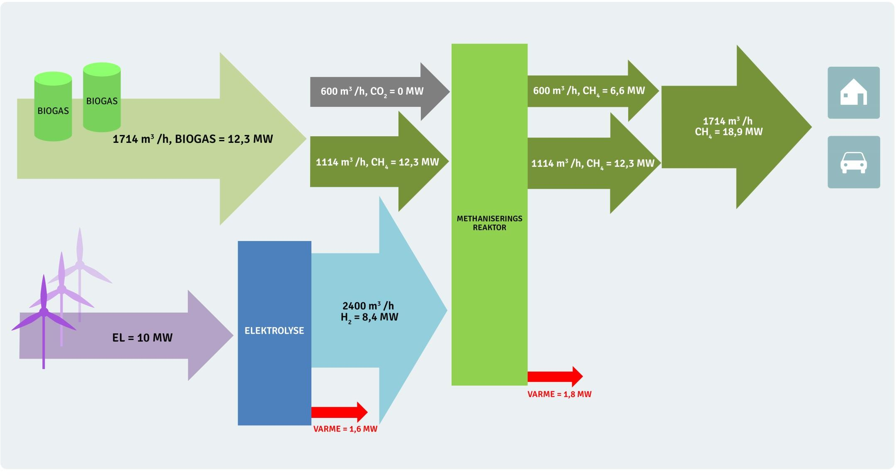
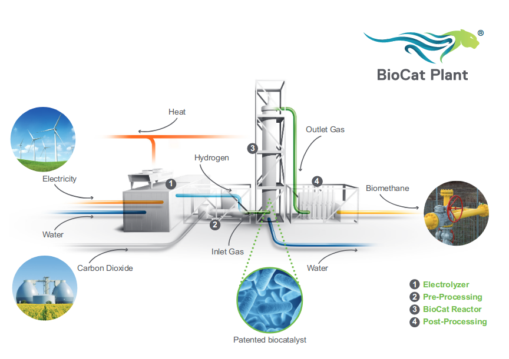
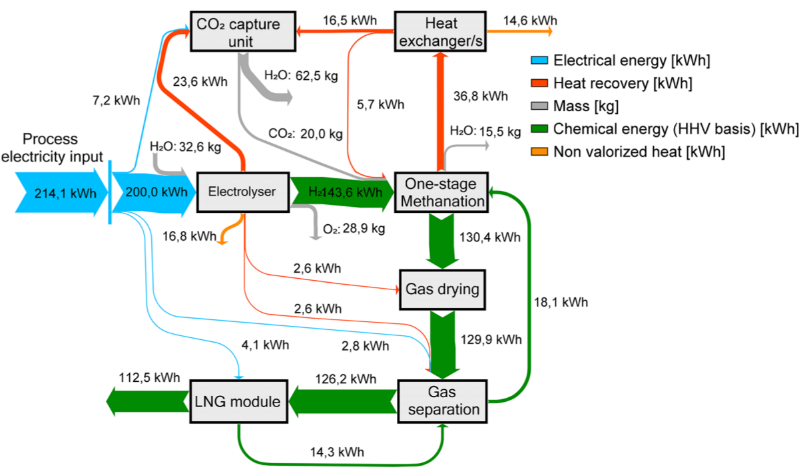

<b>Draft:</b> This piece is part of a new series on zero carbon industrial processes and is currently an initial draft.

## Sabatier process

The sabatier process will likely be a key process in the zero carbon energy system allowing for the production of methane from carbon dioxide and hydrogen, where hydrogen is produced from zero carbon energy, e.g at times where wind and solar exceed demand.

The ZeroCarbonBritain scenario uses the sabatier process to increase the methane content of biogas created using anaerobic digestion from around 60% to near 100%. Using the 40% carbon dioxide content of biogas and utilising excess wind and solar energy to generate hydrogen.

Methane is easier to store in large quantities than hydrogen and can be stored at a scale sufficient to cover inter-seasonal differences in supply and demand. The ZeroCarbonBritain scenario uses methane produced via sabatier enhanced anaerobic digestion to fuel high efficiency gas turbines to cover electricity demand where wind and solar are not sufficient.

The Sabatier Reaction was discovered in 1912 by French chemist Paul Sabatier  and involves the reaction of hydrogen with carbon dioxide at elevated temperatures  (300-400C) and pressures in the presence of a catalyst (e.g: Nickel, ruthenium or alumina) to produce methane and water [1]. 

The reaction is described by the following exothermic reaction:

    CO2 + 4H2 → CH4 + 2H2O       ∆H = −165.0 kJ/mol
    
(some initial energy/heat is required to start the reaction)

Applying higher heating values we can work out the process energy efficiency:

    Methane HHV: 889 kj/mol
    Hydrogen HHV: 286 kj/mol
    
*Heat of combustion, Higher Heating Value (HHV) [https://en.wikipedia.org/wiki/Heat_of_combustion](https://en.wikipedia.org/wiki/Heat_of_combustion)*    

    4H2 = 4x 286 kj/mol = 1144 kj/mol
    CH4 = 889 kj/mol
    HHV Efficiency = 889 kj/mol / 1144 kj/mol = 78%

*Biological conversion of CO2 to CH4 can also be achieved with hydrogenotrophic methanogens.* [2]

### Sabatier enhanced Anaerobic Digestion

Anaerobic digestion is currently used to produce biogas from a mixture of different biodegradable feed stocks such as plant and animal wastes or purposely grown energy crops [3]. By volume biogas is primarily methane (CH4): 50-70% and carbon dioxide (CO2): 30-50% with a mixture of other substances in smaller portions. The high concentration of carbon dioxide in biogas makes it suitable for upgrading with the sabatier reaction, providing the option to increase the methane content from 50-70% up to near 100%.

**Example calculation**

Assuming a biogas content of 60% CH4 and 40% CO2 by molecule.

Sabatier equation:

    CO2 + 4H2 → CH4 + 2H2O
    
Combining our 60/40 biogas with the sabatier process yields:

    3CH4 + 2CO2 + 8H2 → 5CH4 + 4H2O
    
Applying higher heating values:

    Methane HHV: 889 kj/mol
    Hydrogen HHV: 286 kj/mol

    3(889) + 8(286) → 5(889) + Heat
    2667kj CH4 + 2288kj H2 → 4445kj CH4 + 510kj Heat
    
Including energy loss in biomass conversion to biogas (assuming 60% efficiency):

    2667kj CH4 / 0.6 = 4445kj biomass
    4445kj biomass + 2288kj H2 → 4445kj CH4
    
or normalised to be more readable:
    
    1.0 kj biomass + 0.5kj hydrogen → 1.0 kj methane
    
we could also write this in any other unit of energy e.g:

    1.0 kWh biomass + 0.5 kWh hydrogen →  1.0 kWh methane

At an electrolysis efficiency of 80% we would need 0.625 kWh of electricity to upgrade this quantity of biogas to methane.

*Nel Hydrogen state an equivalent electrolysis efficiency range of 80.5% to 93.3% for their A-series electrolysers [https://nelhydrogen.com/product/atmospheric-alkaline-electrolyser-a-series](https://nelhydrogen.com/product/atmospheric-alkaline-electrolyser-a-series)*

### Case study: Lemvig Biogas MeGa-stoRE

The Lemvig Biogas MeGa-stoRE project is technical proof of concept of adding sabatier based biogas upgrading to an existing biogas plant in Denmark [5]. The Lemvig Biogas plant is the largest in Denmark. Slurry from about 75 farms and other waste and residual products from industrial production are used to generate heat and power [6].

The following diagram from a MeGa-stoRE project presentation provides an overview of the material and energy flows in the pilot plant, showing the sabatier methanisation reactor and hydrogen production from renewable electricity:

Source: [https://brintbranchen.dk/wp-content/uploads/2017/10/6.-Lars-Yde-MeGa-StoRE.pdf](https://brintbranchen.dk/wp-content/uploads/2017/10/6.-Lars-Yde-MeGa-StoRE.pdf)

We can read from this diagram that ‘for every hour’ 1713 m3 of biogas is produced with an energy content of 12.3 MWh. The energy content reflects the methane content which is 1114 m3. 

---

The presentation states that the volume units are Nm3 (Normal cubic meter [https://www.engineeringtoolbox.com/stp-standard-ntp-normal-air-d_772.html](https://www.engineeringtoolbox.com/stp-standard-ntp-normal-air-d_772.html)), this means a temperature of 273.15K and pressure of 1 atm (101,325 Pa).

Calculation of the mass of 1 Nm3 of methane and hydrogen:

    Ideal gas law: PV = nRT

    P: Pressure
    V: Volume
    n: number of moles
    R: product of Boltzmann constant and Avogadro constant (8.314)
    T: Temperature
    
    n = PV / RT
    n = (101325×1)÷(8.314×273.15)
    n = 44.62 mol/m3
 
    Molar mass of methane: 16.0425 g/mol*
    Density of methane = 16.0425 × 44.62 = 715.8 g/m3

    Molar mass of hydrogen: 2.01588 g/mol*
    Density of hydrogen = 2.01588 × 44.62 = 89.95 g/m3

[* https://www.webqc.org/mmcalc.php](https://www.webqc.org/mmcalc.php)

Calculation of methane and hydrogen energy density in kWh/kg:

    Molar mass of methane: 16.0425 g/mol
    Methane HHV: 889 kj/mol*
    889 kj/mol / 16.0425 g/mol = 55.4 kj/g
    55.4 MJ/kg / 3.6 MJ/kWh = 15.4 kWh/kg
    
    Molar mass of hydrogen: 2.01588 g/mol
    Hydrogen HHV: 286 kj/mol*
    286 kj/mol / 2.01588 g/mol = 141.9 kj/g
    141.9 MJ/kg / 3.6 MJ/kWh = 39.4 kWh/kg

[* https://en.wikipedia.org/wiki/Heat_of_combustion](https://en.wikipedia.org/wiki/Heat_of_combustion)

---

Sanity checking the MeGa-stoRE calculation:

Biogas input:

    1114 Nm3/h of methane × 0.7158 kg/m3 = 797.4 kg/h
    797.4 kg/h × 15.4 kWh/kg (HHV) = 12.3 MW

Hydrogen input:

    2400 Nm3/h of hydrogen × 0.08995 kg/m3 = 215.9 kg/h
    215.9 kg/h × 39.4 kWh/kg (HHV) = 8.5 MW

Sabatier methane:

    600 Nm3/h of methane × 0.7158 kg/m3 = 429.5 kg/h
    429.5 kg/h × 15.4 kWh/kg (HHV) = 6.6 MW
    
Assuming a 60% biomass to biogas conversion efficiency and using the figures from the diagram above.

20.5 MWh biomass should produce 12.3 MWh of biogas. This is then combined with 8.4 MWh of hydrogen to produce a total of 18.9 MWh of methane. Normalising these figures we get:

    1.0 kWh biomass + 0.41 kWh of hydrogen = 0.92 kWh of methane
    
The CO2 to Methane proportions in the biogas are lower in the MeGa-stoRE project at 35% CO2 and 65% Methane, which should account for the slightly lower hydrogen and output methane figures.

### Direct air capture

An alternative to the use of carbon dioxide present in biogas could be to couple a sabatier reactor to a carbon dioxide direct air capture plant, pulling carbon dioxide from the air for combination with hydrogen produced from excess renewable energy. A key advantage to this approach could be the potential to avoid the land area requirements of growing crops such as rotational grasses for biogas production, however direct-air-capture has an energy cost associated with it, where every kg of carbon dioxide captured requires 2.5 kWh of 100C heat and 0.5 kWh of electricity:

*Driving the Climeworks process uses 2.5 megawatt hours (MWh) of heat, at around 100C, for each tonne of CO2, along with 0.5MWh of power. This energy requirement is roughly equivalent to the 12GJ/tCO2 estimates set out above, though the firm hopes to shave 40% off this figure, bringing it down to around 7GJ/tCO2. Gebald says an increase in energy resources – he points to wind and solar – would be needed to scale up direct capture.* - https://www.carbonbrief.org/swiss-company-hoping-capture-1-global-co2-emissions-2025

Calculating hydrogen requirement for every kg of CO2 captured using DAC:

    Sabatier process
    CO2 + 4H2 → CH4 + 2H2O
    
    Applying molar mass:
    44.009 g/mol CO2 + 4x2.016 g/mol H2 → 16.043 g/mol CH4 + 2x15.015 g/mol 2H2O
    
    Scaling on a per kg CO2 basis:
    1kg CO2 + 0.183 kg H2 = 0.364 kg CH4
    
    In energy terms:
    1kg CO2 + 7.2 kWh H2 = 5.6 kWh CH4
    
    Including electrolysis at 80% efficiency:
    1kg CO2 + 9.0 kWh el = 5.6 kWh CH4

Methane production from direct air capture:

    DAC: 2.5 kWh of 100C heat
    DAC: 0.5 kWh of electric
    9.0 kWh electric for hydrogen production
    Output: 5.6 kWh of methane.
    Total electric input = 9.5 kWh

Heat recovery:

    Heat from sabatier reaction: 7.2 - 5.6 = 1.6 kWh
    Heat from electrolysis = 1.98 kWh
    Total heat = 3.58 kWh
    If we can recover 70% of the heat is would cover DAC heat requirement.
    Likely required high temp electrolysis to do this.

Electric to methane efficiency: 5.6 kWh / 9.5 kWh = 59%

At 50% gas turbine efficiency result is 2.8 kWh of electric an overall 30% efficiency. 
At 60% gas turbine efficiency result is 3.4 kWh of electric an overall 35% efficiency.

### Electrochaea Power-to-Gas technology

<table><tr>
<td style="width:65%">

The Electrochaea Power-to-Gas technology uses a biocatalyst to convert CO2 and H2 to biomethane, with recoverable heat.

<a href="http://www.electrochaea.com/wp-content/uploads/2018/03/201803_Data-Sheet_BioCat-Plant.pdf">http://www.electrochaea.com/wp-content/uploads/2018/03/201803_Data-Sheet_BioCat-Plant.pdf</a>

BioCat 10 has a nominal hydrogen input of 2000 Nm3/h (7088 kW) producing 500 Nm3/h of methane.

<pre>
1 Nm3 of CH4 is 44.618 mol x 16.0425 g-mol-1 = 715.78g

Hydrogen higher heating value 889 kj/mol (55.4 MJ/kg)
converted to kWh = 15.4 kWh/kg HHV

1 Nm3 of CH4 has therefore an energy content of 11.0 kWh/Nm3

11.0 kWh/Nm3 x 500 Nm3/h = 5500 kW

Efficiency = 5500 kW / 7088 kW = 78%
</pre>

The energy conversion efficiency in their brochure states >74%

The reactor temperature is relatively low at 63C, which suggests that waste heat temperature will be too low for applications such as the Climeworks CO2 direct air capture technology, but potentially sufficient for space & water heating.

</td>
<td>

</td>
</tr></table>

### STORE&GO: Power to LNG with DAC

<table><tr>
<td style="width:65%">

The Italian demonstration site, part of the STORE&GO power-to-gas project, is exploring the integration of direct air capture of CO2 with electrolysis & methanation. Using the Climeworks DAC technology discussed above.

<a href="https://storeandgo.info/demonstration-sites/italy">https://storeandgo.info/demonstration-sites/italy</a> 

Their paper: <a href="https://storeandgo.info/fileadmin/downloads/publications/2018-11-06_Process_Modeling_of_an_Innovative_Power_to_LNG_Demonstration_Plant_Bensaid.pdf">Process Modeling of an Innovative Power to LNG Demonstration Plant</a> discusses the proposed demonstration plant process in detail. The paper includes a number of particularly useful energy and mass balance sankey diagrams that detailed steps not covered above e.g compression and drying.

The first diagram shows the intended design for the pilot project which should have an electricity to LNG total system efficiency of 46.3% - or 52% without the LNG compression stage.

The second diagram shows a similar design but with waste heat recovery from the electrolysis unit which should increase the electricity to LNG total system efficiency of 52.6% - or 59% without the LNG compression stage.

The CO2 Capture unit in this paper uses less energy than the original figures I found for the Climeworks unit discussed earlier, at 200-300 kWh/tonCO2 (0.25 kWh/kg) and 1500-2000 kWhth/tonCO2 @ 100C (1.75 kWh/kg). There are then additional requirements for electricity that balance out the overall efficiency to be the same.

</td>
<td>

Energy and mass balance Sankey diagram

Improved concept:

Source: <a href="https://storeandgo.info/fileadmin/downloads/publications/2018-11-06_Process_Modeling_of_an_Innovative_Power_to_LNG_Demonstration_Plant_Bensaid.pdf">Process Modeling of an Innovative Power to LNG Demonstration Plant</a>

</td>
</tr></table>

### References

[1] https://en.wikipedia.org/wiki/Sabatier_reaction

[2] https://en.wikipedia.org/wiki/Methanogen

[3] https://en.wikipedia.org/wiki/Anaerobic_digestion

[4] http://www.engineeringtoolbox.com/gas-density-d_158.html

[5] http://www.lemvigbiogas.com/MeGa-stoREfinalreport.pdf

[6] http://www.lemvigbiogas.com/GB.htm

[7] https://h2tools.org/tools
