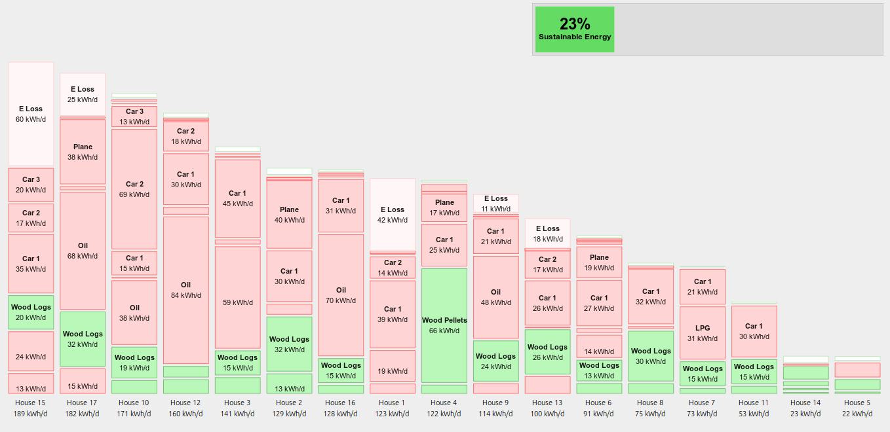
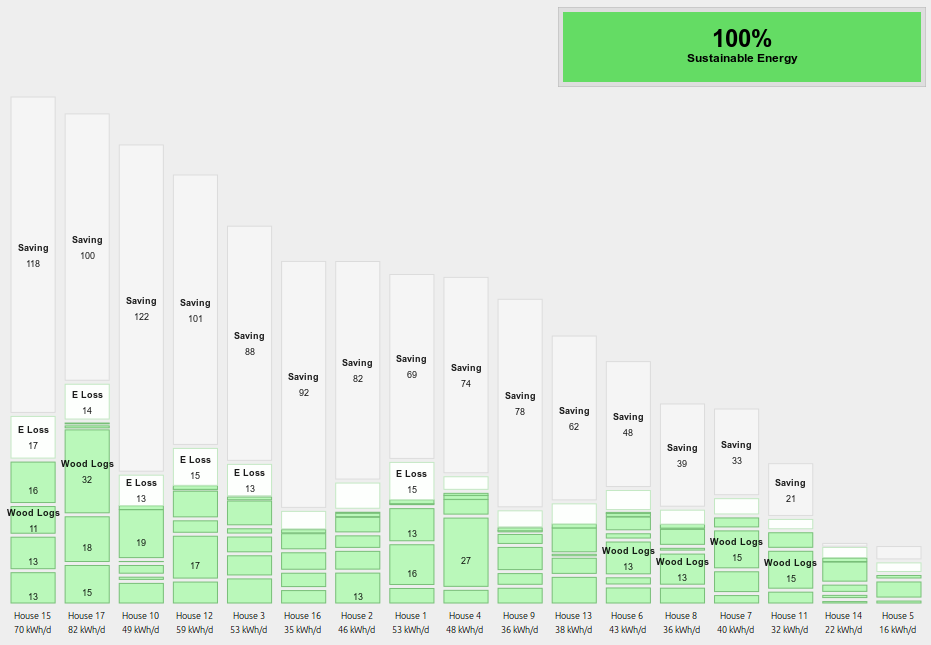

## Snowdonia household energy study

While it is useful to get an understanding of typical average household energy consumption, the reality is that every household can be quite different. In 2010 we helped carry out a energy study into a number of households in North Wales all of which where part of a group interested in the topic. Each stack in the following graphic is one household, showing energy consumption for electricity, heating and transport, including flights.

The graphic really illustrates how different each household can be with the most energy consuming household using over 8x the energy consumption of the least energy consuming household (189 kWh/d vs 22 kWh/d). The example of the least energy consuming household demonstrates the effectiveness of many of the key solutions outlined in the power down section of ZeroCarbonBritain, in particular: insulation and air-tightness, heatpumps, electric cars and reducing miles driven by car and air-travel.

The 17 households in the study emitted a total of 141 tonnes of CO2 per year. Just over 8 tonnes per household per year for electric, heating and transport. The household emitting the largest amount of CO2 emitted 17.7 tonnes of CO2/year due to a high degree of air travel and oil fired heating. The household with the lowest CO2 output of 1.3 tonnes/year achieved this with a heatpump heated small cottage, an electric car and no flights. The household with the second lowest CO2 output of 1.5 tonnes/year achieved this with a very well insulated house, a heatpump and a very low mileage of 3500 miles/year in a small petrol car. Both households used green electricity suppliers (see appendix below) however even with the grid average co2 intensity for 2010 of 444gCO2/kWh both households still come out as the lowest carbon emitters with about 2.3 tonnes CO2 each.

[View: Snowdonia household energy study data tool](snowdonia-energy-study-data.html)

### Variation in heating demand

The study showed a large variation in heating demand with the highest heating energy (fuel) household using 36,360 kWh/year (99.6 kWh/d) and the lowest 2205 kWh/year (6.0 kWh/d), a 17x difference. The average heating fuel demand was 17,245 kWh/year (47 kWh/d). The groups average is slightly higher than the UK average of 41 kWh/d.

Taking into account estimated efficiencies of each heating system the delivered heat ranged from 27,980 kWh/year (76.7 kWh/d) to 3444 kWh/year (9.4 kWh/d). An average of 14,164 kWh/year (38.8 kWh/d). The ZeroCarbonBritain target for space and water heating demand is 17.4 kWh/d, with most delivered from 7.0 kWh/d of electric via heatpumps.

There are several factors that contributed to the large variation in heating demand between households seen above.

- **The extent of insulation and draught proofing levels** A number of the larger energy consuming households had older poorly insulated stone construction.
- **The difference in floor area** Building with larger surface areas for a given fabric energy efficiency require more heating.
- **The controllability of the heating system** Several households had oil fired range cookers which provide combined cooking and heating functionality. The problem with this configuration is that these range cookers often need to be left on at winter heating levels during warmer summer months in order to provide hot enough hobs and ovens for cooking but as we saw from the analysis of the typical household: cooking demand was only 1.0 kWh/d while space heating was almost 35 kWh/d and so leaving the range cooker on is a big waste of energy if no space heating is needed.
- **The efficiency of the heating system** Oil fired range cookers in particular can have particularly low efficiencies ~55%.
- **Internal temperature** While not measured comprehensively in the study, it is likely that the average internal temperature chosen by households will also have made a large impact on heating demand.

### Variation in transport demand

The study also showed a large variation in transport demand with the least energy consuming household using 9 kWh/d for transport while the highest energy consuming household used 100 kWh/d. The group average is 43.6 kWh/d which is very close to the national average.

All households in the study had cars, 3 households had two cars and 2 households had 3 cars. A combined total of 205,600 miles were driven by car and motorbike an average of 12,094 miles per household.

The highest performing lowest energy households achieved their results through a combination of significantly lower annual mileage, little or no flying and in one case an electric car, demonstrating both the effectiveness of what are often called behavioural change measures i.e reducing miles driven, flying less and technology switch measures such as electric cars.

### Exploring solutions

As part of the study we explored in a basic way the effect of carrying out different measures on the groups energy consumption and carbon emissions. These can be explored dynamically via the linked energy stack tool. Measures explored include:

- Switching to a 100% green electricity supplier
- Replacing Oil, Gas, Coal heating with heatpumps
- Improving insulation and air-tightness to achieve at least 120 kWh/m2/year primary energy requirements
- Replacing gas cooking with electric cooking
- Replacing petrol and diesel cars and motorbikes with electric vehicles
- Replacing plane and boat journeys with electric train journeys
- Full electrification of rail network
- Electric buses

With these largely 'technology switch' based measures CO2 emissions could theoretically be reduced to zero with fully zero carbon energy supply. Primary energy is reduced by 60% to 38.5 kWh/d per household without any further reduction in miles driven or home comfort. This is still larger than the household average target as suggested by ZeroCarbonBritain, however the results do not yet contain a full assessment of energy savings that might be possible with more efficient appliances and a more comprehensive look at retrofit savings.

Switching from planes to trains is perhaps one of the most speculative measures, if flights were still included and with fuel from fossil sources the resulting co2 emissions would be 27 tonnes/year, which is still an 80% reduction. Alternatives could also be explored such as synthetic liquid fuel powered aircraft as used in ZeroCarbonBritain or David MacKay's suggestion of airships in Sustainable Energy without the hot air.

If natural gas was used as the backup supply and flights were included the overall reduction in CO2 emissions could be 75% to 35 tonnes/year.

Interestingly even if the electricity supply remained at 2010 carbon intensity levels of 444gCO2/kWh and the households switched to heatpumps and electric vehicles a base carbon saving of 25% would be achieved. This would then extend to a potential carbon saving of up to 77% as the electricity supply is further de-carbonised.

### Developing Zero Carbon Scenarios

Section 5 and 6 on developing zero carbon scenarios builds on this basic analysis with a much more detailed approach involving a 10 year hourly zero carbon energy model, taking into account supply/demand matching requirements, the need for backup for times where there is less wind and solar output. 

<b>Appendix:</b> Green Electricity Tariffs

There is some debate about the CO2 savings that are possible to claim using green electricity tariffs. One view is that the CO2 intensity figure of the entire national grid should be used instead of a lower green tariff specific amount. Another view reasons that it should be possible to use the grid as a transport infrastructure where its possible to buy electricity from a renewable sources, supporting the growth of renewable energy through energy bills and also allowing for a claim of lower co2 emissions for the consumed electricity.

An extended discussion of this topic including an attempt to calculate two alternative middle of the road emission factors can be found here: <a href="greentariffs">Green tariffs and GHG emissions</a>

In order to provide a balanced view we show the CO2 emission results using a range of different emission factors in this analysis:

<ul>
<li>1. The average CO2 intensity of grid electricity in 2010: 444gCO2/kWh</li>
<li>2. The average CO2 intensity of grid electricity in 2015: 367gCO2/kWh</li>
<li>3. Green tariff emission factor based on who pays for the electricity: 218gCO2/kWh</li>
<li>4. Green tariff emission factor based on 25% backup requirement: 90gCO2/kWh</li>
<li>5. Green tariff emission factor based on 15% backup requirement: 54gCO2/kWh</li>
<li>6. Fully zero carbon electricity supply: 0gCO2/kWh</li>
</ul>

To explore supply demand matching in more detail see 10 year hourly zero carbon energy model:

<ul>
<li><a href="../zcem/integrated.html#all">7. Household electric only model</a></li>
<li><a href="../zcem/integrated.html#fullhousehold">8. Household full energy model</a></li>
</ul>

