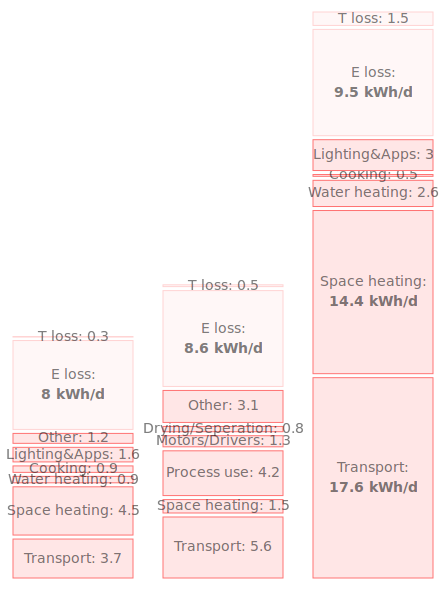

## UK Energy 2015

The Energy 101 page starts with a simplified summary of the energy consumption of the average UK household. This section shows the working for these figures in addition to further insight into energy consumption in the UK.

<table>
<tr><td>

</td><td>
The average UK home uses around <b>92 kWh</b> of energy per day. <b>8 kWh/d</b> for electricity, <b>41 kWh/d</b> for water and space heating and <b>43 kWh/d</b> for transport.  

This translates to an average annual electricity bill of 3100 kWh costing £476, an average annual gas bill of 15000 kWh costing £714 and an average car fuel cost of £1312.  

Over a 25 year timespan the average household spends £62,500 on these direct forms of energy.  

A small village with 200 households will spend almost £12.5 million on energy over 25 years.  

<i>LAC: Lights, Appliances and Cooking</i>
</td></tr></table>

The main dataset used is published by the UK government as part of the uk energy statistics, this example uses the ECUK_Tables_2016.xlsx spreadsheet:

- **Data source:** https://www.gov.uk/government/statistics/energy-consumption-in-the-uk
- **Download:** ECUK_Tables_2016.xlsx

The following energy stacks provide a summary of UK energy consumption obtained from this dataset with the working given below.

<table>
<tr>
<td></td>
<td>
<b>Stack 1:</b> Total energy consumption  
<b>Stack 2:</b> Energy consumption by sector + losses  
<b>Stack 3:</b> Losses allocated by sector  
<b>Stack 4:</b> Losses and transport allocated by sector  
<b>Stack 5:</b> Energy consumption by end use.</td>
</tr>
</table>

### Stack 1: Total primary energy consumption

Stack 1 shows the total 2015 primary energy consumption in kWh per day per person. Total primary energy consumption is available in *table 1.08* in cell Primary:Final for 2015 or 194778 thousand tonnes of oil equivalent. Converting to kWh/d/pp by multiplying by the conversion factor 0.00049 we obtain the figure of **95.4 kWh/d/pp**. 

**Conversion factor:** The consumption figures in the spreadsheet are all in thousand of tonnes of oil equivalent per year, these are converted to kWh per day per person, which are the units used by David MacKay in his book sustainable energy without the hot air. See appendix on calculating this conversion factor.

### Stack 2: Final energy consumption by sector + total losses

Stack 2 shows energy use by sector as outlined in *table 1.01*. For any given year there is a temperature corrected consumption value and a non temperature corrected value. The following tables show the figures for 2015.

2015 non-temperature corrected data (thousand tonnes of oil equivalent):

| Industry      | Transport     | Domestic      | Other        | Final         |
|---------------|---------------|---------------|--------------|---------------|
| 23594         | 54810         | 39623         | 19403        | 137430        |
| 11.6 kWh/d/pp | 26.9 kWh/d/pp | 19.4 kWh/d/pp | 9.5 kWh/d/pp | 67.3 kWh/d/pp |

2015 temperature corrected data (thousand tonnes of oil equivalent):

| Industry      | Transport     | Domestic      | Other        | Final         |
|---------------|---------------|---------------|--------------|---------------|
| 23594         | 54809         | 42061         | 19658        | 140122        |
| 11.6 kWh/d/pp | 26.9 kWh/d/pp | 20.6 kWh/d/pp | 9.6 kWh/d/pp | 68.7 kWh/d/pp |

Stack 2 uses the non temperature corrected dataset for 2015. The total losses are obtained from *table 1.08* cell *Losses:Final* and is 57348 thousand tonnes of oil equivalent or 28.1 kWh per day per person.

### Stack 3: Losses allocated by sector

Another way of looking at energy consumption by sector is to allocate total losses by each sector. This changes the proportions somewhat as the domestic, services and industry sectors have higher losses (associated primarily with electricity generation) than the transport sector.

2015 losses by sector, non-temperature corrected data from table 1.08:

|               | Industry         | Transport     | Domestic      | Services      | Final         |
|------------------|---------------|---------------|---------------|---------------|---------------|
| Primary          | 40675         | 59408         | 58997         | 35697         | 194778        |
| Primary (kWh/d/pp) | 19.9 kWh/d/pp | 29.1 kWh/d/pp | 28.9 kWh/d/pp | 17.5 kWh/d/pp | 95.4 kWh/d/pp |
| Final            | 23594         | 54810         | 39623         | 19403         | 137430        |
| Losses           | 17481         | 4598          | 19375         | 16294         | 57348         |
| Losses (kWh/d/pp)  | 8.6 kWh/d/pp  | 2.3 kWh/d/pp  | 9.5 kWh/d/pp  | 8.0 kWh/d/pp  | 28.1 kWh/d/pp |

Row 'Primary (kWh/d/pp)' is used for generating stack 3.

### Stack 4: Losses and transport allocated by sector

Stack 4 allocates transport consumption and losses by the three main sectors: domestic, services and industry, proving another useful way of looking at sector energy consumption. With domestic transport combined with all other domestic energy use it really highlights the large proportion of primary energy consumption that is associated with the domestic sector making up half of total consumption when presented in this way.

The latest data available for transport by sector is 2014 and is the temperature corrected dataset, total transport consumption in 2015 is 1.3% higher than in 2014. Assuming that the proportions have not changed significantly from 2014 to 2015 an estimate can be calculated by scaling the 2014 figures by 1.3% to match the 2015 total.

For example 2015 estimated non-temperature corrected industrial transport consumption = 11195 x 54809/54126 = 11336.

The first row in the following table is from *Table 2.03*: Transport energy consumption re-allocated to domestic, industrial and service sectors. The subsequent rows are estimated by scaling the 2014 figures to match total 2015 consumption.

| | Industry | Domestic     | Services      | Total  |
|----------------------------------------------------------|--------------|---------------|--------------|---------------|
| 2014 transport consumption by sector | 11195        | 35569         | 7361         | 54126         |
| 2015 estimated temperature corrected                      | 11336        | 36018         | 7454         | 54809         |
| 2015 estimated non temperature corrected                  | 11336        | 36018         | 7454         | 54810         |
| 2015 estimated transport losses by sector                | 951          | 3022          | 625          | 4598          |
| 2015 estimated non temperature corrected + losses         | 12287        | 39040         | 8079         | 59408         |
| 2015 estimated non temperature corrected + losses kWh/d/pp | 6.0 kWh/d/pp | 19.1 kWh/d/pp | 4.0 kWh/d/pp | 29.1 kWh/d/pp |

Adding the last row here to the second row of the table in the section for stack 3 we obtain the following figures as used in stack 4:

| Industry      | Domestic      | Services      | Total         |
|---------------|---------------|---------------|---------------|
| 25.9 kWh/d/pp | 48.0 kWh/d/pp | 21.5 kWh/d/pp | 95.4 kWh/d/pp |

### Stack 5: Energy consumption by end use

Stack 5 shows energy consumption by end use regardless of the sector. This is a useful stack as it relates perhaps better to the energy efficiency solutions available for each end use type such as insulation, draft proofing and passivhaus design for space heating, or electrification for transport.

The latest data for energy consumption by end use is for 2013 and is the non temperature corrected dataset:

Energy consumption by end use for 2013 from Table: 1.03

|                      | Domestic   | Industrial | Services | Total |
|----------------------|------------|----------|-------|-------|
| Space heating        | 31609      | 3254     | 9876  | 44739 |
| Water                | 5676       | 0        | 1907  | 7583  |
| Cooking/ Catering    | 991        | 0        | 2005  | 2995  |
| Lighting/ Appliances | 6525       | 241      | 3423  | 10190 |
| Process use          | 0          | 9162     | 0     | 9162  |
| Motors/Drivers       | 0          | 2755     | 0     | 2755  |
| Drying/Separation    | 0          | 1804     | 0     | 1804  |
| Other3 non-transport | 0          | 6796     | 2563  | 9359  |
| Total                | 44801      | 24011    | 19774 | 88586 |

A simple estimate can again be made by scaling 2013 proportions to 2015 total non transport energy consumption. Example: calculating 2015 estimate of total space heating demand = 44739 x (82,620/88,586) = 41726.

|                      | Domestic   | Industrial | Service1 | Total |
|----------------------|------------|----------|-------|-------|
| Space heating        | 29480      | 3035     | 9211  | 41726 |
| Water                | 5294       | 0        | 1778  | 7072  |
| Cooking/ Catering    | 924        | 0        | 1870  | 2794  |
| Lighting/ Appliances | 6086       | 225      | 3192  | 9503  |
| Process use          | 0          | 8545     | 0     | 8545  |
| Motors/Drivers       | 0          | 2570     | 0     | 2570  |
| Drying/Separation    | 0          | 1682     | 0     | 1682  |
| Other3 non-transport | 0          | 6338     | 2390  | 8729  |
| Total                | 41784      | 22394    | 18442 | 82620 |

kWh/d/pp can be calculated by 0.00049 i.e 41726 thousand tonnes of oil equivalent 0.00049 = 20.4 kWh/d/pp the value used in energy stack 5 for space heating.

### Sector consumption breakdown stacks

The service, industrial and domestic sector consumption breakdown stacks are compiled using the 2015 energy consumption by end use table above alongside transport use and loss figures from table 2.08 from the spreadsheet.

<table>
<tr>
<td></td>
<td>
<b>Stack 1:</b> Service sector consumption breakdown  
<b>Stack 2:</b> Industrial sector consumption breakdown  
<b>Stack 3:</b> Domestic sector consumption breakdown  
</tr>
</table>

### 2015 Household energy consumption

The number of households in the UK was 27.0 million in 2015, the population: 65,110,000. The average household occupancy is therefore 65,110,000 / 27,000,000 = 2.41 people per house.

The conversion factor from thousand tonnes of oil equivalent to kWh per day per household is therefore 0.00049 x 2.41 = 0.0011809.

|                      | Domestic   | kWh/d    |
|----------------------|------------|----------|
| Space heating        | 29480      | 34.81    |
| Water                | 5294       | 6.25     |
| Cooking              | 924        | 1.09     |
| Lighting/ Appliances | 6086       | 7.19     |
| Transport            | 36018      | 42.53    |
| Total                | 41784      | 91.87    |

Combining space heating with water heating as the fuel source can often be the same and cooking with lighting and appliances, assuming cooking is on electric. We obtain the following simplification:

|                              | kWh/d |
|------------------------------|-------|
| Space & Water heating        | 41.1  |
| Lights, Appliances & Cooking | 8.3   |
| Transport                    | 42.5  |
| Total                        | 91.9  |

We can compare these figures with the typical domestic consumption values provided by ofgem here for 2015. [https://www.ofgem.gov.uk/gas/retail-market/monitoring-data-and-statistics/typical-domestic-consumption-values](https://www.ofgem.gov.uk/gas/retail-market/monitoring-data-and-statistics/typical-domestic-consumption-values)

| TDCVs                        |        | kWh/year | kWh/d |
|------------------------------|--------|----------|-------|
| Gas                          | Low    | 8000     | 21.9  |
|                              | Medium | 12500    | 34.2  |
|                              | High   | 18000    | 49.3  |
| Electricity: Profile Class 1 | Low    | 2000     | 5.5   |
|                              | Medium | 3100     | 8.5   |
|                              | High   | 4600     | 12.6  |
| Electricity: Profile Class 2 | Low    | 2500     | 6.8   |
|                              | Medium | 4300     | 11.8  |
|                              | High   | 7200     | 19.7  |

The Medium Electricity Profile Class 1 figure of 8.5 kWh/d is near the average Lights, Appliances & Cooking value we obtained above, the medium gas consumption however is 17% lower than the average space & water heating value. The source of this difference may reflect that the medium category is the median rather than the mean consumption.

- "In 2015 the average electricity bill across all payment types fell by £8 compared with 2014, to £584" Based on an average electricity consumption of 3800 kWh
- "The average 2015 gas bill across all payment types fell by £38, compared to 2014, to **£714**" Based on an average gas consumption of 15000 kWh

Average annual consumption data: 
[https://www.gov.uk/government/statistical-data-sets/annual-domestic-energy-price-statistics](https://www.gov.uk/government/statistical-data-sets/annual-domestic-energy-price-statistics)

Note on revised average figures, plus reference to median figures: 
[https://www.gov.uk/government/uploads/system/uploads/attachment_data/file/295244/Revisions_to_DECC_domestic_energy_bill_estimates.pdf](https://www.gov.uk/government/uploads/system/uploads/attachment_data/file/295244/Revisions_to_DECC_domestic_energy_bill_estimates.pdf)

By using the unit costs from the average bill figures we can estimate the bill cost for the medium category.

- Electricity: £584 / 3800 kWh = 15.37 p/kWh x 3100 kWh = **£476**
- Gas: £714 / 15000 kWh = 4.76 p/kWh x 12500 = £595

The total energy consumption of non transport household energy use calculated from ECUK_Tables_2016.xlsx is 18009 kWh. This differs somewhat from the electricity and gas bill average total of 18800 kWh. For the summary the values based on ECUK_Tables_2016.xlsx of 18009 kWh are used and the assumption is made that gas is used for space heating and water heating, while electricity is used for lights, appliances and cooking.

### Calculating domestic car consumption and costs

While we have a breakdown of transport energy by sectors we don't yet know how much of the sectoral transport energy is for car consumption, air or other modes.

ECUK_Tables_2016.xlsx, Table 2.01, 2014 provides the following breakdown by end use for transport as a whole.

| Rail | Road  | Freight | Water | Air   | Total |
|------|-------|---------|-------|-------|-------|
| 1066 | 26863 | 13098   | 679   | 12419 | 54125 |

We also know from ECUK_Tables_2016.xlsx, Table 2.02, 2014 the more detailed road transport breakdown as follows:

| All Cars | All LGV | All HGV | Buses | Motorcycles | LPG  | Biofuels | Total |
|----------|---------|---------|-------|-------------|------|----------|-------|
| 22197    | 5515    | 5906    | 1223  | 169         | 90   | 1500     | 36600 |

and from table 2.03 that transport energy by sector is:

| Industry | Domestic | Services | Total |
|----------|----------|----------|-------|
| 11195    | 35569    | 7361     | 54126 |

It stands to reason that all freight energy consumption can be allocated to the industry and service sectors. We can calculate the remaining unallocated transport energy for the industrial and service sectors as (11195 + 7361) - 13098 = 5458.

If we assume the majority of passenger road energy consumption is domestic we can calculate the remainder here as 35569 - 26863 = 8706

The data tables don't provide a breakdown of rail, water or air travel consumption by sector and so in order to get a rough estimate here we will need to make a couple of assumptions. If we assume that 80% of rail is allocated to domestic and 50% of water we arrive at a total unallocated amount of 7514 for domestic and 4905 for industry and services, adding to a total of 12419 - the amount used by air travel, giving us an estimate of the breakdown.

The following table shows estimated breakdown of domestic transport energy:

|                     | Road  | Rail  | Water | Air    | Total |
|---------------------|-------|-------|-------|--------|-------|
| Thousand tonnes oil | 26863 | 852.8 | 339.5 | 7513.7 | 35569 |
| kWh/d               | 13.2  | 0.4   | 0.2   | 3.7    | 17.4  |
| kWh/year            | 4804  | 153   | 61    | 1344   | 6362  |

There are 9.7 kWh per Litre of petrol, 4804 kWh/year / 9.7 kWh per Litre = 495 Litres. The cost of petrol is now around 110p/litre down from an average of around 120p/litre over the last 10 years. If we use the 110p/litre value this would result in an estimated annual petrol cost per person of £545, or **£1312 per household**.

Further insight into transport energy use can be gained by looking at the Department for Transports National Travel Survey data, nts0410 provides average travel data in miles per person by different modes:

[https://www.gov.uk/government/uploads/system/uploads/attachment_data/file/456868/nts0410.xls](https://www.gov.uk/government/uploads/system/uploads/attachment_data/file/456868/nts0410.xls)

| Walk | Bicycle | Car / van driver | Car / van passenger | Motorcycle | Other private transport | Local bus | Rail | Other public transport | All modes |
|------|---------|------------------|---------------------|------------|--------------------------|-----------|-------|-------------------------|-----------|
| 149  | 56      | 3,268            | 1,783               | 30         | 109                      | 273       | 685   | 134                     | 6,488     |

A total of 5051 passenger miles are traveled by car per person. The occupancy is about 1.55 people per car. The average vehicle miles per person is 3268 miles. We can calculate the average MPG achieved as 3268 miles / 4804 kWh = 0.68 miles per kWh. If we multiply this by the number of kWh in a Litre (9.7) and the number of Litres in a Gallon (4.55) it works out to being an average efficiency of 30 MPG. Clearly newer cars can do much better than this but this indicates if correct that the average of the total stock is significantly lower.

The following table gives a useful overview of cost per mile and MPG:

| MPG | MPL  | miles/kWh | p/mile |
|-----|------|-----------|--------|
| 30  | 6.6  | 0.68      | 16.7   |
| 35  | 7.7  | 0.79      | 14.3   |
| 40  | 8.8  | 0.91      | 12.5   |
| 45  | 9.9  | 1.02      | 11.1   |
| 50  | 11.0 | 1.13      | 10.0   |
| 55  | 12.1 | 1.25      | 9.1    |
| 60  | 13.2 | 1.36      | 8.3    |

The average miles traveled by a household by car is 3268×2.41 = 7876 vehicle miles and 12173 passenger miles. The total mileage by all means is 15636 miles.

An alternative calculations suggests that cars traveled 244.4 billion vehicle miles in the uk in 2014. Dividing by the UK population this works out to 3754 miles per person and 9046 miles per household, a little higher than the calculation above but in the same general range.

There are also 25.8 million cars on the road which works out to an average of 9473 miles per car which sounds about right.

https://www.gov.uk/government/uploads/system/uploads/attachment_data/file/487689/annual-road-traffic-estimates-2014.pdf

### Primary energy factors for electricity generation

Electricity generated and supplied, 1970 to 2015 (DUKES 5.1.3) 
[https://www.gov.uk/government/uploads/system/uploads/attachment_data/file/541291/DUKES_5.1.3.xls](https://www.gov.uk/government/uploads/system/uploads/attachment_data/file/541291/DUKES_5.1.3.xls)

Fuel input for electricity generation, 1970 to 2015 (DUKES 5.1.1) 
[https://www.gov.uk/government/uploads/system/uploads/attachment_data/file/541289/DUKES_5.1.1.xls](https://www.gov.uk/government/uploads/system/uploads/attachment_data/file/541289/DUKES_5.1.1.xls)

**Primary energy requirement for grid electricity in 2015**

- Total fuel input for electricity generation 2015: 66.53 mtoe
- Converted to Gwh: 773,744 GWh
- Total electricity generated 2015: 295,742 GWh
- Primary energy factor =  773,744 /  295,742 = **2.616**

**Primary energy requirement for grid electricity in 2010**

- Total fuel input for electricity generation 2010: 79.33 mtoe
- Converted to Gwh: 922,608 GWh
- Total electricity generated 2010: 347,846 GWh
- Primary energy factor =  922,608 /  347,846 = 2.652

There are 11,630 kWh's per ton of oil equivalent (1 mtoe = 11,630 GWh)

### Calculating kWh/d per person from tonnes of oil equivalent

1 ton of oil equivalent = 11,630 kWh 
1 thousand tonnes of oil equivalent = 11630000 kWh 
UK Population mid-2015 = 65,110,000 
kWh per person = 11630000  / 65,110,000 = 0.17862 kWh per person 
kWh per person per day = 0.17862 kWh / 365 = 0.00049 kWh/d per person 

(1 ton of oil equivalent = 11630 kWh/year or 32 kWh/day)

**Source:** [https://www.ons.gov.uk/peoplepopulationandcommunity/populationandmigration/populationestimates/bulletins/annualmidyearpopulationestimates/latest](https://www.ons.gov.uk/peoplepopulationandcommunity/populationandmigration/populationestimates/bulletins/annualmidyearpopulationestimates/latest)
