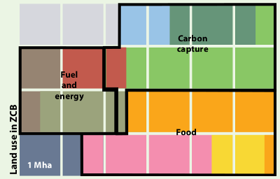

## Building on the ZeroCarbonBritain Energy Model

The ZeroCarbonBritain energy model is a 10-year hourly energy model developed by the ZeroCarbonBritain team at the Centre for Alternative Technology. The model underpins their wider zero carbon scenario showing how demand for transport, heat and traditional electricity can be met from a variable renewable supply and biomass based backup system.

The model includes 10 year hourly offshore wind, onshore wind, solar, wave & tidal datasets, these are derived from hourly weather data mapped to relevant offshore and onshore regions. These datasets are normalised and can be multiplied by an installed capacity in order to provide an expected output for a given installed capacity.

On the demand side the model builds up a detailed picture covering everything from lighting, appliances, cooking, water heating, space heating, electric, hydrogen, biofuel vehicles to industrial process demand. A multitude of different short term storage technologies are included from heat and battery stores to pump-storage. Longer term backup is provided with gas turbines run on sabatier enhanced biogas combining hydrogen from excess renewable electricity with biogas to produce larger quantities of methane.

Energy is provided in the form of electricity, hydrogen, liquid biofuel and methane gas to meet the variety of demand types.

The report is available for free download and underlying hourly energy model is open source, including the datasets used:

**Downloads**

- [**ZeroCarbonBritain: Rethinking the Future** Full Report](http://zerocarbonbritain.com/images/pdfs/ZCBrtflo-res.pdf)
- [Full ZeroCarbonBritain Spreadsheet Model](https://dl.dropboxusercontent.com/u/79311585/ZCB_TYHME_v2.xlsx)

**ZeroCarbonBritain Methodology**

Useful technical background covering many different aspects of the ZeroCarbonBritain scenario can be found in the methodology papers, including assumptions around space heating demand reduction, changes in travel distances and how the renewable supply datasets where constructed for offshore & onshore wind, solar and other sources.

- [Power Down](http://zerocarbonbritain.com/images/pdfs/Power%20Down%20Methodology%202%207%2013.pdf)
- [Renewable Supply](http://zerocarbonbritain.com/images/pdfs/Renewable%20Energy%20Supply%20Methodology.pdf)
- [Hourly Energy Model](http://zerocarbonbritain.com/images/pdfs/Hourly%20Energy%20Model%20Methodology.pdf)
- [Land use](http://zerocarbonbritain.com/images/pdfs/Land%20Use%20Methodology%2030.6.13.pdf)
- [Carbon Model](http://zerocarbonbritain.com/images/pdfs/Carbon%20model%20methodology.pdf)
- [Food and Diets](http://zerocarbonbritain.com/images/pdfs/Food%20and%20diets%20methodology.pdf)
- [CAT Blog: Energy Modelling](http://blog.cat.org.uk/2012/12/03/zcblog-energy-modelling/)

In our view ZeroCarbonBritain is a particularly good scenario, perhaps one of the most thoroughly worked out for the UK, looking right across the system from electricity supply to land use, with the assumptions and workings transparent and open for scrutiny. We would recommend however to first read Sustainable Energy without the hot air by David MacKay which provides a good framework for understanding energy scenarios, in particular how to do the maths in order to ensure scenarios add up and then diving in to the detail of the ZeroCarbonBritain scenario with the understanding and background of the first.

#### November 2014: OpenEnergyMonitor and ZeroCarbonBritain Collaboration

*Trystan Lea:* In late 2014 a meeting with Philip James a researcher on the ZeroCarbonBritain project about household retrofit modelling software got on to the subject of wanting from our part to better understand how zero carbon energy systems can work including how demand can be met from a variable renewable supply, the role of storage and demand response among other elements of the system. Carbon Coop who we where working with on the MyHomeEnergyPlanner open source retrofit software project where planning a smart grid project exploring these themes and we where using the monitoring ourselves to try and shift consumption to times of high solar output. 

Philip mentioned that he had recently been converting the ZeroCarbonBritain spreadsheet into a java model and gave a demo of it in action with beautiful graphs showing energy balances over the 10 year model period. Philip was happy to share the model and made it open source on github here:

- [https://github.com/philJam/energymodel](https://github.com/philJam/energymodel)

In the following weeks I helped Philip convert his java model into a javascript web model while trying my best to get to grips with how the model worked. We worked back and forth for a while developing three variants - covering most of the full ZeroCarbonBritain model. These initial attempts are still available to explore here: 

- [http://zerocarbonbritain.org/energy_model/other](http://zerocarbonbritain.org/energy_model/other)
- [CAT Blog: Zero Carbon Britain and OpenEnergyMonitor collaborate on open source energy model](http://blog.cat.org.uk/2015/02/17/zero-carbon-britain-and-openenergymonitor-collaborate-on-open-source-energy-model/) 

#### June 2015: Building up the model in steps

Having completed an initial port of most of the ZeroCarbonBritain model to these javascript web models I realised that having put everything together at the same time I had missed some of the understanding of how the constituent parts add up to the bigger picture and so in order to try and get to a better understanding I went about breaking the model down and build it up part, writing up the process as a energy model guide. The result of which where published as a web tool which is now integrated in the zero carbon energy model section of this site and also a series of blogs:

- [1. June 10, 2015: Modelling hourly demand and supply for renewable powered domestic electricity, heating with heatpumps and electric vehicles](https://blog.openenergymonitor.org/2015/06/modelling-hourly-demand-and-supply-for/)
- [2. June 11, 2015: Variable Supply](https://blog.openenergymonitor.org/2015/06/hourly-energy-model-example-1-variable/)
- [3. June 12, 2015: Variable supply and flat demand](https://blog.openenergymonitor.org/2015/06/hourly-energy-model-example-2-variable/)
- [4. June 14, 2015: Variable supply and traditional electricity demand](https://blog.openenergymonitor.org/2015/06/hourly-energy-model-example-3-variable/)
- [5. June 18, 2015: Complementarity of different renewable generating technologies](https://blog.openenergymonitor.org/2015/06/hourly-energy-model-example-4/)
- [6. June 22, 2015: Simple space heating model with heatpump's powered by renewable energy](https://blog.openenergymonitor.org/2015/06/hourly-energy-model-example-5-simple/)
- [7. July 2, 2015: Electric vehicles and a renewable energy supply](https://blog.openenergymonitor.org/2015/07/hourly-energy-model-example-5-electric/)
- [8. July 4, 2015: Combining traditional electric, heating and electric vehicle demand.](https://blog.openenergymonitor.org/2015/07/open-source-hourly-zero-carbon-energy/)
- [9. August 2, 2015: Understanding zero carbon energy systems: Energy storage (part 1)](https://blog.openenergymonitor.org/2015/08/understanding-zero-carbon-energy/)

#### September 2016: Completing the household energy model

The step by step guide developed in 2015 got as far as integrating most of the key electrification technologies but did not get as far as replicating the wider ZeroCarbonBritain model including key parts such as 'power to gas' biogas+sabatier backup, household related aviation demand and options to include a mix of heating system and personal transportation technologies and fuels.

The latest version of the zero carbon energy model now integrates these parts and includes finer grained inputs that relate more clearly to sources of household energy demand than the original web models developed in late 2014/early 2015.

It also brings with it the ability to scale the output by a given number of households to produce energy scenarios at different scales. Rather than only being able to see outputs in TWh and GWh at a fixed national scale its possible to see the output at different scales from a single households share of a large wind turbine to the size of and number of wind turbines or solar farm/s required by a village, town or city.

The latest model can be explored in full here:

- [**8. Household full energy model**](../zcem/integrated.html#fullhousehold)

#### Using the energy model to explore different scenarios

ZeroCarbonBritain is only one of several possible zero carbon scenarios. It is largely a wind and solar scenario with a high degree of heat and transport electrification.

There are of course a lot of different views on what mix of technologies we should employ with divergent views on heatpumps, hydrogen vs EV's, nuclear, biomass, wind, solar, degree of building fabric improvement possible and on and on. Perhaps the final results will be a mix of all of these to different degrees. The critical thing will be to make sure that what we build adds up to providing a zero carbon energy supply.

The following example energy scenarios show the results of choosing different supply and demand technologies on overall renewable capacity required, energy store sizes and land areas used, providing an interesting and rough insight into different scenarios:

Ordered by biomass land area requirement:

**Note:** The land area figures calculated in the following scenario examples are for domestic household demand for electricity, heating and transport only and don’t include service and industrial sector demands. Which require roughly another 12% above the 5% calculated in the ZCB scenario example.

| | Onshore Wind (kW) | SolarPV (kW) | Capacity (kW) | Supply (kWh/d) | Liquid Store (kWh) | Gas store (kWh) | Biomass (m2) | Prc | Primary Energy |
|--------------------|-------------------|--------------|---------------|----------------|--------------------|-----------------|--------------|------|----------------|------|
| Hydrogen Cars | 3.2 | 3.2 | 6.4 | 36.8 | 1000 | 2500 | 247 | 2.60% | 1.57 |
| ZCB: EV's | 1.92 | 1.92 | 3.84 | 26.7 | 300 | 5000 | 467 | 5.00% | 1.57 |
| Biofuel Cars | 2.6 | 2.6 | 5.2 | 46.7 | 1600 | 4000 | 862 | 9.20% | 1.85 |
| Solar PV Max | 0 | 9.8 | 9.8 | 35.4 | 350 | 5000 | 937 | 10.0% | 2.09 |
| Biomass Boilers | 1.22 | 1.22 | 2.44 | 35.0 | 250 | 1500 | 1018 | 10.90% | 1.18 |

**Hydrogen cars** 

The hydrogen car scenario starts with the default energy model that is most similar to ZeroCarbonBritain and then switches the EV's for hydrogen cars with the performance of a Toyota Mirrai. The wind and solar capacity is 65% higher than the EV only scenario due to the lower efficiencies of hydrogen production, The benefit of a 2.4% reduction in land use required is perhaps a small benefit compared with the additional renewable capacity. The reduction in land use is dependent on being able to store hydrogen produced at times of excess renewable supply for later use at times of demand, whereas EV's require backup CCGT fueled by biomethane. In total 500 kWh of hydrogen storage are required per household or 13 TWh when scaled up by 26 million households. 

A useful angle on the EV vs Hydrogen discussion worth a more in depth look is this article by riversimple who point out that efficiency is partly dependent on vehicle weight and the duty-cycle (amount of acceleration/de-acceleration in a journey) for any particular application [riversimple: Batteries or Hydrogen, the wrong question](http://www.riversimple.com/batteries-hydrogen-wrong-question)

The riversimple hydrogen car achieves a much higher energy performance than the toyota mirrai and boosts an impressive range, it is however a much smaller and lighter car.

Another possibility is that larger hydrogen stores and fuel cells could be used as part of the backup supply for BEV charging, the model suggests that land use could be reduced by a similar amount with this combination without the need for such a large increase in wind and solar capacity. 

**Default scenario, Wind, Solar, EV's & Heatpumps (Similar to ZeroCarbonBritain)**

The second scenario describes a scenario most similar to ZeroCarbonBritain with heatpumps used for heat demand and electric vehicles predominantly used for transport. This scenario results in the 2nd lowest wind and solar capacity requirement and one of the lowest land area requirements.
The size of the backup methane gas stores required are very large but similar to existing gas stores in the UK today.

**Biofuel cars**

In this scenario we start again with the default energy model and switch out the EV's for high efficiency internal combustion cars achieving an average performance of 60 MPG across the entire UK fleet. This scenario uses synthetic liquid fuel produced using the Fischer tropp process that makes use of hydrogen produced from excess wind and solar electricity - reducing the amount of biomass and hence land area required. To produce enough hydrogen however the wind and solar capacities have to be increased significantly resulting in a scenario that both requires more land for biofuels and more wind and solar capacity than the ZeroCarbonBritain EV scenario making this an unlikely scenario.

If liquid fuel was produced without hydrogen from excess renewable energy land use would increase to about 16.4% of UK land area and wind and solar capacities could be reduced by about 38% compared to the default scenario. This would however likely result in too high a pressure on land use once industrial and service demands are also included. See brief note on UK land use below.

**Biomass boilers instead of Heatpump's**

This is perhaps an interesting scenario as there is a significant 36% reduction in wind and solar capacity, combined with significant reductions in store sizes and a reduction in backup CCGT gas turbine capacity of 72% from 1.419 kW per household to 0.391 kW per household. 

This highlights a point explored further in the renewable heat section that a large part of backup capacity and methane storage requirements in the default model is due to winter heat demand requirements of heatpumps.

At the same time land use requirements do double to 10% with similar feasibility questions raised in the last scenario example. The renewable heat section explores a number of alternative options including the use of bivalent heatpump + biomass boiler systems which would provide many of the backup reduction benefits without such a large land use increase. However a more detailed cost analysis may result in the larger store plus backup gas turbine option being cheaper overall.

**Solar PV Max**

Another interesting but perhaps more hypothetical scenario in light of discussion of the dominant potential role of solar in the future energy system is a solar max scenario consisting of only solar pv and biomass. In this scenario excess solar electricity is used to generate hydrogen which is combined with biogas to create larger quantities of methane. Methane is then burnt in gas turbines to provide backup throughout the winter season. It is perhaps notable that a land area as low as 10% is achieved in this scenario given the bulk of backup power required to cover winter months. Co-location of solar and biogas+sabatier plants would likely be needed in this scenario as long distance transport of the solar energy would otherwise need particularly high grid capacities.

**Biomass only**

As a reference case if biomass energy was the sole energy supply for all domestic demand with high yielding miscanthus and short rotation coppice being used for solid heating and liquid fuel production, and then rotational grasses used for anaerobic digestion to produce electricity to cover traditional electricity demand, the total land area required for domestic household demand would reach 34.6% which is perhaps surprisingly low although unlikely a sustainable level due to all other demands on land use. We can see then that the solar max scenario reduced land use compared to this biomass only scenario by 71%.

#### Land use in ZeroCarbonBritain

UK Land area is about 24 Mha. The graphic below from the ZeroCarbonBritain shows that the land area allocation is roughly:

    Energy          17%
    Food            34%
    Carbon capture  33%
    Conserved       10% 
    Urban           6%
    
“4.1 Mha of land (most of which was previously used for the intensive grazing of livestock) is used to produce energy by growing various grasses, short rotation forestry and coppice.” - 4.1 Mha is equivalent to about 17% of UK land area.

