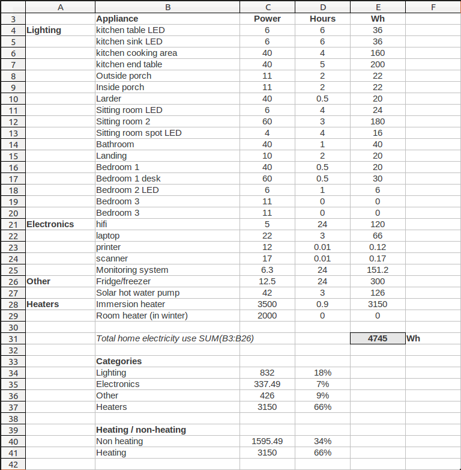
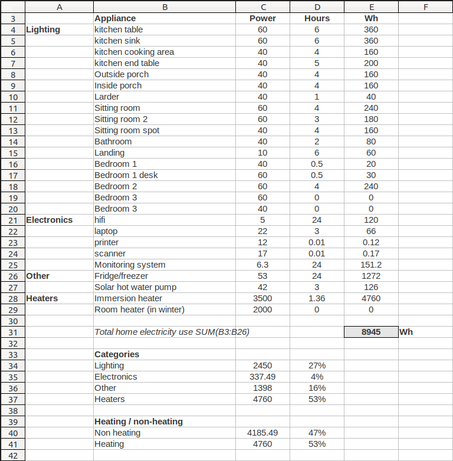
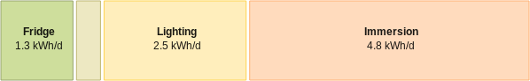
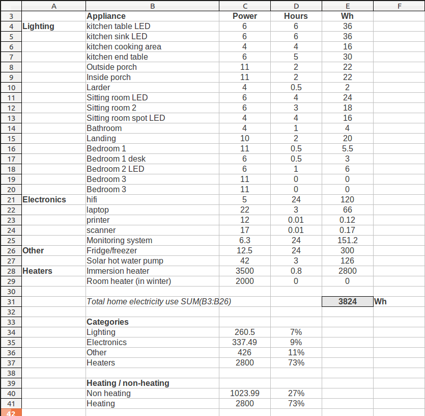
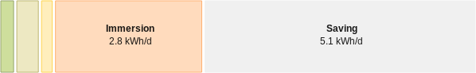
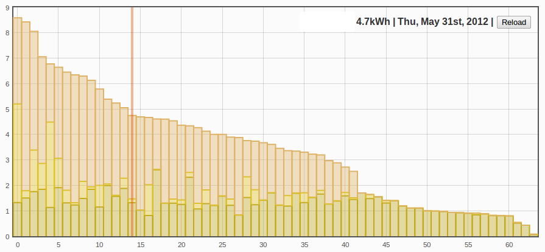

## Electricity audit and savings case study

A useful exercise that is really worth doing in order to identify and prioritise electricity savings is to create a list of all the things that use electricity in a house, how many watts they use and very roughly how many hours they are used daily.

Here is an example appliance list:

Many appliances have their power ratings printed on them. These ratings are usually accurate in the case of lighting that is always on at a constant level, however they are often maximum ratings in the case of electronics (for example a laptop power supply is rated at the maximum power draw while the average power consumption of the laptop could be much lower than this).

This is the first place where an energy monitor can come in useful as you can use an energy monitor to cross-check or measure the actual in use electricity consumption of each of the items in the list where the power consumption is not clear.

All the lights below are entered with their rated power as detailed on the light bulb. For all the other devices and appliances we can use an energy monitor to see the change in power when they are turned on or off.

### Savings example

The appliance list above is from a household that had already made several changes in order to reduce electricity consumption including: 

- Switching from incandescent light bulbs over to low energy CFL and LED light bulbs.
- Installation of a new, smaller A rated fridge.
- Better control of an immersion heater for hot water away from leaving it on all the time to switching it on when needed. 

Here is the original electricity use breakdown:

**Past electricity stack**

**Results of past savings**

Switching to low energy light bulbs may have reduced the lighting consumption from 2450 Wh to 832Wh almost a third of the original lighting electricity use. More care was also taken to switch off lights.

The fridge used to consume about 1.3 kWh a day. The new fridge consumes about 0.3 kWh a day, so over 4 times less energy for the same function.

Leaving the immersion heater on all day used 1.6 kWh per day just to maintain cylinder temperature. So switching off the immersion heater when not needed may have saved another 1.6 kWh per day.

**Current electricity stack showing extent of savings:**

**The total saving achieved may therefore be as much as 47%.**

### Can electricity use be optimized further?

There are still a number of incandescent lights that can be switched to low energy light bulbs, this could reduce lighting use from 832 Wh to 260 Wh, almost a whole 10x reduction on the original lighting consumption, which really goes to show how much better low energy lighting is.

**Electricity stack after final optimisations:**

**The action list**

- Switch cooking area light bulb to a low energy light bulb.
- Switch end of table light bulb to a low energy light bulb.
- Switch sitting room 2 to a low energy light bulb

These 3 light bulbs should be prioritized as they will have the greatest effect as the other light bulbs are not used for as long.

### How typical is the use figure as calculated in the model above?

As mentioned above the time that an appliance is on field is a rough estimate, so a good question to ask is whether the above model resembles reality?

The following graph is created by applying the histogram input processor in emoncms to the house consumption input and visualizing the result using a visualization called "thresholdorder" which can be found (in dev branch) under the vis tab of emoncms. 

In green is all energy consumed at below 250W, in yellow is all energy consumed at below 3000W and red is above 3000W. Allowing us to clearly see the contribution of the immersion heater to each days electricity consumption. 

The graph is ordered by descending daily consumption.

Highlighted in red is a day that has the same daily consumption at calculated above and also a similar breakdown between heating and non heating electricity use.

As you can see there is a wide spread of kWh per day readings from almost 9 kWh per day all the way down too half a kWh. This difference corresponds to difference in occupancy,  seasons and general carefullness. There isnt really a typical day, however the model calculated kwh per day figure does correspond roughly to the average kWh per day figure which although not representative of most days allow us to gain enough insight as to help work out action points for further savings and optimisations.
