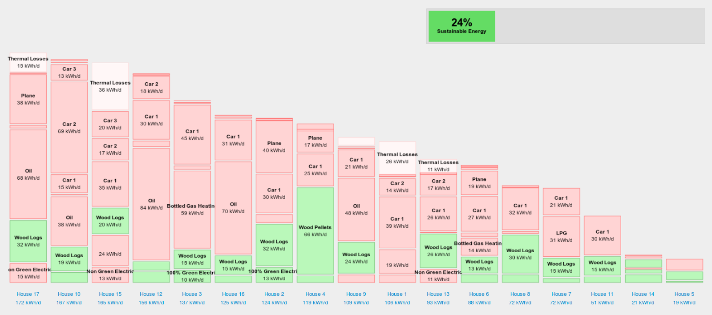

## Snowdonia energy study

While it is useful to get an understanding of typical average household energy consumption, the reality is that every household can be quite different. In 2010 we helped carry out a energy study into a number of households in North Wales. Each stack in the following graphic is one household, showing energy consumption for electricity, heating and transport, including flights.

The graphic really illustrates how different each household can be with the most energy consuming household using 9x the energy consumption of the least energy consuming household.

#### Variation in space heating demand

There are several factors that contributed to the large variation in heating demand between households seen above.

- The extent of insulation and draught proofing levels. A number of the larger energy consuming households had older poorly insulated stone construction.
- The difference in floor area. Building with larger surface areas require more heating.
- The controllability of the heating system. Several households had oil fired range cookers which provide combined cooking and heating functionality. The problem with this configuration is that these range cookers often need to be left on at winter heating levels during warmer summer months in order to provide hot enough hobs and ovens for cooking but as we saw from the analysis of the typical household: cooking demand was only 1.0 kWh/d while space heating was almost 35 kWh/d and so leaving the range cooker on is a big waste of energy if no space heating is needed.
- The efficiency of the heating system. Oil fired range cookers in particular can have particularly low efficiencies ~55%.
